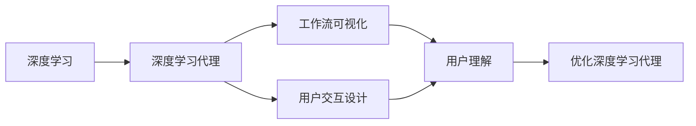

## 1.背景介绍

在人工智能（AI）的世界中，深度学习已经成为一种重要的方法，它通过模仿人脑的工作方式，使计算机能够从数据中学习。然而，深度学习的复杂性和抽象性使得其对于大多数人来说难以理解和应用。因此，深度学习的可视化和用户交互设计就显得尤为重要，它能够使用户更好地理解、使用和优化深度学习模型。本文将详细介绍深度学习代理工作流的可视化与用户交互设计。

## 2.核心概念与联系

深度学习是一种机器学习的方法，它通过神经网络模型，使计算机能够从大量的数据中学习和预测。深度学习代理则是一种基于深度学习的智能代理，它可以自动学习和优化任务的执行策略。

深度学习的可视化是一种将深度学习模型的内部结构和运行过程以图形化的方式展现出来的技术，它可以帮助用户更好地理解和分析深度学习模型。用户交互设计则是一种设计理念，它强调以用户为中心，设计出易用、高效、满足用户需求的产品。

深度学习代理的工作流可视化和用户交互设计是将深度学习的可视化和用户交互设计应用到深度学习代理的工作流中，使用户能够更好地理解、使用和优化深度学习代理。



## 3.核心算法原理具体操作步骤

深度学习代理的工作流可视化和用户交互设计主要包括以下几个步骤：

1. **定义任务**：首先，我们需要定义深度学习代理需要完成的任务。这个任务可以是分类、回归、聚类等任何深度学习可以处理的任务。

2. **设计深度学习模型**：然后，我们需要设计一个深度学习模型来完成这个任务。这个模型可以是卷积神经网络（CNN）、循环神经网络（RNN）、自编码器（AE）等任何一种深度学习模型。

3. **训练深度学习模型**：接着，我们需要用大量的数据来训练这个深度学习模型。在训练过程中，我们需要监控模型的训练状态，包括损失函数的值、准确率等指标。

4. **可视化深度学习模型**：在训练深度学习模型的同时，我们可以将模型的内部结构和运行过程可视化出来。这可以帮助我们更好地理解模型的工作原理和性能。

5. **设计用户交互界面**：最后，我们需要设计一个用户交互界面，使用户能够方便地使用和优化深度学习模型。这个界面可以包括模型的参数设置、训练状态的监控、模型的可视化等功能。

## 4.数学模型和公式详细讲解举例说明

深度学习模型的训练过程可以用数学公式来描述。例如，我们可以用损失函数$L$来衡量模型的预测值$y'$与真实值$y$之间的差距。在分类任务中，我们通常使用交叉熵损失函数，其公式为：

$$
L = -\sum_{i=1}^{n} y_i \log y'_i
$$

其中，$n$是分类的数量，$y_i$和$y'_i$分别是真实值和预测值的第$i$个元素。

在训练过程中，我们的目标是找到一组模型参数$\theta$，使得损失函数$L$的值最小。这个过程可以通过梯度下降法来实现，其更新公式为：

$$
\theta = \theta - \alpha \nabla L
$$

其中，$\alpha$是学习率，$\nabla L$是损失函数$L$关于模型参数$\theta$的梯度。

## 5.项目实践：代码实例和详细解释说明

在Python中，我们可以使用Keras库来实现深度学习模型的训练和可视化。以下是一个简单的例子：

```python
from keras.models import Sequential
from keras.layers import Dense
from keras.utils import plot_model

# 定义模型
model = Sequential()
model.add(Dense(32, input_dim=784))
model.add(Dense(10, activation='softmax'))

# 编译模型
model.compile(loss='categorical_crossentropy', optimizer='adam', metrics=['accuracy'])

# 训练模型
model.fit(x_train, y_train, epochs=10, batch_size=32)

# 可视化模型
plot_model(model, to_file='model.png')
```

在这个例子中，我们首先定义了一个简单的全连接神经网络模型，然后用交叉熵损失函数和Adam优化器编译模型，接着用训练数据训练模型，最后将模型的结构可视化出来。

## 6.实际应用场景

深度学习代理的工作流可视化和用户交互设计在许多领域都有广泛的应用，例如：

- **医疗诊断**：在医疗诊断中，深度学习模型可以用来识别病变图像，而工作流的可视化和用户交互设计可以帮助医生更好地理解和使用深度学习模型。

- **自动驾驶**：在自动驾驶中，深度学习模型可以用来识别路面标志和障碍物，而工作流的可视化和用户交互设计可以帮助工程师更好地调试和优化深度学习模型。

- **智能家居**：在智能家居中，深度学习模型可以用来识别用户的行为和需求，而工作流的可视化和用户交互设计可以帮助用户更好地控制和设置智能设备。

## 7.工具和资源推荐

以下是一些关于深度学习代理的工作流可视化和用户交互设计的工具和资源推荐：

- **TensorBoard**：TensorBoard是一个用于深度学习模型训练过程可视化的工具，它可以显示模型的结构、参数、损失函数等信息。

- **Keras**：Keras是一个用于深度学习的Python库，它提供了许多高级的功能，如模型的定义、编译、训练、保存、加载等。

- **DeepMind**：DeepMind是一个致力于人工智能研究的公司，它开发了许多深度学习代理的工作流可视化和用户交互设计的工具和资源。

## 8.总结：未来发展趋势与挑战

深度学习代理的工作流可视化和用户交互设计是一个新兴的研究领域，它有着广阔的发展前景和许多挑战。

在发展趋势方面，随着深度学习技术的不断发展，深度学习代理将在更多的领域得到应用，而工作流的可视化和用户交互设计将更加重要。此外，随着虚拟现实（VR）和增强现实（AR）技术的发展，深度学习代理的工作流可视化和用户交互设计可能会有更多的创新和应用。

在挑战方面，深度学习模型的复杂性和抽象性使得其可视化和用户交互设计非常困难。此外，如何设计出既易用又高效的用户交互界面，如何在保证用户隐私的同时收集和使用用户数据，也是深度学习代理的工作流可视化和用户交互设计面临的挑战。

## 9.附录：常见问题与解答

**Q1：深度学习代理的工作流可视化和用户交互设计有什么用处？**

A1：深度学习代理的工作流可视化和用户交互设计可以帮助用户更好地理解、使用和优化深度学习模型，从而提高深度学习代理的性能和用户体验。

**Q2：如何进行深度学习模型的可视化？**

A2：深度学习模型的可视化可以通过各种工具来实现，例如TensorBoard、Keras等。这些工具可以将模型的内部结构和运行过程以图形化的方式展现出来。

**Q3：深度学习代理的工作流可视化和用户交互设计有哪些挑战？**

A3：深度学习代理的工作流可视化和用户交互设计面临的挑战主要包括深度学习模型的复杂性和抽象性、用户交互界面的设计、用户隐私的保护等。

**作者：禅与计算机程序设计艺术 / Zen and the Art of Computer Programming**