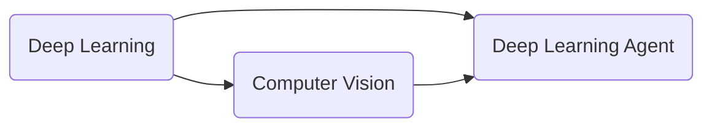

# AI人工智能深度学习算法：计算机视觉在深度学习代理中的集成

## 1. 背景介绍
### 1.1 人工智能与深度学习的发展历程
人工智能(Artificial Intelligence, AI)作为计算机科学的一个分支,其目标是研究如何让计算机模拟甚至超越人类的智能。自1956年达特茅斯会议提出"人工智能"这一概念以来,AI经历了从早期的符号主义到20世纪80年代的专家系统,再到如今的机器学习和深度学习的发展历程。

深度学习(Deep Learning, DL)是机器学习的一个重要分支,其本质是通过构建具有多个隐藏层的人工神经网络,并利用大量数据对网络进行训练,从而使网络能够自动学习到数据背后的复杂模式和规律。深度学习在语音识别、计算机视觉、自然语言处理等领域取得了突破性进展,成为当前AI领域最为前沿和热门的研究方向之一。

### 1.2 计算机视觉与深度学习
计算机视觉(Computer Vision, CV)是人工智能的一个重要分支,旨在让计算机具备类似人类视觉系统的感知和理解能力。传统的计算机视觉方法主要基于人工设计的特征(如SIFT、HOG等),然后再用机器学习的分类器(如SVM)来完成图像分类、目标检测等任务。

随着深度学习的兴起,尤其是卷积神经网络(Convolutional Neural Network, CNN)在ImageNet图像分类竞赛中的成功应用,深度学习开始在计算机视觉领域崭露头角。相比传统方法,深度学习能够自动学习到更加抽象和鲁棒的视觉特征,在图像分类、目标检测、语义分割等任务上实现了质的飞跃,成为计算机视觉的主流范式。

### 1.3 深度学习代理与计算机视觉
深度学习代理(Deep Learning Agent)是将深度学习与智能体(Agent)相结合的一种范式。智能体通过与环境的交互,利用深度神经网络来学习策略,以实现目标导向的决策和控制。将计算机视觉集成到深度学习代理中,可以赋予智能体感知和理解视觉信息的能力,使其能够在复杂环境中自主地感知、决策和行动。

深度学习代理在机器人、自动驾驶、智能监控等领域有广泛应用前景。例如,自动驾驶汽车需要通过车载摄像头感知道路环境,识别车道线、交通标志、行人等,并据此进行决策控制,这就需要将计算机视觉与深度强化学习代理进行集成。因此,研究计算机视觉在深度学习代理中的集成具有重要的理论意义和实践价值。

## 2. 核心概念与联系
### 2.1 深度学习
深度学习通过构建多层神经网络,利用大量数据对网络进行训练,使其能够自动学习数据中蕴含的特征模式。常见的深度学习模型包括:
- 前馈神经网络(Feedforward Neural Network) 
- 卷积神经网络(Convolutional Neural Network, CNN)
- 循环神经网络(Recurrent Neural Network, RNN)

其中,CNN由于其局部连接、权值共享、池化等独特结构,特别适合处理网格化数据如图像,在计算机视觉中得到广泛应用。

### 2.2 计算机视觉
计算机视觉的目标是让计算机理解和分析视觉信息(主要是图像和视频),以完成如下任务:
- 图像分类(Image Classification):判断图像所属类别
- 目标检测(Object Detection):检测图像中特定目标的位置和类别
- 语义分割(Semantic Segmentation):对图像的每个像素进行类别标注
- 实例分割(Instance Segmentation):检测并分割图像中的每个目标实例
- 姿态估计(Pose Estimation):估计图像中人体关键点的位置

深度学习在上述任务中均取得了远超传统方法的性能,成为计算机视觉的主流技术。

### 2.3 深度学习代理 
深度学习代理是一种通用的智能体框架,由环境感知、决策和执行三个模块构成。其中:
- 感知模块负责感知环境状态,如通过CNN提取图像特征
- 决策模块负责根据感知信息和历史经验,生成下一步的动作,如通过深度强化学习算法
- 执行模块负责执行动作并与环境交互,如机器人执行运动控制

将计算机视觉集成到感知模块中,可以赋予代理感知视觉信息的能力。同时,代理通过与环境交互收集数据,又可以进一步训练视觉感知模型,实现感知与决策的耦合学习。

### 2.4 核心概念之间的联系
计算机视觉、深度学习与深度学习代理三者之间环环相扣:
- 深度学习为计算机视觉任务提供了强大的特征学习和函数拟合能力
- 计算机视觉为深度学习代理提供了重要的感知信息来源
- 深度学习代理通过端到端的学习,实现了视觉感知、决策与控制的无缝集成

下图展示了三者之间的关系:

## 3. 核心算法原理具体操作步骤
将计算机视觉集成到深度学习代理的核心是端到端学习视觉感知与决策策略。以视觉导航任务为例,我们介绍其核心算法的具体步骤。

### 3.1 问题定义
视觉导航任务可以定义为马尔可夫决策过程(Markov Decision Process, MDP):
- 状态$s$:由当前RGB图像表示,即$s_t=I_t$ 
- 动作$a$:代理可执行的动作,如前进、左转、右转等
- 转移概率$P(s_{t+1}|s_t,a_t)$:执行动作$a_t$后,从状态$s_t$转移到$s_{t+1}$的概率
- 奖励$r(s_t,a_t)$:在状态$s_t$下执行动作$a_t$获得的即时奖励

代理的目标是学习一个策略$\pi(a_t|s_t)$,使得累积奖励$R=\sum_{t=0}^{T}\gamma^t r(s_t,a_t)$最大化,其中$\gamma$为折扣因子。

### 3.2 感知模块:视觉特征提取
感知模块的作用是将原始的高维图像状态$s_t$映射为低维的特征表示$\phi(s_t)$。一般采用预训练的CNN作为特征提取器:
$$
\phi(s_t) = CNN(s_t) 
$$

可以选择在ImageNet等大规模数据集上预训练的CNN,如ResNet等,并去掉其全连接层,只保留卷积层和池化层。提取到的CNN特征$\phi(s_t)$可以作为决策模块的输入。

### 3.3 决策模块:深度强化学习
决策模块的作用是根据状态特征$\phi(s_t)$生成动作$a_t$。一般采用深度强化学习算法,如DQN、A3C、PPO等。以DQN为例,其核心是价值网络$Q(\phi(s),a;\theta)$,用于估计在状态$s$下采取动作$a$的长期累积奖励。DQN的训练分为两个阶段:

(1) 样本收集:代理与环境交互,用$\epsilon-greedy$策略收集转移样本$(\phi(s_t),a_t,r_t,\phi(s_{t+1}))$,存入经验回放池。

(2) 网络更新:从经验回放池中采样小批量转移样本,并最小化TD误差:
$$
L(\theta)=\mathbb{E}_{(\phi,a,r,\phi')\sim D}[(r+\gamma \max_{a'}Q(\phi',a';\theta^-)-Q(\phi,a;\theta))^2]
$$

其中$\theta^-$为目标网络的参数,每隔一定步数从在线网络$\theta$复制得到,以稳定训练。

在推理阶段,代理直接采取Q值最大的动作:
$$
a_t=\arg\max_a Q(\phi(s_t),a;\theta)
$$

### 3.4 执行模块:控制指令生成
执行模块将决策模块输出的高层动作$a_t$转化为低层的控制指令,如线/角速度等,并传给执行器如机器人进行执行。一般可以采用一个简单的映射函数$f$:
$$
v_t = f(a_t)
$$

其中$v_t$为控制指令。这样,代理就可以通过视觉感知、决策与执行的闭环学习,实现端到端的视觉导航。

## 4. 数学模型和公式详细讲解举例说明
本节我们详细讲解视觉导航代理中涉及的几个关键数学模型和公式。

### 4.1 马尔可夫决策过程(MDP)
MDP提供了一个通用的数学框架来刻画序贯决策问题,其定义为一个五元组$\mathcal{M}=\langle\mathcal{S},\mathcal{A},\mathcal{P},\mathcal{R},\gamma\rangle$:
- 状态空间$\mathcal{S}$:所有可能的状态集合
- 动作空间$\mathcal{A}$:所有可能的动作集合  
- 转移概率$\mathcal{P}(s'|s,a)$:在状态$s$下执行动作$a$后转移到状态$s'$的概率
- 奖励函数$\mathcal{R}(s,a)$:在状态$s$下执行动作$a$获得的即时奖励
- 折扣因子$\gamma\in[0,1]$:未来奖励的折算因子

MDP的目标是寻找一个最优策略$\pi^*:\mathcal{S}\to\mathcal{A}$,使得从任意状态$s$出发,采取该策略获得的期望累积奖励最大:
$$
\pi^*=\arg\max_{\pi}\mathbb{E}_{\pi}[\sum_{t=0}^\infty \gamma^t r_t|s_0=s], \forall s\in\mathcal{S}
$$

其中$\mathbb{E}_{\pi}$表示在策略$\pi$下求期望。

在视觉导航任务中,状态$s$为RGB图像,动作$a$为离散的导航动作(如前进、左转、右转等),奖励$r$可以根据代理与目标的距离等设计。这样,视觉导航就被建模为一个MDP,代理的目标是学习一个最优导航策略。

### 4.2 卷积神经网络(CNN)
CNN是一种特殊的前馈神经网络,由若干卷积层、池化层和全连接层组成。相比普通的多层感知机,CNN引入了三个关键思想:
- 局部连接:每个神经元只与前一层的一个局部区域(感受野)连接,而不是全连接
- 权值共享:同一个卷积核在整个图像上滑动,提取相同的特征
- 池化操作:对卷积特征图进行降采样,提高特征的平移不变性

以最简单的二层CNN为例,其前向传播过程可以表示为:
$$
\begin{aligned}
&h^{(1)}=\sigma(W^{(1)}*x+b^{(1)})\\
&h^{(2)}=\sigma(W^{(2)}*h^{(1)}+b^{(2)})\\  
&\hat{y}=\text{softmax}(W^{(3)}h^{(2)}+b^{(3)})
\end{aligned}
$$

其中$*$表示卷积操作,$\sigma$为激活函数(如ReLU),$\hat{y}$为预测的类别概率。CNN的训练采用反向传播算法,通过最小化交叉熵损失来更新权重:
$$
L=-\sum_{i=1}^N\sum_{k=1}^K y_{ik}\log \hat{y}_{ik}
$$

其中$y_{ik}$为第$i$个样本的真实标签(one-hot向量),$\hat{y}_{ik}$为预测概率。

在视觉导航中,CNN被用于提取RGB图像的特征表示,作为后续决策模块的输入。一般采用在大规模分类数据集(如ImageNet)上预训练的CNN,并去掉其全连接层,只保留卷积层和池化层。

### 4.3 深度Q网