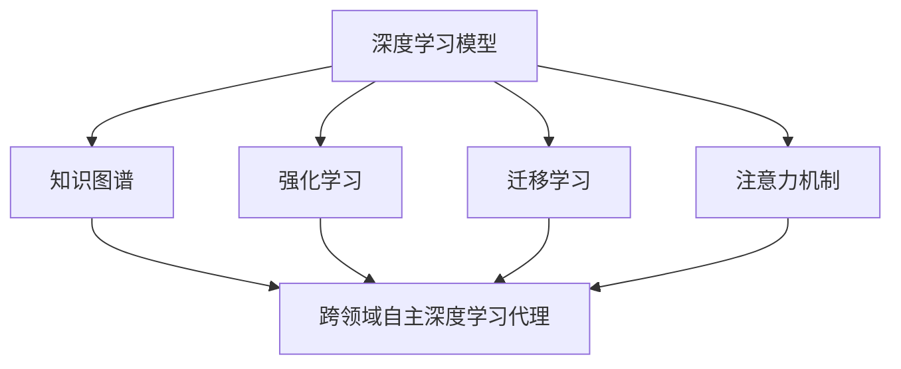

# AI人工智能深度学习算法：跨领域自主深度学习代理的集成

## 1.背景介绍

### 1.1 人工智能的发展历程

人工智能(Artificial Intelligence,AI)是当代科技发展的重要领域,其目标是创造出能够模仿人类智能行为的智能系统。AI的发展经历了几个重要阶段:

- 1950年,图灵提出"图灵测试",奠定了AI的理论基础。
- 1956年,人工智能这一术语正式被创造,标志着AI作为一个独立学科的诞生。
- 1997年,IBM的深蓝战胜国际象棋冠军加里·卡斯帕罗夫,展现了AI在特定领域超越人类的能力。
- 2016年,谷歌的AlphaGo战胜了世界围棋冠军李世乭,标志着AI在复杂决策领域取得了突破。

### 1.2 深度学习的兴起

深度学习(Deep Learning)是AI领域的一个分支,它模仿人脑的信息处理模式,通过对大量数据的学习,自动获取特征表示,解决复杂问题。近年来,深度学习取得了巨大成功,在计算机视觉、自然语言处理、语音识别等领域表现出色,成为AI发展的核心动力。

### 1.3 跨领域自主深度学习代理的需求

传统的深度学习模型通常专注于单一领域,但现实世界的问题往往需要综合不同领域的知识。因此,构建能够自主学习、推理和决策的跨领域智能代理,成为AI发展的重要方向。这种智能代理需要具备以下能力:

- 跨领域知识融合:整合不同领域的知识,形成统一的理解和表示。
- 自主学习:能够主动获取新知识,持续扩展自身能力。
- 推理决策:根据已有知识,进行逻辑推理和决策。
- 交互反馈:通过与环境的交互,获取反馈并优化自身。

## 2.核心概念与联系

构建跨领域自主深度学习代理需要整合多个核心概念,包括:

### 2.1 深度学习模型

深度学习模型是该智能代理的核心,负责从数据中学习特征表示和建模。常用的深度学习模型包括:

- 卷积神经网络(CNN):擅长处理图像、视频等结构化数据。
- 递归神经网络(RNN):擅长处理序列数据,如自然语言、语音等。
- 生成对抗网络(GAN):能够生成逼真的数据样本。
- transformer:注意力机制模型,在自然语言处理领域表现卓越。

### 2.2 知识图谱

知识图谱是结构化的知识库,以图的形式表示实体之间的关系。它能够有效组织和管理跨领域的知识,为智能代理提供背景知识和常识推理能力。

### 2.3 强化学习

强化学习是一种基于环境交互的学习范式,智能代理通过不断试错和获取反馈,优化自身的决策策略。它能够赋予智能代理自主学习和决策的能力。

### 2.4 迁移学习

迁移学习允许将在一个领域学习到的知识迁移到另一个领域,提高了学习效率和泛化能力。这对于构建跨领域智能代理至关重要。

### 2.5 注意力机制

注意力机制是深度学习模型中的一种关键技术,它允许模型动态地关注输入数据的不同部分,提高了模型对关键信息的捕捉能力。

### 2.6 概念关联图

上图展示了这些核心概念之间的关联。深度学习模型是代理的核心,知识图谱提供背景知识,强化学习赋予自主学习能力,迁移学习增强泛化性,注意力机制提高信息捕捉能力。通过有机整合这些概念,我们才能构建出强大的跨领域自主深度学习代理。

## 3.核心算法原理具体操作步骤

构建跨领域自主深度学习代理需要整合多种算法,下面将介绍其中的核心算法原理和具体操作步骤。

### 3.1 基于知识图谱的表示学习

#### 3.1.1 算法原理

知识图谱能够以结构化的方式表示实体之间的关系,但它本身无法直接被深度学习模型使用。因此,我们需要将知识图谱转换为低维向量表示,这个过程称为表示学习(Representation Learning)。

常用的表示学习方法包括TransE、TransR等翻译模型,以及基于神经网络的模型如ConvE、RotatE等。这些模型的核心思想是,通过最小化一个能量函数或损失函数,学习出能够恰当表示实体关系的向量嵌入。

#### 3.1.2 具体操作步骤

1. 构建知识图谱:从各种结构化和非结构化数据源中抽取实体和关系,构建知识图谱。
2. 负采样:为每个正例三元组(head, relation, tail)采样一定数量的负例三元组,用于模型训练。
3. 初始化向量:为每个实体和关系随机初始化一个低维向量表示。
4. 模型训练:使用选定的表示学习模型(如TransE),最小化正负例三元组之间的能量函数或损失函数,迭代更新向量表示。
5. 模型评估:在验证集上评估模型性能,可使用指标如平均精度(Mean Rank)、命中率(Hit@N)等。
6. 知识融合:将学习到的实体和关系向量表示,融合到深度学习模型中,赋予模型跨领域知识理解能力。

### 3.2 基于强化学习的自主决策

#### 3.2.1 算法原理  

强化学习是一种基于环境交互的学习范式,智能代理通过不断试错和获取反馈,优化自身的决策策略。在跨领域自主深度学习代理中,我们可以将代理视为一个智能体,通过与环境交互来学习最优策略。

常用的强化学习算法包括Q-Learning、Deep Q-Network(DQN)、策略梯度算法(Policy Gradient)等。这些算法的核心思想是,智能体根据当前状态选择一个动作,环境给出相应的反馈(奖励或惩罚),智能体据此调整自身的策略,以获得长期的最大累积奖励。

#### 3.2.2 具体操作步骤

1. 定义状态空间:根据问题场景,确定描述当前状态的状态变量。
2. 定义动作空间:确定智能体在每个状态下可执行的动作集合。
3. 定义奖励函数:设计一个奖励函数,根据状态转移给出对应的奖励或惩罚值。
4. 初始化策略:可使用深度神经网络来表示策略,初始化网络参数。
5. 与环境交互:智能体根据当前状态和策略选择动作,环境给出下一状态和奖励值。
6. 策略更新:使用强化学习算法(如Q-Learning或策略梯度),基于状态转移和奖励,更新策略网络参数。
7. 策略评估:在测试环境中评估当前策略的表现,可使用累积奖励等指标。
8. 迭代优化:重复5-7步骤,直到策略收敛或达到预期性能。

通过上述步骤,我们可以训练出一个能够自主决策的智能代理,并将其与深度学习模型相结合,赋予代理自主学习和决策的能力。

### 3.3 基于迁移学习的跨领域知识迁移

#### 3.3.1 算法原理

迁移学习旨在将在源领域学习到的知识迁移到目标领域,提高目标领域的学习效率和性能。在跨领域自主深度学习代理中,我们需要将不同领域的知识相互迁移,实现知识融合。

常用的迁移学习方法包括基于实例的迁移、基于特征的迁移、基于模型的迁移等。其中,基于模型的迁移学习是最常用的方法,它通过共享部分模型参数或对参数进行正则化,实现知识迁移。

#### 3.3.2 具体操作步骤  

1. 领域数据准备:收集源领域和目标领域的数据集。
2. 预训练模型:在源领域数据上预训练一个深度学习模型,获取源领域的知识表示。
3. 模型修改:根据具体的迁移学习方法,修改模型结构以实现知识迁移。
   - 特征提取:冻结预训练模型的部分层,将其作为特征提取器,仅微调最后几层。
   - 微调:在目标领域数据上,以较小的学习率微调整个预训练模型。
   - 正则化:在目标领域模型的损失函数中,添加一项与源领域模型参数的距离作为正则项。
4. 模型训练:在目标领域数据上训练修改后的模型。
5. 模型评估:在目标领域的测试集上评估模型性能。
6. 迭代优化:可根据需要,重复2-5步骤,在多个领域之间迁移知识。

通过迁移学习,我们可以在不同领域之间共享和融合知识,提高跨领域自主深度学习代理的泛化能力和学习效率。

## 4.数学模型和公式详细讲解举例说明

在构建跨领域自主深度学习代理的过程中,涉及多种数学模型和公式,下面将对其中的几个核心模型进行详细讲解。

### 4.1 知识图谱表示学习:TransE模型

TransE是一种常用的知识图谱表示学习模型,它将实体和关系映射到低维向量空间,使得 $h + r \approx t$ 对于每个三元组 $(h, r, t)$ 成立,其中 $h$ 是头实体, $r$ 是关系, $t$ 是尾实体。

TransE的目标是最小化以下能量函数:

$$\mathcal{L} = \sum_{(h, r, t) \in \mathcal{S}} \sum_{(h', r, t') \in \mathcal{S}_{(h,r,t)}^{'}} [\gamma + d(h + r, t) - d(h' + r, t')]_+$$

其中:
- $\mathcal{S}$ 是知识图谱中的正例三元组集合
- $\mathcal{S}_{(h,r,t)}^{'}$ 是对应于 $(h, r, t)$ 的负例三元组集合
- $d(\cdot, \cdot)$ 是向量之间的距离函数,通常使用 $L_1$ 或 $L_2$ 范数
- $\gamma > 0$ 是一个超参数,用于强制正例和负例之间的边距
- $[\cdot]_+$ 是正值函数,即 $[x]_+ = \max(0, x)$

通过梯度下降优化上述损失函数,我们可以学习到实体和关系的向量表示,并将其融合到深度学习模型中,赋予模型跨领域知识理解能力。

### 4.2 强化学习:Q-Learning算法

Q-Learning是一种常用的强化学习算法,它通过不断试错和获取反馈,学习出一个状态-动作值函数 $Q(s, a)$,该函数估计在状态 $s$ 下执行动作 $a$ 后能获得的最大累积奖励。

Q-Learning算法的核心更新规则如下:

$$Q(s_t, a_t) \leftarrow Q(s_t, a_t) + \alpha [r_t + \gamma \max_{a} Q(s_{t+1}, a) - Q(s_t, a_t)]$$

其中:
- $s_t$ 是时刻 $t$ 的状态
- $a_t$ 是时刻 $t$ 执行的动作
- $r_t$ 是执行 $a_t$ 后获得的即时奖励
- $\alpha$ 是学习率超参数,控制更新幅度
- $\gamma$ 是折扣因子超参数,权衡即时奖励和长期累积奖励

通过不断更新 $Q(s, a)$ 函数,智能体最终可以学习到一个最优策略 $\pi^*(s) = \arg\