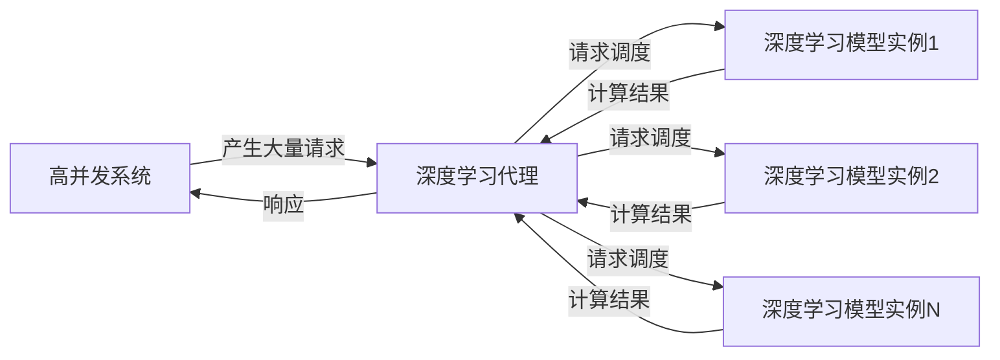

# AI人工智能深度学习算法：高并发场景下深度学习代理的性能调优

## 1.背景介绍

### 1.1 深度学习的兴起

近年来,人工智能(AI)和深度学习(Deep Learning)技术发展迅猛,已广泛应用于计算机视觉、自然语言处理、语音识别等诸多领域,取得了令人瞩目的成就。深度学习是机器学习的一个新的研究热点,它模仿人脑的神经网络结构和信息传递规则,通过对大量数据的训练,自动学习数据的特征表示,并用于解决实际问题。

### 1.2 高并发场景的挑战

随着人工智能系统的不断普及,越来越多的应用需要在高并发的场景下运行深度学习模型,以满足大量用户的并发请求。高并发场景下,系统需要在有限的硬件资源上快速响应大量请求,对系统的性能提出了极大的挑战。如何在保证响应速度的同时,有效利用硬件资源,提高系统的吞吐量,成为了深度学习系统优化的关键问题之一。

### 1.3 深度学习代理及其作用

为解决高并发场景下的性能瓶颈,深度学习代理(Deep Learning Proxy)应运而生。深度学习代理是一种高效的中间件,它位于客户端和深度学习模型之间,负责管理和调度客户端的请求,并将请求分发到多个深度学习模型实例上进行计算。通过合理的负载均衡和资源调度策略,深度学习代理可以充分利用硬件资源,提高系统的整体吞吐量和响应速度。

## 2.核心概念与联系

### 2.1 深度学习模型

深度学习模型是基于人工神经网络的机器学习模型,通过对大量数据的训练,自动学习数据的特征表示,并用于解决实际问题。常见的深度学习模型包括卷积神经网络(CNN)、循环神经网络(RNN)、长短期记忆网络(LSTM)等。这些模型在计算机视觉、自然语言处理、语音识别等领域都取得了卓越的成绩。

### 2.2 高并发系统

高并发系统指的是需要同时处理大量请求的系统,例如电子商务网站、在线视频平台、社交网络等。在高并发场景下,系统需要在有限的硬件资源上快速响应大量请求,对系统的性能提出了极大的挑战。

### 2.3 深度学习代理

深度学习代理是一种高效的中间件,位于客户端和深度学习模型之间,负责管理和调度客户端的请求。它的主要功能包括:

1. **请求调度**:将客户端的请求合理地分发到多个深度学习模型实例上进行计算,实现负载均衡。
2. **资源管理**:动态调整深度学习模型实例的数量,根据实际需求合理分配硬件资源。
3. **缓存机制**:缓存常见请求的计算结果,避免重复计算,提高响应速度。
4. **监控和优化**:持续监控系统的运行状态,并根据实时数据进行性能优化。

通过合理的请求调度、资源管理和缓存机制,深度学习代理可以充分利用硬件资源,提高系统的整体吞吐量和响应速度,从而更好地满足高并发场景下的需求。

### 2.4 核心概念关系

深度学习模型、高并发系统和深度学习代理三者之间存在密切的关系。在高并发场景下,单个深度学习模型无法满足大量并发请求的需求,因此需要引入深度学习代理作为中间层,对请求进行调度和管理,将请求分发到多个深度学习模型实例上进行计算,从而提高系统的整体性能。

## 3.核心算法原理具体操作步骤

### 3.1 请求调度算法

深度学习代理的核心功能之一是请求调度,即将客户端的请求合理地分发到多个深度学习模型实例上进行计算。常见的请求调度算法包括:

1. **轮询调度(Round-Robin Scheduling)**:按照固定的顺序,将请求依次分发到每个深度学习模型实例上。这种算法简单易实现,但无法考虑各个实例的负载情况,可能导致负载不均衡。

2. **加权轮询调度(Weighted Round-Robin Scheduling)**:在轮询调度的基础上,根据每个实例的权重进行调度。权重可以根据实例的硬件配置、历史负载等因素来设置,从而实现更合理的负载均衡。

3. **最小连接数调度(Least Connections Scheduling)**:将请求分发到当前连接数最少的实例上,以减轻繁忙实例的负载。这种算法需要实时监控每个实例的连接数,并维护一个连接数排序列表。

4. **最小响应时间调度(Shortest Response Time Scheduling)**:将请求分发到预计响应时间最短的实例上,以提高整体的响应速度。这种算法需要预测每个实例的响应时间,可以基于历史数据和当前负载情况进行估计。

5. **一致性哈希调度(Consistent Hashing Scheduling)**:通过哈希算法将请求映射到不同的实例上,具有较好的负载均衡性能和容错能力。当实例数量发生变化时,只需重新计算受影响的请求的映射关系,而不需要重新计算所有请求的映射。

不同的请求调度算法各有优缺点,在实际应用中需要根据具体场景和需求进行选择和调优。一般来说,加权轮询调度和最小连接数调度是较为常用的算法,它们能够在一定程度上实现负载均衡,同时实现较为简单。而最小响应时间调度和一致性哈希调度则更加复杂,但能够提供更精确的负载均衡和容错能力。

### 3.2 资源管理算法

除了请求调度,资源管理也是深度学习代理的另一个核心功能。资源管理算法负责动态调整深度学习模型实例的数量,根据实际需求合理分配硬件资源,以提高资源利用率和系统吞吐量。常见的资源管理算法包括:

1. **基于阈值的自动扩缩容(Threshold-based Auto-scaling)**:根据预设的CPU利用率、内存使用率等指标阈值,自动增加或减少深度学习模型实例的数量。当指标超过上限阈值时,增加实例数量;当指标低于下限阈值时,减少实例数量。这种算法简单易实现,但需要手动设置合理的阈值,否则可能导致资源浪费或性能下降。

2. **基于队列长度的自动扩缩容(Queue-length-based Auto-scaling)**:根据待处理请求队列的长度,自动调整深度学习模型实例的数量。当队列长度超过上限时,增加实例数量;当队列长度低于下限时,减少实例数量。这种算法可以更直观地反映系统的负载情况,但需要合理设置队列长度的上下限阈值。

3. **基于机器学习的自动扩缩容(ML-based Auto-scaling)**:利用机器学习算法,根据历史数据和当前系统状态,预测未来的资源需求,并自动调整深度学习模型实例的数量。这种算法可以更精确地预测资源需求,但需要大量的历史数据进行训练,并且模型的准确性也需要不断优化。

4. **基于成本优化的自动扩缩容(Cost-optimized Auto-scaling)**:在满足性能要求的前提下,自动调整深度学习模型实例的数量,以最小化资源成本。这种算法需要考虑硬件成本、实例运行成本等多个因素,通常会结合其他算法进行优化。

与请求调度算法类似,不同的资源管理算法也有不同的优缺点,需要根据具体场景和需求进行选择和调优。一般来说,基于阈值和队列长度的自动扩缩容算法相对简单,易于实现和调优,而基于机器学习和成本优化的算法则更加复杂,但能够提供更精确的资源管理和成本优化。

### 3.3 缓存机制

为了进一步提高系统的响应速度,深度学习代理通常会采用缓存机制,缓存常见请求的计算结果,避免重复计算。常见的缓存算法包括:

1. **LRU缓存(Least Recently Used Cache)**:根据数据的最近访问时间,淘汰最近最少使用的数据,以保持缓存的热数据。LRU缓存算法简单高效,是最常用的缓存算法之一。

2. **LFU缓存(Least Frequently Used Cache)**:根据数据的访问频率,淘汰访问频率最低的数据。LFU缓存算法可以保留热数据,但对于周期性访问的数据可能会出现问题。

3. **FIFO缓存(First In First Out Cache)**:根据数据的进入缓存的时间,淘汰最先进入缓存的数据。FIFO缓存算法简单,但无法区分热数据和冷数据。

4. **二级缓存(Two-Level Cache)**:将缓存分为两级,第一级缓存采用LRU或LFU算法,第二级缓存采用FIFO算法。通过两级缓存的组合,可以更好地利用缓存空间,提高缓存命中率。

5. **分布式缓存(Distributed Cache)**:将缓存数据分布存储在多个节点上,提高缓存的容量和并发能力。常见的分布式缓存系统包括Redis、Memcached等。

除了缓存算法,缓存的更新策略也是一个重要的设计考虑因素。常见的缓存更新策略包括:

1. **写through(Write-through)**:每次写操作都会同时更新缓存和后端存储,保证缓存和后端存储的数据一致性。
2. **写回(Write-back)**:先将数据写入缓存,后续再异步将缓存数据写回后端存储,提高写性能,但可能导致数据不一致。
3. **写合并(Write-combining)**:将多个写操作合并成一个操作,减少写操作的次数,提高写性能。

在实际应用中,需要根据具体场景和需求,选择合适的缓存算法和更新策略,并进行调优和优化。合理的缓存机制可以显著提高系统的响应速度和吞吐量。

## 4.数学模型和公式详细讲解举例说明

在深度学习算法中,数学模型和公式扮演着重要的角色。本节将详细介绍一些常见的数学模型和公式,并通过实例说明它们的应用。

### 4.1 神经网络模型

神经网络是深度学习的核心模型,它模仿生物神经元的工作原理,通过连接多个神经元构建网络结构。一个典型的神经网络可以表示为:

$$
y = f\left(\sum_{i=1}^{n}w_ix_i + b\right)
$$

其中:
- $x_i$是输入数据
- $w_i$是权重参数
- $b$是偏置参数
- $f$是激活函数,常见的激活函数包括Sigmoid函数、ReLU函数等

通过对大量数据的训练,神经网络可以自动学习输入数据和目标输出之间的映射关系,从而解决实际问题。

### 4.2 损失函数

在神经网络的训练过程中,需要定义一个损失函数(Loss Function)来衡量模型的预测结果与真实结果之间的差距。常见的损失函数包括:

1. **均方误差(Mean Squared Error, MSE)**:

$$
\text{MSE} = \frac{1}{n}\sum_{i=1}^{n}(y_i - \hat{y}_i)^2
$$

其中$y_i$是真实值,$\hat{y}_i$是预测值。

2. **交叉熵损失(Cross-Entropy Loss)**:

对于二分类问题:
$$
\text{CE} = -\frac{1}{n}\sum_{i=1}^{n}[y_i\log(\hat{y}_i) + (1-y_