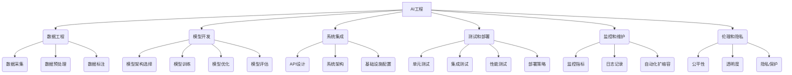

# AI工程最佳实践原理与代码实战案例讲解

## 1.背景介绍

随着人工智能(AI)技术的快速发展,AI系统已经广泛应用于各个领域,包括计算机视觉、自然语言处理、推荐系统等。然而,构建高质量、可靠和可扩展的AI系统是一项艰巨的挑战。AI工程作为一门新兴的跨学科领域,旨在提供系统化的方法和最佳实践,以应对AI系统开发和部署过程中的各种复杂性。

### 1.1 AI工程的重要性

AI工程涉及AI系统的全生命周期管理,包括数据处理、模型开发、系统集成、测试、部署和监控等各个环节。良好的AI工程实践可以确保AI系统的质量、可靠性、安全性和可维护性,从而提高系统的整体效率和性能。此外,AI工程还关注AI系统的伦理和隐私问题,旨在构建公平、透明和负责任的AI应用。

### 1.2 AI工程的挑战

尽管AI工程为AI系统开发提供了指导和最佳实践,但它也面临着一些重大挑战:

1. **数据质量**:高质量的训练数据对于构建准确和可靠的AI模型至关重要。然而,获取、清理和标注大规模数据集是一项艰巨的任务。

2. **模型复杂性**:现代AI模型(如深度神经网络)通常具有复杂的架构和大量参数,这增加了模型开发、优化和部署的难度。

3. **系统集成**:将AI模型与其他系统组件(如数据库、API等)集成并确保它们之间的无缝协作是一个挑战。

4. **可解释性**:许多AI模型被视为"黑箱",难以解释其内部决策逻辑,这可能会影响系统的透明度和可信度。

5. **伦理和隐私**:AI系统可能会产生偏见、歧视或隐私侵犯等伦理和法律问题,需要采取适当的措施来缓解这些风险。

## 2.核心概念与联系

AI工程涉及多个关键概念,这些概念相互关联,共同构建了AI系统开发和部署的整体框架。

### 2.1 数据工程

数据工程是AI工程的基础,它包括数据采集、预处理和标注等步骤。高质量的训练数据对于构建准确和可靠的AI模型至关重要。数据工程还涉及数据版本控制、元数据管理和数据治理等方面。

### 2.2 模型开发

模型开发是AI工程的核心,它包括模型架构选择、训练、优化和评估等步骤。选择合适的模型架构、超参数和训练策略对于获得良好的模型性能至关重要。此外,模型开发还需要考虑模型的可解释性、公平性和隐私保护等方面。

### 2.3 系统集成

系统集成将AI模型与其他系统组件(如数据库、API等)集成,并确保它们之间的无缝协作。这涉及API设计、系统架构选择和基础设施配置等方面。良好的系统集成可以提高AI系统的可扩展性和可维护性。

### 2.4 测试和部署

测试和部署是AI工程的关键环节,它包括单元测试、集成测试、性能测试和部署策略等方面。全面的测试可以确保AI系统的质量和可靠性,而合理的部署策略可以最小化系统中断和风险。

### 2.5 监控和维护

监控和维护是AI系统运行后的重要工作,它包括监控指标、日志记录和自动化扩缩容等方面。通过持续监控和维护,可以确保AI系统的稳定性和性能,并及时发现和解决潜在问题。

### 2.6 伦理和隐私

伦理和隐私是AI工程中不可忽视的重要方面,它包括公平性、透明度和隐私保护等方面。AI系统可能会产生偏见、歧视或隐私侵犯等问题,需要采取适当的措施来缓解这些风险,确保AI系统的可信度和社会责任。

## 3.核心算法原理具体操作步骤

AI工程中涉及多种核心算法和技术,这些算法和技术在不同的环节发挥着关键作用。本节将介绍一些常见的核心算法原理及其具体操作步骤。

### 3.1 数据预处理算法

数据预处理是AI工程中的重要环节,它包括多种算法和技术,如数据清洗、特征工程、数据增强等。这些算法和技术可以提高训练数据的质量,从而提高AI模型的性能。

#### 3.1.1 数据清洗

数据清洗是指去除或修复数据中的错误、缺失值和异常值等问题。常见的数据清洗技术包括:

1. **缺失值处理**:通过删除、插值或使用机器学习模型等方式处理缺失值。
2. **异常值处理**:使用统计方法(如箱线图、Z-score等)或基于模型的方法(如隔离森林)检测和处理异常值。
3. **数据规范化**:将数据转换为统一的格式或范围,以便后续处理。

#### 3.1.2 特征工程

特征工程是指从原始数据中提取或构造有意义的特征,以供机器学习模型使用。常见的特征工程技术包括:

1. **特征选择**:使用过滤法、包裹法或嵌入法等方法选择最相关的特征子集。
2. **特征构造**:通过组合、转换或派生等方式创建新的特征。
3. **特征编码**:将分类特征转换为数值特征,如one-hot编码、标签编码等。

#### 3.1.3 数据增强

数据增强是指通过各种技术(如旋转、平移、缩放等)生成新的训练样本,以增加数据集的多样性和数量。这对于提高模型的泛化能力和鲁棒性非常有帮助。

### 3.2 模型训练算法

模型训练是AI工程中的核心环节,它包括多种算法和技术,如梯度下降、正则化、优化器等。这些算法和技术可以提高模型的性能和泛化能力。

#### 3.2.1 梯度下降

梯度下降是机器学习中最常用的优化算法,它通过迭代地调整模型参数来最小化损失函数。常见的梯度下降算法包括:

1. **批量梯度下降(BGD)**:每次迭代使用全部训练数据计算梯度。
2. **随机梯度下降(SGD)**:每次迭代使用一个训练样本计算梯度。
3. **小批量梯度下降(Mini-batch GD)**:每次迭代使用一小批训练样本计算梯度。

#### 3.2.2 正则化

正则化是一种防止过拟合的技术,它通过在损失函数中添加惩罚项来限制模型复杂度。常见的正则化技术包括:

1. **L1正则化(Lasso)**:添加模型参数的L1范数作为惩罚项,可以实现参数稀疏。
2. **L2正则化(Ridge)**:添加模型参数的L2范数作为惩罚项,可以缩小参数值。
3. **Dropout**:在训练过程中随机丢弃一些神经元,以减少过拟合。

#### 3.2.3 优化器

优化器是用于更新模型参数的算法,它们通常基于梯度下降,但采用不同的策略来加速收敛和提高性能。常见的优化器包括:

1. **随机梯度下降(SGD)**:简单但效率较低。
2. **动量优化(Momentum)**:在梯度方向上添加动量项,加速收敛。
3. **自适应学习率优化(Adam)**:自动调整每个参数的学习率,提高收敛速度。

### 3.3 模型评估算法

模型评估是AI工程中的关键环节,它包括多种算法和指标,用于评估模型的性能和质量。常见的模型评估算法和指标包括:

1. **分类指标**:准确率、精确率、召回率、F1分数等。
2. **回归指标**:均方根误差(RMSE)、平均绝对误差(MAE)等。
3. **排序指标**:平均精度(AP)、归一化折旧累积增益(NDCG)等。
4. **聚类指标**:轮廓系数、Calinski-Harabasz指数等。
5. **交叉验证**:K-折交叉验证、留一交叉验证等。

### 3.4 模型解释算法

模型解释是AI工程中的重要环节,它旨在提高模型的可解释性和透明度。常见的模型解释算法包括:

1. **LIME(Local Interpretable Model-Agnostic Explanations)**:通过训练本地可解释模型来解释任何黑箱模型的预测。
2. **SHAP(SHapley Additive exPlanations)**:基于博弈论中的Shapley值,计算每个特征对模型预测的贡献。
3. **层次化注意力可视化(Hierarchical Attention Visualization)**:可视化注意力机制在不同层次上关注的部分,解释模型的决策过程。

## 4.数学模型和公式详细讲解举例说明

AI工程中涉及多种数学模型和公式,这些模型和公式为算法和技术提供了理论基础。本节将详细讲解一些常见的数学模型和公式,并给出具体的例子和说明。

### 4.1 线性回归

线性回归是一种常用的监督学习算法,它试图找到一条最佳拟合直线,使得数据点到直线的残差平方和最小。线性回归的数学模型如下:

$$y = \theta_0 + \theta_1x_1 + \theta_2x_2 + ... + \theta_nx_n$$

其中,y是目标变量,x是特征向量,θ是模型参数。

线性回归的目标是找到最小化残差平方和的参数θ,可以使用最小二乘法求解:

$$\min_\theta \sum_{i=1}^{m}(y_i - \hat{y}_i)^2$$

其中,m是训练样本数量,$\hat{y}_i$是第i个样本的预测值。

**举例说明**:假设我们有一个数据集,包含房屋面积(x)和房价(y)。我们可以使用线性回归来建模,找到最佳拟合直线,预测新房屋的价格。

### 4.2 逻辑回归

逻辑回归是一种常用的分类算法,它将输入映射到0到1之间的概率值,表示属于某个类别的可能性。逻辑回归的数学模型如下:

$$p(y=1|x) = \sigma(\theta^Tx) = \frac{1}{1 + e^{-\theta^Tx}}$$

其中,x是特征向量,θ是模型参数,σ(z)是sigmoid函数。

逻辑回归的目标是最小化交叉熵损失函数:

$$J(\theta) = -\frac{1}{m}\sum_{i=1}^{m}[y_i\log(p(y_i|x_i)) + (1-y_i)\log(1-p(y_i|x_i))]$$

其中,m是训练样本数量。

**举例说明**:假设我们有一个数据集,包含客户的年龄、收入等特征,以及是否购买产品的标签。我们可以使用逻辑回归来建模,预测新客户购买产品的概率。

### 4.3 支持向量机(SVM)

支持向量机(SVM)是一种常用的