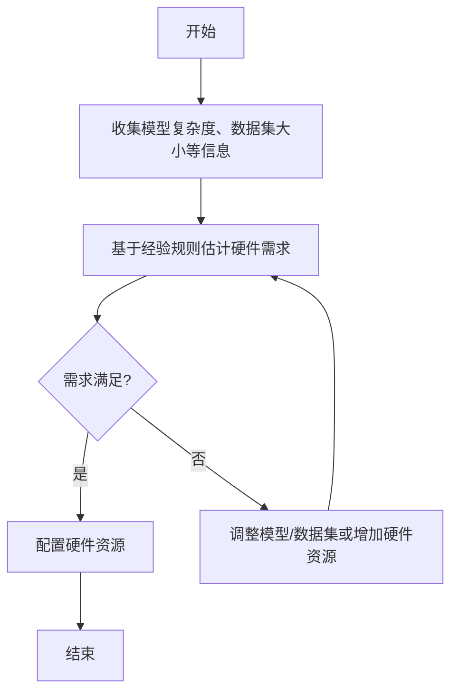
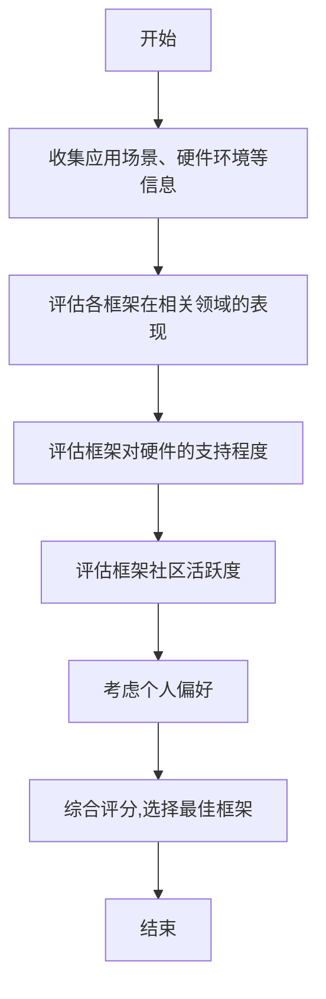
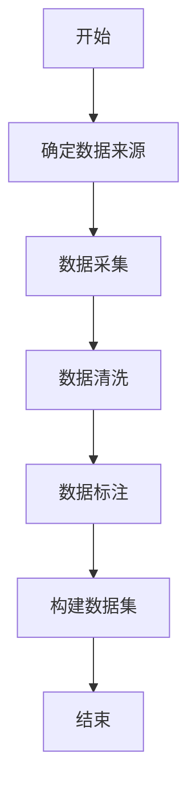

# AI开发环境搭建原理与代码实战案例讲解

## 1.背景介绍

在当今科技飞速发展的时代,人工智能(AI)已经成为各行业关注的热点话题。无论是在金融、医疗、制造业还是娱乐等领域,AI都展现出了广阔的应用前景。然而,要充分发挥AI的潜力,构建高效、稳定的AI开发环境是必不可少的第一步。

AI开发环境的搭建包括硬件基础设施、软件框架、编程语言、数据集等多个方面。合理的环境配置不仅能够提高开发效率,还能确保AI模型的性能和可靠性。因此,掌握AI开发环境搭建的原理和实践技能对于AI从业者来说至关重要。

## 2.核心概念与联系

在探讨AI开发环境搭建之前,我们需要了解一些核心概念:

### 2.1 硬件基础设施

AI计算对硬件资源的需求通常很高,尤其是在训练大型深度学习模型时。因此,GPU(图形处理器)和TPU(张量处理器)等加速硬件往往是AI开发环境中的重要组成部分。此外,足够的内存、存储空间和网络带宽也是保证AI应用顺利运行的关键因素。

### 2.2 软件框架

常见的AI软件框架包括TensorFlow、PyTorch、Keras等。这些框架提供了丰富的API和工具,简化了AI模型的构建、训练和部署过程。选择合适的软件框架对于提高开发效率和模型性能至关重要。

### 2.3 编程语言

Python是AI开发中最常用的编程语言,因为它简洁易学,同时拥有丰富的科学计算库和工具。除了Python,C++、Java等语言也在某些AI应用场景中得到应用。

### 2.4 数据集

高质量的数据集是训练AI模型的基础。根据应用场景的不同,数据集可以来自各种来源,如图像、视频、文本等。数据的采集、清洗和标注是确保AI模型准确性的关键步骤。

### 2.5 云计算资源

对于资源需求较高的AI项目,云计算平台(如AWS、GCP、Azure)提供了可扩展的计算资源和存储空间,使开发者能够灵活调配硬件资源,降低基础设施成本。

上述核心概念相互关联、环环相扣,共同构建了完整的AI开发环境。合理的架构设计和配置能够最大限度地发挥AI的潜力。

## 3.核心算法原理具体操作步骤

AI开发环境搭建过程中,需要遵循一些核心算法原理和具体操作步骤,以确保环境的高效和稳定。下面我们将详细介绍这些核心算法原理和操作步骤。

### 3.1 硬件资源评估算法

在搭建AI开发环境之前,我们需要评估硬件资源需求,以确保足够的计算能力。评估算法通常考虑以下几个主要因素:

1. **AI模型复杂度**: 更复杂的模型需要更强大的硬件资源。
2. **数据集大小**: 较大的数据集需要更多的内存和存储空间。
3. **并行计算需求**: 并行计算可以加速训练过程,但需要更多的CPU/GPU资源。
4. **实时性要求**: 对于需要实时响应的应用,硬件性能尤为重要。

评估算法通常采用基于经验的启发式方法或机器学习模型来预测硬件需求。以下是一个简化的硬件评估算法流程:



### 3.2 软件框架选择算法

选择合适的软件框架对于AI开发效率和模型性能至关重要。软件框架选择算法需要考虑多个因素,包括:

1. **应用场景**: 不同的框架在计算机视觉、自然语言处理等领域有不同的优势。
2. **硬件支持**: 某些框架对特定硬件(如GPU)的支持更好。
3. **社区活跃度**: 活跃的社区意味着更多的文档、示例和技术支持。
4. **个人偏好**: 开发者对特定框架的熟悉程度也是一个重要因素。

以下是一个简化的软件框架选择算法流程:



### 3.3 数据处理算法

高质量的数据集对于训练精确的AI模型至关重要。数据处理算法包括数据采集、清洗、标注等步骤,旨在提高数据质量和一致性。

1. **数据采集算法**: 根据应用场景,从各种来源(如网络爬虫、传感器等)收集原始数据。
2. **数据清洗算法**: 去除噪声、填补缺失值、处理异常值等,提高数据质量。
3. **数据标注算法**: 对数据进行人工或自动标注,为监督学习提供标签。

以下是一个简化的数据处理算法流程:



通过实施上述核心算法,我们可以合理评估硬件需求、选择合适的软件框架,并准备高质量的数据集,为后续的AI模型训练和部署奠定坚实基础。

## 4.数学模型和公式详细讲解举例说明

在AI开发过程中,数学模型和公式扮演着重要角色。它们不仅描述了AI算法的理论基础,还为模型优化和性能评估提供了量化依据。本节将详细讲解一些常见的数学模型和公式,并结合实际案例进行说明。

### 4.1 线性回归模型

线性回归是一种常见的监督学习算法,用于预测连续值的目标变量。它的数学模型可以表示为:

$$y = \theta_0 + \theta_1x_1 + \theta_2x_2 + ... + \theta_nx_n$$

其中:
- $y$是预测的目标值
- $x_1, x_2, ..., x_n$是特征变量
- $\theta_0, \theta_1, ..., \theta_n$是模型参数,需要通过训练数据进行估计

线性回归的目标是找到最小化以下损失函数的参数值:

$$J(\theta) = \frac{1}{2m}\sum_{i=1}^m(h_\theta(x^{(i)}) - y^{(i)})^2$$

其中:
- $m$是训练样本数量
- $h_\theta(x^{(i)})$是对于第$i$个样本的预测值
- $y^{(i)}$是第$i$个样本的真实值

通过梯度下降等优化算法,我们可以找到最小化损失函数的参数值,从而得到最佳拟合的线性回归模型。

**案例说明**:
假设我们要预测某城市的房价,可以使用线性回归模型。特征变量可以包括房屋面积、卧室数量、距市中心距离等。通过收集大量房屋数据并标注真实房价,我们可以训练线性回归模型,估计各个特征对房价的影响程度(即参数$\theta$值)。最终,该模型可用于预测新房屋的价格。

### 4.2 逻辑回归模型

逻辑回归是一种常用的分类算法,用于预测离散值的目标变量(如0或1)。它的数学模型可以表示为:

$$h_\theta(x) = \frac{1}{1 + e^{-\theta^Tx}}$$

其中:
- $h_\theta(x)$是样本$x$被分类为正例(如1)的概率
- $\theta$是模型参数向量
- $\theta^Tx$是参数向量与特征向量$x$的内积

逻辑回归的目标是最大化以下对数似然函数:

$$J(\theta) = \frac{1}{m}\sum_{i=1}^m[y^{(i)}\log(h_\theta(x^{(i)})) + (1 - y^{(i)})\log(1 - h_\theta(x^{(i)}))]$$

其中:
- $m$是训练样本数量
- $y^{(i)}$是第$i$个样本的真实标签(0或1)

通过梯度上升等优化算法,我们可以找到最大化对数似然函数的参数值,从而得到最佳拟合的逻辑回归模型。

**案例说明**:
假设我们要构建一个垃圾邮件检测系统。可以使用逻辑回归模型,其中特征变量包括邮件正文中的关键词、发件人信息等。通过收集大量已标注的邮件数据进行训练,我们可以估计每个特征对于判断垃圾邮件的重要性(即参数$\theta$值)。最终,该模型可用于预测新邮件是否为垃圾邮件。

### 4.3 神经网络模型

神经网络是一种强大的机器学习模型,可以用于解决各种复杂的任务,如图像识别、自然语言处理等。一个简单的神经网络模型可以表示为:

$$
\begin{aligned}
z^{[1]} &= W^{[1]}x + b^{[1]} \\
a^{[1]} &= \sigma(z^{[1]}) \\
z^{[2]} &= W^{[2]}a^{[1]} + b^{[2]} \\
a^{[2]} &= \sigma(z^{[2]}) \\
\hat{y} &= a^{[2]}
\end{aligned}
$$

其中:
- $x$是输入特征向量
- $W^{[1]}, W^{[2]}$是权重矩阵
- $b^{[1]}, b^{[2]}$是偏置向量
- $\sigma$是激活函数,如Sigmoid或ReLU
- $a^{[1]}, a^{[2]}$是各层的激活值
- $\hat{y}$是模型的输出

神经网络的目标是最小化以下损失函数:

$$J(W, b) = \frac{1}{m}\sum_{i=1}^mL(\hat{y}^{(i)}, y^{(i)})$$

其中:
- $m$是训练样本数量
- $L$是损失函数,如交叉熵损失或均方误差
- $y^{(i)}$是第$i$个样本的真实标签

通过反向传播算法和梯度下降等优化方法,我们可以更新权重和偏置,最小化损失函数,从而得到最佳拟合的神经网络模型。

**案例说明**:
假设我们要构建一个手写数字识别系统。可以使用卷积神经网络(CNN)模型,该模型擅长处理图像数据。通过收集大量手写数字图像及其标签进行训练,CNN可以学习到数字图像的特征模式,从而实现精确的数字识别。在训练过程中,我们需要根据损失函数调整网络的权重和偏置,以提高模型的准确性。

通过上述数学模型和公式,我们可以更好地理解和优化AI算法,从而提高模型的性能和泛化能力。在实际应用中,根据具体问题选择合适的模型和损失函数至关重要。

## 5.项目实践:代码实例和详细解释说明

为了更好地理解AI开发环境的搭建过程,我们将通过一个实际项目案例来演示相关代码和详细解释。在本例中,我们将构建一个基于TensorFlow的图像分类项目,并逐步介绍环境搭建的各个步骤。

### 5.1 硬件环境配置

首先,我们需要配置硬件环境。由于图像分类任务对GPU的计算能力有较高要求,因此我们将使用GPU加速。以下是在Ubuntu 20.04系统上配置NVIDIA GPU驱动程序的代码示例:

```bash
# 安