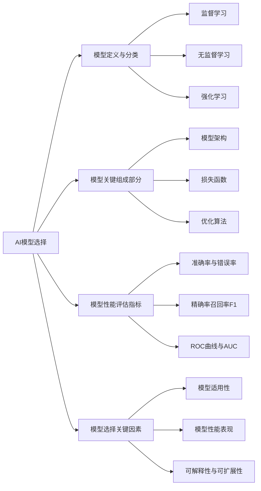

# AI模型选择：洞悉算法，为项目匹配最佳AI引擎

## 1. 背景介绍
### 1.1 人工智能的发展历程
#### 1.1.1 人工智能的起源与早期发展
#### 1.1.2 人工智能的三次浪潮
#### 1.1.3 当前人工智能的现状与趋势

### 1.2 AI模型的重要性
#### 1.2.1 AI模型在人工智能领域的地位
#### 1.2.2 AI模型对实际应用的影响
#### 1.2.3 选择合适AI模型的必要性

### 1.3 AI模型选择面临的挑战
#### 1.3.1 AI模型的多样性与复杂性
#### 1.3.2 不同应用场景对AI模型的特定需求
#### 1.3.3 选择AI模型时需要考虑的因素

## 2. 核心概念与联系
### 2.1 AI模型的定义与分类
#### 2.1.1 AI模型的定义
#### 2.1.2 AI模型的分类方法
#### 2.1.3 常见的AI模型类型

### 2.2 AI模型的关键组成部分
#### 2.2.1 模型架构
#### 2.2.2 损失函数
#### 2.2.3 优化算法

### 2.3 AI模型的性能评估指标
#### 2.3.1 准确率与错误率
#### 2.3.2 精确率、召回率与F1分数
#### 2.3.3 ROC曲线与AUC

### 2.4 AI模型选择的关键因素
#### 2.4.1 模型的适用性
#### 2.4.2 模型的性能表现
#### 2.4.3 模型的可解释性与可扩展性



## 3. 核心算法原理具体操作步骤
### 3.1 监督学习算法
#### 3.1.1 线性回归
##### 3.1.1.1 算法原理
##### 3.1.1.2 具体操作步骤
##### 3.1.1.3 优缺点分析

#### 3.1.2 逻辑回归
##### 3.1.2.1 算法原理  
##### 3.1.2.2 具体操作步骤
##### 3.1.2.3 优缺点分析

#### 3.1.3 支持向量机(SVM)
##### 3.1.3.1 算法原理
##### 3.1.3.2 具体操作步骤  
##### 3.1.3.3 优缺点分析

#### 3.1.4 决策树与随机森林
##### 3.1.4.1 算法原理
##### 3.1.4.2 具体操作步骤
##### 3.1.4.3 优缺点分析

### 3.2 无监督学习算法
#### 3.2.1 K-均值聚类
##### 3.2.1.1 算法原理
##### 3.2.1.2 具体操作步骤
##### 3.2.1.3 优缺点分析

#### 3.2.2 层次聚类 
##### 3.2.2.1 算法原理
##### 3.2.2.2 具体操作步骤
##### 3.2.2.3 优缺点分析

#### 3.2.3 主成分分析(PCA)
##### 3.2.3.1 算法原理
##### 3.2.3.2 具体操作步骤
##### 3.2.3.3 优缺点分析

### 3.3 深度学习算法
#### 3.3.1 卷积神经网络(CNN)
##### 3.3.1.1 算法原理
##### 3.3.1.2 具体操作步骤
##### 3.3.1.3 优缺点分析

#### 3.3.2 循环神经网络(RNN)
##### 3.3.2.1 算法原理
##### 3.3.2.2 具体操作步骤
##### 3.3.2.3 优缺点分析

#### 3.3.3 生成对抗网络(GAN)  
##### 3.3.3.1 算法原理
##### 3.3.3.2 具体操作步骤
##### 3.3.3.3 优缺点分析

## 4. 数学模型和公式详细讲解举例说明
### 4.1 线性回归模型
#### 4.1.1 模型定义与假设
#### 4.1.2 目标函数与优化方法
#### 4.1.3 模型求解与参数估计

### 4.2 逻辑回归模型
#### 4.2.1 模型定义与假设
#### 4.2.2 目标函数与优化方法 
#### 4.2.3 模型求解与参数估计

### 4.3 支持向量机模型
#### 4.3.1 模型定义与假设
#### 4.3.2 目标函数与优化方法
#### 4.3.3 核函数与软间隔

### 4.4 卷积神经网络模型
#### 4.4.1 卷积层与池化层
#### 4.4.2 激活函数与损失函数
#### 4.4.3 反向传播算法

线性回归模型的数学表达如下：

$$
\hat{y} = w_0 + w_1x_1 + w_2x_2 + ... + w_nx_n
$$

其中，$\hat{y}$ 表示预测值，$w_0$ 表示截距项，$w_1, w_2, ..., w_n$ 表示各个特征的权重系数，$x_1, x_2, ..., x_n$ 表示输入特征。

线性回归的目标函数（损失函数）通常选择均方误差（MSE）：

$$
J(w) = \frac{1}{2m}\sum_{i=1}^m(\hat{y}^{(i)} - y^{(i)})^2
$$

其中，$m$ 表示样本数量，$\hat{y}^{(i)}$ 表示第 $i$ 个样本的预测值，$y^{(i)}$ 表示第 $i$ 个样本的真实值。

逻辑回归模型的数学表达如下：

$$
P(y=1|x) = \frac{1}{1+e^{-(\beta_0+\beta_1x_1+...+\beta_nx_n)}}
$$

其中，$P(y=1|x)$ 表示在给定特征 $x$ 的条件下，样本属于正类的概率。$\beta_0, \beta_1, ..., \beta_n$ 为模型的参数。

逻辑回归的目标函数（损失函数）通常选择交叉熵损失：

$$
J(\beta) = -\frac{1}{m}\sum_{i=1}^m[y^{(i)}\log(p^{(i)}) + (1-y^{(i)})\log(1-p^{(i)})]
$$

其中，$m$ 表示样本数量，$y^{(i)}$ 表示第 $i$ 个样本的真实标签（0或1），$p^{(i)}$ 表示第 $i$ 个样本属于正类的预测概率。

## 5. 项目实践：代码实例和详细解释说明
### 5.1 数据预处理
#### 5.1.1 数据清洗
#### 5.1.2 特征缩放
#### 5.1.3 数据集划分

### 5.2 模型训练与评估
#### 5.2.1 模型初始化
#### 5.2.2 模型训练
#### 5.2.3 模型评估

### 5.3 模型优化与调参
#### 5.3.1 学习率调整
#### 5.3.2 正则化技术
#### 5.3.3 模型集成

### 5.4 模型部署与应用
#### 5.4.1 模型保存与加载
#### 5.4.2 模型部署到生产环境
#### 5.4.3 模型的持续监控与更新

以下是一个使用Python的Scikit-learn库实现逻辑回归的代码示例：

```python
from sklearn.linear_model import LogisticRegression
from sklearn.datasets import load_iris
from sklearn.model_selection import train_test_split
from sklearn.metrics import accuracy_score

# 加载鸢尾花数据集
iris = load_iris()
X = iris.data
y = iris.target

# 划分训练集和测试集
X_train, X_test, y_train, y_test = train_test_split(X, y, test_size=0.2, random_state=42)

# 创建逻辑回归模型
model = LogisticRegression()

# 训练模型
model.fit(X_train, y_train)

# 在测试集上进行预测
y_pred = model.predict(X_test)

# 计算准确率
accuracy = accuracy_score(y_test, y_pred)
print("Accuracy:", accuracy)
```

这个示例中，我们首先从Scikit-learn库中加载了鸢尾花数据集。然后，使用`train_test_split`函数将数据集划分为训练集和测试集，其中测试集占总数据的20%。

接下来，我们创建了一个`LogisticRegression`对象，表示逻辑回归模型。通过调用`fit`方法，将训练数据传递给模型进行训练。

训练完成后，我们使用训练好的模型对测试集进行预测，得到预测结果`y_pred`。最后，使用`accuracy_score`函数计算模型在测试集上的准确率，并将结果打印出来。

这个示例展示了如何使用Scikit-learn库快速实现逻辑回归模型，并对模型进行训练和评估。在实际项目中，我们可以根据具体需求对模型进行进一步的优化和调整。

## 6. 实际应用场景
### 6.1 计算机视觉
#### 6.1.1 图像分类
#### 6.1.2 目标检测
#### 6.1.3 语义分割

### 6.2 自然语言处理
#### 6.2.1 文本分类
#### 6.2.2 情感分析
#### 6.2.3 机器翻译

### 6.3 推荐系统
#### 6.3.1 协同过滤
#### 6.3.2 基于内容的推荐
#### 6.3.3 混合推荐

### 6.4 异常检测
#### 6.4.1 欺诈检测
#### 6.4.2 设备故障检测
#### 6.4.3 网络入侵检测

## 7. 工具和资源推荐
### 7.1 机器学习框架
#### 7.1.1 Scikit-learn
#### 7.1.2 TensorFlow
#### 7.1.3 PyTorch

### 7.2 数据处理与可视化
#### 7.2.1 NumPy
#### 7.2.2 Pandas
#### 7.2.3 Matplotlib

### 7.3 模型评估与调优
#### 7.3.1 交叉验证
#### 7.3.2 网格搜索
#### 7.3.3 超参数优化

### 7.4 在线学习资源
#### 7.4.1 Coursera机器学习课程
#### 7.4.2 吴恩达深度学习专项课程
#### 7.4.3 Kaggle竞赛平台

## 8. 总结：未来发展趋势与挑战
### 8.1 AI模型的发展趋势
#### 8.1.1 模型的轻量化与移动端部署
#### 8.1.2 模型的可解释性与可信赖性
#### 8.1.3 模型的持续学习与自适应能力

### 8.2 AI模型面临的挑战
#### 8.2.1 数据质量与隐私保护
#### 8.2.2 模型的公平性与伦理考量
#### 8.2.3 模型的鲁棒性与安全性

### 8.3 AI模型选择的未来展望
#### 8.3.1 自动化的模型选择与优化
#### 8.3.2 多模态数据的融合与建模
#### 8.3.3 AI模型在更广泛领域的应用

## 9. 附录：常见问题与解答
### 9.1 如何处理不平衡数据集？
### 9.2 如何选择合适的模型评估指标？
### 9.3 如何避免模型过拟合？
### 9.4 如何进行特征工程？
### 9.5 如何解释模型的预测结果？

AI模型选择是一个复杂而关键的过程，需要综合考虑多方面因素。通过深入了解不同类型的AI模型及其原理，把握模型选择的关键因素，并结合实际应用场景的需求，我们可以为每个项目匹配