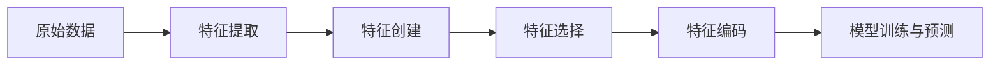

# AI特征工程原理与代码实战案例讲解

## 1. 背景介绍
在人工智能的世界里，数据是王道。然而，原始数据往往无法直接用于机器学习模型的训练和预测。这就需要特征工程的介入，它是数据预处理的关键步骤，涉及从原始数据中提取、选择和转换变量，以提高模型的性能。特征工程的艺术在于找到数据的最佳表示方式，以便算法可以从中学习。

## 2. 核心概念与联系
特征工程包括多个方面，如特征提取、特征创建、特征选择和特征编码。这些概念之间的联系在于它们共同构成了一个流程，目的是将原始数据转化为模型能够有效处理的格式。



## 3. 核心算法原理具体操作步骤
特征工程的核心算法原理涉及以下步骤：

1. **数据探索**：分析数据分布、缺失值和异常值。
2. **特征提取**：从原始数据中提取有意义的信息。
3. **特征创建**：基于业务知识和数据分析创建新特征。
4. **特征选择**：通过算法选择对模型最有用的特征。
5. **特征编码**：将类别特征转换为模型可理解的数值特征。

## 4. 数学模型和公式详细讲解举例说明
以特征选择为例，常用的数学模型包括信息增益、卡方检验等。例如，信息增益的计算公式为：

$$
IG(T, a) = H(T) - H(T|a)
$$

其中，$H(T)$ 是数据集 $T$ 的熵，$H(T|a)$ 是给定特征 $a$ 后数据集 $T$ 的条件熵。

## 5. 项目实践：代码实例和详细解释说明
以Python语言为例，使用`pandas`和`scikit-learn`库进行特征工程操作。代码示例如下：

```python
import pandas as pd
from sklearn.feature_selection import SelectKBest, chi2

# 加载数据
data = pd.read_csv('data.csv')

# 特征选择
X, y = data.iloc[:, :-1], data.iloc[:, -1]
X_new = SelectKBest(chi2, k=2).fit_transform(X, y)

print(X_new)
```

## 6. 实际应用场景
特征工程在金融风控、医疗诊断、推荐系统等多个领域都有广泛应用。例如，在推荐系统中，特征工程帮助模型更好地理解用户的喜好。

## 7. 工具和资源推荐
推荐使用`pandas`、`numpy`、`scikit-learn`等库进行特征工程。此外，`Featuretools`是一个强大的自动特征工程工具，值得尝试。

## 8. 总结：未来发展趋势与挑战
特征工程的未来发展趋势是自动化和智能化。随着技术的进步，自动特征工程工具将更加智能，能够更好地理解数据和业务逻辑。然而，挑战在于如何平衡自动化和定制化的需求。

## 9. 附录：常见问题与解答
Q1: 特征选择和特征提取有什么区别？
A1: 特征选择是从现有特征中选择子集，而特征提取是创建新特征。

Q2: 如何处理高维数据？
A2: 可以使用降维技术如PCA或特征选择方法来减少维度。

作者：禅与计算机程序设计艺术 / Zen and the Art of Computer Programming