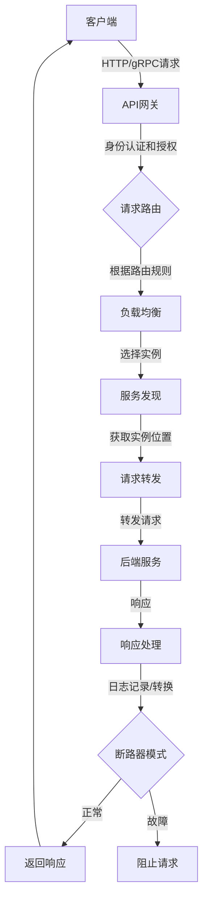

# AI系统API网关原理与代码实战案例讲解

## 1.背景介绍

随着人工智能(AI)技术的快速发展,越来越多的企业开始采用AI系统来提高工作效率和决策质量。然而,AI系统通常由多个独立的模型或服务组成,这些模型和服务可能使用不同的编程语言、框架和运行环境。因此,在实际应用中,需要一种统一的接口来集成和管理这些异构AI服务,以简化开发和部署流程。这就是API网关(API Gateway)在AI系统中的作用所在。

API网关作为AI系统的入口点,负责接收客户端的请求,路由到相应的AI服务,并将响应结果返回给客户端。它不仅提供了统一的API接口,还可以实现负载均衡、身份认证、监控和日志记录等功能,从而降低了AI系统的复杂性,提高了可维护性和可扩展性。

## 2.核心概念与联系

在深入探讨API网关的原理和实现之前,我们需要了解几个核心概念:

### 2.1 API (Application Programming Interface)

API是一组定义良好的规则,用于允许不同软件组件相互通信和交互。在AI系统中,API通常用于封装AI模型或服务,提供标准化的接口供其他应用程序调用。

### 2.2 微服务架构 (Microservices Architecture)

微服务架构是一种将单一应用程序构建为一套小型服务的方法,每个服务运行在自己的进程中,并通过轻量级机制(如HTTP API)进行通信。AI系统通常采用微服务架构,将不同的AI模型或服务拆分为独立的微服务,以提高可维护性和可扩展性。

### 2.3 API网关 (API Gateway)

API网关是微服务架构中的一个关键组件,它位于客户端和微服务之间,充当反向代理(Reverse Proxy)的角色。API网关负责接收客户端的所有请求,并根据预定义的路由规则将请求转发到相应的微服务。它还可以执行一些跨服务的功能,如身份认证、监控、日志记录等。

### 2.4 服务发现 (Service Discovery)

在微服务架构中,服务实例的数量和位置可能会动态变化。服务发现机制用于跟踪服务实例的位置,以便API网关能够正确路由请求。常见的服务发现机制包括DNS、Zookeeper、Consul等。

### 2.5 负载均衡 (Load Balancing)

负载均衡是指将工作负载分发到多个服务实例上,以提高系统的可用性和响应能力。API网关通常内置了负载均衡功能,可以根据预定义的策略(如轮询、最少连接等)将请求分发到多个服务实例。

### 2.6 Circuit Breaker (断路器模式)

Circuit Breaker是一种应用程序级的故障隔离模式,用于防止级联故障并提高系统的稳定性。当API网关检测到某个服务出现故障时,它会暂时阻止对该服务的请求,直到服务恢复正常。这样可以避免级联故障,并给予服务一定的恢复时间。

## 3.核心算法原理具体操作步骤

API网关的核心算法原理可以概括为以下几个步骤:

1. **接收客户端请求**

API网关作为系统的入口点,负责接收来自客户端的所有请求。这些请求通常采用HTTP或gRPC协议。

2. **身份认证和授权**

根据配置的安全策略,API网关需要对请求进行身份认证和授权。常见的认证方式包括基于令牌(Token)、API密钥或OAuth等。

3. **请求路由**

API网关需要根据预定义的路由规则,将请求转发到相应的后端服务。路由规则可以基于请求的URL路径、HTTP方法、请求头或查询参数等信息进行匹配。

4. **负载均衡**

如果后端服务有多个实例,API网关需要根据负载均衡策略(如轮询、最少连接等)选择一个合适的实例来处理请求。

5. **服务发现**

API网关需要知道后端服务实例的位置信息,以便正确路由请求。服务发现机制(如DNS、Zookeeper、Consul等)可以提供这些信息。

6. **请求转发**

API网关将原始请求转发到选定的后端服务实例。

7. **响应处理**

API网关接收后端服务的响应,并根据需要进行一些处理,如日志记录、响应转换等。

8. **断路器模式**

如果后端服务出现故障,API网关可以启用断路器模式,暂时阻止对该服务的请求,直到服务恢复正常。

9. **返回响应**

API网关将处理后的响应返回给客户端。

这些步骤可以通过以下Mermaid流程图来直观地表示:



## 4.数学模型和公式详细讲解举例说明

在API网关中,负载均衡算法是一个关键的数学模型。常见的负载均衡算法包括:

### 4.1 轮询算法 (Round Robin)

轮询算法是最简单的负载均衡算法,它按照固定的顺序将请求依次分发到每个服务实例上。假设有n个服务实例,第i个请求将被分发到第(i % n)个实例。

轮询算法的优点是实现简单,但缺点是无法考虑服务实例的负载情况,可能导致负载不均衡。

### 4.2 加权轮询算法 (Weighted Round Robin)

加权轮询算法是轮询算法的改进版,它为每个服务实例分配一个权重,根据权重值决定将请求分发到哪个实例。假设有n个服务实例,权重分别为$w_1, w_2, \ldots, w_n$,则第i个请求将被分发到第$\lfloor \frac{i \times \sum_{j=1}^n w_j}{\sum_{j=1}^n j \times w_j} \rfloor$个实例。

加权轮询算法可以根据服务实例的性能和负载情况进行动态调整,但计算过程相对复杂。

### 4.3 最少连接算法 (Least Connections)

最少连接算法根据当前每个服务实例正在处理的活动连接数来选择实例。具体来说,对于第i个请求,算法会选择当前活动连接数最少的实例$k$,使得$\forall j \neq k, n_k \leq n_j$,其中$n_k$和$n_j$分别表示第k个和第j个实例的活动连接数。

最少连接算法的优点是可以较好地实现负载均衡,但缺点是需要实时监控每个实例的连接数,计算开销较大。

### 4.4 加权最少连接算法 (Weighted Least Connections)

加权最少连接算法是最少连接算法的改进版,它为每个服务实例分配一个权重,根据权重值和当前连接数共同决定将请求分发到哪个实例。假设有n个服务实例,权重分别为$w_1, w_2, \ldots, w_n$,当前活动连接数分别为$n_1, n_2, \ldots, n_n$,则第i个请求将被分发到第$\underset{1 \leq j \leq n}{\arg\min} \frac{n_j}{w_j}$个实例。

加权最少连接算法综合考虑了实例的权重和负载情况,可以实现更加精确的负载均衡,但计算开销也相对较大。

除了负载均衡算法外,API网关中还可能使用其他数学模型,如队列模型用于请求缓冲、马尔可夫模型用于故障预测等。这些模型的选择和应用需要根据具体的系统需求和约束条件进行权衡。

## 5.项目实践:代码实例和详细解释说明

为了更好地理解API网关的原理和实现,我们将使用Python和Flask框架构建一个简单的API网关示例。

### 5.1 项目结构

```
api-gateway/
├── app.py
├── services/
│   ├── __init__.py
│   ├── service1.py
│   └── service2.py
├── requirements.txt
└── README.md
```

- `app.py`: API网关的主入口文件
- `services/`: 模拟后端服务的目录
- `requirements.txt`: 项目依赖列表
- `README.md`: 项目说明文件

### 5.2 安装依赖

```bash
pip install -r requirements.txt
```

### 5.3 模拟后端服务

我们将创建两个简单的Flask应用程序来模拟后端服务。

`services/service1.py`:

```python
from flask import Flask

app = Flask(__name__)

@app.route('/service1', methods=['GET'])
def service1():
    return 'Hello from Service 1!'

if __name__ == '__main__':
    app.run(host='0.0.0.0', port=5001)
```

`services/service2.py`:

```python
from flask import Flask

app = Flask(__name__)

@app.route('/service2', methods=['GET'])
def service2():
    return 'Hello from Service 2!'

if __name__ == '__main__':
    app.run(host='0.0.0.0', port=5002)
```

### 5.4 实现API网关

`app.py`:

```python
from flask import Flask, request
import requests

app = Flask(__name__)

# 服务实例映射
services = {
    '/service1': ['http://localhost:5001/service1'],
    '/service2': ['http://localhost:5002/service2']
}

# 路由规则
@app.route('/<path:path>', methods=['GET', 'POST'])
def proxy(path):
    # 检查路由规则
    if path not in services:
        return 'Service not found', 404

    # 选择服务实例
    service_url = services[f'/{path}'][0]

    # 转发请求
    headers = dict(request.headers)
    resp = requests.request(
        method=request.method,
        url=service_url,
        headers=headers,
        data=request.get_data(),
        cookies=request.cookies,
        allow_redirects=False)

    # 返回响应
    headers = [(name, value) for (name, value) in resp.raw.headers.items()]
    return resp.content, resp.status_code, headers

if __name__ == '__main__':
    app.run(host='0.0.0.0', port=5000)
```

在这个示例中,API网关使用Flask框架构建,并定义了两个后端服务的映射关系。当客户端发送请求时,API网关会根据请求路径匹配相应的服务,并使用`requests`库将请求转发到服务实例。最后,API网关将服务实例的响应原样返回给客户端。

### 5.5 运行示例

1. 启动后端服务:

```bash
# 新终端窗口1
python services/service1.py

# 新终端窗口2
python services/service2.py
```

2. 启动API网关:

```bash
# 新终端窗口3
python app.py
```

3. 测试API网关:

```bash
# 新终端窗口4
curl http://localhost:5000/service1
# 输出: Hello from Service 1!

curl http://localhost:5000/service2
# 输出: Hello from Service 2!
```

通过这个简单的示例,我们可以看到API网关如何接收客户端请求、路由到相应的后端服务,并将响应返回给客户端。当然,在实际应用中,API网关还需要实现更多的功能,如身份认证、负载均衡、服务发现、断路器模式等。

## 6.实际应用场景

API网关在AI系统中有着广泛的应用场景,包括但不限于:

### 6.1 智能助手系统

智能助手系统通常由多个AI模型组成,如自然语言处理(NLP)模型、知识库查询模型、对话管理模型等。API网关可以将这些模型封装为独立的微服务,并提供统一的API接口,简化了系统的开发和部署。

### 6.2 计算机视觉系统

计算机视觉系统常常需要集成多个AI模型,如目标检测模型、图像分类模型、语义分割模型等。API网关可以将这些模型组合起来,提供一站式的视觉分析服务。

### 6.3 