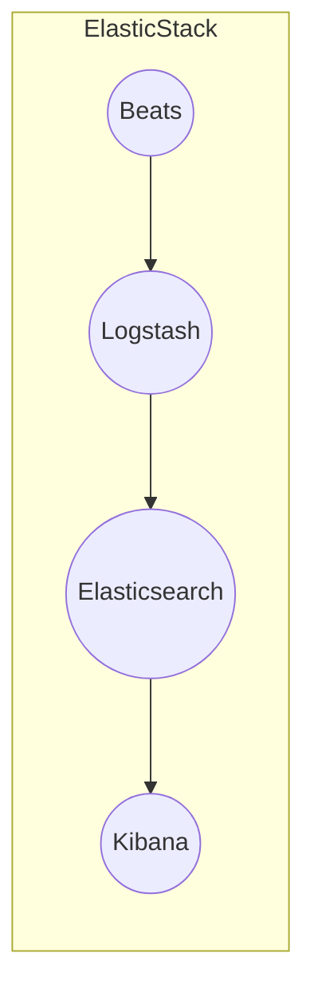

# AI系统Kibana原理与代码实战案例讲解

## 1.背景介绍

在当今数据主导的时代,海量数据的存储、分析和可视化成为了企业和组织面临的重大挑战。Kibana作为ElasticStack生态系统中的一个重要组件,为用户提供了强大的数据可视化和探索功能,使其能够从复杂的数据集中获取洞见。

Kibana最初是为Elasticsearch设计的开源分析和可视化平台。随着时间的推移,它已经发展成为一个功能丰富的数据探索和可视化工具,支持各种数据源,包括Elasticsearch、Logstash、Beats等。它提供了一个直观的Web界面,允许用户创建各种自定义图表、仪表板和地图,以便更好地理解和呈现数据。

作为一名AI系统架构师,深入了解Kibana的原理和实战应用对于构建高效的数据分析和可视化解决方案至关重要。本文将探讨Kibana的核心概念、算法原理、实践案例以及未来发展趋势,为读者提供全面的理解和实用的指导。

## 2.核心概念与联系

### 2.1 Elasticsearch

Elasticsearch是一个分布式、RESTful风格的搜索和分析引擎,它基于Apache Lucene构建。Elasticsearch提供了一个分布式的全文搜索引擎,具有高度可扩展、高可用和近实时搜索的能力。它被广泛应用于日志分析、全文搜索、安全智能等多个领域。

### 2.2 Logstash

Logstash是一个开源的数据收集管道,用于从不同的数据源收集数据,对数据进行转换,然后将数据发送到Elasticsearch进行存储和分析。它支持各种输入源,如日志文件、métrica数据、Web应用程序日志等,并提供了强大的数据解析和转换功能。

### 2.3 Beats

Beats是一个轻量级的数据发送器,用于从不同的源收集数据并将其发送到Logstash或Elasticsearch进行进一步处理。Beats家族包括Filebeat(用于日志文件)、Metricbeat(用于系统和服务métrica)、Packetbeat(用于网络数据)等。

### 2.4 Kibana

Kibana是ElasticStack生态系统中的可视化和数据探索组件。它提供了一个Web界面,允许用户创建各种自定义图表、仪表板和地图,以便更好地理解和呈现数据。Kibana与Elasticsearch紧密集成,可以直接从Elasticsearch中读取数据并进行可视化。

这些核心概念紧密相连,共同构建了ElasticStack生态系统,为用户提供了一个强大的数据处理和分析平台。Elasticsearch负责存储和索引数据,Logstash和Beats负责数据收集和转换,而Kibana则负责数据可视化和探索。



## 3.核心算法原理具体操作步骤

### 3.1 数据索引

在Kibana中,数据首先需要被索引到Elasticsearch中。Elasticsearch使用了一种称为反向索引(Inverted Index)的数据结构,它将文档中的每个唯一词条与包含该词条的文档列表相关联。这种数据结构使得Elasticsearch能够快速地搜索和检索相关文档。

索引过程包括以下步骤:

1. **数据收集**: 使用Logstash或Beats从各种数据源收集数据,如日志文件、métrica数据等。
2. **数据转换**: Logstash提供了强大的数据转换功能,可以对原始数据进行过滤、解析和enrichment。
3. **数据索引**: 将转换后的数据发送到Elasticsearch进行索引。Elasticsearch会将数据分割成多个分片(Shards),并将这些分片分布在不同的节点上,以实现水平扩展和高可用性。

### 3.2 数据探索和可视化

在数据被索引到Elasticsearch之后,Kibana就可以与Elasticsearch进行交互,实现数据探索和可视化。Kibana提供了以下核心功能:

1. **Discover**: 允许用户探索和搜索索引中的数据。用户可以使用Lucene查询语法或Kibana查询语言(KQL)来构建复杂的查询。
2. **Visualize**: 提供了多种可视化选项,如柱状图、折线图、饼图、地图等,用于创建自定义的数据可视化。
3. **Dashboard**: 允许用户将多个可视化组合成一个统一的仪表板,以便于监控和分析数据。
4. **Canvas**: 一个强大的数据呈现工具,可以创建高度自定义和交互式的数据故事。
5. **Machine Learning**: 提供了机器学习功能,如异常检测和预测,帮助用户发现数据中的模式和异常。

Kibana的核心算法包括:

- **查询解析**: Kibana使用Lucene查询语法或KQL来解析用户的查询,并将其转换为Elasticsearch可以理解的查询请求。
- **数据聚合**: Kibana支持多种数据聚合操作,如sum、avg、max、min等,用于对数据进行汇总和统计。
- **数据可视化**: Kibana使用各种图表库(如Vega和Vega-Lite)来渲染数据可视化。
- **机器学习算法**: Kibana集成了Elasticsearch的机器学习功能,如异常检测和预测,使用了各种机器学习算法,如聚类、回归和分类等。

## 4.数学模型和公式详细讲解举例说明

在Kibana中,数学模型和公式主要应用于机器学习和数据分析领域。以下是一些常见的数学模型和公式:

### 4.1 异常检测

异常检测是机器学习中的一个重要任务,旨在识别数据集中的异常值或模式。Kibana使用了基于距离的异常检测算法,如k-means聚类和孤立森林算法。

**1. k-means聚类**

k-means聚类算法是一种常见的无监督学习算法,用于将数据划分为k个聚类。算法的目标是最小化所有数据点到其所属聚类中心的距离之和。

$$J = \sum_{i=1}^{k} \sum_{x \in C_i} ||x - \mu_i||^2$$

其中,\\(J\\)是目标函数,\\(k\\)是聚类数量,\\(C_i\\)是第\\(i\\)个聚类,\\(x\\)是数据点,\\(\mu_i\\)是第\\(i\\)个聚类的中心。

**2. 孤立森林算法**

孤立森林算法是一种基于树的异常检测算法,它通过构建隔离树来识别异常值。隔离树的核心思想是,异常值比正常值更容易被隔离。

$$s(x, n) = 2^{-\frac{E(h(x))}{c(n)}}$$

其中,\\(s(x, n)\\)是样本\\(x\\)的异常分数,\\(E(h(x))\\)是样本\\(x\\)的路径长度的期望值,\\(c(n)\\)是一个常数,用于归一化。

### 4.2 时间序列预测

时间序列预测是机器学习中的另一个重要任务,旨在根据历史数据预测未来的值。Kibana使用了多种时间序列预测算法,如指数平滑法和ARIMA模型。

**1. 指数平滑法**

指数平滑法是一种基于加权移动平均的预测方法,它赋予最新的观测值更高的权重。

$$y_t = \alpha x_t + (1 - \alpha) y_{t-1}$$

其中,\\(y_t\\)是时间\\(t\\)的预测值,\\(x_t\\)是时间\\(t\\)的实际观测值,\\(\alpha\\)是平滑系数,取值范围为\\(0 < \alpha < 1\\)。

**2. ARIMA模型**

ARIMA(自回归综合移动平均模型)是一种广泛使用的时间序列预测模型,它结合了自回归(AR)、移动平均(MA)和差分(I)三个部分。

$$y_t = c + \phi_1 y_{t-1} + \phi_2 y_{t-2} + ... + \phi_p y_{t-p} + \theta_1 \epsilon_{t-1} + \theta_2 \epsilon_{t-2} + ... + \theta_q \epsilon_{t-q} + \epsilon_t$$

其中,\\(y_t\\)是时间\\(t\\)的观测值,\\(c\\)是常数项,\\(\phi_i\\)是自回归系数,\\(\theta_i\\)是移动平均系数,\\(\epsilon_t\\)是白噪声项。

通过对这些数学模型和公式的理解和应用,Kibana能够为用户提供强大的数据分析和预测功能,帮助用户从复杂的数据集中获取洞见。

## 5.项目实践:代码实例和详细解释说明

在本节中,我们将通过一个实际项目案例来演示如何使用Kibana进行数据可视化和分析。我们将使用一个开源的电子商务数据集,并展示如何使用Kibana探索和可视化这些数据。

### 5.1 数据集介绍

我们将使用一个名为"Brazilian E-Commerce Public Dataset by Olist"的开源数据集。这个数据集包含了一家巴西电子商务公司Olist的订单、客户、产品和评论数据。数据集包含以下几个主要文件:

- `orders.csv`: 包含订单信息,如订单ID、订单状态、订购日期等。
- `order_items.csv`: 包含订单中的商品信息,如商品ID、价格、数量等。
- `customers.csv`: 包含客户信息,如客户ID、客户名称、地址等。
- `products.csv`: 包含产品信息,如产品ID、产品名称、类别等。
- `reviews.csv`: 包含产品评论信息,如评论分数、评论文本等。

### 5.2 数据导入

首先,我们需要将数据导入到Elasticsearch中。我们可以使用Logstash或Beats来完成这个任务。以下是一个使用Logstash导入数据的示例配置文件:

```conf
input {
  file {
    path => "/path/to/data/*.csv"
    start_position => "beginning"
  }
}

filter {
  csv {
    separator => ","
    columns => [...] # 指定CSV文件的列名
  }
}

output {
  elasticsearch {
    hosts => ["http://localhost:9200"]
    index => "olist"
  }
}
```

在这个配置文件中,我们指定了CSV文件的路径,并使用`csv`过滤器来解析CSV文件。最后,我们将数据输出到Elasticsearch中,并指定了索引名称为"olist"。

### 5.3 数据探索和可视化

导入数据后,我们就可以在Kibana中进行数据探索和可视化了。以下是一些示例:

**1. 订单状态分布**

```kibana
GET orders/_search
{
  "size": 0,
  "aggs": {
    "order_status": {
      "terms": {
        "field": "order_status.keyword"
      }
    }
  }
}
```

这个查询使用了Elasticsearch的聚合功能,统计了不同订单状态的数量。我们可以将结果可视化为一个饼图或条形图。

**2. 每月订单数量**

```kibana
GET orders/_search
{
  "size": 0,
  "aggs": {
    "orders_per_month": {
      "date_histogram": {
        "field": "order_purchase_timestamp",
        "calendar_interval": "month"
      }
    }
  }
}
```

这个查询使用了`date_histogram`聚合,按月统计订单数量。我们可以将结果可视化为一个折线图或柱状图,以观察订单数量的变化趋势。

**3. 客户地理分布**

```kibana
GET customers/_search
{
  "size": 0,
  "aggs": {
    "customer_locations": {
      "geohash_grid": {
        "field": "customer_location",
        "precision": 3
      }
    }
  }
}
```

这个查询使用了`geohash_grid`聚合,统计了客户的地理位置分布。我们可以将结果可视化为一个地图,以直观地观察客户的分布情况。

**4. 产品评分分布**

```kibana
GET reviews/_search
{
  "size": 0,
  "aggs": {
    "review_scores": {
      "histogram": {
        "field": "review_score",
        "interval": 1
      }
    }
  }
}
```

这个查询使用了`histogram`聚合,统计了不同评分的数量。我们可以将结果可视化为一个柱状图或折线图,以观察产品