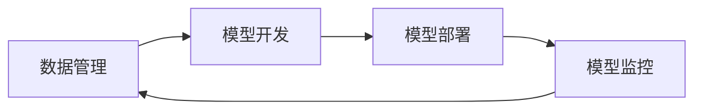

# AI系统MLOps原理与代码实战案例讲解

## 1. 背景介绍
### 1.1 MLOps的兴起
随着人工智能技术的快速发展,越来越多的企业开始将机器学习应用于生产环境中。然而,将机器学习模型从实验室环境部署到生产环境中并非易事。传统的软件开发流程和工具无法很好地适应机器学习系统的特点,导致模型部署周期长、质量难以保证等问题。为了解决这些问题,MLOps应运而生。

MLOps是一种结合了机器学习(Machine Learning,ML)和运维(Operations,Ops)的实践,旨在使机器学习系统的开发、部署和维护更加高效、可靠。它借鉴了DevOps的理念和实践,强调开发(Dev)和运维(Ops)团队的紧密协作,通过自动化的方式来管理机器学习系统的整个生命周期。

### 1.2 MLOps的重要性
MLOps对于机器学习项目的成功至关重要,主要体现在以下几个方面:

1. 加速模型部署:MLOps通过自动化流程,缩短了模型从开发到部署的时间,使得新模型能够更快地应用到生产环境中,为企业创造价值。

2. 提高模型质量:MLOps引入了诸如版本控制、自动化测试等实践,可以有效地控制模型的质量,减少错误和故障的发生。

3. 增强团队协作:MLOps打破了数据科学家和工程师之间的壁垒,促进了团队成员之间的沟通和协作,提高了项目的效率。

4. 实现持续优化:MLOps支持对生产环境中的模型进行持续监控和优化,使得模型能够适应不断变化的业务需求和数据环境。

### 1.3 MLOps的核心原则
MLOps的核心原则包括:

1. 自动化:尽可能地自动化机器学习系统的开发、部署和维护流程,减少人工干预,提高效率和可靠性。

2. 可重复性:通过版本控制、环境管理等手段,确保机器学习系统的可重复性,便于问题定位和回滚。 

3. 可监控性:对机器学习系统的关键指标进行监控,及时发现和解决问题,保证系统的稳定运行。

4. 持续改进:通过数据分析和反馈机制,不断优化机器学习系统,提高其性能和效果。

## 2. 核心概念与联系
### 2.1 数据管理
数据是机器学习的基础,高质量的数据是训练出好模型的前提。在MLOps中,数据管理包括数据采集、清洗、标注、版本控制等环节,旨在为模型训练提供可靠的数据支撑。

### 2.2 模型开发
模型开发是机器学习的核心环节,包括模型选择、超参数调优、模型训练和评估等步骤。MLOps强调模型开发过程的自动化和规范化,提倡使用统一的框架和工具,以提高开发效率和模型质量。

### 2.3 模型部署
模型部署是将训练好的模型应用于生产环境的过程。MLOps中的模型部署强调自动化和标准化,通过容器化、服务化等技术,实现模型的快速、安全、可扩展的部署。

### 2.4 模型监控
模型监控是对生产环境中的模型进行持续监控和分析的过程,包括对模型性能、输入数据、资源消耗等指标的监控。通过模型监控,可以及时发现和解决模型的异常行为,保证其稳定运行。

### 2.5 概念之间的联系
MLOps中的各个环节紧密相连,形成了一个闭环的工作流。数据管理为模型开发提供了高质量的数据基础,模型开发产出了可部署的模型,模型部署将模型应用于生产环境,模型监控对生产环境中的模型进行监督和优化,优化的结果又反馈到数据管理和模型开发环节,形成持续改进的闭环。

下图是MLOps核心概念的Mermaid流程图:


## 3. 核心算法原理具体操作步骤
MLOps涉及的算法主要分为两大类:机器学习算法和软件工程算法。

### 3.1 机器学习算法
机器学习算法是MLOps的核心,常见的机器学习算法包括:

1. 监督学习算法:如线性回归、逻辑回归、决策树、随机森林、支持向量机等,用于解决分类和回归问题。

2. 无监督学习算法:如K-means、层次聚类、主成分分析等,用于解决聚类和降维问题。 

3. 深度学习算法:如卷积神经网络(CNN)、循环神经网络(RNN)、长短期记忆网络(LSTM)等,用于解决图像识别、自然语言处理等复杂问题。

这些算法的具体操作步骤一般包括:

1. 数据准备:收集、清洗、标注数据,划分训练集和测试集。

2. 特征工程:选择、提取、转换特征,构建特征向量。

3. 模型选择:根据问题的特点和数据的规模,选择合适的机器学习算法。

4. 模型训练:使用训练集数据训练模型,调整超参数,优化模型性能。

5. 模型评估:使用测试集数据评估模型的性能,分析错误样本,进行模型选择。

6. 模型部署:将训练好的模型封装成可部署的形式,如API服务、可执行文件等。

### 3.2 软件工程算法
除了机器学习算法,MLOps还涉及一些软件工程领域的算法,如:

1. 版本控制算法:如Git的分支管理、合并算法等,用于管理机器学习系统的代码和数据版本。

2. 容器调度算法:如Kubernetes的调度算法,用于管理机器学习系统的容器化部署和运维。

3. 数据流算法:如Apache Beam的数据流编程模型,用于构建机器学习的数据处理流水线。

这些算法的使用可以极大地提高MLOps的自动化和智能化水平,降低人工运维的成本。

## 4. 数学模型和公式详细讲解举例说明
机器学习算法的核心是数学模型和公式,下面以线性回归算法为例,详细讲解其数学原理。

### 4.1 线性回归模型
线性回归是一种常用的监督学习算法,用于解决连续值预测问题。其基本思想是找到一个线性函数,使得预测值与真实值之间的误差最小。

线性回归的数学模型可以表示为:

$$h_{\theta}(x) = \theta_0 + \theta_1x_1 + \theta_2x_2 + ... + \theta_nx_n$$

其中,$h_{\theta}(x)$是预测值,$\theta_0$是截距项,$\theta_1,\theta_2,...,\theta_n$是各个特征的权重系数,$x_1,x_2,...,x_n$是输入特征的值。

### 4.2 损失函数
为了衡量线性回归模型的性能,需要定义一个损失函数。常用的损失函数是均方误差(Mean Squared Error,MSE):

$$J(\theta) = \frac{1}{2m}\sum_{i=1}^{m}(h_{\theta}(x^{(i)}) - y^{(i)})^2$$

其中,$m$是样本数量,$x^{(i)}$是第$i$个样本的特征向量,$y^{(i)}$是第$i$个样本的真实值。

损失函数$J(\theta)$衡量了模型预测值与真实值之间的差异大小,我们的目标是找到一组参数$\theta$,使得损失函数最小。

### 4.3 梯度下降算法
梯度下降是一种常用的优化算法,用于寻找损失函数的最小值。其基本思想是沿着损失函数下降最快的方向更新参数,直到收敛。

梯度下降算法的数学公式为:

$$\theta_j := \theta_j - \alpha\frac{\partial}{\partial\theta_j}J(\theta)$$

其中,$\alpha$是学习率,控制每次更新的步长,$\frac{\partial}{\partial\theta_j}J(\theta)$是损失函数对参数$\theta_j$的偏导数。

将损失函数$J(\theta)$代入,可以得到:

$$\theta_j := \theta_j - \alpha\frac{1}{m}\sum_{i=1}^{m}(h_{\theta}(x^{(i)}) - y^{(i)})x_j^{(i)}$$

重复执行上述更新公式,直到损失函数收敛或达到预设的迭代次数,即可得到最优的模型参数$\theta$。

### 4.4 正则化
为了防止模型过拟合,可以在损失函数中加入正则化项,对模型的复杂度进行约束。常用的正则化方法有L1正则化和L2正则化。

L1正则化的数学公式为:

$$J(\theta) = \frac{1}{2m}\sum_{i=1}^{m}(h_{\theta}(x^{(i)}) - y^{(i)})^2 + \lambda\sum_{j=1}^{n}|\theta_j|$$

L2正则化的数学公式为:

$$J(\theta) = \frac{1}{2m}\sum_{i=1}^{m}(h_{\theta}(x^{(i)}) - y^{(i)})^2 + \lambda\sum_{j=1}^{n}\theta_j^2$$

其中,$\lambda$是正则化系数,控制正则化的强度。

加入正则化项后,梯度下降算法的更新公式也需要相应地修改:

L1正则化:

$$\theta_j := \theta_j - \alpha(\frac{1}{m}\sum_{i=1}^{m}(h_{\theta}(x^{(i)}) - y^{(i)})x_j^{(i)} + \lambda sgn(\theta_j))$$

L2正则化:

$$\theta_j := \theta_j - \alpha(\frac{1}{m}\sum_{i=1}^{m}(h_{\theta}(x^{(i)}) - y^{(i)})x_j^{(i)} + \lambda\theta_j)$$

其中,$sgn(\theta_j)$是符号函数,当$\theta_j>0$时取1,当$\theta_j<0$时取-1,当$\theta_j=0$时取0。

## 5. 项目实践:代码实例和详细解释说明
下面以Python语言为例,演示如何使用线性回归算法实现房价预测。

### 5.1 数据准备
首先,我们需要准备房价数据集,可以使用sklearn库自带的波士顿房价数据集:

```python
from sklearn.datasets import load_boston

boston = load_boston()
X = boston.data
y = boston.target
```

其中,`X`是特征矩阵,包含506个样本,每个样本有13个特征;`y`是目标向量,包含506个样本的房价值。

接下来,将数据集划分为训练集和测试集:

```python
from sklearn.model_selection import train_test_split

X_train, X_test, y_train, y_test = train_test_split(X, y, test_size=0.2, random_state=42)
```

其中,`test_size`指定测试集的比例,`random_state`指定随机数种子,以保证结果的可重复性。

### 5.2 模型训练
使用sklearn库中的`LinearRegression`类,可以方便地训练线性回归模型:

```python
from sklearn.linear_model import LinearRegression

lr = LinearRegression()
lr.fit(X_train, y_train)
```

`fit`方法会自动执行梯度下降算法,找到最优的模型参数。

### 5.3 模型评估
使用训练好的模型对测试集进行预测,并计算均方误差和R^2分数:

```python
from sklearn.metrics import mean_squared_error, r2_score

y_pred = lr.predict(X_test)
mse = mean_squared_error(y_test, y_pred)
r2 = r2_score(y_test, y_pred)

print("Mean squared error: %.2f" % mse)
print("R^2 score: %.2f" % r2)
```

其中,`mean_squared_error`函数计算均方误差,`r2_score`函数计算R^2分数,用于衡量模型的拟合优度。

### 5.4 添加正则化
为了防止过拟合,可以使用`Ridge`类训练带有L2正则化的线性回归模型:

```python
from sklearn.linear_model import Ridge

ridge = Ridge(alpha=1.0)
ridge.fit(X_train,