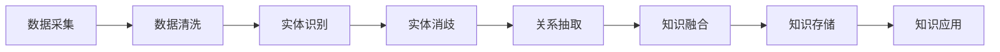
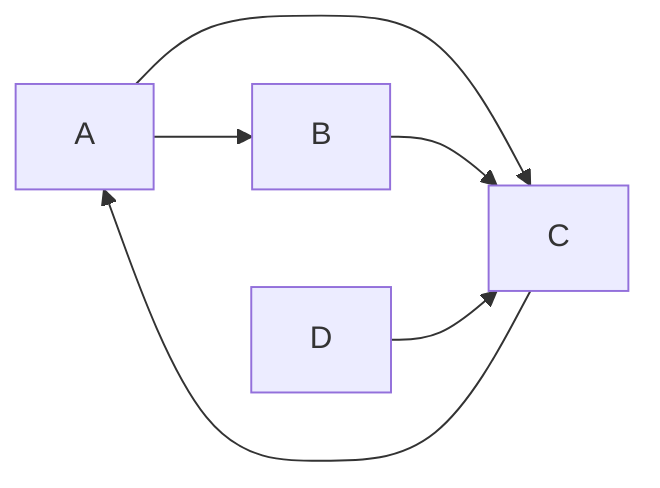

# AI系统Neo4j原理与代码实战案例讲解

## 1. 背景介绍
### 1.1 知识图谱与人工智能
随着人工智能技术的快速发展,知识图谱作为连接人工智能与知识工程的桥梁,在智能搜索、智能问答、个性化推荐等领域发挥着越来越重要的作用。知识图谱通过对海量数据进行语义化、结构化表示,构建起实体、概念之间的关联网络,使机器能够像人一样理解、学习和应用知识。

### 1.2 图数据库与Neo4j
传统的关系型数据库在处理高度关联的复杂数据时存在性能瓶颈。图数据库作为一种原生支持图结构数据的NoSQL数据库,能够高效地存储和查询具有复杂关联的数据。Neo4j作为目前最成熟、使用最广泛的图数据库之一,以其灵活的数据模型、强大的图算法库和友好的查询语言Cypher而备受青睐。

### 1.3 Neo4j在AI系统中的应用
Neo4j在人工智能领域有着广泛的应用前景。利用Neo4j构建知识图谱,可以为智能系统提供高质量的结构化知识;基于图的自然语言处理、推荐系统、异常检测等AI算法也可以通过Neo4j高效实现。本文将重点探讨Neo4j的原理、特性及其在AI系统开发中的实践应用。

## 2. 核心概念与联系
### 2.1 Neo4j的数据模型
#### 2.1.1 节点(Node)
节点是Neo4j图数据库的基本单元,用于表示实体对象,如人物、地点、事件等。每个节点可以拥有任意数量的属性(Property),用键值对表示。节点通过标签(Label)进行分类。

#### 2.1.2 关系(Relationship) 
关系用于连接两个节点,表示节点之间的联系。关系总是有方向的,从一个节点指向另一个节点。与节点类似,关系也可以拥有属性。关系通过类型(Type)进行区分。

#### 2.1.3 属性(Property)
属性是以键值对形式附加在节点或关系上的信息。一个节点或关系可以有多个属性,每个属性由属性名和属性值组成。

#### 2.1.4 标签(Label)与类型(Type)
标签用于声明节点的角色或类别,一个节点可以拥有多个标签。通过为节点添加标签,可以方便地对节点进行分组和查找。类型用于声明关系的性质,一个关系有且仅有一个类型。关系的类型反映了连接节点间的语义关联。

### 2.2 Neo4j的特性
#### 2.2.1 原生图存储
与其他将图结构数据映射到表的数据库不同,Neo4j采用原生的图存储方式,直接将节点和关系存储在一个原生的图结构中。这种存储方式使得图的遍历和查询变得非常高效。  

#### 2.2.2 ACID事务支持
Neo4j完全支持ACID(原子性、一致性、隔离性、持久性)事务,保证了数据操作的可靠性和一致性。这对于构建企业级应用尤为重要。

#### 2.2.3 声明式查询语言Cypher
Cypher是Neo4j的声明式图查询语言,语法简洁、表达力强。Cypher借鉴了SQL和SPARQL的思想,通过描述数据模式和期望返回的数据,让数据库引擎自动优化查询过程。

#### 2.2.4 丰富的图算法库
Neo4j提供了一个功能强大的图算法库Graph Data Science Library,包含了50多种经典图算法的高性能实现,涵盖了图的中心性、社区发现、相似性计算、路径查找、链路预测等方方面面。

### 2.3 知识图谱构建流程


## 3. 核心算法原理具体操作步骤
### 3.1 PageRank算法
PageRank是Google创始人佩奇和布林提出的一种用于评估网页重要性的算法。其基本思想是,如果一个网页被很多其他重要网页链接,那么这个网页也应该很重要。PageRank通过网页之间的链接关系,迭代计算每个网页的重要性得分。

#### 3.1.1 算法步骤
1. 初始化每个节点的PageRank值为1/N,其中N为图中节点总数
2. 对每个节点u,将其PageRank值平均分配给它指向的节点
3. 对每个节点v,将所有指向它的节点贡献的PageRank值相加,得到新的PageRank值
4. 重复步骤2和3,直到PageRank值收敛或达到最大迭代次数
5. 最终每个节点的PageRank值即为其重要性得分

#### 3.1.2 Neo4j Cypher实现
```cypher
CALL gds.pageRank.stream('myGraph')
YIELD nodeId, score
RETURN gds.util.asNode(nodeId).name AS name, score
ORDER BY score DESC
```

### 3.2 社区发现算法
社区发现算法用于在图中识别紧密关联的节点组,这些节点组内部的连接密度高于组外连接。Louvain算法是一种基于模块度优化的高效社区发现算法。

#### 3.2.1 算法步骤
1. 初始将每个节点视为一个独立的社区
2. 对每个节点i,尝试将其移动到其邻居节点j所在的社区,计算模块度变化
3. 将节点i移动到能够最大化模块度增益的社区
4. 重复步骤2和3,直到模块度不再增加
5. 将每个社区视为一个新的节点,两个新节点之间的边权重为原社区之间的边数,构建新的图
6. 重复步骤2到5,直到图不再发生变化

#### 3.2.2 Neo4j Cypher实现
```cypher
CALL gds.louvain.stream('myGraph')
YIELD nodeId, communityId
RETURN gds.util.asNode(nodeId).name AS name, communityId
ORDER BY communityId
```

## 4. 数学模型和公式详细讲解举例说明
### 4.1 PageRank数学模型
PageRank的数学模型可以用下面的公式表示:

$$PR(p_i) = \frac{1-d}{N} + d \sum_{p_j \in M(p_i)} \frac{PR(p_j)}{L(p_j)}$$

其中:
- $PR(p_i)$ 表示网页 $p_i$ 的PageRank值
- $N$ 表示图中网页总数  
- $d$ 表示阻尼因子,一般取值0.85
- $M(p_i)$ 表示指向网页 $p_i$ 的网页集合
- $L(p_j)$ 表示网页 $p_j$ 的出链数

这个公式表明,一个网页的PageRank值由两部分组成:
1. 所有网页的基础PageRank值 $\frac{1-d}{N}$
2. 所有指向该网页的其他网页贡献的PageRank值之和

举例说明:
假设有4个网页A、B、C、D,它们的链接关系如下:

假设阻尼因子d=0.85,初始每个网页的PageRank值为0.25。

第一轮迭代:
- A的PageRank值: $0.15/4 + 0.85*0.25 = 0.25125$  
- B的PageRank值: $0.15/4 + 0.85*0.25/2 = 0.14375$
- C的PageRank值: $0.15/4 + 0.85*(0.25/2+0.25+0.25) = 0.50375$
- D的PageRank值: $0.15/4 = 0.0375$

重复迭代直至收敛,即可得到每个网页的PageRank值,反映了网页的重要性。

### 4.2 模块度的定义
模块度(Modularity)是衡量图中社区划分好坏的一个重要指标。直观地说,模块度反映了社区内部边的密度与社区间边的密度之差。模块度值越大,表明社区划分的效果越好。

模块度Q的定义为:

$$Q = \frac{1}{2m}\sum_{i,j} \left( A_{ij} - \frac{k_ik_j}{2m} \right) \delta(c_i,c_j)$$

其中:
- $m$ 表示图中边的总数
- $A_{ij}$ 表示节点i和j之间是否有边相连,有边取1,无边取0
- $k_i,k_j$ 分别表示节点i和j的度
- $c_i,c_j$ 表示节点i和j所属的社区
- $\delta(c_i,c_j) = 1$ 如果 $c_i=c_j$,否则为0

Louvain算法通过不断地将节点移动到可以最大化模块度增益的社区,来优化整个图的模块度,从而得到合理的社区划分结果。

## 5. 项目实践：代码实例和详细解释说明
下面以一个简单的电影知识图谱为例,演示如何使用Neo4j进行知识图谱的构建和查询。

### 5.1 数据导入
首先,将预处理好的电影数据以CSV格式导入到Neo4j中:
```cypher
// 导入电影节点
LOAD CSV WITH HEADERS FROM 'file:///movies.csv' AS row
CREATE (m:Movie {id: row.id, title: row.title, year: toInteger(row.year)})

// 导入演员节点  
LOAD CSV WITH HEADERS FROM 'file:///actors.csv' AS row
CREATE (a:Actor {id: row.id, name: row.name})

// 导入电影-演员关系
LOAD CSV WITH HEADERS FROM 'file:///movies_actors.csv' AS row
MATCH (m:Movie {id: row.movie_id})
MATCH (a:Actor {id: row.actor_id})
CREATE (a)-[:ACTED_IN]->(m)
```

### 5.2 知识查询
导入数据后,就可以通过Cypher语句进行各种查询和分析。

#### 5.2.1 查询电影的基本信息
```cypher
MATCH (m:Movie)
WHERE m.title CONTAINS '黑客帝国'
RETURN m.title, m.year
```

#### 5.2.2 查询电影的演员
```cypher
MATCH (m:Movie {title: '黑客帝国'})<-[:ACTED_IN]-(a:Actor)
RETURN a.name
```

#### 5.2.3 查询演员合作过的电影
```cypher
MATCH (a1:Actor {name: '基努·里维斯'})-[:ACTED_IN]->(m:Movie)<-[:ACTED_IN]-(a2:Actor)
RETURN a1.name, a2.name, collect(m.title) AS movies
```

#### 5.2.4 查询演员的Kevin Bacon数
```cypher
MATCH (a1:Actor {name: '基努·里维斯'})-[*1..6]-(a2:Actor {name: '凯文·贝肯'})
RETURN length(p) AS bacon_number
ORDER BY bacon_number
LIMIT 1
```

### 5.3 图算法应用
利用Neo4j的图算法库,可以方便地在知识图谱上应用图算法。

#### 5.3.1 计算演员的PageRank值
```cypher
CALL gds.pageRank.stream('actorGraph')
YIELD nodeId, score
RETURN gds.util.asNode(nodeId).name AS actor, score
ORDER BY score DESC
LIMIT 10
```

#### 5.3.2 发现演员社区
```cypher
CALL gds.louvain.stream('actorGraph')
YIELD nodeId, communityId
RETURN gds.util.asNode(nodeId).name AS actor, communityId
ORDER BY communityId
```

## 6. 实际应用场景
Neo4j在众多领域都有实际应用,下面列举几个典型场景:

### 6.1 金融风控
利用Neo4j构建金融知识图谱,对客户、账户、交易等实体及其关系进行全面分析,可以有效识别洗钱、欺诈等风险行为。

### 6.2 社交网络分析
使用Neo4j对社交网络数据进行存储和分析,挖掘用户社区、影响力、传播路径等,为精准营销和舆情监测提供支持。

### 6.3 推荐系统
基于Neo4j构建的知识图谱,结合协同过滤、基于内容等推荐算法,可以实现个性化、解释性强的推荐功能。

### 6.4 医疗辅助