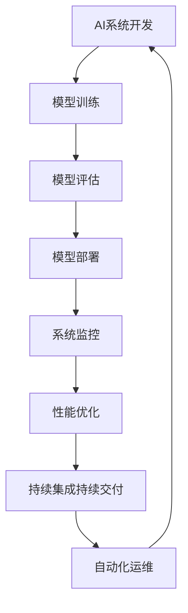

# AI系统PlatformOps原理与代码实战案例讲解

## 1.背景介绍

随着人工智能(AI)技术的不断发展和广泛应用,AI系统的规模和复杂性也在不断增加。为了确保AI系统的高效运行和可靠性,PlatformOps(Platform Operations)的概念应运而生。PlatformOps是一种将软件开发运维(DevOps)实践应用于AI系统管理的方法,旨在简化AI系统的部署、监控、维护和优化过程。

在传统的软件开发中,DevOps已经成为提高效率和质量的关键实践。然而,AI系统具有一些独特的挑战,如大规模数据处理、高性能计算需求、模型训练和部署的复杂性等,这使得直接应用DevOps实践变得困难。因此,PlatformOps作为一种专门为AI系统量身定制的运维方法,受到了越来越多的关注。

### Mermaid流程图:



## 2.核心概念与联系

PlatformOps涉及多个核心概念,包括:

1. **AI系统生命周期管理**: 从数据采集、模型训练、模型评估、模型部署到系统监控和优化,PlatformOps致力于将整个AI系统生命周期无缝集成,实现自动化和高效运维。

2. **DevOps实践**: PlatformOps借鉴了DevOps的核心理念,如持续集成、持续交付、基础设施自动化、监控和日志管理等,并将其应用于AI系统的上下文中。

3. **MLOps(Machine Learning Operations)**: MLOps是PlatformOps的一个重要组成部分,专注于机器学习模型的生命周期管理,包括数据管理、模型训练、模型评估、模型部署和模型监控等。

4. **云原生技术**: PlatformOps通常利用云原生技术,如容器化、微服务、Kubernetes等,来实现AI系统的弹性伸缩、高可用性和自动化运维。

5. **AI系统可观测性**: PlatformOps强调AI系统的可观测性,通过全面的监控、日志记录和分析,实现对系统性能、模型质量和数据质量的实时了解和优化。

这些核心概念相互关联,共同构建了PlatformOps的理论基础和实践框架。

## 3.核心算法原理具体操作步骤

PlatformOps的核心算法原理和具体操作步骤可以概括为以下几个方面:

### 3.1 持续集成和持续交付(CI/CD)

持续集成(Continuous Integration)和持续交付(Continuous Delivery)是DevOps实践中的关键环节,也是PlatformOps的核心组成部分。具体操作步骤如下:

1. 建立版本控制系统(如Git)和持续集成环境(如Jenkins、Travis CI或GitLab CI/CD)。
2. 编写自动化测试用例,包括单元测试、集成测试和端到端测试。
3. 在每次代码提交时,自动触发构建和测试流程。
4. 如果测试通过,则自动将新版本部署到测试环境或生产环境。
5. 监控部署过程和系统运行状况,及时发现并解决问题。

### 3.2 基础设施自动化

基础设施自动化是PlatformOps实现高效运维的关键。具体操作步骤如下:

1. 使用基础设施即代码(Infrastructure as Code)工具,如Terraform、Ansible或Pulumi,定义和管理基础设施资源。
2. 利用容器化技术(如Docker)和容器编排工具(如Kubernetes)实现应用程序的可移植性和弹性伸缩。
3. 自动化基础设施供应、配置管理和部署流程。
4. 实现基础设施资源的版本控制和回滚机制。

### 3.3 模型生命周期管理

模型生命周期管理是PlatformOps中MLOps的核心部分。具体操作步骤如下:

1. 建立数据管理系统,确保数据的版本控制、质量监控和可追溯性。
2. 使用机器学习框架(如TensorFlow、PyTorch或scikit-learn)进行模型训练和评估。
3. 将训练好的模型打包为可部署的artifact,并进行版本控制。
4. 将模型部署到生产环境,并监控模型的性能和质量。
5. 根据监控数据,对模型进行重新训练、优化或替换。

### 3.4 系统监控和日志管理

系统监控和日志管理是PlatformOps中确保系统可观测性和故障排查的关键环节。具体操作步骤如下:

1. 部署监控系统(如Prometheus、Grafana或ELK Stack)收集系统指标和日志数据。
2. 设置合适的监控指标和警报规则,及时发现系统异常。
3. 将监控数据和日志数据集中存储和分析,进行可视化展示。
4. 利用机器学习算法对监控数据和日志数据进行异常检测和根因分析。
5. 根据分析结果,优化系统配置和模型性能。

## 4.数学模型和公式详细讲解举例说明

在PlatformOps中,数学模型和公式主要应用于以下几个方面:

### 4.1 机器学习模型

机器学习模型是PlatformOps中最核心的数学模型。常见的机器学习模型包括:

1. **线性回归模型**:

$$y = \theta_0 + \theta_1x_1 + \theta_2x_2 + ... + \theta_nx_n$$

其中$y$是预测值,$x_i$是特征值,$\theta_i$是模型参数。

2. **逻辑回归模型**:

$$P(y=1|x) = \sigma(\theta^Tx) = \frac{1}{1 + e^{-\theta^Tx}}$$

其中$\sigma$是sigmoid函数,$\theta$是模型参数向量,$x$是特征向量。

3. **决策树模型**:

决策树模型通过递归地构建决策节点和叶子节点来进行预测,可以表示为一个树形结构。

4. **神经网络模型**:

神经网络模型由多层神经元组成,每层神经元的输出通过激活函数(如ReLU、Sigmoid等)传递到下一层。神经网络模型可以表示为一系列矩阵运算和非线性变换。

### 4.2 系统性能模型

系统性能模型用于评估和优化AI系统的性能,常见的模型包括:

1. **队列模型**:

队列模型用于描述并行任务的等待时间和响应时间,如M/M/1队列模型:

$$W_q = \frac{\rho}{1-\rho}\cdot \frac{1}{\mu}$$

其中$W_q$是平均队列等待时间,$\rho$是系统利用率,$\mu$是服务率。

2. **负载模型**:

负载模型用于描述系统的负载情况,如CPU利用率模型:

$$U_{CPU} = \frac{\sum_{i=1}^{n}u_i}{n}$$

其中$U_{CPU}$是CPU利用率,$u_i$是第$i$个CPU核心的利用率,$n$是CPU核心数量。

### 4.3 异常检测模型

异常检测模型用于监控系统和模型的运行状态,及时发现异常情况。常见的异常检测模型包括:

1. **基于统计的异常检测**:

基于统计的异常检测模型假设正常数据服从某种分布(如高斯分布),异常数据则偏离该分布。常用的统计量包括均值、标准差、中位数等。

2. **基于密度的异常检测**:

基于密度的异常检测模型通过估计数据的概率密度函数,将密度较低的数据点标记为异常。常用的密度估计方法包括核密度估计、最近邻密度估计等。

3. **基于聚类的异常检测**:

基于聚类的异常检测模型将数据划分为多个聚类,离任何聚类中心较远的数据点被视为异常。常用的聚类算法包括K-Means、DBSCAN等。

4. **基于深度学习的异常检测**:

基于深度学习的异常检测模型利用神经网络自动学习数据的特征表示,并基于该特征表示进行异常检测。常用的模型包括自编码器(Autoencoder)、生成对抗网络(GAN)等。

这些数学模型和公式为PlatformOps提供了理论基础和分析工具,有助于更好地理解、优化和管理AI系统。

## 5.项目实践:代码实例和详细解释说明

为了更好地理解PlatformOps的实践,我们将通过一个基于Kubernetes和TensorFlow的示例项目来演示PlatformOps的具体实现。

### 5.1 项目概述

本示例项目是一个基于Kubernetes的分布式机器学习平台,用于训练和部署图像分类模型。该平台包括以下主要组件:

1. **数据管理组件**: 负责管理训练数据和测试数据,确保数据的版本控制和可追溯性。
2. **模型训练组件**: 基于TensorFlow框架,在Kubernetes集群上进行分布式模型训练。
3. **模型服务组件**: 将训练好的模型打包为Docker容器,并在Kubernetes集群上部署为Web服务。
4. **监控组件**: 基于Prometheus和Grafana,监控集群资源利用率、模型性能和推理延迟等指标。
5. **CI/CD管道**: 基于GitLab CI/CD,实现代码、模型和基础设施的持续集成和持续交付。

### 5.2 代码实例

以下是一些关键代码示例,展示了PlatformOps的实现细节。

#### 5.2.1 Kubernetes资源定义

使用Kubernetes资源定义文件(YAML格式)来描述和管理集群资源,如下所示:

```yaml
# 定义TensorFlow训练Job
apiVersion: batch/v1
kind: Job
metadata:
  name: tf-train
spec:
  template:
    spec:
      containers:
      - name: tf-train
        image: my-registry/tf-train:v1
        volumeMounts:
        - name: data
          mountPath: /data
      volumes:
      - name: data
        persistentVolumeClaim:
          claimName: training-data
      restartPolicy: OnFailure
```

#### 5.2.2 模型训练代码

使用TensorFlow框架进行模型训练,并将训练好的模型保存为可部署的artifact:

```python
import tensorflow as tf

# 加载数据
train_data, test_data = load_data()

# 定义模型
model = tf.keras.Sequential([
    tf.keras.layers.Conv2D(32, (3, 3), activation='relu', input_shape=(28, 28, 1)),
    tf.keras.layers.MaxPooling2D((2, 2)),
    tf.keras.layers.Flatten(),
    tf.keras.layers.Dense(64, activation='relu'),
    tf.keras.layers.Dense(10, activation='softmax')
])

# 编译模型
model.compile(optimizer='adam',
              loss='sparse_categorical_crossentropy',
              metrics=['accuracy'])

# 训练模型
model.fit(train_data, epochs=5, validation_data=test_data)

# 保存模型
model.save('model.h5')
```

#### 5.2.3 模型服务代码

使用Flask框架将训练好的模型封装为Web服务:

```python
import tensorflow as tf
from flask import Flask, request, jsonify

app = Flask(__name__)

# 加载模型
model = tf.keras.models.load_model('model.h5')

@app.route('/predict', methods=['POST'])
def predict():
    data = request.get_json()
    image = data['image']
    prediction = model.predict(image)
    return jsonify({'prediction': prediction.tolist()})

if __name__ == '__main__':
    app.run(host='0.0.0.0', port=5000)
```

#### 5.2.4 监控配置

使用Prometheus配置文件定义监控目标和指标:

```yaml
# 监控Kubernetes集群指标
scrape_configs:
  - job_name: 'kubernetes-cluster'
    kubernetes_sd_configs:
      - role: node
    relabel_configs:
      - source_labels: [__address__]
        regex: '(.*):10250'
        target_label: __address__
        replacement: '${1}:10255'

# 监控模型服务指标
  - job_name: 'model-service'
    metrics_path: '/metrics'
    static_configs:
      - targets: ['model-service:5000']
```

#### 5.2.5 CI/CD管道

使用GitLab CI/CD配置文件定义构建、测试和部署流程:

```yaml
image: docker:latest

services:
  - docker:dind

stages:
  - build
  - test
  - deploy

build:
  