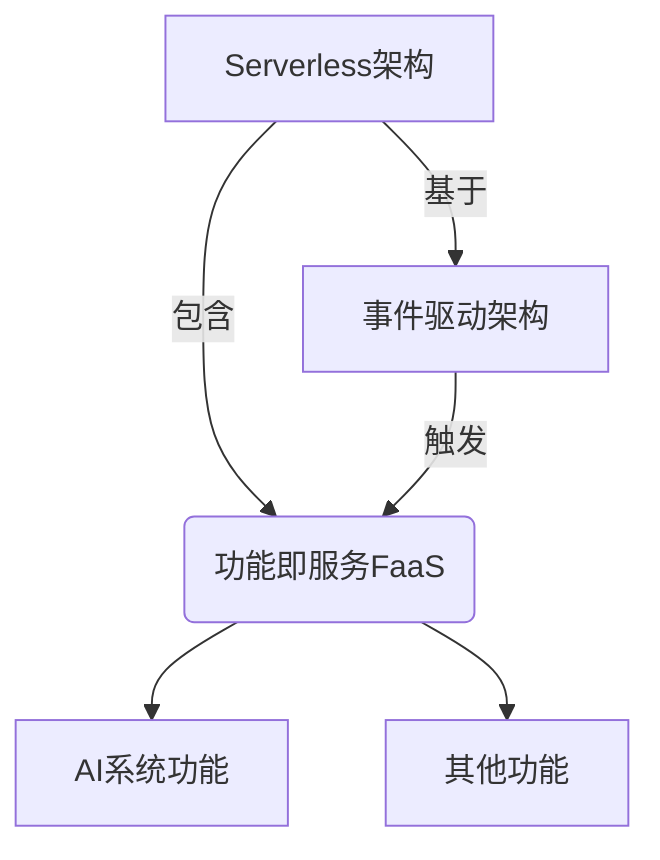
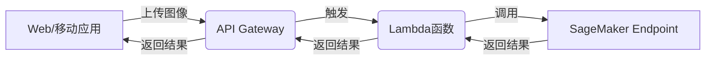

# AI系统Serverless原理与代码实战案例讲解

## 1.背景介绍

在当今快节奏的数字时代，企业和组织面临着快速响应客户需求并提供无缝体验的巨大压力。传统的基于服务器的架构往往难以满足这种需求,因为它需要大量的资源来预配置和管理基础设施。这就催生了Serverless架构的出现,它允许开发人员构建和运行无需管理服务器基础设施的应用程序。

Serverless架构是一种基于事件驱动的计算模型,应用程序由一系列独立的功能或服务组成,只在响应特定事件(如HTTP请求、数据库事件或消息队列通知)时才会运行。这种按需分配资源的模式不仅可以降低运营开销,还能实现自动扩展,从而满足不断变化的需求。

在Serverless架构中,人工智能(AI)系统扮演着越来越重要的角色。AI系统可以用于各种任务,如图像识别、自然语言处理、预测分析等。通过将AI功能与Serverless架构相结合,企业可以构建高度可扩展、响应迅速的智能应用程序,而无需关注底层基础架构的管理。

本文将探讨AI系统在Serverless架构中的应用原理,介绍核心概念和算法,并通过实际案例说明如何将AI与Serverless架构相结合,以构建高效、经济的智能解决方案。

## 2.核心概念与联系

在深入探讨AI系统Serverless原理之前,我们需要了解几个核心概念及其相互关系。

### 2.1 Serverless架构

Serverless架构是一种云计算执行模型,应用程序被分解为一系列独立的功能,这些功能由事件驱动并在需要时自动分配资源。Serverless架构的主要优势包括:

- 无需预配置或管理服务器
- 自动扩展以满足需求
- 仅为实际使用的资源付费(按使用量付费)
- 更高的可用性和容错能力

### 2.2 功能即服务(FaaS)

功能即服务(FaaS)是Serverless架构的核心组成部分。它允许开发人员编写和部署单个功能,而不必担心底层基础架构。常见的FaaS平台包括AWS Lambda、Google Cloud Functions和Azure Functions。

### 2.3 人工智能(AI)系统

人工智能系统指能够模拟人类智能行为的计算机系统,如机器学习、自然语言处理、计算机视觉等。在Serverless架构中,AI系统通常作为独立的功能或微服务运行,以响应特定事件并提供智能服务。

### 2.4 事件驱动架构

事件驱动架构是Serverless应用程序的核心。应用程序由一系列功能组成,这些功能由各种事件(如HTTP请求、数据库更新、消息队列通知等)触发。事件驱动架构可确保高度的解耦和可扩展性。

### 2.5 关系总结

Serverless架构提供了一种无需管理底层基础设施即可构建和运行应用程序的方式。FaaS允许开发人员专注于编写功能代码,而不必担心服务器管理。AI系统可以作为FaaS功能运行,以响应各种事件并提供智能服务。事件驱动架构将所有这些组件联系在一起,使应用程序能够高效、可扩展地运行。



## 3.核心算法原理具体操作步骤

在Serverless架构中,AI系统通常作为独立的功能运行,响应特定事件并提供智能服务。这些功能的工作原理通常涉及以下几个核心步骤:

1. **事件触发**: 当特定事件(如HTTP请求、数据库更新或消息队列通知)发生时,相应的AI功能被触发执行。

2. **数据预处理**: 原始输入数据(如图像、文本或其他格式)需要进行预处理,以便AI模型能够理解和处理。这可能涉及数据清理、标准化、特征提取等步骤。

3. **模型加载**: 根据任务需求,从存储中加载预先训练好的AI模型。这些模型可以是机器学习模型、深度学习模型或其他类型的AI模型。

4. **模型推理**: 使用加载的AI模型对预处理后的输入数据进行推理,生成所需的输出或预测结果。这可能涉及复杂的数学计算和算法。

5. **后处理**: 根据需要,对模型输出进行后处理,如格式化、过滤或与其他数据源集成。

6. **结果返回**: 最终结果被返回或存储,以供其他服务或应用程序使用。

这个过程可以通过以下伪代码来概括:

```python
def ai_function(event, context):
    # 1. 事件触发
    input_data = event.get_data()

    # 2. 数据预处理
    preprocessed_data = preprocess(input_data)

    # 3. 模型加载
    model = load_model(model_path)

    # 4. 模型推理
    output = model.predict(preprocessed_data)

    # 5. 后处理
    processed_output = postprocess(output)

    # 6. 结果返回
    return processed_output
```

在实际应用中,这些步骤可能会根据具体的AI任务和模型而有所不同。但总的来说,Serverless架构为AI系统提供了一种高效、可扩展的执行环境,使其能够按需响应事件并提供智能服务。

## 4.数学模型和公式详细讲解举例说明

在AI系统中,数学模型和公式扮演着至关重要的角色。它们为机器学习算法和深度神经网络提供了理论基础,并指导了模型的训练和推理过程。在这一部分,我们将介绍一些常见的数学模型和公式,并通过具体示例说明它们在AI系统中的应用。

### 4.1 线性回归

线性回归是一种广泛使用的监督学习算法,用于预测连续值输出。它的数学模型可以表示为:

$$y = \theta_0 + \theta_1x_1 + \theta_2x_2 + ... + \theta_nx_n$$

其中$y$是预测值,$x_1, x_2, ..., x_n$是特征值,而$\theta_0, \theta_1, ..., \theta_n$是需要通过训练数据来估计的参数。

在Serverless架构中,线性回归模型可以用于各种预测任务,如销售预测、能源需求预测等。以销售预测为例,我们可以将历史销售数据作为训练集,使用线性回归算法估计参数$\theta$,然后基于新的特征值(如广告投放、促销活动等)预测未来的销售额。

### 4.2 逻辑回归

逻辑回归是一种用于二分类问题的监督学习算法。它的数学模型可以表示为:

$$P(y=1|x) = \sigma(\theta^Tx) = \frac{1}{1 + e^{-\theta^Tx}}$$

其中$\sigma(z)$是sigmoid函数,用于将线性函数$\theta^Tx$的值映射到0到1之间,从而表示概率值。

在Serverless架构中,逻辑回归模型可以用于各种二分类任务,如垃圾邮件检测、欺诈检测等。以垃圾邮件检测为例,我们可以将历史邮件数据作为训练集,使用逻辑回归算法估计参数$\theta$,然后基于新邮件的特征值(如主题、正文内容等)预测它是否为垃圾邮件。

### 4.3 神经网络

神经网络是一种强大的机器学习模型,能够学习复杂的非线性映射关系。它的数学模型可以表示为:

$$y = f(W^{(L)}f(W^{(L-1)}...f(W^{(1)}x + b^{(1)}) + b^{(L-1)}) + b^{(L)})$$

其中$x$是输入,$y$是输出,而$W^{(l)}$和$b^{(l)}$分别表示第$l$层的权重和偏置。$f$是非线性激活函数,如sigmoid或ReLU函数。

在Serverless架构中,神经网络可以用于各种复杂的AI任务,如计算机视觉、自然语言处理等。以图像分类为例,我们可以使用卷积神经网络(CNN)模型,将图像作为输入,经过多层卷积、池化和全连接层的处理,最终输出图像的类别概率分布。

这些只是数学模型和公式在AI系统中应用的一小部分示例。在实际应用中,还有许多其他模型和算法,如决策树、支持向量机、聚类算法等,它们都有各自的数学基础和公式推导。掌握这些数学模型和公式,对于理解AI系统的原理和实现至关重要。

## 5.项目实践:代码实例和详细解释说明

为了更好地理解AI系统在Serverless架构中的应用,我们将通过一个实际案例来演示如何使用AWS Lambda和Amazon SageMaker等服务构建一个图像分类应用程序。

### 5.1 案例背景

假设我们需要构建一个图像分类应用程序,用于识别上传图像中的物体。用户可以通过Web界面或移动应用上传图像,系统会自动对图像进行分类,并返回识别结果。

### 5.2 架构设计

我们将采用Serverless架构,利用AWS Lambda和Amazon SageMaker等服务来实现该应用程序。整体架构如下所示:



1. 用户通过Web或移动应用上传图像。
2. API Gateway接收上传的图像,并触发相应的Lambda函数。
3. Lambda函数将图像数据传递给预先部署的SageMaker Endpoint。
4. SageMaker Endpoint使用预训练的深度学习模型对图像进行分类,并将结果返回给Lambda函数。
5. Lambda函数将分类结果返回给API Gateway。
6. API Gateway将结果返回给Web或移动应用,并展示给用户。

### 5.3 代码实现

以下是Lambda函数的Python代码示例,用于调用SageMaker Endpoint并获取图像分类结果:

```python
import json
import boto3

# 创建SageMaker运行时客户端
runtime = boto3.Session().client('sagemaker-runtime')

# SageMaker Endpoint名称
ENDPOINT_NAME = 'image-classification-endpoint'

def lambda_handler(event, context):
    # 获取上传的图像数据
    image_data = event['body']

    # 调用SageMaker Endpoint进行推理
    response = runtime.invoke_endpoint(
        EndpointName=ENDPOINT_NAME,
        ContentType='image/jpeg',
        Body=image_data
    )

    # 解析推理结果
    result = json.loads(response['Body'].read().decode())
    predicted_class = result['predicted_label']

    # 返回分类结果
    return {
        'statusCode': 200,
        'body': json.dumps({'predicted_class': predicted_class})
    }
```

这段代码首先创建一个SageMaker运行时客户端,用于与预先部署的SageMaker Endpoint进行交互。然后,它从事件数据中获取上传的图像数据,并调用`invoke_endpoint`方法将图像发送给SageMaker Endpoint进行推理。

SageMaker Endpoint使用预训练的深度学习模型(如ResNet或VGG)对图像进行分类,并将结果返回给Lambda函数。Lambda函数解析推理结果,提取预测的类别标签,并将其作为JSON响应返回。

需要注意的是,在实际部署之前,您需要先在Amazon SageMaker中训练和部署深度学习模型,并将SageMaker Endpoint的名称配置到Lambda函数中。

### 5.4 优化和扩展

虽然上述示例展示了一个基本的图像分类应用程序,但在实际生产环境中,您可能需要进行一些优化和扩展,以提高性能和可靠性:

- **并行处理**: 如果需要同时处理大量图像请求,您可以利用AWS Lambda的并行执行功能,自动扩展Lambda函数的实例数量以满足需求。
- **缓存优化**: 对于相同的图像,您可以缓存推理结果,避免重复调用SageMaker Endpoint,从而