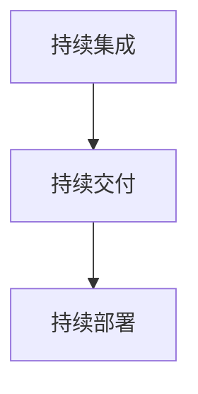

## 1.背景介绍

在今天的高速发展的科技环境下，人工智能（AI）已经成为我们生活中不可或缺的一部分。从智能手机到自动驾驶汽车，AI的应用已经无处不在。然而，随着AI技术的发展，如何有效地部署和更新AI系统成为了一个重要的问题。为了解决这个问题，持续部署（Continuous Deployment）应运而生。

持续部署是一种软件工程实践，通过自动化的流程，使得软件在开发阶段的任何时间点都可以被实时地部署到生产环境中。这种实践可以使得软件产品在短时间内快速地迭代，同时保证其高质量。在AI系统中，持续部署尤其重要，因为AI系统需要不断地学习和适应新的数据，以提高其性能和准确性。

## 2.核心概念与联系

在持续部署的过程中，有几个核心的概念需要我们理解：

- **持续集成（Continuous Integration）**：持续集成是持续部署的前提，它要求开发者频繁地将代码集成到主分支。通过自动化的构建和测试，持续集成可以早期发现并修复错误，提高软件质量。

- **持续交付（Continuous Delivery）**：持续交付是持续部署的一个重要步骤，它确保了软件在任何时候都处于可以部署到生产环境的状态。

- **持续部署（Continuous Deployment）**：持续部署是持续交付的下一步，它不仅要求软件可以随时部署，还要求软件能够自动地部署到生产环境。

这三个概念之间的关系可以用下面的Mermaid流程图表示：



## 3.核心算法原理具体操作步骤

持续部署的过程可以分为几个具体的步骤：

1. **代码提交**：开发者提交他们的代码到版本控制系统（如Git）。

2. **构建和测试**：持续集成服务器（如Jenkins）会自动地获取最新的代码，然后进行构建和测试。

3. **部署到预生产环境**：如果构建和测试成功，代码会被部署到预生产环境。

4. **验收测试**：在预生产环境中进行验收测试。

5. **部署到生产环境**：如果验收测试通过，代码会被部署到生产环境。

6. **监控和反馈**：部署后，需要对系统进行监控，如果发现问题，需要及时地反馈给开发者。

这个过程可以用下面的Mermaid流程图表示：


## 4.数学模型和公式详细讲解举例说明

在持续部署的过程中，我们可以使用一些数学模型和公式来进行量化分析。例如，我们可以使用MTTR（Mean Time To Recovery）和MTBF（Mean Time Between Failures）来衡量系统的稳定性。

MTTR是指系统出现故障后，恢复正常所需要的平均时间。它的计算公式为：

$$ MTTR = \frac{总的恢复时间}{故障次数} $$

MTBF是指两次连续故障之间的平均时间。它的计算公式为：

$$ MTBF = \frac{总的运行时间 - 总的恢复时间}{故障次数} $$

通过这两个指标，我们可以评估持续部署的效果。如果MTTR越低，说明系统恢复的速度越快；如果MTBF越高，说明系统的稳定性越好。

## 5.项目实践：代码实例和详细解释说明

在实际的项目中，我们可以使用一些工具来实现持续部署。例如，我们可以使用Jenkins作为持续集成服务器，使用Docker来容器化应用，使用Kubernetes来进行容器编排。

下面是一个简单的Jenkinsfile示例，它描述了一个使用Docker和Kubernetes的持续部署流程：

```groovy
pipeline {
    agent any
    stages {
        stage('Build') {
            steps {
                sh 'docker build -t my-app .'
            }
        }
        stage('Test') {
            steps {
                sh 'docker run --rm my-app npm test'
            }
        }
        stage('Deploy') {
            steps {
                sh 'kubectl apply -f k8s/'
            }
        }
    }
}
```

这个Jenkinsfile定义了三个阶段：构建（Build）、测试（Test）和部署（Deploy）。在构建阶段，我们使用Docker来构建应用的镜像；在测试阶段，我们运行这个镜像，并执行应用的测试；在部署阶段，我们使用Kubernetes来部署这个应用。

## 6.实际应用场景

持续部署在许多实际的应用场景中都有广泛的应用。例如：

- **互联网公司**：互联网公司需要快速地迭代他们的产品，以适应市场的变化。持续部署可以使他们在短时间内发布新的功能和修复bug。

- **金融机构**：金融机构需要保证他们的系统的稳定性和安全性。持续部署可以使他们及时地发现和修复系统的问题。

- **AI研究**：AI研究需要不断地试验新的模型和算法。持续部署可以使他们快速地验证他们的研究成果。

## 7.工具和资源推荐

在持续部署的过程中，有一些工具和资源是非常有用的：

- **Jenkins**：Jenkins是一个开源的持续集成服务器，它可以自动化各种任务，如构建、测试和部署。

- **Docker**：Docker是一个开源的容器平台，它可以使应用的部署变得简单和一致。

- **Kubernetes**：Kubernetes是一个开源的容器编排系统，它可以自动化容器的部署、扩展和管理。

- **Git**：Git是一个开源的版本控制系统，它是持续部署的基础。

- **Spinnaker**：Spinnaker是一个开源的持续部署平台，它支持多种云平台，如AWS、GCP和Azure。

## 8.总结：未来发展趋势与挑战

随着科技的发展，持续部署的重要性将会越来越大。然而，持续部署也面临着一些挑战：

- **安全性**：持续部署需要将代码自动地部署到生产环境，这可能会带来一些安全风险。

- **复杂性**：持续部署需要整合各种工具和流程，这可能会增加系统的复杂性。

- **文化改变**：持续部署需要开发者和运维人员紧密合作，这可能需要改变传统的组织文化。

尽管有这些挑战，我相信持续部署将会在未来的IT领域中发挥越来越重要的作用。

## 9.附录：常见问题与解答

- **问：持续部署和持续交付有什么区别？**

答：持续交付和持续部署的主要区别在于是否自动部署到生产环境。持续交付确保了软件在任何时候都处于可以部署到生产环境的状态，但是是否部署到生产环境还需要人工决定。而持续部署则不仅要求软件可以随时部署，还要求软件能够自动地部署到生产环境。

- **问：持续部署需要什么样的硬件和软件条件？**

答：持续部署主要依赖于软件和流程，而不是硬件。你需要一个版本控制系统（如Git）来管理代码，一个持续集成服务器（如Jenkins）来自动化构建和测试，一个容器平台（如Docker）来容器化应用，一个容器编排系统（如Kubernetes）来部署应用。此外，你还需要一套自动化的流程来将这些工具整合在一起。

- **问：持续部署适合所有的项目吗？**

答：持续部署并不适合所有的项目。例如，对于一些高风险或者高稳定性要求的项目，可能需要更多的人工审核和测试。然而，对于大多数需要快速迭代的项目，持续部署是一个非常有效的实践。

作者：禅与计算机程序设计艺术 / Zen and the Art of Computer Programming