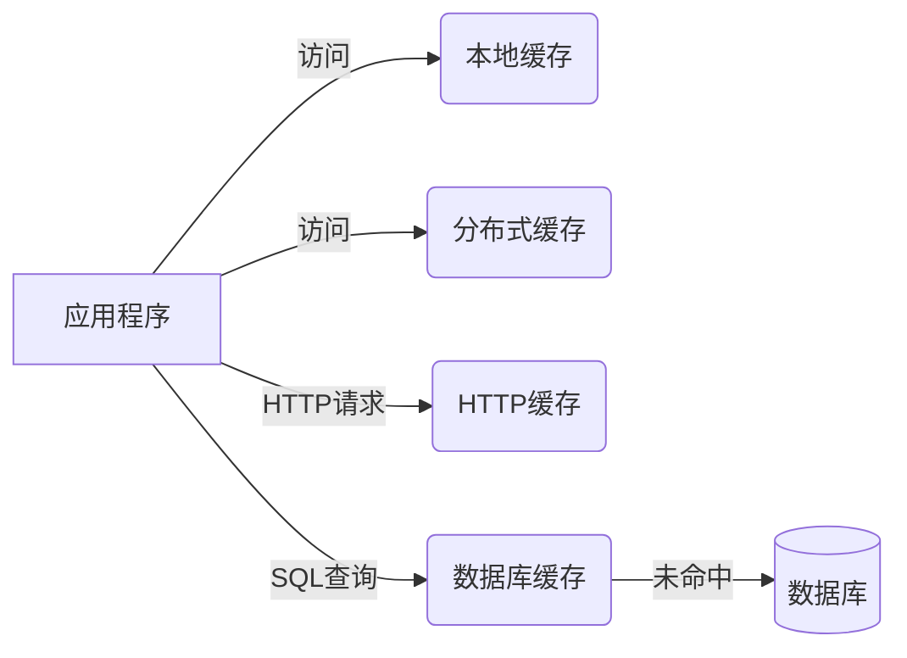

# AI系统缓存设计原理与代码实战案例讲解

## 1. 背景介绍
### 1.1 缓存在AI系统中的重要性
在当今大数据和人工智能时代,海量数据的高效处理和实时响应是AI系统必须具备的关键能力。而高性能的缓存系统在其中扮演着至关重要的角色。缓存通过将频繁访问的数据临时存储在内存中,大大减少了对底层数据源的访问,显著提升了系统的吞吐量和响应速度。对于数据密集型的AI应用,例如推荐系统、搜索引擎、自然语言处理等,高效的缓存设计往往是决定其性能的关键因素。

### 1.2 AI系统对缓存的特殊需求
与传统的Web应用相比,AI系统对缓存提出了更高的要求。首先,AI系统通常需要处理海量的非结构化数据,如文本、图像、视频等,对缓存的容量和吞吐量要求很高。其次,很多AI算法具有数据访问的局部性特征,同时不同类型数据的访问模式差异很大,需要缓存系统能够灵活适配。此外,机器学习训练过程中的参数更新也对缓存的一致性提出了新的挑战。因此,AI系统的缓存设计需要在容量、吞吐、一致性、扩展性等方面做专门的优化。

### 1.3 本文的主要内容
本文将重点探讨AI系统缓存设计的核心原理和最佳实践。内容涵盖缓存的基本概念,常见的缓存架构和算法,针对AI场景的缓存优化技巧,以及使用Python进行缓存系统开发的实战案例。通过本文的学习,读者可以系统地掌握AI系统缓存设计的关键技术,并能够应用到实际的项目开发中。

## 2. 核心概念与联系
### 2.1 缓存的基本原理
缓存的基本原理是将频繁访问的数据暂存在更高速的存储介质中,例如内存,从而避免了每次都从底层数据源(如磁盘)获取数据的开销。当应用程序请求某个数据时,会先检查缓存中是否已经存在,如果存在则直接返回,避免了对底层数据源的访问。只有当缓存未命中时,才会从数据源获取数据,并将其放入缓存,供后续使用。合理地使用缓存,可以大大降低系统的平均数据访问延迟。

### 2.2 缓存的关键指标
衡量一个缓存系统性能的关键指标主要有:
- 缓存命中率:缓存命中次数占所有缓存访问次数的比例,命中率越高,缓存的效果越好。 
- 缓存容量:缓存可以存储的数据量。容量越大,可以缓存的数据就越多,命中率一般也会更高。
- 缓存吞吐量:缓存每秒可以处理的读写请求数。高吞吐量意味着缓存可以支撑更大的并发访问。
- 缓存一致性:分布式缓存系统中多个节点缓存数据的一致性。一致性越好,数据的正确性就越有保障。

### 2.3 缓存与数据库的区别
缓存与数据库都是数据存储系统,但有着本质的区别:
- 存储介质:缓存多使用内存进行存储,而数据库主要使用磁盘。内存的访问速度远高于磁盘。
- 数据持久性:数据库提供数据的持久化存储,而缓存通常是易失的,断电或重启后数据会丢失。
- 数据一致性:数据库强调数据的强一致性,使用事务保证原子性。而缓存为了性能,通常牺牲一定的一致性。
- 访问模式:数据库适合复杂的关联查询和聚合分析,而缓存适合简单的 Key-Value 查询。

### 2.4 常见的缓存类型
根据缓存的位置和作用范围,常见的缓存可以分为以下几类:
- 本地缓存:应用程序中的进程内缓存,如 HashMap。读写速度最快,但受限于单机内存容量。
- 分布式缓存:独立的缓存服务,多个应用节点共享,如 Redis、Memcached。容量和吞吐量可扩展。
- HTTP 缓存:针对 Web 应用的缓存,利用 HTTP 协议头实现,如浏览器缓存、CDN 缓存。
- 数据库缓存:数据库自带的查询结果缓存,如 MySQL Query Cache。



## 3. 核心算法原理与具体操作步骤
### 3.1 缓存淘汰算法
由于缓存容量有限,当缓存满时,需要选择一部分数据删除,以便为新数据腾出空间。常用的缓存淘汰算法有:
- LRU(Least Recently Used):淘汰最近最少使用的数据。维护一个按访问时间排序的链表,新访问的数据移到表头,淘汰表尾的数据。
- LFU(Least Frequently Used):淘汰访问频率最低的数据。维护一个按访问次数排序的优先队列,新访问的数据访问次数加1,淘汰访问次数最少的数据。
- FIFO(First In First Out):淘汰最先进入缓存的数据。按照数据进入缓存的时间顺序,淘汰最早进入的数据。
- Random:随机淘汰缓存中的数据。实现简单,但无法保证淘汰的数据是最优的。

以 LRU 算法为例,其基本操作步骤如下:
1. 新数据插入缓存时,将其放到链表头部。
2. 每当缓存命中(即数据在缓存中被访问),则将数据移到链表头部。
3. 当缓存满时,将链表尾部的数据淘汰。

```python
class LRUCache:
    def __init__(self, capacity):
        self.capacity = capacity
        self.cache = {}
        self.head = Node(0, 0)
        self.tail = Node(0, 0)
        self.head.next = self.tail
        self.tail.prev = self.head
    
    def get(self, key):
        if key in self.cache:
            node = self.cache[key]
            self._remove(node)
            self._add(node)
            return node.value
        return -1
    
    def put(self, key, value):
        if key in self.cache:
            self._remove(self.cache[key])
        node = Node(key, value)
        self._add(node)
        self.cache[key] = node
        if len(self.cache) > self.capacity:
            node = self.head.next
            self._remove(node)
            del self.cache[node.key]
    
    def _remove(self, node):
        node.prev.next = node.next
        node.next.prev = node.prev
    
    def _add(self, node):
        node.prev = self.tail.prev
        node.next = self.tail
        self.tail.prev.next = node
        self.tail.prev = node

class Node:
    def __init__(self, key, value):
        self.key = key
        self.value = value
        self.prev = None
        self.next = None
```

### 3.2 缓存一致性算法
在分布式缓存系统中,由于存在多个缓存节点,不同节点的缓存数据可能存在不一致的情况。常用的缓存一致性算法有:
- 读写穿透:对于每个写操作,同时更新所有节点的缓存数据。对于读操作,如果本地缓存未命中,则直接读取底层数据源。简单粗暴,但会增加底层数据源的负载。
- 写失效:对于每个写操作,先删除所有节点的缓存数据,然后再更新数据源。缓存在下次读取时再从数据源加载。避免了不一致,但可能导致短时间内大量缓存失效,造成缓存雪崩。
- 最终一致性:写操作只更新本节点缓存,然后异步地将更新同步到其他节点。不保证强一致性,但是最终所有节点的数据会达到一致。适用于对一致性要求不高的场景。

以读写穿透为例,其基本操作步骤如下:
1. 对于写操作,同时更新所有节点的缓存数据。
2. 对于读操作,先查询本地缓存,如果命中则直接返回。
3. 如果缓存未命中,则直接查询底层数据源,并将结果写回所有节点的缓存。

```python
class DistributedCache:
    def __init__(self, nodes):
        self.nodes = nodes
    
    def get(self, key):
        local_cache = self.nodes[0]
        if local_cache.get(key) is not None:
            return local_cache.get(key)
        else:
            value = db.get(key)  # 从数据库读取
            if value is not None:
                for node in self.nodes:  # 更新所有节点缓存
                    node.put(key, value)
            return value
    
    def put(self, key, value):
        db.put(key, value)  # 写入数据库
        for node in self.nodes:  # 更新所有节点缓存
            node.put(key, value)
    
    def delete(self, key):
        db.delete(key)  # 删除数据库中的数据
        for node in self.nodes:  # 删除所有节点缓存
            node.delete(key)
```

### 3.3 缓存预热与缓存雪崩
- 缓存预热:在系统启动或者缓存为空时,提前将一些热点数据加载到缓存中,避免请求直接打到数据库。可以采用定时任务或者异步任务的方式进行缓存预热。
- 缓存雪崩:缓存大面积同时失效或者缓存服务不可用,导致大量请求直接打到数据库,引起数据库压力骤增,甚至宕机。常见的解决方案有:
  - 设置不同的缓存过期时间,避免同时失效。
  - 使用多级缓存,例如同时使用本地缓存和分布式缓存。
  - 缓存失效时,使用限流和降级策略,避免数据库被压垮。
  - 提前演练,制定应急预案,做好故障转移和快速恢复。

## 4. 数学模型和公式详解
### 4.1 缓存命中率模型
缓存命中率是衡量缓存系统效率的重要指标,它表示缓存能够成功响应请求的比例。假设缓存的总请求数为 $n$,命中次数为 $h$,则缓存命中率 $r$ 可以表示为:

$$r = \frac{h}{n}$$

举个例子,如果一个缓存系统总共处理了1000个请求,其中800个请求命中缓存,那么它的缓存命中率就是:

$$r = \frac{800}{1000} = 0.8 = 80\%$$

这意味着80%的请求都可以直接通过缓存响应,只有20%的请求需要访问底层数据源。一般来说,命中率越高,缓存的效果就越好。

### 4.2 缓存容量估算公式
合理地估算缓存所需的内存空间对于成本控制和性能优化都很重要。假设要缓存的数据有 $n$ 条,每条数据的平均大小为 $s$,期望的缓存命中率为 $r$,那么所需的缓存空间 $C$ 可以估算为:

$$C = n \times s \times r$$

例如,如果要缓存1000万条数据,每条数据平均占用1KB空间,期望命中率为90%,那么需要的缓存空间为:

$$C = 10^7 \times 1KB \times 0.9 \approx 9GB$$

这意味着需要准备至少9GB的内存空间来支撑这个缓存系统。当然,这只是一个理想估算,实际情况中还需要考虑缓存的预留空间、数据压缩、内存碎片等因素。

### 4.3 缓存一致性时间模型
在最终一致性的缓存架构中,数据的更新并不是实时同步到所有节点,而是存在一定的时间延迟。假设有 $n$ 个缓存节点,每个节点的数据同步时间为 $t$,那么整个缓存系统的最终一致性时间 $T$ 可以表示为:

$$T = max(t_1, t_2, ..., t_n)$$

其中 $t