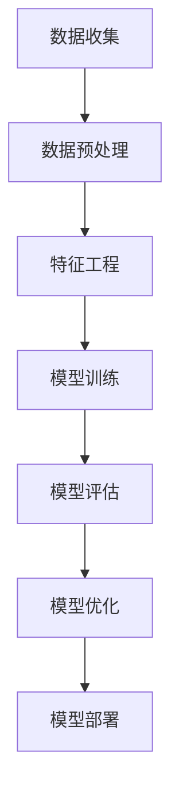

# AI系统设计原理与代码实战案例讲解

## 1.背景介绍

人工智能（AI）已经成为现代科技的核心驱动力之一，从自动驾驶汽车到智能语音助手，AI技术正在改变我们的生活方式。AI系统的设计和实现涉及多个学科的知识，包括计算机科学、数学、统计学和工程学。本文旨在通过深入探讨AI系统设计的核心原理，并结合实际代码案例，帮助读者更好地理解和应用AI技术。

## 2.核心概念与联系

在设计AI系统时，理解核心概念和它们之间的联系是至关重要的。以下是一些关键概念：

### 2.1 人工智能（AI）

人工智能是指通过计算机系统模拟人类智能的能力。AI系统可以执行诸如学习、推理、问题解决、感知和语言理解等任务。

### 2.2 机器学习（ML）

机器学习是AI的一个子领域，涉及通过数据训练模型，使其能够自动改进和做出预测。常见的机器学习算法包括线性回归、决策树、支持向量机和神经网络。

### 2.3 深度学习（DL）

深度学习是机器学习的一个子领域，使用多层神经网络来处理复杂的数据模式。深度学习在图像识别、自然语言处理和语音识别等领域表现出色。

### 2.4 数据与特征工程

数据是AI系统的基础，特征工程是从原始数据中提取有用特征的过程。高质量的数据和特征是成功的AI系统的关键。

### 2.5 模型评估与优化

模型评估是衡量模型性能的过程，常用的评估指标包括准确率、精确率、召回率和F1分数。模型优化是通过调整模型参数和结构来提高其性能的过程。

### 2.6 AI系统架构

AI系统架构包括数据收集、数据预处理、模型训练、模型评估和模型部署等多个环节。每个环节都需要精心设计和实现。

以下是AI系统架构的Mermaid流程图：



## 3.核心算法原理具体操作步骤

在AI系统设计中，核心算法的选择和实现是至关重要的。以下是一些常见的核心算法及其具体操作步骤：

### 3.1 线性回归

线性回归是一种简单而有效的回归算法，用于预测连续值。其基本思想是找到一个最佳拟合直线，使得数据点到直线的距离最小。

#### 操作步骤：

1. **数据准备**：收集和清洗数据。
2. **特征选择**：选择相关特征。
3. **模型训练**：使用最小二乘法拟合直线。
4. **模型评估**：计算均方误差（MSE）。
5. **模型优化**：调整特征或使用正则化方法。

### 3.2 决策树

决策树是一种树状结构的分类和回归算法，通过递归地分割数据空间来构建模型。

#### 操作步骤：

1. **数据准备**：收集和清洗数据。
2. **特征选择**：选择相关特征。
3. **树构建**：递归地选择最佳分割点。
4. **树剪枝**：防止过拟合。
5. **模型评估**：计算准确率或均方误差。

### 3.3 神经网络

神经网络是深度学习的基础，通过模拟人脑的神经元结构来处理复杂的数据模式。

#### 操作步骤：

1. **数据准备**：收集和清洗数据。
2. **特征选择**：选择相关特征。
3. **网络设计**：确定网络层数和每层神经元数量。
4. **模型训练**：使用反向传播算法调整权重。
5. **模型评估**：计算准确率或均方误差。
6. **模型优化**：调整网络结构或使用正则化方法。

## 4.数学模型和公式详细讲解举例说明

在AI系统设计中，数学模型和公式是理解算法原理的关键。以下是一些常见的数学模型和公式：

### 4.1 线性回归

线性回归的目标是找到一个线性函数 $y = \beta_0 + \beta_1 x_1 + \beta_2 x_2 + \cdots + \beta_n x_n$，使得预测值与实际值之间的误差最小。

#### 损失函数：

$$
J(\beta) = \frac{1}{2m} \sum_{i=1}^{m} (h_\beta(x^{(i)}) - y^{(i)})^2
$$

其中，$h_\beta(x) = \beta_0 + \beta_1 x_1 + \beta_2 x_2 + \cdots + \beta_n x_n$ 是预测函数，$m$ 是样本数量。

### 4.2 决策树

决策树通过递归地选择最佳分割点来构建模型。常用的分割标准包括信息增益和基尼指数。

#### 信息增益：

$$
IG(D, A) = H(D) - \sum_{v \in Values(A)} \frac{|D_v|}{|D|} H(D_v)
$$

其中，$H(D)$ 是数据集 $D$ 的熵，$D_v$ 是按特征 $A$ 的值 $v$ 分割后的子集。

### 4.3 神经网络

神经网络通过多层神经元的连接来处理数据。每个神经元的输出是输入的加权和通过激活函数后的结果。

#### 激活函数：

常用的激活函数包括Sigmoid函数、ReLU函数和Tanh函数。

$$
\sigma(x) = \frac{1}{1 + e^{-x}}
$$

$$
ReLU(x) = \max(0, x)
$$

$$
tanh(x) = \frac{e^x - e^{-x}}{e^x + e^{-x}}
$$

#### 损失函数：

常用的损失函数包括均方误差（MSE）和交叉熵损失。

$$
MSE = \frac{1}{m} \sum_{i=1}^{m} (y^{(i)} - \hat{y}^{(i)})^2
$$

$$
CrossEntropy = -\frac{1}{m} \sum_{i=1}^{m} [y^{(i)} \log(\hat{y}^{(i)}) + (1 - y^{(i)}) \log(1 - \hat{y}^{(i)})]
$$

## 5.项目实践：代码实例和详细解释说明

为了更好地理解AI系统的设计和实现，以下是一个简单的线性回归项目实践案例。

### 5.1 数据准备

首先，我们需要准备数据。假设我们有一个简单的数据集，包含房屋面积和价格。

```python
import numpy as np
import pandas as pd

# 创建数据集
data = {
    '面积': [50, 60, 70, 80, 90],
    '价格': [150, 180, 210, 240, 270]
}
df = pd.DataFrame(data)
```

### 5.2 特征选择

在这个例子中，我们选择面积作为特征，价格作为目标变量。

```python
X = df['面积'].values.reshape(-1, 1)
y = df['价格'].values
```

### 5.3 模型训练

使用Scikit-Learn库进行线性回归模型训练。

```python
from sklearn.linear_model import LinearRegression

# 创建线性回归模型
model = LinearRegression()

# 训练模型
model.fit(X, y)
```

### 5.4 模型评估

计算模型的均方误差（MSE）。

```python
from sklearn.metrics import mean_squared_error

# 预测
y_pred = model.predict(X)

# 计算均方误差
mse = mean_squared_error(y, y_pred)
print(f'均方误差: {mse}')
```

### 5.5 模型优化

在实际项目中，我们可以通过增加更多特征或使用正则化方法来优化模型。

```python
from sklearn.preprocessing import PolynomialFeatures
from sklearn.pipeline import make_pipeline

# 创建多项式特征
poly = PolynomialFeatures(degree=2)

# 创建多项式回归模型
poly_model = make_pipeline(poly, LinearRegression())

# 训练模型
poly_model.fit(X, y)

# 预测
y_poly_pred = poly_model.predict(X)

# 计算均方误差
poly_mse = mean_squared_error(y, y_poly_pred)
print(f'多项式回归均方误差: {poly_mse}')
```

## 6.实际应用场景

AI技术在各个领域都有广泛的应用，以下是一些实际应用场景：

### 6.1 医疗健康

AI可以用于疾病诊断、药物研发和个性化治疗。例如，深度学习算法可以分析医学影像，帮助医生诊断疾病。

### 6.2 金融服务

AI可以用于风险评估、欺诈检测和投资策略优化。例如，机器学习算法可以分析客户数据，预测信用风险。

### 6.3 自动驾驶

AI是自动驾驶技术的核心，通过传感器数据和深度学习算法，自动驾驶汽车可以感知环境并做出驾驶决策。

### 6.4 电子商务

AI可以用于推荐系统、客户服务和库存管理。例如，推荐系统可以根据用户的历史行为，推荐个性化的商品。

### 6.5 智能家居

AI可以用于智能家居设备的控制和管理。例如，智能音箱可以通过语音识别技术，执行用户的语音命令。

## 7.工具和资源推荐

在AI系统设计和实现过程中，使用合适的工具和资源可以大大提高效率。以下是一些推荐的工具和资源：

### 7.1 编程语言

- **Python**：Python是AI开发的首选编程语言，拥有丰富的库和框架。
- **R**：R语言在统计分析和数据可视化方面表现出色。

### 7.2 开发框架

- **TensorFlow**：谷歌开发的开源深度学习框架，支持大规模机器学习任务。
- **PyTorch**：Facebook开发的开源深度学习框架，易于使用和调试。
- **Scikit-Learn**：Python的机器学习库，适用于中小规模的机器学习任务。

### 7.3 数据集

- **Kaggle**：提供丰富的公开数据集和竞赛平台。
- **UCI机器学习库**：提供各种机器学习数据集，适用于学术研究和项目实践。

### 7.4 在线课程和书籍

- **Coursera**：提供各种AI和机器学习课程。
- **edX**：提供来自顶尖大学的AI课程。
- **《深度学习》**：Ian Goodfellow等人编写的经典教材，深入讲解深度学习原理和应用。

## 8.总结：未来发展趋势与挑战

AI技术正在迅速发展，并在各个领域展现出巨大的潜力。未来，AI系统将更加智能和自主，能够处理更复杂的任务。然而，AI的发展也面临一些挑战：

### 8.1 数据隐私与安全

随着AI系统对数据的依赖增加，数据隐私和安全问题变得越来越重要。如何保护用户数据，防止数据泄露和滥用，是一个亟待解决的问题。

### 8.2 伦理与法律

AI系统的决策可能会对社会产生深远影响，因此需要考虑伦理和法律问题。例如，自动驾驶汽车在发生事故时的责任归属问题。

### 8.3 可解释性

许多AI算法，特别是深度学习算法，具有“黑箱”特性，难以解释其决策过程。提高AI系统的可解释性，有助于增加用户的信任和接受度。

### 8.4 通用人工智能

目前的AI系统大多是专用的，能够处理特定任务。实现通用人工智能（AGI），即具有人类智能水平的AI系统，是AI研究的终极目标，但仍面临巨大的技术挑战。

## 9.附录：常见问题与解答

### 9.1 什么是过拟合，如何防止过拟合？

过拟合是指模型在训练数据上表现良好，但在测试数据上表现不佳。防止过拟合的方法包括使用更多数据、正则化、交叉验证和剪枝等。

### 9.2 如何选择合适的机器学习算法？

选择机器学习算法需要考虑数据的特性、任务的需求和计算资源。可以通过实验和比较不同算法的性能，选择最合适的算法。

### 9.3 什么是特征工程，为什么重要？

特征工程是从原始数据中提取有用特征的过程。高质量的特征可以显著提高模型的性能，因此特征工程在AI系统设计中非常重要。

### 9.4 如何评估模型的性能？

常用的模型评估指标包括准确率、精确率、召回率、F1分数和均方误差。选择合适的评估指标取决于具体任务和需求。

### 9.5 什么是深度学习，如何开始学习深度学习？

深度学习是机器学习的一个子领域，使用多层神经网络来处理复杂的数据模式。学习深度学习可以从基础数学和机器学习知识入手，逐步深入到神经网络和深度学习框架的使用。

---

作者：禅与计算机程序设计艺术 / Zen and the Art of Computer Programming