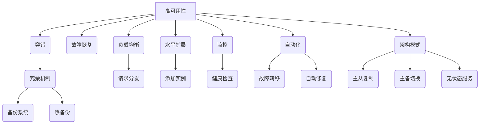

# AI系统高可用原理与代码实战案例讲解

## 1.背景介绍

在当今快节奏的数字时代,AI系统的高可用性变得越来越重要。无论是为了支持关键任务的连续运行,还是确保服务的稳定性和可靠性,高可用性都是AI系统设计和部署的核心考虑因素。本文将探讨AI系统高可用性的核心概念、原理和实现方法,并通过实际案例讲解如何在代码层面实现高可用系统。

### 1.1 什么是高可用性?

高可用性(High Availability,HA)是指系统能够在规定的时间内保持可操作和可访问的能力。具有高可用性的系统能够最大程度地减少由于故障、维护或其他原因导致的停机时间,从而提高系统的整体可靠性和用户体验。

### 1.2 高可用性的重要性

在AI系统中,高可用性尤为关键,原因如下:

1. **任务连续性**: 许多AI任务(如自动驾驶、智能制造等)需要持续不间断地运行,任何中断都可能导致严重后果。
2. **数据完整性**: AI系统通常会处理大量数据,中断可能导致数据丢失或不一致。
3. **用户体验**: 对于面向用户的AI服务(如语音助手、推荐系统等),可用性直接影响用户体验。
4. **商业影响**: 对于依赖AI的企业来说,系统中断可能导致巨大的经济损失。

因此,确保AI系统的高可用性对于维护其正常运行、保护数据完整性、提供优质用户体验和减少商业风险至关重要。

## 2.核心概念与联系

实现AI系统的高可用性需要结合多种技术和架构模式。以下是一些核心概念及其相互关系:

### 2.1 故障tolerant和故障恢复

高可用系统必须具备容错(Fault Tolerant)能力,即在发生故障时能够继续运行,并且能够从故障中快速恢复(Fault Recovery)。这通常需要引入冗余机制,如备份系统、热备份等。

### 2.2 负载均衡和水平扩展

为了应对高并发场景,高可用系统需要实现负载均衡(Load Balancing)和水平扩展(Horizontal Scaling)。负载均衡可以将请求分发到多个实例,而水平扩展则允许通过添加更多实例来扩大系统的处理能力。

### 2.3 监控和自动化

高可用系统需要实时监控各个组件的健康状况,并在发现异常时自动执行故障转移、自动修复等操作。因此,监控(Monitoring)和自动化(Automation)是高可用性的关键支撑。

### 2.4 架构模式

实现高可用性需要采用合适的架构模式,如主从复制(Master-Slave Replication)、主备切换(Active-Passive)、无状态服务(Stateless Service)等。不同的架构模式适用于不同的场景和需求。



上图展示了高可用性的核心概念及其之间的关系。实现高可用AI系统需要综合考虑和应用这些概念和技术。

## 3.核心算法原理具体操作步骤

实现AI系统高可用性的核心算法原理和操作步骤如下:

### 3.1 主从复制

主从复制(Master-Slave Replication)是一种常见的高可用架构模式,它将数据复制到多个节点,其中一个节点作为主节点(Master)处理写入操作,其他节点作为从节点(Slave)处理读取操作。当主节点发生故障时,从节点中的一个将被提升为新的主节点,以确保服务的连续性。

1. 选举主节点:通过分布式协议(如Raft、Paxos等)在集群中选举出一个主节点。
2. 数据同步:主节点将数据变更同步到所有从节点。
3. 读写分离:主节点处理所有写入操作,从节点处理读取操作。
4. 主从切换:当主节点发生故障时,从节点中的一个被选举为新的主节点,其他从节点将与新主节点建立复制关系。
5. 故障检测:持续监控主节点和从节点的健康状态,及时发现故障。
6. 故障恢复:当故障节点恢复后,需要将其重新加入集群,并进行数据同步。

### 3.2 主备切换

主备切换(Active-Passive)是另一种常见的高可用架构模式。它包含一个活动节点(Active)和一个或多个备用节点(Passive)。活动节点处理所有请求,而备用节点则处于待机状态,准备在活动节点发生故障时接管服务。

1. 状态复制:活动节点将其状态持续复制到备用节点。
2. 心跳检测:备用节点持续监控活动节点的健康状态。
3. 故障切换:当活动节点发生故障时,备用节点将接管服务,成为新的活动节点。
4. 故障恢复:当故障节点恢复后,需要将其重新加入集群,并进行状态同步。
5. 故障模拟:定期进行故障模拟测试,验证故障切换机制的有效性。

### 3.3 无状态服务

无状态服务(Stateless Service)是一种简化高可用性实现的架构模式。无状态服务不维护内部状态,每个请求都是独立处理的。这种架构模式通常更易于实现高可用性,因为服务实例之间没有状态依赖关系。

1. 请求路由:通过负载均衡器将请求路由到多个服务实例。
2. 实例扩展:根据需求动态添加或删除服务实例。
3. 健康检查:持续监控服务实例的健康状态,自动移除故障实例。
4. 数据持久化:将服务所需的状态数据持久化到外部存储(如数据库、缓存等)。

这些核心算法原理和操作步骤为实现AI系统的高可用性提供了基础。在实际应用中,还需要结合具体的系统架构、工作负载和可用资源进行优化和调整。

## 4.数学模型和公式详细讲解举例说明  

在设计和优化高可用AI系统时,需要使用数学模型和公式来量化和评估系统的可用性、可靠性和性能。以下是一些常见的数学模型和公式:

### 4.1 可用性模型

可用性(Availability)是衡量系统在给定时间内保持可操作状态的能力。它通常用以下公式表示:

$$
可用性 = \frac{正常运行时间}{总运行时间} = \frac{MTTF}{MTTF + MTTR}
$$

其中:
- $MTTF$ (Mean Time To Failure) 是平均故障间隔时间,即系统在发生故障前的平均运行时间。
- $MTTR$ (Mean Time To Recovery) 是平均恢复时间,即系统从发生故障到恢复正常运行所需的平均时间。

例如,如果一个系统的 $MTTF$ 为 30 天,而 $MTTR$ 为 2 小时,则其可用性为:

$$
可用性 = \frac{30 \times 24}{30 \times 24 + 2} \approx 0.9986 \text{ 或 } 99.86\%
$$

通过优化 $MTTF$ 和 $MTTR$,可以显著提高系统的可用性。

### 4.2 可靠性模型

可靠性(Reliability)描述了系统在给定时间内无故障运行的概率。常用的可靠性模型是指数分布模型,其概率密度函数为:

$$
f(t) = \lambda e^{-\lambda t}
$$

其中 $\lambda$ 是故障率(Failure Rate),表示单位时间内发生故障的概率。

对于高可用系统,我们希望可靠性尽可能高。给定运行时间 $t$,系统的可靠性为:

$$
R(t) = e^{-\lambda t}
$$

例如,如果一个系统的故障率为 $\lambda = 0.001$ 次/小时,则在运行 1000 小时后,其可靠性为:

$$
R(1000) = e^{-0.001 \times 1000} \approx 0.368 \text{ 或 } 36.8\%
$$

通过降低故障率 $\lambda$,可以提高系统的可靠性。

### 4.3 队列理论模型

在高可用系统中,经常需要处理大量并发请求。队列理论模型可用于分析和优化系统的响应时间和吞吐量。

例如,在 M/M/1 队列模型中(单服务器、泊松到达、指数服务时间),系统的平均响应时间 $T$ 由以下公式给出:

$$
T = \frac{1}{\mu - \lambda}
$$

其中 $\lambda$ 是请求到达率,而 $\mu$ 是服务率。

当 $\lambda < \mu$ 时,队列长度期望值为:

$$
L_q = \frac{\lambda^2}{\mu(\mu - \lambda)}
$$

通过调整服务率 $\mu$ 或限制请求到达率 $\lambda$,可以控制响应时间和队列长度,从而优化系统性能。

以上是一些常见的数学模型和公式,在设计和优化高可用AI系统时,需要根据具体情况选择合适的模型进行分析和计算。

## 5.项目实践:代码实例和详细解释说明

为了更好地理解高可用AI系统的实现,我们将通过一个基于 Python 和 Kubernetes 的实际项目案例来演示核心概念和技术。

### 5.1 项目概述

在本案例中,我们将构建一个高可用的对象检测服务,该服务可以实时处理来自多个客户端的图像,并返回检测到的对象信息。该服务由以下几个主要组件组成:

1. **对象检测模型**:基于深度学习的对象检测模型,用于处理图像并识别其中的对象。
2. **API 服务器**:提供 RESTful API 接口,接收客户端的图像请求并返回检测结果。
3. **消息队列**:用于在 API 服务器和模型服务之间传递图像数据和检测结果。
4. **模型服务**:从消息队列中获取图像数据,使用对象检测模型进行处理,并将结果发送回消息队列。
5. **Kubernetes 集群**:用于部署和管理整个服务的基础设施。

### 5.2 高可用性实现

为了实现高可用性,我们将采用以下策略:

1. **API 服务器**: 使用 Kubernetes 部署多个副本,并通过服务(Service)实现负载均衡。
2. **消息队列**: 使用 RabbitMQ 作为消息队列,并部署为高可用集群。
3. **模型服务**: 使用 Kubernetes 部署多个副本,并通过消费者组实现负载均衡和故障转移。

#### 5.2.1 API 服务器

API 服务器使用 Flask 框架构建,代码如下:

```python
from flask import Flask, request
import pika
import json

app = Flask(__name__)

# 连接到 RabbitMQ
connection = pika.BlockingConnection(pika.ConnectionParameters('rabbitmq-service'))
channel = connection.channel()
channel.queue_declare(queue='image_queue')

@app.route('/detect', methods=['POST'])
def detect():
    # 获取客户端上传的图像
    image = request.files['image'].read()

    # 将图像发送到消息队列
    channel.basic_publish(exchange='', routing_key='image_queue', body=image)

    # 返回一个响应,告知客户端图像已被接收
    return 'Image received'

if __name__ == '__main__':
    app.run(host='0.0.0.0', port=5000)
```

该服务器通过 `/detect` 端点接收客户端上传的图像,并将图像数据发送到 RabbitMQ 的 `image_queue` 队列中。

在 Kubernetes 中,我们使用 Deployment 创建多个副本,并通过 Service 实