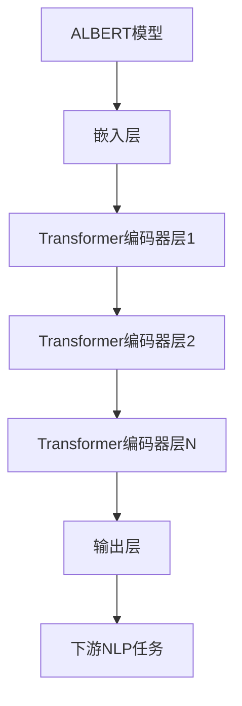
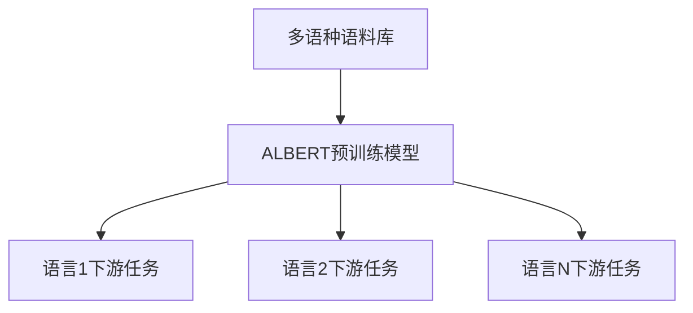
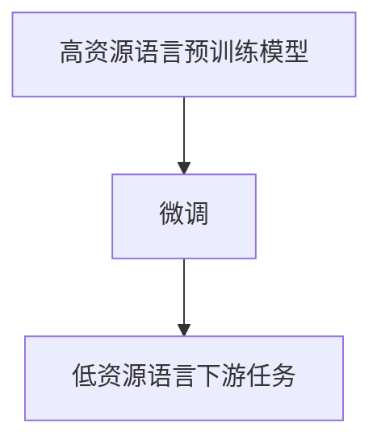

# ALBERT多语言支持：构建跨语言NLP应用

## 1.背景介绍

### 1.1 自然语言处理的重要性

在当今数字时代,自然语言处理(NLP)已成为人工智能领域中最重要和最具挑战性的研究方向之一。随着大数据和计算能力的不断提升,NLP技术在各个领域得到了广泛应用,如机器翻译、智能问答、文本摘要、情感分析等。然而,由于语言的多样性和复杂性,构建高效、准确的跨语言NLP系统仍然是一个巨大的挑战。

### 1.2 BERT模型的革命性贡献

2018年,谷歌推出了BERT(Bidirectional Encoder Representations from Transformers)模型,这是NLP领域的一个里程碑式进展。BERT是一种基于Transformer的双向编码器模型,能够有效地捕捉文本中的上下文信息,从而在多项NLP任务上取得了state-of-the-art的性能表现。

### 1.3 ALBERT模型的优化改进

尽管BERT模型取得了巨大成功,但它存在一些缺陷,如参数量过大、训练成本高昂等。为了解决这些问题,谷歌于2019年推出了ALBERT(A Lite BERT for Self-supervised Learning of Language Representations)模型,它是BERT的一个优化版本,在保持性能的同时,大幅减少了模型参数量和训练时间。

### 1.4 跨语言NLP的重要性

随着全球化进程的加速,构建高效的跨语言NLP系统变得越来越重要。跨语言NLP不仅可以促进不同语言之间的信息交流和理解,还可以为缺乏语料资源的语种提供有力支持。ALBERT模型在多语言支持方面表现出色,为构建跨语言NLP应用提供了强大的基础。

## 2.核心概念与联系

### 2.1 ALBERT模型架构

ALBERT模型的核心架构继承自BERT,采用了Transformer编码器结构。它由多层Transformer编码器堆叠而成,每一层由多头注意力机制和前馈神经网络组成。ALBERT模型的主要优化策略包括:

1. 嵌入参数因子分解(Factorized Embedding Parameterization)
2. 跨层参数共享(Cross-layer Parameter Sharing)
3. 句子顺序预测(Sentence Order Prediction)

这些优化策略有效地降低了模型参数量,同时保持了与BERT相当的性能表现。



### 2.2 多语言支持

ALBERT模型通过共享参数的方式,支持多种语言的预训练和微调。在预训练阶段,ALBERT模型可以在多语种语料库上进行自监督学习,获取通用的语言表示能力。在微调阶段,只需要对特定语言的下游任务进行少量微调,即可获得良好的性能表现。



### 2.3 跨语言迁移学习

基于ALBERT模型的多语言支持,我们可以实现跨语言迁移学习。具体来说,我们可以在资源丰富的语言上预训练ALBERT模型,然后将其迁移到资源匮乏的语言上,通过少量微调即可获得良好的性能表现。这种方法可以有效地解决数据稀缺问题,为低资源语言提供强大的NLP能力。



## 3.核心算法原理具体操作步骤

### 3.1 ALBERT模型预训练

ALBERT模型的预训练过程包括两个主要任务:掩码语言模型(Masked Language Model)和句子顺序预测(Sentence Order Prediction)。

#### 3.1.1 掩码语言模型

掩码语言模型的目标是根据上下文预测被掩码的词。具体操作步骤如下:

1. 从语料库中随机选择一个句子或连续的句子对。
2. 随机选择一些词,并用特殊的[MASK]标记替换它们。
3. 将被掩码的句子输入ALBERT模型,模型需要预测被掩码的词。
4. 通过最大化被掩码词的条件概率,优化ALBERT模型参数。

#### 3.1.2 句子顺序预测

句子顺序预测的目标是判断两个句子的前后顺序是否正确。具体操作步骤如下:

1. 从语料库中随机选择一个句子对。
2. 以50%的概率交换句子对的顺序。
3. 将句子对输入ALBERT模型,模型需要预测句子顺序是否被交换。
4. 通过最小化句子顺序预测的交叉熵损失,优化ALBERT模型参数。

### 3.2 ALBERT模型微调

在完成预训练后,我们可以将ALBERT模型微调到特定的下游NLP任务上,如文本分类、序列标注、问答系统等。微调过程通常包括以下步骤:

1. 准备下游任务的训练数据和评估数据。
2. 将ALBERT模型的输出层替换为适合下游任务的输出层。
3. 在下游任务的训练数据上进行微调,优化ALBERT模型参数。
4. 在评估数据上测试微调后模型的性能。

在多语言场景下,我们可以在不同语言的下游任务上分别进行微调,从而获得针对不同语言的NLP模型。

## 4.数学模型和公式详细讲解举例说明

### 4.1 Transformer编码器

ALBERT模型的核心结构是Transformer编码器,它由多头注意力机制和前馈神经网络组成。

#### 4.1.1 多头注意力机制

多头注意力机制能够捕捉输入序列中不同位置之间的依赖关系。对于一个长度为n的输入序列$X = (x_1, x_2, \dots, x_n)$,多头注意力机制的计算过程如下:

1. 将输入序列$X$线性映射到查询(Query)、键(Key)和值(Value)向量:

$$
Q = XW^Q, K = XW^K, V = XW^V
$$

其中$W^Q, W^K, W^V$分别是查询、键和值的权重矩阵。

2. 计算注意力分数:

$$
\text{Attention}(Q, K, V) = \text{softmax}\left(\frac{QK^T}{\sqrt{d_k}}\right)V
$$

其中$d_k$是缩放因子,用于防止内积过大导致梯度消失。

3. 多头注意力机制将多个注意力头的结果拼接:

$$
\text{MultiHead}(Q, K, V) = \text{Concat}(head_1, \dots, head_h)W^O
$$

其中$head_i = \text{Attention}(QW_i^Q, KW_i^K, VW_i^V)$,表示第$i$个注意力头的计算结果。$W_i^Q, W_i^K, W_i^V$是第$i$个注意力头的权重矩阵,而$W^O$是用于线性变换的权重矩阵。

#### 4.1.2 前馈神经网络

前馈神经网络由两个线性变换和一个非线性激活函数组成,用于对每个位置的表示进行独立的变换:

$$
\text{FFN}(x) = \max(0, xW_1 + b_1)W_2 + b_2
$$

其中$W_1, W_2$是线性变换的权重矩阵,$b_1, b_2$是偏置向量,而$\max(0, \cdot)$是ReLU激活函数。

### 4.2 ALBERT模型优化策略

#### 4.2.1 嵌入参数因子分解

ALBERT模型采用嵌入参数因子分解策略,将词嵌入矩阵$E$分解为两个低维矩阵的乘积:

$$
E = E_1E_2^T
$$

其中$E_1 \in \mathbb{R}^{d \times m}, E_2 \in \mathbb{R}^{n \times m}$,且$m \ll d, n$。这种分解方式可以大幅减少嵌入参数的数量,从$dn$降低到$dm + nm$。

#### 4.2.2 跨层参数共享

ALBERT模型在Transformer编码器的不同层之间共享部分参数,包括注意力和前馈网络的参数。具体来说,对于$L$层的Transformer编码器,ALBERT模型将其划分为$g$组,每组包含$k$层,其中$L = g \times k$。在同一组内的层共享相同的参数,而不同组之间的参数是独立的。这种策略可以进一步减少模型参数量,同时保持性能。

## 5.项目实践:代码实例和详细解释说明

在本节中,我们将提供一个使用ALBERT模型进行文本分类的代码示例,并对关键步骤进行详细解释。

### 5.1 导入必要的库

```python
import torch
from transformers import AlbertForSequenceClassification, AlbertTokenizer
```

我们将使用Hugging Face的`transformers`库,它提供了预训练的ALBERT模型和tokenizer。

### 5.2 加载预训练模型和tokenizer

```python
model_name = "albert-base-v2"
tokenizer = AlbertTokenizer.from_pretrained(model_name)
model = AlbertForSequenceClassification.from_pretrained(model_name, num_labels=2)
```

我们加载了`albert-base-v2`预训练模型和对应的tokenizer。`num_labels=2`表示这是一个二分类任务。

### 5.3 数据预处理

```python
texts = ["This movie is great!", "I didn't like the book."]
encodings = tokenizer(texts, truncation=True, padding=True, return_tensors="pt")
```

我们使用tokenizer将文本数据转换为模型可以接受的输入格式,包括对词进行编码、截断和填充等操作。

### 5.4 模型推理

```python
outputs = model(**encodings)
logits = outputs.logits
predictions = torch.argmax(logits, dim=-1)
print(predictions)  # 输出: tensor([1, 0])
```

我们将编码后的输入传递给模型,获取logits输出,并使用`torch.argmax`函数获取预测的标签。

### 5.5 模型微调

如果需要在特定数据集上微调ALBERT模型,可以使用如下代码:

```python
from transformers import TrainingArguments, Trainer

training_args = TrainingArguments(...)
trainer = Trainer(
    model=model,
    args=training_args,
    train_dataset=train_dataset,
    eval_dataset=eval_dataset,
)
trainer.train()
```

`TrainingArguments`用于设置训练超参数,如批大小、学习率等。`Trainer`类提供了便捷的API进行模型训练和评估。

## 6.实际应用场景

ALBERT模型的多语言支持使其在各种跨语言NLP应用场景中发挥着重要作用,包括但不限于:

### 6.1 机器翻译

在机器翻译任务中,我们可以使用ALBERT模型作为编码器,将源语言文本编码为语义表示,然后使用解码器生成目标语言文本。ALBERT模型的多语言能力可以支持多种语言对之间的翻译,大大提高了系统的通用性和可扩展性。

### 6.2 跨语言文本分类

文本分类是NLP中一项基础且广泛应用的任务,如新闻分类、垃圾邮件检测等。使用ALBERT模型,我们可以在多种语言的文本分类任务上获得良好的性能表现,实现跨语言的文本分类能力。

### 6.3 多语种问答系统

构建多语种问答系统是一项极具挑战的任务,需要处理多种语言的自然语言查询和知识库。ALBERT模型可以在多种语言的问答数据集上进行预训练和微调,从而支持多语种问答功能。

### 6.4 低资源语言NLP

对于缺乏大规模语料的低资源语言,我们可以利用ALBERT模型的跨语言迁移学习能力。首先在高资源语言上预训练ALBERT模型,然后将其迁移到低资源语言上进行微调,从而获得良好的NLP性能。

## 7.工具和资源推荐

### 7.1 Hugging Face Transformers

Hugging Face