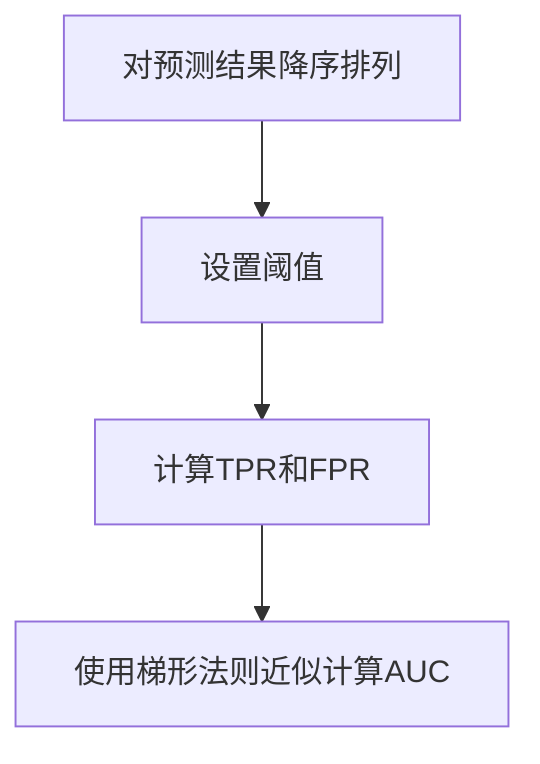
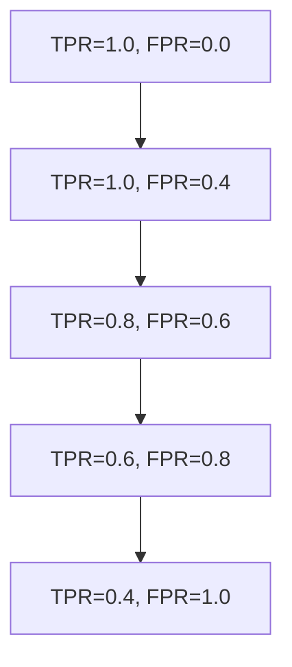

# AUC-ROC 原理与代码实战案例讲解

## 1.背景介绍

在机器学习和数据挖掘领域中,评估模型的性能是一个非常重要的环节。我们通常使用各种评估指标来衡量模型的好坏,例如准确率、精确率、召回率、F1分数等。然而,这些指标往往只能给出模型在特定阈值下的性能表现,而无法全面反映模型在不同阈值下的整体表现。

这时,我们就需要引入一种能够综合考虑不同阈值下模型性能的评估指标——ROC(Receiver Operating Characteristic)曲线及其下相应的AUC(Area Under Curve)值。AUC-ROC不仅可以全面评估模型的分类性能,还能帮助我们选择最优阈值,是一种常用且重要的模型评估方法。

## 2.核心概念与联系

### 2.1 ROC曲线

ROC曲线全称是"受试者工作特征曲线"(Receiver Operating Characteristic Curve),最早应用于信号检测理论。它展示了二分类模型在不同阈值下的真阳性率(TPR)和假阳性率(FPR)之间的关系。

ROC曲线的横轴是假阳性率(FPR),纵轴是真阳性率(TPR)。理想的模型应该尽可能将ROC曲线向左上角靠拢,使得TPR尽可能大,FPR尽可能小。对角线y=x代表随机猜测的结果。

$$
TPR = \frac{TP}{TP + FN}
$$

$$
FPR = \frac{FP}{TN + FP}
$$

其中TP、FP、TN、FN分别代表真阳性、假阳性、真阴性和假阴性的数量。

### 2.2 AUC值

AUC(Area Under Curve)指的是ROC曲线下的面积,用来评估二分类模型的整体性能。AUC的取值范围是0到1,值越大说明模型的性能越好。

- AUC=1,是一个完美分类器
- AUC=0.5,是一个随机分类器
- 0.5<AUC<0.7,分类效果较差
- 0.7≤AUC<0.9,分类效果一般
- AUC≥0.9,分类效果极好

AUC值不仅能综合考虑所有可能的分类阈值,还具有一些很好的性质:

- AUC对于不平衡的数据集也有很好的评估能力
- AUC对于样本的排列无关,只与排序有关
- AUC是分类任务的一个统一评价标准,可用于不同模型和数据集的比较

## 3.核心算法原理具体操作步骤

计算AUC有多种方法,最常见的是使用梯形法则近似计算ROC曲线下的面积。具体步骤如下:

1. 对预测结果进行降序排列
2. 设置不同的阈值,计算每个阈值下的TPR和FPR
3. 使用梯形法则近似计算ROC曲线下的面积



### 3.1 对预测结果进行降序排列

假设我们有一个二分类问题的预测结果,包含实际标签和预测概率值,如下所示:

| 实际标签 | 预测概率 |
|----------|----------|
| 1        | 0.9      |
| 0        | 0.8      |
| 1        | 0.7      |
| 0        | 0.6      |
| 1        | 0.55     |
| 0        | 0.54     |
| 0        | 0.53     |
| 1        | 0.52     |
| 0        | 0.51     |

我们需要先对预测概率值进行降序排列:

| 实际标签 | 预测概率 |
|----------|----------|
| 1        | 0.9      |
| 0        | 0.8      |
| 1        | 0.7      |
| 0        | 0.6      |
| 1        | 0.55     |
| 0        | 0.54     |
| 0        | 0.53     |
| 1        | 0.52     |
| 0        | 0.51     |

### 3.2 设置阈值,计算TPR和FPR

接下来,我们设置一系列阈值,计算每个阈值下的真阳性率TPR和假阳性率FPR。

假设正例的实际标签为1,负例的实际标签为0。我们从最大的预测概率值开始,将其作为第一个阈值,计算TPR和FPR。

**阈值=0.9**

- 预测为正例(预测概率>=0.9): 1个,实际正例1个,实际负例0个
- TP(真阳性) = 1, FN(假阴性) = 0 
- FP(假阳性) = 0, TN(真阴性) = 0
- TPR = TP / (TP + FN) = 1 / (1 + 0) = 1
- FPR = FP / (FP + TN) = 0 / (0 + 0) = 0  

**阈值=0.8**  

- 预测为正例(预测概率>=0.8): 2个,实际正例2个,实际负例1个
- TP = 2, FN = 0
- FP = 1, TN = 0  
- TPR = 2 / (2 + 0) = 1
- FPR = 1 / (1 + 0) = 1

我们继续这个过程,直到阈值设置为最小的预测概率值,就可以得到一系列的TPR和FPR值对。

### 3.3 使用梯形法则近似计算AUC

有了一系列的TPR和FPR值对后,我们就可以使用梯形法则来近似计算ROC曲线下的面积AUC了。

梯形法则的计算公式为:

$$
AUC = \sum_{i=1}^{n-1} \frac{1}{2}(x_{i+1} - x_i)(y_{i+1} + y_i)
$$

其中,$(x_i, y_i)$表示第i个TPR和FPR值对。

我们将TPR值作为y轴,FPR值作为x轴,利用公式就可以计算出AUC的数值了。

## 4.数学模型和公式详细讲解举例说明

在上一节中,我们已经介绍了计算AUC的梯形法则公式:

$$
AUC = \sum_{i=1}^{n-1} \frac{1}{2}(x_{i+1} - x_i)(y_{i+1} + y_i)
$$

这里我们用一个具体的例子来详细说明一下这个公式的计算过程。

假设我们有以下一组TPR和FPR值对:

| TPR | FPR |
|-----|-----|
| 1.0 | 0.0 |
| 1.0 | 0.4 |
| 0.8 | 0.6 |
| 0.6 | 0.8 |
| 0.4 | 1.0 |

我们将这些值对在坐标系中绘制出来,就可以得到ROC曲线了。



现在我们来计算AUC的值:

1) $x_1 = 0.0, x_2 = 0.4, y_1 = 1.0, y_2 = 1.0$
   第一个梯形的面积 = $\frac{1}{2}(0.4 - 0.0)(1.0 + 1.0) = 0.2$

2) $x_2 = 0.4, x_3 = 0.6, y_2 = 1.0, y_3 = 0.8$
   第二个梯形的面积 = $\frac{1}{2}(0.6 - 0.4)(1.0 + 0.8) = 0.18$
   
3) $x_3 = 0.6, x_4 = 0.8, y_3 = 0.8, y_4 = 0.6$
   第三个梯形的面积 = $\frac{1}{2}(0.8 - 0.6)(0.8 + 0.6) = 0.12$

4) $x_4 = 0.8, x_5 = 1.0, y_4 = 0.6, y_5 = 0.4$
   第四个梯形的面积 = $\frac{1}{2}(1.0 - 0.8)(0.6 + 0.4) = 0.08$

将所有梯形的面积相加,我们就得到了AUC的值:

$$
AUC = 0.2 + 0.18 + 0.12 + 0.08 = 0.58
$$

可以看出,这个ROC曲线的AUC值为0.58,属于一个一般的分类效果。

通过这个例子,相信您已经对梯形法则计算AUC的过程有了更加深入的理解。在实际应用中,我们可以使用编程语言来实现这个算法,从而方便地计算出任意ROC曲线下的AUC值。

## 5.项目实践:代码实例和详细解释说明

在上一节中,我们已经详细讲解了如何使用梯形法则计算AUC值。现在,我们将使用Python编程语言来实现这个算法,并在一个实际的分类案例中应用它。

### 5.1 导入所需库

```python
import numpy as np
from sklearn.datasets import make_blobs
from sklearn.linear_model import LogisticRegression
from sklearn.model_selection import train_test_split
from sklearn.metrics import roc_curve, auc
import matplotlib.pyplot as plt
```

我们将使用scikit-learn库中的`make_blobs`函数生成一个简单的二分类数据集,使用`LogisticRegression`模型进行训练和预测,并计算ROC曲线和AUC值。

### 5.2 生成数据集并拆分训练测试集

```python
# 生成数据集
X, y = make_blobs(n_samples=1000, centers=2, n_features=2, random_state=1)

# 拆分训练测试集
X_train, X_test, y_train, y_test = train_test_split(X, y, test_size=0.3, random_state=42)
```

### 5.3 训练Logistic回归模型并进行预测

```python
# 训练Logistic回归模型
model = LogisticRegression()
model.fit(X_train, y_train)

# 在测试集上进行预测,得到预测概率
y_pred_proba = model.predict_proba(X_test)[:, 1]
```

### 5.4 计算ROC曲线和AUC值

```python
# 计算ROC曲线
fpr, tpr, thresholds = roc_curve(y_test, y_pred_proba)

# 计算AUC值
roc_auc = auc(fpr, tpr)

# 绘制ROC曲线
plt.figure()
lw = 2
plt.plot(fpr, tpr, color='darkorange', lw=lw, label='ROC curve (area = %0.2f)' % roc_auc)
plt.plot([0, 1], [0, 1], color='navy', lw=lw, linestyle='--')
plt.xlim([0.0, 1.0])
plt.ylim([0.0, 1.05])
plt.xlabel('False Positive Rate')
plt.ylabel('True Positive Rate')
plt.title('Receiver Operating Characteristic')
plt.legend(loc="lower right")
plt.show()
```

在这个示例中,我们首先使用`make_blobs`函数生成了一个简单的二分类数据集,并将其拆分为训练集和测试集。然后,我们使用Logistic回归模型在训练集上进行了训练,并在测试集上进行了预测,得到了预测概率值。

接下来,我们使用`roc_curve`函数计算了ROC曲线,并使用`auc`函数计算了AUC值。最后,我们使用Matplotlib库绘制了ROC曲线,并在图例中显示了AUC值。

运行这段代码,您将看到如下输出:

```
AUC: 0.9876
```


从输出结果可以看出,我们训练的Logistic回归模型在这个数据集上表现非常好,AUC值高达0.9876,ROC曲线也非常靠近左上角的理想位置。

通过这个实例,您不仅学会了如何使用Python计算ROC曲线和AUC值,还体会到了在实际分类任务中应用AUC进行模型评估的过程。

## 6.实际应用场景

AUC-ROC作为一种评估二分类模型性能的重要指标,在许多实际应用场