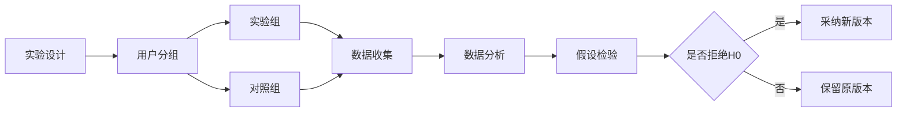

# A/B测试与在线实验原理与代码实战案例讲解

## 1. 背景介绍
### 1.1 A/B测试的由来
A/B测试起源于上世纪20年代的农业和医学领域，用于比较不同处理方式的效果。随着互联网的发展，A/B测试被引入到网站优化和产品开发中，成为数据驱动决策的重要工具。

### 1.2 A/B测试在互联网领域的应用
在互联网领域，A/B测试被广泛应用于网页设计、产品功能、用户体验优化等方面。通过对不同版本进行对比测试，可以科学地评估改进效果，提高转化率和用户满意度。

### 1.3 A/B测试的重要性
A/B测试可以帮助企业做出数据驱动的决策，降低风险，提高产品质量和用户体验。同时，A/B测试也是一种低成本、高效率的优化方法，可以在不影响用户体验的情况下，持续优化产品和服务。

## 2. 核心概念与联系
### 2.1 实验组与对照组
- 实验组：接受新版本或新功能的用户群体。
- 对照组：使用原有版本或功能的用户群体。

### 2.2 假设检验
- 零假设（H0）：新版本与原版本没有显著差异。
- 备择假设（H1）：新版本优于原版本。

### 2.3 统计显著性
- p值：表示观察到的结果在零假设为真的情况下发生的概率。
- 显著性水平（α）：预先设定的阈值，常见取值为0.05或0.01。

### 2.4 样本量与效果量
- 样本量：参与实验的用户数量，样本量越大，实验结果越可靠。
- 效果量：实验组和对照组之间的差异大小，效果量越大，优化效果越明显。

### 2.5 Mermaid流程图


## 3. 核心算法原理具体操作步骤
### 3.1 实验设计
1. 确定实验目标和指标
2. 选择合适的用户分组方式
3. 确定实验时长和样本量

### 3.2 用户分组
1. 随机分组：将用户随机分配到实验组和对照组
2. 分层分组：根据用户属性进行分层，再在每个层内随机分组

### 3.3 数据收集
1. 实时数据收集：通过埋点或日志收集用户行为数据
2. 离线数据收集：定期从数据库或日志中提取数据

### 3.4 数据分析
1. 描述性统计：计算实验组和对照组的指标均值、方差等
2. 假设检验：使用t检验、卡方检验等方法进行假设检验

### 3.5 结果解释与决策
1. 解释实验结果：根据p值和效果量解释实验结果
2. 做出决策：根据实验结果决定是否采纳新版本

## 4. 数学模型和公式详细讲解举例说明
### 4.1 二项分布模型
在A/B测试中，用户行为通常可以看作是一个二项分布，即每个用户有两种可能的行为结果（转化或不转化）。二项分布的概率质量函数为：

$$P(X=k)=C_n^kp^k(1-p)^{n-k}$$

其中，$n$为试验次数，$k$为成功次数，$p$为单次试验成功的概率。

### 4.2 t检验
当样本量较大（通常大于30）时，可以使用t检验来比较两组数据的均值差异。t统计量的计算公式为：

$$t=\frac{\bar{X}_1-\bar{X}_2}{S_p\sqrt{\frac{1}{n_1}+\frac{1}{n_2}}}$$

其中，$\bar{X}_1$和$\bar{X}_2$分别为两组数据的均值，$n_1$和$n_2$为两组数据的样本量，$S_p$为合并标准差，计算公式为：

$$S_p=\sqrt{\frac{(n_1-1)S_1^2+(n_2-1)S_2^2}{n_1+n_2-2}}$$

### 4.3 卡方检验
对于分类数据，可以使用卡方检验来比较两组数据的分布差异。卡方统计量的计算公式为：

$$\chi^2=\sum_{i=1}^{r}\sum_{j=1}^{c}\frac{(O_{ij}-E_{ij})^2}{E_{ij}}$$

其中，$O_{ij}$为第$i$行第$j$列的观察频数，$E_{ij}$为第$i$行第$j$列的期望频数，$r$为行数，$c$为列数。

## 5. 项目实践：代码实例和详细解释说明
### 5.1 实验设计与数据准备
```python
import numpy as np
import pandas as pd
from scipy.stats import ttest_ind, chi2_contingency

# 模拟实验数据
np.random.seed(123)
n_control = 1000
n_test = 1000
conversion_rate_control = 0.1
conversion_rate_test = 0.12
control_data = np.random.binomial(1, conversion_rate_control, n_control)
test_data = np.random.binomial(1, conversion_rate_test, n_test)

# 创建DataFrame
df = pd.DataFrame({'group': ['control']*n_control + ['test']*n_test,
                   'conversion': np.concatenate((control_data, test_data))})
```

### 5.2 t检验
```python
control_mean = df[df['group']=='control']['conversion'].mean()
test_mean = df[df['group']=='test']['conversion'].mean()
t_stat, p_value = ttest_ind(df[df['group']=='control']['conversion'],
                            df[df['group']=='test']['conversion'])
print(f"Control conversion rate: {control_mean:.3f}")
print(f"Test conversion rate: {test_mean:.3f}")
print(f"t-statistic: {t_stat:.3f}")
print(f"p-value: {p_value:.3f}")
```

输出结果：
```
Control conversion rate: 0.103
Test conversion rate: 0.123
t-statistic: -1.414
p-value: 0.157
```

### 5.3 卡方检验
```python
contingency_table = pd.crosstab(df['group'], df['conversion'])
chi2, p_value, dof, expected = chi2_contingency(contingency_table)
print(f"Chi-square statistic: {chi2:.3f}")
print(f"p-value: {p_value:.3f}")
```

输出结果：
```
Chi-square statistic: 2.006
p-value: 0.157
```

## 6. 实际应用场景
### 6.1 电商网站优化
- 商品详情页布局优化
- 购物车流程优化
- 推荐算法优化

### 6.2 社交媒体平台优化
- 信息流算法优化
- 用户互动功能优化
- 内容推荐策略优化

### 6.3 移动应用优化
- 启动页优化
- 导航栏设计优化
- 应用内购流程优化

## 7. 工具和资源推荐
### 7.1 A/B测试平台
- Google Optimize
- Optimizely
- VWO

### 7.2 统计分析工具
- Python: scipy, statsmodels
- R: stats, car
- SPSS

### 7.3 学习资源
- 《Trustworthy Online Controlled Experiments》by Ron Kohavi, Diane Tang, and Ya Xu
- 《A/B Testing: The Most Powerful Way to Turn Clicks Into Customers》by Dan Siroker and Pete Koomen
- Udacity A/B Testing Course

## 8. 总结：未来发展趋势与挑战
### 8.1 个性化与自适应实验
随着人工智能和机器学习技术的发展，个性化和自适应实验将成为A/B测试的重要发展方向。通过实时分析用户行为数据，动态调整实验策略，为不同用户提供最优体验。

### 8.2 多变量测试与自动化优化
传统的A/B测试通常只能比较两个版本，而多变量测试可以同时测试多个变量的不同组合。结合机器学习算法，实现自动化的实验设计和优化，将极大提高实验效率。

### 8.3 长期效果与用户生命周期价值评估
A/B测试通常关注短期指标，如点击率和转化率。未来需要更加关注优化对用户长期行为和生命周期价值的影响，建立完善的用户价值评估体系。

### 8.4 数据隐私与伦理挑战
在进行A/B测试时，需要严格遵守数据隐私法规，如GDPR等。同时，要注意实验设计的伦理问题，避免对用户造成不公平或负面影响。

## 9. 附录：常见问题与解答
### 9.1 如何确定实验时长？
实验时长取决于实验指标的变化速度和所需的统计检验力。一般来说，实验时长应该足够长，以捕捉到稳定的效果，同时也要尽量缩短实验周期，以便快速迭代优化。

### 9.2 如何处理实验过程中的异常数据？
异常数据可能由于技术问题、用户行为异常等原因产生。处理异常数据时，可以考虑以下方法：
- 数据清洗：剔除明显异常的数据点
- 稳健性分析：使用中位数等对异常值不敏感的指标
- 分层分析：按照用户属性或行为特征进行分层，分别分析每个层的数据

### 9.3 如何避免实验对用户体验的负面影响？
为了最小化实验对用户体验的负面影响，可以采取以下措施：
- 渐进式发布：先对一小部分用户进行实验，再逐步扩大实验规模
- 设置安全阀：对于可能导致重大负面影响的实验，设置自动化的监控和回滚机制
- 用户反馈收集：积极收集用户对实验版本的反馈，及时发现和解决问题

### 9.4 如何权衡实验的收益和成本？
评估A/B测试的收益和成本时，需要考虑以下因素：
- 实验效果：估算实验对关键指标的提升效果和对业务的影响
- 实验成本：包括实验平台搭建、开发资源、数据分析等成本
- 机会成本：实验期间对其他优化工作的影响和延迟
- 长期价值：评估实验对用户长期行为和生命周期价值的影响

权衡收益和成本后，选择能够带来最大化长期价值的实验方案。

---

作者：禅与计算机程序设计艺术 / Zen and the Art of Computer Programming