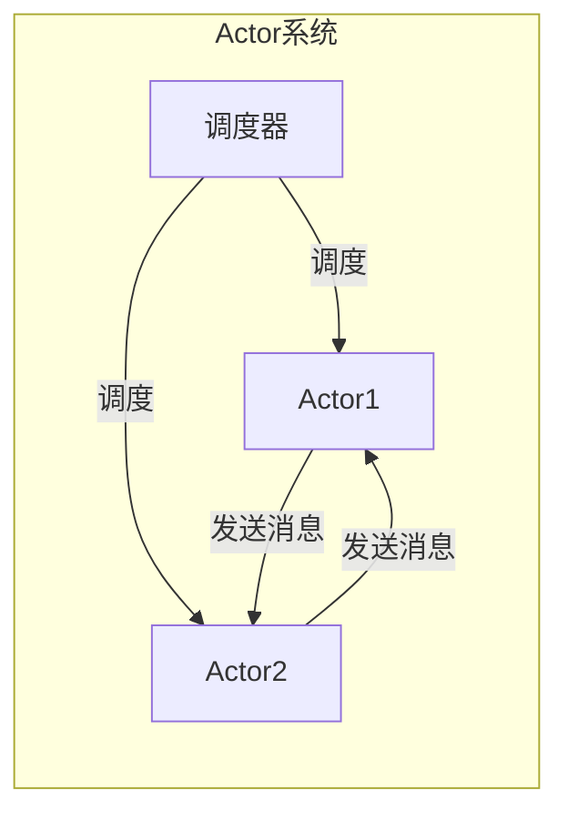

# Actor Model原理与代码实例讲解

## 1.背景介绍

在现代分布式系统和高并发应用程序的开发中,Actor模型作为一种基于消息传递的并发计算模型,越来越受到广泛关注和应用。它提供了一种简单而强大的方式来设计、构建和推理并发和分布式系统。

Actor模型由卡尔·休伊特(Carl Hewitt)等人在20世纪70年代初期于麻省理工学院(MIT)提出,最初的目的是为了更好地理解人工智能系统。它借鉴了物理学中的"原子"概念,将系统中的每个组件都抽象为一个"Actor"(行为体),通过消息传递的方式来协调和管理不同行为体之间的交互。

相较于传统的多线程编程模型,Actor模型具有天然的并发性、location transparency(位置透明性)和轻量级的线程(Actor)等优势,非常适合用于构建可伸缩、容错、分布式的系统。目前,Actor模型已经被广泛应用于诸多领域,如分布式系统、并行计算、反应式编程、物联网等。

## 2.核心概念与联系

### 2.1 Actor

Actor是Actor模型中最基本的构造单元,它可以被视为一个独立的、高度封闭的对象,只能通过异步消息传递与外界进行交互。每个Actor都有自己的状态、行为、邮箱(用于接收消息)、地址(用于标识和寻址)等属性。

Actor的行为是确定性的,即对于同一个输入消息,Actor的行为和输出结果是完全确定的。这种确定性保证了Actor模型的可测试性和可推理性。

### 2.2 消息传递

在Actor模型中,Actor之间的通信完全依赖于异步消息传递机制。Actor之间不能直接调用彼此的方法或访问彼此的状态,而是通过发送消息来请求对方执行某些操作或响应某些事件。

消息传递是非阻塞的,即发送者在发送消息后不需要等待接收者的响应,可以继续执行其他任务。这种异步通信模式使得Actor模型天生具有良好的并发性和容错性。

### 2.3 Actor系统

一个完整的Actor系统通常由多个Actor组成,它们通过消息传递协作完成特定的任务。每个Actor都有一个唯一的地址,可以被其他Actor寻址和发送消息。

Actor系统中还包括一个或多个调度器(Scheduler),负责调度和管理Actor的执行。调度器决定了哪些Actor可以被执行,以及它们的执行顺序。不同的调度策略会影响系统的性能和公平性。



上图展示了一个简单的Actor系统,包含两个Actor和一个调度器。Actor1和Actor2通过消息传递进行交互,调度器负责调度它们的执行。

## 3.核心算法原理具体操作步骤

Actor模型的核心算法原理可以概括为以下几个步骤:

1. **创建Actor**

   首先需要创建一个或多个Actor,每个Actor都有自己的状态、行为和邮箱。可以使用Actor模型提供的API或框架来创建Actor。

2. **发送消息**

   Actor之间通过发送消息进行通信。发送者将消息发送到接收者的邮箱中,不需要等待接收者的响应。

3. **接收消息**

   接收者从自己的邮箱中取出消息,根据消息的类型执行相应的行为。Actor的行为是确定性的,对于同一个输入消息,行为和输出结果是确定的。

4. **更新状态**

   在执行行为的过程中,Actor可能会更新自身的状态。状态的更新也是确定性的,只依赖于当前状态和接收到的消息。

5. **发送响应**

   Actor可以根据需要发送响应消息给其他Actor,以完成协作任务或通知执行结果。

6. **调度执行**

   调度器根据特定的调度策略,决定哪些Actor可以被执行,以及它们的执行顺序。常见的调度策略包括先入先出(FIFO)、优先级调度等。

上述步骤在Actor系统中循环执行,直到完成所有任务或达到终止条件。Actor模型的核心算法保证了系统的确定性和可推理性,同时提供了良好的并发性和容错性。

## 4.数学模型和公式详细讲解举例说明

虽然Actor模型本身没有严格的数学模型,但我们可以借助一些数学概念和符号来更好地描述和推理Actor系统的行为。

### 4.1 Actor的形式化定义

我们可以将Actor定义为一个元组:

$$Actor = (state, behavior, mailbox, address)$$

其中:

- $state$表示Actor的内部状态
- $behavior$表示Actor的行为函数,将输入消息映射到输出消息和状态更新
- $mailbox$表示Actor的邮箱,用于接收其他Actor发送的消息
- $address$表示Actor的唯一标识符,用于寻址和发送消息

### 4.2 消息传递的形式化描述

假设有两个Actor $A$和$B$,它们之间通过消息传递进行交互。我们可以用以下符号来表示消息传递过程:

$$A \xrightarrow{msg} B$$

这表示Actor $A$向Actor $B$发送了一个消息$msg$。

Actor $B$在接收到消息后,会根据其行为函数$behavior_B$执行相应的操作,并可能更新自身的状态和发送响应消息。我们可以用以下公式来描述这个过程:

$$behavior_B(state_B, msg) \rightarrow (state_B', output)$$

其中:

- $state_B$表示Actor $B$的当前状态
- $msg$表示接收到的消息
- $behavior_B$是Actor $B$的行为函数
- $state_B'$表示Actor $B$执行行为后的新状态
- $output$表示Actor $B$可能发送的响应消息

### 4.3 Actor系统的形式化描述

一个完整的Actor系统可以被视为一组Actor和一个调度器的组合:

$$ActorSystem = (Actors, Scheduler)$$

其中:

- $Actors$是系统中所有Actor的集合
- $Scheduler$是系统的调度器,负责决定Actor的执行顺序

调度器的工作可以用以下公式来描述:

$$Scheduler(Actors, policy) \rightarrow executionOrder$$

其中:

- $policy$表示调度策略,如FIFO、优先级调度等
- $executionOrder$表示Actor的执行顺序

通过上述数学模型和公式,我们可以更好地理解和推理Actor模型的行为,为Actor系统的设计、实现和验证提供理论基础。

## 5.项目实践:代码实例和详细解释说明

为了更好地理解Actor模型的实现,我们将使用Scala编程语言和Akka Actor框架来编写一个简单的示例项目。

### 5.1 项目概述

我们将构建一个简单的在线商店系统,包含以下几个Actor:

- `CustomerActor`: 代表客户,负责发送订单请求
- `InventoryActor`: 代表库存系统,负责检查库存并响应订单请求
- `OrderActor`: 代表订单系统,负责处理订单并与库存系统交互

### 5.2 定义Actor

首先,我们需要定义Actor及其行为。在Akka Actor框架中,我们可以通过继承`Actor`trait并实现`receive`方法来定义Actor的行为。

```scala
// CustomerActor
class CustomerActor extends Actor {
  import CustomerActor._

  override def receive: Receive = {
    case PlaceOrder(item) =>
      val orderActor = context.actorOf(Props[OrderActor], s"order-${item.id}")
      orderActor ! PlaceOrder(item)
  }
}

object CustomerActor {
  case class PlaceOrder(item: Item)
}

// InventoryActor
class InventoryActor extends Actor {
  import InventoryActor._

  var inventory: Map[String, Int] = Map(
    "item1" -> 10,
    "item2" -> 5
  )

  override def receive: Receive = {
    case CheckInventory(item) =>
      val inStock = inventory.get(item.id).exists(_ > 0)
      sender() ! InventoryResponse(item, inStock)
  }
}

object InventoryActor {
  case class CheckInventory(item: Item)
  case class InventoryResponse(item: Item, inStock: Boolean)
}

// OrderActor
class OrderActor(inventoryActor: ActorRef) extends Actor {
  import OrderActor._

  override def receive: Receive = {
    case PlaceOrder(item) =>
      inventoryActor ! CheckInventory(item)
    case InventoryResponse(item, inStock) =>
      if (inStock) {
        println(s"Order for ${item.id} has been placed.")
      } else {
        println(s"${item.id} is out of stock.")
      }
  }
}

object OrderActor {
  case class PlaceOrder(item: Item)
}

case class Item(id: String)
```

在上面的代码中,我们定义了三个Actor:

- `CustomerActor`用于发送订单请求
- `InventoryActor`用于检查库存
- `OrderActor`用于处理订单并与`InventoryActor`交互

每个Actor都有自己的消息类型和行为定义。例如,`CustomerActor`在接收到`PlaceOrder`消息时,会创建一个新的`OrderActor`并向其发送订单请求。`OrderActor`则会向`InventoryActor`发送`CheckInventory`消息,并根据库存情况打印相应的信息。

### 5.3 创建Actor系统

接下来,我们需要创建Actor系统并启动Actor:

```scala
import akka.actor.{ActorSystem, Props}

object OnlineShopApp extends App {
  val system = ActorSystem("OnlineShopSystem")
  val inventoryActor = system.actorOf(Props[InventoryActor], "inventory")

  val customerActor = system.actorOf(Props[CustomerActor], "customer")
  customerActor ! CustomerActor.PlaceOrder(Item("item1"))
  customerActor ! CustomerActor.PlaceOrder(Item("item2"))
  customerActor ! CustomerActor.PlaceOrder(Item("item3"))
}
```

在上面的代码中,我们首先创建了一个名为`OnlineShopSystem`的Actor系统。然后,我们创建了`InventoryActor`和`CustomerActor`,并向`CustomerActor`发送了三个订单请求。

### 5.4 运行示例

当我们运行上述代码时,将会看到以下输出:

```
Order for item1 has been placed.
Order for item2 has been placed.
item3 is out of stock.
```

这个输出反映了系统的执行过程:

1. `CustomerActor`发送了三个订单请求
2. 对于前两个订单,`InventoryActor`发现库存足够,因此订单被成功处理
3. 对于第三个订单,`InventoryActor`发现库存不足,因此订单被拒绝

通过这个简单的示例,我们可以看到Actor模型如何通过消息传递实现并发和分布式系统的构建。每个Actor都是独立的,只关注自己的行为和状态,而不需要关心其他Actor的实现细节。这种松耦合的设计使得系统更加灵活和可扩展。

## 6.实际应用场景

Actor模型由于其天然的并发性、容错性和可扩展性,在许多领域都有广泛的应用。以下是一些典型的应用场景:

### 6.1 分布式系统

Actor模型非常适合构建分布式系统,如分布式数据处理、分布式存储、分布式计算等。每个Actor可以代表一个独立的节点或服务,通过消息传递协作完成任务。Actor模型的location transparency特性使得系统可以轻松地在不同节点之间迁移Actor,提高了系统的可伸缩性和容错性。

### 6.2 并行计算

Actor模型可以用于实现高效的并行计算。每个Actor都可以被视为一个独立的计算单元,可以并行执行任务。Actor之间通过消息传递协调和同步,避免了传统并行编程中的锁和共享内存问题,从而提高了并行效率和可扩展性。

### 6.3 反应式编程

Actor模型是实现反应式编程的一种常见方式。在反应式系统中,每个Actor都可以被视为一个独立的事件源或事件处理器,通过消息传递响应各种事件。这种事件驱动的编程范式非常适合构建高度响应、弹性和可伸缩的系统。

### 6.4 物联网和边缘计算

在物联网和边缘计算领域,Actor模型可以用于构建分布式的、高度并发的系统。每个物联网设备或边缘节点都可以被抽象为一个Actor,通过消息传递与其他设备或云