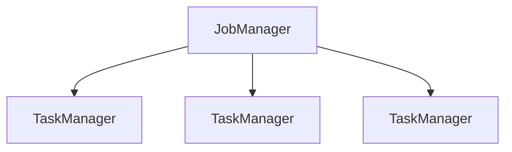

# Apache Flink

## 1.背景介绍

Apache Flink 是一个开源的分布式流式数据处理框架,专门为有状态计算而设计。它能够在有限的时间内,以高吞吐量和低延迟的方式处理数据流。Flink 最初是由柏林理工大学的研究生开发的,后来捐赠给了 Apache 软件基金会,成为了顶级开源项目。

Flink 的核心理念是提供一个统一的框架,用于处理批处理和流式数据。传统上,批处理系统(如 Apache Hadoop)和流式系统是分开的,这导致了数据管理、编程模型和运行时环境的不一致。Flink 旨在消除这种差异,为批处理和流式处理提供相同的编程模型、部署模式和优化。

Flink 的主要特点包括:

- **事件驱动型(Event-Driven)**: Flink 以事件为中心,可以处理持续到来的无限数据流。
- **有状态(Stateful)**: Flink 支持有状态的流处理,可以维护状态并进行增量计算。
- **高吞吐量(High Throughput)**: Flink 能够以高吞吐量处理数据,并且延迟较低。
- **容错(Fault-Tolerant)**: Flink 提供了自动故障恢复机制,可以从故障中恢复并继续处理。
- **内存计算(In-Memory Computing)**: Flink 支持内存计算,可以充分利用内存来加速处理。

Flink 已经被广泛应用于各种领域,如实时分析、机器学习、事件处理和ETL(提取、转换、加载)等。它的应用场景包括金融服务、电子商务、物联网和游戏分析等。

## 2.核心概念与联系

### 2.1 流(Stream)

流是 Flink 中的核心概念,表示连续不断到来的数据。与批处理系统处理有限的静态数据集不同,流式处理系统需要持续处理无限的数据流。Flink 将数据流抽象为无限的数据序列,每个数据元素都被称为事件(Event)或记录(Record)。

### 2.2 转换(Transformation)

转换是对数据流进行操作的函数,如过滤、映射、聚合等。Flink 提供了丰富的转换操作,用户可以将它们链接在一起形成复杂的数据处理管道。

### 2.3 数据源(Source)和数据汇(Sink)

数据源是数据流的入口,可以从各种来源(如文件、消息队列、数据库等)读取数据。数据汇则是数据流的出口,用于将处理后的数据写入外部系统(如文件系统、数据库或消息队列)。

### 2.4 窗口(Window)

窗口是一种对流数据进行分割的抽象概念。Flink 支持多种窗口类型,如滚动窗口、滑动窗口、会话窗口等。通过窗口,可以在有限的数据块上进行有状态的计算操作。

### 2.5 状态(State)

Flink 支持有状态的流处理,可以维护和更新状态。状态可以存储在内存或者外部存储系统中,并在发生故障时自动恢复。有状态的计算使得 Flink 能够支持更复杂的操作,如会话窗口和连续查询。

### 2.6 时间(Time)

时间是流式处理中的一个关键概念。Flink 支持三种时间概念:事件时间(Event Time)、摄入时间(Ingestion Time)和处理时间(Processing Time)。正确处理时间对于有状态计算和窗口操作至关重要。

### 2.7 容错(Fault Tolerance)

容错是 Flink 的一个核心特性。Flink 使用了检查点(Checkpoint)和状态恢复机制来实现容错,可以在发生故障时自动恢复并继续处理,而不会丢失状态。

### 2.8 架构概览

Flink 采用主从架构,由一个 JobManager(主服务器)和多个 TaskManager(从服务器)组成。JobManager 负责调度和协调作业的执行,而 TaskManager 则在工作节点上执行实际的数据处理任务。

## 3.核心算法原理具体操作步骤

### 3.1 流处理模型

Flink 的流处理模型基于有向无环图(DAG),其中每个节点代表一个数据转换操作。当作业被提交时,Flink 会根据这个 DAG 构建一个执行计划,并将其分发到集群中的 TaskManager 上执行。

### 3.2 有状态计算

Flink 支持有状态的流处理,这意味着它可以维护和更新状态。有状态计算通常涉及以下步骤:

1. **状态描述符(State Descriptor)**: 定义状态的数据结构和逻辑属性。
2. **状态访问(State Access)**: 在用户函数中访问和修改状态。
3. **状态管理(State Management)**: Flink 负责管理状态的生命周期,包括创建、分区、持久化和恢复。

### 3.3 窗口操作

窗口是对流数据进行分割的抽象概念。Flink 支持多种窗口类型,如滚动窗口、滑动窗口和会话窗口。窗口操作通常包括以下步骤:

1. **窗口分配器(Window Assigner)**: 将数据流分配到不同的窗口中。
2. **窗口函数(Window Function)**: 在每个窗口上执行计算操作,如聚合或Join。
3. **触发器(Trigger)**: 定义何时计算和清除窗口。
4. **允许器(Allowed Lateness)**: 控制延迟数据的处理方式。

### 3.4 容错机制

Flink 使用检查点(Checkpoint)和状态恢复机制来实现容错。容错过程包括以下步骤:

1. **检查点(Checkpoint)**: 定期将状态快照存储到持久存储中。
2. **重新调度(Reschedule)**: 当发生故障时,Flink 会重新调度失败的任务。
3. **状态恢复(State Recovery)**: 从最新的检查点恢复状态,并重新处理数据。

## 4.数学模型和公式详细讲解举例说明

在流式数据处理中,常见的数学模型和公式包括:

### 4.1 滑动窗口模型

滑动窗口是一种常见的窗口模型,用于对流数据进行分割和聚合。它由三个参数定义:窗口大小(window size)、滑动步长(slide size)和滑动间隔(slide interval)。

给定一个事件流 $E = \{e_1, e_2, \ldots, e_n\}$,其中每个事件 $e_i$ 都有一个相关的时间戳 $t_i$。滑动窗口模型可以表示为:

$$W(t, w, s) = \{e_i \in E | t \leq t_i < t + w\}$$

其中:
- $W(t, w, s)$ 表示以时间 $t$ 为起点,窗口大小为 $w$,滑动步长为 $s$ 的窗口
- $t$ 是窗口的起始时间
- $w$ 是窗口的大小
- $s$ 是窗口的滑动步长

例如,对于事件流 $E = \{(1, 1), (2, 2), (3, 3), (4, 5), (5, 6), (6, 7)\}$,其中每个元组表示 $(value, timestamp)$。如果我们应用一个滑动窗口 $W(1, 3, 2)$,则会得到以下三个窗口:

- $W(1, 3, 2) = \{(1, 1), (2, 2), (3, 3)\}$
- $W(3, 3, 2) = \{(3, 3), (4, 5), (5, 6)\}$
- $W(5, 3, 2) = \{(5, 6), (6, 7)\}$

### 4.2 会话窗口模型

会话窗口是另一种常见的窗口模型,它根据事件之间的活动模式来动态分割数据流。会话窗口由一个会话间隔(session gap)参数定义,表示两个事件之间的最大非活动时间。

给定一个事件流 $E = \{e_1, e_2, \ldots, e_n\}$,其中每个事件 $e_i$ 都有一个相关的时间戳 $t_i$。会话窗口模型可以表示为:

$$S(g) = \{e_i, e_{i+1}, \ldots, e_j | t_j - t_i \leq g \land \forall k \in (i, j), t_{k+1} - t_k \leq g\}$$

其中:
- $S(g)$ 表示会话间隔为 $g$ 的会话窗口
- $g$ 是会话间隔,表示两个事件之间的最大非活动时间

例如,对于事件流 $E = \{(1, 1), (2, 2), (3, 5), (4, 6), (5, 9), (6, 10)\}$,其中每个元组表示 $(value, timestamp)$。如果我们应用一个会话窗口 $S(3)$,则会得到以下两个窗口:

- $S(3) = \{(1, 1), (2, 2), (3, 5)\}$
- $S(3) = \{(4, 6), (5, 9), (6, 10)\}$

### 4.3 计数窗口模型

计数窗口是另一种常见的窗口模型,它根据事件的数量而不是时间来分割数据流。计数窗口由一个计数大小(count size)参数定义,表示每个窗口中包含的最大事件数量。

给定一个事件流 $E = \{e_1, e_2, \ldots, e_n\}$,计数窗口模型可以表示为:

$$C(c) = \{e_i, e_{i+1}, \ldots, e_{i+c-1}\}$$

其中:
- $C(c)$ 表示计数大小为 $c$ 的计数窗口
- $c$ 是计数大小,表示每个窗口中包含的最大事件数量

例如,对于事件流 $E = \{1, 2, 3, 4, 5, 6, 7, 8, 9, 10\}$,如果我们应用一个计数窗口 $C(3)$,则会得到以下四个窗口:

- $C(3) = \{1, 2, 3\}$
- $C(3) = \{4, 5, 6\}$
- $C(3) = \{7, 8, 9\}$
- $C(3) = \{10\}$

### 4.4 聚合函数

在流式数据处理中,常见的聚合函数包括求和(sum)、计数(count)、最大值(max)和最小值(min)等。这些函数通常应用于窗口上,以计算窗口内的聚合结果。

假设我们有一个事件流 $E = \{e_1, e_2, \ldots, e_n\}$,其中每个事件 $e_i$ 都有一个相关的值 $v_i$。对于一个窗口 $W$,我们可以定义以下聚合函数:

- 求和: $\sum_{e_i \in W} v_i$
- 计数: $\sum_{e_i \in W} 1$
- 最大值: $\max_{e_i \in W} v_i$
- 最小值: $\min_{e_i \in W} v_i$

例如,对于事件流 $E = \{(1, 1), (2, 2), (3, 3), (4, 5), (5, 6), (6, 7)\}$,其中每个元组表示 $(value, timestamp)$,如果我们应用一个滑动窗口 $W(1, 3, 2)$,并对每个窗口计算求和,则会得到以下结果:

- $\sum_{e_i \in W(1, 3, 2)} v_i = 1 + 2 + 3 = 6$
- $\sum_{e_i \in W(3, 3, 2)} v_i = 3 + 5 + 6 = 14$
- $\sum_{e_i \in W(5, 3, 2)} v_i = 6 + 7 = 13$

## 5.项目实践：代码实例和详细解释说明

在本节中,我们将通过一个实际的代码示例来演示如何使用 Apache Flink 进行流式数据处理。我们将构建一个简单的应用程序,从 Socket 源读取数据,对数据进行过滤和聚合,并将结果写入