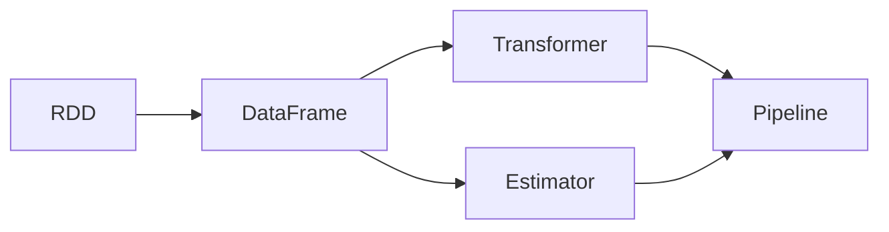

# Apache Spark MLlib

## 1. 背景介绍
在大数据时代，数据分析和机器学习成为了推动技术进步的关键力量。Apache Spark，作为一个强大的分布式数据处理框架，因其出色的内存计算能力和易用性而广受欢迎。Spark的机器学习库MLlib，提供了一系列高效的算法实现，使得在大规模数据集上进行机器学习成为可能。MLlib不仅支持常见的机器学习任务，如分类、回归、聚类和协同过滤，还提供了特征提取、转换、降维和选择的工具。

## 2. 核心概念与联系
在深入探讨MLlib之前，我们需要理解一些核心概念及其相互之间的联系。

- **RDD（弹性分布式数据集）**: Spark的基本数据结构，能够容错、并行处理大型数据集。
- **DataFrame**: 以RDD为基础，提供了更高级的抽象，允许用户以类似SQL的方式操作数据。
- **Transformer**: 一个将一个DataFrame转换为另一个DataFrame的算法。
- **Estimator**: 一个算法，通过fit方法对DataFrame进行训练，产生一个Transformer。
- **Pipeline**: 一个由多个步骤组成的工作流，每个步骤可以是Transformer或Estimator。



## 3. 核心算法原理具体操作步骤
MLlib中的算法遵循统一的工作流程，具体操作步骤如下：

1. 数据准备：加载数据，转换为RDD或DataFrame。
2. 数据预处理：使用Transformer进行数据清洗、特征提取等。
3. 模型训练：使用Estimator对预处理后的数据进行训练。
4. 模型评估：对模型进行评估，以确定其性能。
5. 模型应用：将训练好的模型应用于新数据，进行预测。

## 4. 数学模型和公式详细讲解举例说明
以线性回归为例，其数学模型可以表示为：

$$
y = \beta_0 + \beta_1 x_1 + \beta_2 x_2 + ... + \beta_n x_n + \epsilon
$$

其中，$y$ 是响应变量，$x_1, x_2, ..., x_n$ 是解释变量，$\beta_0, \beta_1, ..., \beta_n$ 是模型参数，$\epsilon$ 是误差项。

在Spark MLlib中，线性回归的参数通过最小化均方误差来估计：

$$
MSE = \frac{1}{n} \sum_{i=1}^{n} (y_i - \hat{y}_i)^2
$$

其中，$n$ 是样本数量，$y_i$ 是第$i$个观测值，$\hat{y}_i$ 是模型的预测值。

## 5. 项目实践：代码实例和详细解释说明
以下是一个使用Spark MLlib进行线性回归的简单示例：

```scala
import org.apache.spark.ml.regression.LinearRegression
import org.apache.spark.sql.SparkSession

val spark = SparkSession.builder.appName("LinearRegressionExample").getOrCreate()

// 加载数据
val training = spark.read.format("libsvm").load("data/mllib/sample_linear_regression_data.txt")

// 创建线性回归对象
val lr = new LinearRegression()
  .setMaxIter(10)
  .setRegParam(0.3)
  .setElasticNetParam(0.8)

// 训练模型
val lrModel = lr.fit(training)

// 打印模型参数
println(s"Coefficients: ${lrModel.coefficients} Intercept: ${lrModel.intercept}")
```

在这个例子中，我们首先创建了一个SparkSession，然后加载了数据，并创建了一个LinearRegression对象。通过设置迭代次数、正则化参数和弹性网络参数，我们对模型进行了配置。最后，我们使用fit方法训练模型，并打印出模型的参数。

## 6. 实际应用场景
MLlib在多个领域都有广泛的应用，包括但不限于：

- 金融：信用评分、欺诈检测。
- 电商：推荐系统、客户细分。
- 医疗：疾病预测、药物发现。
- 能源：需求预测、设备维护。

## 7. 工具和资源推荐
为了更好地使用Spark MLlib，以下是一些有用的工具和资源：

- **Apache Spark官方文档**: 提供了关于Spark和MLlib的详细信息。
- **Databricks**: 提供了一个基于Spark的统一分析平台。
- **Jupyter Notebook**: 一个开源的Web应用程序，允许创建和共享包含代码、方程、可视化和文本的文档。

## 8. 总结：未来发展趋势与挑战
随着技术的发展，MLlib也在不断进化。未来的发展趋势可能包括更多的算法实现、性能优化和更好的集成能力。同时，随着数据量的增加和计算需求的提高，如何保持高效的计算性能和良好的可扩展性将是MLlib面临的挑战。

## 9. 附录：常见问题与解答
Q1: MLlib支持哪些机器学习算法？
A1: MLlib支持多种机器学习算法，包括分类、回归、聚类、协同过滤等。

Q2: 如何在Spark中进行模型的持久化？
A2: 可以使用MLlib提供的save和load方法将模型保存到文件系统，并在需要时重新加载。

Q3: MLlib和其他机器学习库相比有何优势？
A3: MLlib的优势在于其分布式计算能力，能够处理大规模数据集，并且与Spark生态系统紧密集成。

作者：禅与计算机程序设计艺术 / Zen and the Art of Computer Programming