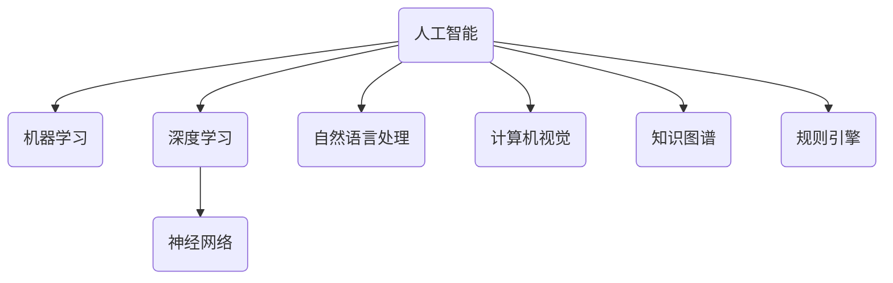

# Artificial Intelligence (AI)原理与代码实例讲解

## 1.背景介绍

人工智能(Artificial Intelligence,AI)是当代科技发展的重要领域,旨在使机器能够模仿人类的认知功能,如学习、推理、感知和行为适应。AI已广泛应用于多个领域,如计算机视觉、自然语言处理、机器人技术、专家系统等,为人类生活和工作带来了巨大变革。

AI的发展经历了多个阶段,早期的AI系统主要基于符号主义和逻辑推理,如专家系统。20世纪90年代,机器学习和神经网络的兴起推动了AI的新发展,使系统能从数据中自动学习模式和规律。近年来,深度学习在大数据和强计算能力的支持下取得突破性进展,在语音识别、图像识别等任务上表现优异。

未来,AI将继续向通用人工智能(Artificial General Intelligence,AGI)发展,机器将具备类似于人类的广泛认知能力。但目前的AI仍是狭义人工智能,只能在特定领域发挥作用,还存在一些局限性和挑战需要解决。

## 2.核心概念与联系

### 2.1 人工智能核心概念

人工智能涉及多个核心概念,包括:

1. **机器学习(Machine Learning)**:使计算机从数据中自动分析获得规律,并对新数据作出预测。包括监督学习、非监督学习、强化学习等。

2. **深度学习(Deep Learning)**:一种基于人工神经网络的机器学习技术,通过构建深层次的神经网络模型来模拟人脑学习机制。

3. **神经网络(Neural Network)**:仿生人脑神经元的数学模型和计算模型,用于模式识别、数据处理等任务。

4. **自然语言处理(Natural Language Processing,NLP)**:使计算机能够理解和生成人类自然语言。

5. **计算机视觉(Computer Vision)**:赋予计算机识别和理解数字图像或视频的能力。

6. **知识图谱(Knowledge Graph)**:结构化知识的语义网络,描述实体概念及其关系。

7. **规则引擎(Rule Engine)**:基于预定义的规则对输入数据进行推理和决策。

这些概念相互关联,共同构建了人工智能的理论和技术体系。



### 2.2 人工智能与其他领域的关系

人工智能与计算机科学、数学、统计学、心理学等学科密切相关:

- **计算机科学**:提供算法、数据结构、编程语言等基础支撑。
- **数学**:微积分、线性代数、概率论等为AI建模提供工具。 
- **统计学**:为机器学习、数据挖掘等提供理论基础。
- **心理学**:认知科学为AI提供人类思维和行为的理解。

同时,人工智能也与其他领域交叉应用,如金融、医疗、制造等,推动了各行业的智能化转型。

## 3.核心算法原理具体操作步骤  

### 3.1 机器学习算法

机器学习是人工智能的核心部分,包括以下主要算法:

1. **监督学习算法**

   - k-近邻算法(k-Nearest Neighbors,kNN)
   - 线性回归(Linear Regression)
   - 逻辑回归(Logistic Regression)
   - 支持向量机(Support Vector Machine,SVM)
   - 决策树(Decision Tree)
   - 随机森林(Random Forest)
   - 梯度提升树(Gradient Boosting Tree)

2. **非监督学习算法**

   - k-均值聚类(k-Means Clustering)
   -层次聚类(Hierarchical Clustering)
   - 高斯混合模型(Gaussian Mixture Model,GMM)
   - 主成分分析(Principal Component Analysis,PCA)

3. **强化学习算法**

   - Q-Learning
   - Sarsa
   - 策略梯度(Policy Gradient)
   - 深度Q网络(Deep Q-Network,DQN)

4. **关联规则挖掘算法**

   - Apriori算法
   - FP-Growth算法

以上算法均有详细的数学原理和具体实现步骤,在实践中需要根据具体问题选择合适的算法并调整超参数。

### 3.2 深度学习算法

深度学习是机器学习的一个重要分支,主要算法包括:

1. **前馈神经网络(Feedforward Neural Network)**
   - 多层感知器(Multilayer Perceptron,MLP)
   - 反向传播算法(Backpropagation)

2. **卷积神经网络(Convolutional Neural Network,CNN)** 
   - LeNet
   - AlexNet
   - VGGNet
   - GoogLeNet/Inception
   - ResNet

3. **循环神经网络(Recurrent Neural Network,RNN)**
   - 简单循环单元(Simple Recurrent Unit)
   - 长短期记忆网络(Long Short-Term Memory,LSTM)
   - 门控循环单元(Gated Recurrent Unit,GRU)

4. **生成对抗网络(Generative Adversarial Network,GAN)**
   - 基本GAN
   - 条件GAN
   - 循环GAN
   - 周期GAN

5. **注意力机制(Attention Mechanism)**
   - 加性注意力
   - 点积注意力
   - 多头注意力

6. **迁移学习(Transfer Learning)**
   - 特征提取
   - 微调(Fine-tuning)

这些算法通过构建深层次的神经网络模型,能够从大规模数据中自动学习特征表示,在计算机视觉、自然语言处理等任务上表现出色。算法的具体实现需要根据问题场景选择合适的网络结构、损失函数、优化器等超参数。

## 4.数学模型和公式详细讲解举例说明

人工智能算法中广泛使用了各种数学模型和公式,这些模型和公式为算法提供了理论基础和计算框架。以下是一些常见的数学模型和公式:

### 4.1 线性代数

线性代数在人工智能中扮演着重要角色,特别是在深度学习中。常见的线性代数概念包括:

- 向量(Vector)
- 矩阵(Matrix)
- 张量(Tensor)
- 矩阵乘法
- 特征值和特征向量

例如,在神经网络中,输入数据通常表示为向量,权重参数表示为矩阵,前向传播和反向传播过程都涉及大量的矩阵乘法运算。

### 4.2 概率论和统计

概率论和统计在机器学习中扮演着核心作用,许多算法都基于概率模型和统计推断。常见的概念包括:

- 概率分布(Probability Distribution)
- 贝叶斯定理(Bayes' Theorem)
- 最大似然估计(Maximum Likelihood Estimation,MLE)
- 最大后验概率(Maximum A Posteriori,MAP)

例如,在朴素贝叶斯分类器中,我们根据贝叶斯定理计算每个类别的后验概率,并选择概率最大的类别作为预测结果。在高斯混合模型中,我们使用最大似然估计来确定模型参数。

### 4.3 微积分

微积分在优化算法中发挥着关键作用,用于计算目标函数的梯度,并根据梯度信息更新模型参数。常见的微积分概念包括:

- 导数(Derivative)
- 梯度(Gradient)
- 链式法则(Chain Rule)

例如,在反向传播算法中,我们使用链式法则计算损失函数相对于每个权重的梯度,然后根据梯度下降法更新权重参数。

### 4.4 信息论

信息论为人工智能提供了一些重要的理论基础,如熵(Entropy)、互信息(Mutual Information)等概念。例如,在决策树算法中,我们使用信息增益(Information Gain)或基尼系数(Gini Index)作为特征选择的标准,以最大限度地减少数据的不确定性。

### 4.5 其他数学工具

除了上述模型和公式外,人工智能还广泛使用了其他数学工具,如:

- 凸优化(Convex Optimization)
- 随机过程(Stochastic Process)
- 蒙特卡罗方法(Monte Carlo Methods)
- 图论(Graph Theory)

这些数学工具为人工智能算法提供了强大的理论支持和计算框架。

## 5.项目实践:代码实例和详细解释说明

为了更好地理解人工智能算法的实现,我们将通过一个实际项目来演示代码实例。在这个项目中,我们将使用Python和流行的机器学习库scikit-learn构建一个手写数字识别系统。

### 5.1 项目概述

手写数字识别是一个经典的机器学习问题,旨在自动识别手写数字图像中的数字。这个问题可以被视为一个监督学习任务,其中输入是手写数字图像,输出是对应的数字标签。

我们将使用著名的MNIST数据集,该数据集包含来自250个不同人手写的60,000个训练图像和10,000个测试图像。每个图像都是28x28像素的灰度图像,对应一个0到9之间的数字标签。

### 5.2 数据预处理

在开始构建模型之前,我们需要对数据进行预处理。以下是一些常见的预处理步骤:

1. **加载数据**:使用scikit-learn提供的`datasets.load_digits()`函数加载MNIST数据集。

2. **数据归一化**:将像素值缩放到0到1之间的范围,以防止某些特征对模型产生过大影响。

3. **数据分割**:将数据集分为训练集和测试集,用于模型训练和评估。

4. **特征提取(可选)**:对于像素数据,我们可以考虑使用主成分分析(PCA)等技术提取有意义的特征。

### 5.3 模型构建和训练

接下来,我们将构建和训练一个支持向量机(SVM)模型进行手写数字识别。SVM是一种监督学习算法,通过找到最大化边界来分离不同类别的数据点。

```python
from sklearn.svm import SVC
from sklearn.metrics import accuracy_score

# 创建SVM模型
svm_model = SVC(kernel='rbf', gamma='auto')

# 训练模型
svm_model.fit(X_train, y_train)

# 在测试集上进行预测
y_pred = svm_model.predict(X_test)

# 计算准确率
accuracy = accuracy_score(y_test, y_pred)
print(f"Accuracy: {accuracy}")
```

在上面的代码中,我们首先创建了一个SVM模型实例,使用径向基函数(RBF)作为核函数。然后,我们使用`fit()`方法在训练数据上训练模型。最后,我们在测试集上进行预测,并计算预测结果与真实标签之间的准确率。

### 5.4 模型评估和优化

评估模型性能是机器学习项目中的一个重要步骤。除了准确率之外,我们还可以使用其他指标,如精确率(Precision)、召回率(Recall)和F1分数。

如果模型性能不理想,我们可以尝试以下优化策略:

1. **超参数调整**:调整SVM模型的超参数,如正则化参数`C`和核函数参数`gamma`,以获得更好的性能。

2. **特征工程**:探索其他特征提取技术,如HOG(Histogram of Oriented Gradients)或LBP(Local Binary Patterns),以获得更有意义的特征表示。

3. **集成学习**:使用集成技术,如随机森林或Adaboost,组合多个弱学习器以提高性能。

4. **深度学习**:探索使用深度神经网络,如卷积神经网络(CNN),直接从原始像素数据中学习特征表示。

通过不断迭代和优化,我们可以获得更加准确和鲁棒的手写数字识别系统。

## 6.实际应用场景

人工智能技术在现实生活中有着广泛的应用场景,为我们带来了巨大的便利和价值。以下是一些典型的应用场景:

1. **计算机视觉**:图像识别、目标检测、视频分析等,应用于自动驾驶、安防监控、医疗影像诊断等领域。

2. **自然语言