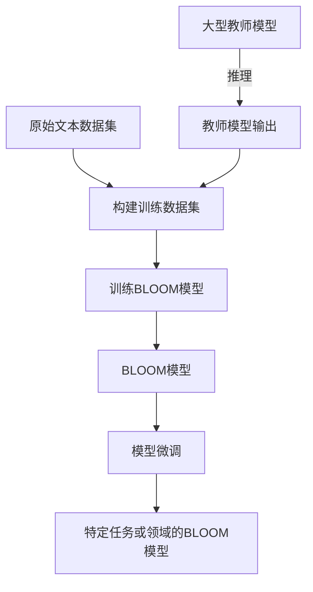

# BLOOM原理与代码实例讲解

## 1.背景介绍

在当今的数据密集型时代,机器学习模型的规模和复杂性不断增加,训练这些大型模型需要消耗大量的计算资源和时间。为了解决这个问题,Meta AI研究院提出了一种新的训练方法,被称为BLOOM(Bidirectional Longform Learner Over Offline Mixture)。BLOOM是一种基于Transformer的大型语言模型,旨在通过有效利用现有数据和模型,以更高效和可持续的方式训练大型语言模型。

## 2.核心概念与联系

### 2.1 BLOOM的核心概念

BLOOM的核心思想是利用现有的大型语言模型和数据集,通过蒸馏(知识蒸馏)和混合(Mixture of Experts,MoE)的方式,训练出一个新的大型语言模型。具体来说,BLOOM包含以下几个关键概念:

1. **蒸馏(Knowledge Distillation)**: 将大型教师模型的知识传递给小型学生模型的过程。BLOOM利用多个大型教师模型(如GPT-3、PaLM等)的知识,训练出一个新的学生模型。

2. **混合(Mixture of Experts, MoE)**: 将多个专家模型的输出进行加权组合,形成最终输出。BLOOM将多个专家模型的输出进行混合,提高了模型的表现。

3. **离线(Offline)训练**: BLOOM采用离线训练的方式,即先生成一个包含教师模型输出的数据集,然后使用这个数据集训练学生模型。这种方式可以更有效地利用计算资源。

4. **双向(Bidirectional)**: BLOOM不仅可以像传统语言模型那样从左到右生成文本,还可以从右到左生成,提高了模型的表现。

### 2.2 BLOOM与其他模型的联系

BLOOM借鉴了多个现有的技术和思想,例如:

1. **Transformer**: BLOOM的基础架构是Transformer,这是当前主流的序列到序列模型架构。

2. **GPT**: BLOOM继承了GPT系列模型(如GPT-3)的自回归语言模型架构。

3. **知识蒸馏**: BLOOM采用了知识蒸馏的技术,这种技术最早被用于模型压缩和加速推理。

4. **MoE**: BLOOM中的MoE思想源自谷歌的Mixture of Experts模型。

5. **多任务学习**: BLOOM在训练过程中同时学习多个任务,如问答、文本生成等,这借鉖了多任务学习的思想。

总的来说,BLOOM将多种现有技术进行了创新性的结合和改进,形成了一种新的大型语言模型训练范式。

## 3.核心算法原理具体操作步骤

BLOOM的训练过程可以分为以下几个主要步骤:

### 3.1 生成教师模型输出

首先,BLOOM使用多个大型教师模型(如GPT-3、PaLM等)对一个大型文本数据集(如互联网爬取的文本数据)进行推理,生成教师模型的输出。这个过程可以离线进行,充分利用计算资源。

### 3.2 构建训练数据集

将教师模型的输出与原始文本数据集进行对齐,构建一个新的训练数据集。在这个数据集中,每个样本包含原始文本和教师模型的输出。

### 3.3 训练BLOOM模型

使用构建的训练数据集,训练BLOOM模型。BLOOM模型的目标是最小化其输出与教师模型输出之间的差异。在训练过程中,BLOOM模型会学习教师模型的知识,同时也会学习如何更好地生成文本。

BLOOM模型的训练过程包括以下几个关键步骤:

1. **Embedding层**:将输入文本转换为向量表示。

2. **Transformer Encoder**:对输入向量进行编码,捕获上下文信息。

3. **MoE层**:将编码后的向量输入到多个专家(Expert)模型中,每个专家模型处理输入的一部分。

4. **MoE输出门控**:根据专家模型的输出,通过门控机制(Gating)计算加权和,得到最终的MoE输出。

5. **Transformer Decoder**:将MoE输出进行解码,生成最终的文本输出。

6. **损失函数**:计算BLOOM模型输出与教师模型输出之间的差异,作为损失函数的值。

7. **优化器**:使用优化算法(如Adam)根据损失函数的值,更新BLOOM模型的参数。

在整个训练过程中,BLOOM模型会不断地学习教师模型的知识,并且通过MoE的方式提高模型的表现。同时,BLOOM模型也会学习如何更好地生成文本,而不仅仅是简单地复制教师模型的输出。

### 3.4 模型微调

在BLOOM模型的初始训练之后,可以对模型进行进一步的微调(Fine-tuning),以适应特定的任务或领域。微调过程通常使用较小的数据集,并且只更新模型的一部分参数,从而保留了BLOOM模型在大规模数据上学习到的通用知识。



## 4.数学模型和公式详细讲解举例说明

在BLOOM模型的训练过程中,涉及到多个数学模型和公式,下面将对其中一些关键部分进行详细讲解。

### 4.1 Transformer编码器(Encoder)

Transformer编码器的作用是对输入序列进行编码,捕获上下文信息。它的核心是多头自注意力(Multi-Head Self-Attention)机制,可以表示为:

$$\mathrm{MultiHead}(Q, K, V) = \mathrm{Concat}(head_1, \ldots, head_h)W^O$$
$$\text{where } head_i = \mathrm{Attention}(QW_i^Q, KW_i^K, VW_i^V)$$

其中,$Q$、$K$、$V$分别表示查询(Query)、键(Key)和值(Value)矩阵。$W_i^Q$、$W_i^K$、$W_i^V$和$W^O$是可学习的权重矩阵。

自注意力机制的计算过程如下:

$$\mathrm{Attention}(Q, K, V) = \mathrm{softmax}(\frac{QK^T}{\sqrt{d_k}})V$$

这里,$d_k$是缩放因子,用于防止点积的值过大导致梯度消失或爆炸。

### 4.2 Mixture of Experts(MoE)层

MoE层是BLOOM模型的核心部分之一,它将输入分配给多个专家(Expert)模型,每个专家模型只处理输入的一部分,从而提高了模型的计算效率和表现。

在MoE层中,首先需要计算每个专家模型对于当前输入的相关性分数(relevance score),通常使用一个前馈神经网络来计算:

$$r_i = \mathrm{FFN}(x_i)$$

其中,$x_i$是输入向量的第$i$个元素,$r_i$是第$i$个专家模型的相关性分数。

然后,使用Softmax函数将相关性分数转换为概率分布:

$$p_i = \frac{\exp(r_i)}{\sum_j \exp(r_j)}$$

这个概率分布被称为门控(Gating),它决定了每个输入元素应该被分配给哪个专家模型。

接下来,每个专家模型对分配给它的输入元素进行处理,得到输出向量$y_i$。最终的MoE输出是所有专家模型输出的加权和:

$$\mathrm{MoE}(x) = \sum_i p_i y_i$$

通过这种方式,MoE层可以有效地利用多个专家模型的知识,提高模型的表现。

### 4.3 知识蒸馏损失函数

BLOOM模型的训练目标是最小化其输出与教师模型输出之间的差异,这可以通过知识蒸馏损失函数来实现。

假设BLOOM模型的输出为$y$,教师模型的输出为$y_t$,则知识蒸馏损失函数可以定义为:

$$\mathcal{L}_\mathrm{KD} = -\sum_i y_t^i \log y^i$$

这是一个交叉熵损失函数,它衡量了BLOOM模型输出与教师模型输出之间的差异。

在实际应用中,还可以加入其他辅助损失函数,如语言模型损失函数、多任务损失函数等,形成综合损失函数:

$$\mathcal{L} = \mathcal{L}_\mathrm{KD} + \lambda_1 \mathcal{L}_\mathrm{LM} + \lambda_2 \mathcal{L}_\mathrm{MT} + \cdots$$

其中,$\lambda_1$、$\lambda_2$等是权重系数,用于平衡不同损失函数的重要性。

通过最小化综合损失函数,BLOOM模型可以同时学习教师模型的知识、生成高质量文本的能力,以及处理多种任务的能力。

## 5.项目实践:代码实例和详细解释说明

为了更好地理解BLOOM模型的原理和实现,下面将提供一个基于PyTorch的代码示例,并对关键部分进行详细解释。

### 5.1 导入所需库

```python
import torch
import torch.nn as nn
import torch.nn.functional as F
from typing import Tuple
```

### 5.2 定义Transformer编码器

```python
class TransformerEncoder(nn.Module):
    def __init__(self, d_model, nhead, num_layers, dropout=0.1):
        super().__init__()
        self.encoder = nn.TransformerEncoder(
            nn.TransformerEncoderLayer(d_model, nhead, dim_feedforward=2048, dropout=dropout),
            num_layers
        )

    def forward(self, src):
        return self.encoder(src)
```

这里我们使用PyTorch内置的`nn.TransformerEncoder`模块来实现Transformer编码器。`d_model`是输入向量的维度,`nhead`是多头注意力机制中头的数量,`num_layers`是Transformer编码器层的数量。

### 5.3 定义Mixture of Experts层

```python
class MoE(nn.Module):
    def __init__(self, d_model, num_experts, expert_capacity):
        super().__init__()
        self.num_experts = num_experts
        self.expert_capacity = expert_capacity
        self.gate = nn.Linear(d_model, num_experts)
        self.experts = nn.ModuleList([nn.Linear(d_model, expert_capacity) for _ in range(num_experts)])

    def forward(self, x):
        gate_outputs = self.gate(x)
        gate_probs = F.softmax(gate_outputs, dim=-1)
        expert_outputs = torch.stack([expert(x) for expert in self.experts], dim=-1)
        moe_output = torch.einsum('bnd,bnk->bkd', expert_outputs, gate_probs)
        return moe_output
```

在这个实现中,我们首先使用一个线性层`self.gate`计算每个输入向量对应的门控概率。然后,我们使用`nn.ModuleList`存储多个专家模型(这里使用线性层作为示例)。在前向传播时,我们计算每个专家模型的输出,并根据门控概率进行加权求和,得到最终的MoE输出。

### 5.4 定义BLOOM模型

```python
class BLOOMModel(nn.Module):
    def __init__(self, d_model, nhead, num_encoder_layers, num_experts, expert_capacity, dropout=0.1):
        super().__init__()
        self.encoder = TransformerEncoder(d_model, nhead, num_encoder_layers, dropout)
        self.moe = MoE(d_model, num_experts, expert_capacity)
        self.decoder = nn.TransformerDecoder(
            nn.TransformerDecoderLayer(d_model, nhead, dim_feedforward=2048, dropout=dropout),
            num_layers=6
        )

    def forward(self, src, tgt):
        src_encoding = self.encoder(src)
        moe_output = self.moe(src_encoding)
        output = self.decoder(tgt, moe_output)
        return output
```

在这个实现中,我们将之前定义的Transformer编码器、MoE层和Transformer解码器组合在一起,构建了BLOOM模型。在前向传播时,输入序列首先通过Transformer编码器进行编码,然后输入到MoE层,最后将MoE层的输出作为解码器的输入,得到最终的输出序列。

### 5.5 训练BLOOM模型

```python
# 准备训练数据
train_data = ...  # 从构建的训练数据集中加载

# 定义模型、损失函数