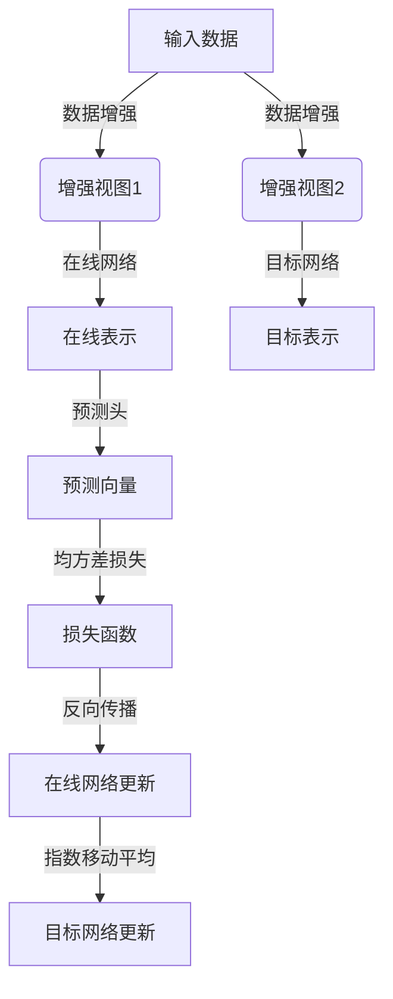

# BYOL在物理仿真领域的创新实践

## 1.背景介绍

近年来,随着计算能力的不断提高,物理仿真在各个领域得到了广泛应用,如流体动力学、天气预报、材料科学等。物理仿真能够帮助我们更好地理解和预测复杂系统的行为,从而指导实际应用。然而,传统的物理仿真方法通常需要大量的人工标注数据,这是一个十分耗时耗力的过程。

自监督学习(Self-Supervised Learning)作为一种无需人工标注的学习范式,近年来在计算机视觉等领域取得了巨大成功。BYOL(Bootstrap Your Own Latent)作为一种新兴的自监督学习方法,通过训练一个在线(Online)网络和一个目标(Target)网络,使两个网络的输出保持一致,从而学习到有效的表示。与其他自监督方法相比,BYOL不需要负样本对(Negative Pair),训练更加简单高效。

## 2.核心概念与联系

### 2.1 自监督学习(Self-Supervised Learning)

自监督学习是一种无需人工标注的学习范式,它通过设计预text任务(Pretext Task),利用数据本身的信息进行学习。常见的预text任务包括:

- 图像去噪(Image Denoising)
- 图像恢复(Image Inpainting)
- 相对位置预测(Relative Patch Location)

通过预text任务的学习,模型可以捕捉到数据的内在结构和规律,从而学习到有效的表示。

### 2.2 对比学习(Contrastive Learning)

对比学习是自监督学习的一种重要方法,它通过最大化正样本对(Positive Pair)的相似度,最小化负样本对(Negative Pair)的相似度,来学习有效的表示。常见的对比学习方法包括:

- SimCLR(Simple Contrastive Learning of Visual Representations)
- MoCo(Momentum Contrast)
- BYOL(Bootstrap Your Own Latent)

其中,BYOL不需要显式的负样本对,训练更加简单高效。

### 2.3 BYOL原理

BYOL的核心思想是训练一个在线(Online)网络和一个目标(Target)网络,使两个网络的输出保持一致。具体来说,BYOL包括以下几个关键步骤:

1. 数据增强(Data Augmentation):对输入数据进行随机增强,获得两个增强视图(View)。
2. 在线网络(Online Network):将增强视图输入在线网络,获得在线表示(Online Representation)。
3. 目标网络(Target Network):将另一个增强视图输入目标网络,获得目标表示(Target Representation)。
4. 预测头(Prediction Head):在线表示通过一个预测头(Projection Head),获得预测向量(Prediction Vector)。
5. 损失函数(Loss Function):最小化预测向量和目标表示之间的均方差(Mean Squared Error)。
6. 目标网络更新(Target Network Update):使用指数移动平均(Exponential Moving Average)的方式,缓慢地更新目标网络的参数。

通过上述步骤,BYOL可以在无需负样本对的情况下,学习到有效的表示。



## 3.核心算法原理具体操作步骤

BYOL算法的具体操作步骤如下:

1. **数据增强**:对输入数据进行随机增强,获得两个增强视图$x_1$和$x_2$。常用的数据增强操作包括:随机裁剪(Random Crop)、随机水平翻转(Random Horizontal Flip)、颜色抖动(Color Jittering)等。

2. **在线网络前向传播**:将增强视图$x_1$输入在线网络$f_{\theta}$,获得在线表示$y_1 = f_{\theta}(x_1)$。

3. **目标网络前向传播**:将增强视图$x_2$输入目标网络$f_{\xi}$,获得目标表示$y_2 = f_{\xi}(x_2)$。

4. **预测头前向传播**:将在线表示$y_1$输入预测头$q_{\phi}$,获得预测向量$z_1 = q_{\phi}(y_1)$。

5. **计算损失函数**:使用均方差损失函数(Mean Squared Error)计算预测向量$z_1$和目标表示$y_2$之间的差异,损失函数为:

$$\mathcal{L}(z_1, y_2) = \left\lVert z_1 - y_2 \right\rVert_2^2$$

6. **反向传播和优化**:使用梯度下降法,更新在线网络$f_{\theta}$和预测头$q_{\phi}$的参数。

7. **目标网络更新**:使用指数移动平均(Exponential Moving Average)的方式,缓慢地更新目标网络$f_{\xi}$的参数:

$$\xi \leftarrow \lambda \xi + (1 - \lambda) \theta$$

其中$\lambda$是平滑系数,通常取值为0.99或0.995。

8. **重复上述步骤**:重复执行上述步骤,直到模型收敛。

通过上述操作步骤,BYOL可以在无需负样本对的情况下,学习到有效的表示,从而提高物理仿真等下游任务的性能。

## 4.数学模型和公式详细讲解举例说明

在BYOL算法中,使用了均方差损失函数(Mean Squared Error)来度量预测向量和目标表示之间的差异。具体来说,损失函数定义如下:

$$\mathcal{L}(z_1, y_2) = \left\lVert z_1 - y_2 \right\rVert_2^2 = \sum_{i=1}^{d}(z_{1i} - y_{2i})^2$$

其中,$z_1$是预测向量,$y_2$是目标表示,均为$d$维向量。损失函数计算了两个向量之间的欧几里得距离的平方。

在实际计算中,我们通常对损失函数取均值,从而获得平均损失:

$$\overline{\mathcal{L}}(z_1, y_2) = \frac{1}{d}\sum_{i=1}^{d}(z_{1i} - y_{2i})^2$$

使用均方差损失函数的原因是,它可以有效地度量两个向量之间的相似性。当两个向量完全相同时,损失函数值为0;当两个向量差异越大时,损失函数值也越大。

在训练过程中,我们希望最小化这个损失函数,从而使预测向量和目标表示尽可能地相似。通过梯度下降法,我们可以更新在线网络和预测头的参数,使损失函数值不断减小。

例如,假设我们有一个3维的预测向量$z_1 = [0.1, 0.2, 0.3]$,和一个3维的目标表示$y_2 = [0.2, 0.1, 0.4]$,那么损失函数值为:

$$\mathcal{L}(z_1, y_2) = (0.1 - 0.2)^2 + (0.2 - 0.1)^2 + (0.3 - 0.4)^2 = 0.02$$

通过不断优化,我们希望使这个损失函数值趋近于0,从而使预测向量和目标表示尽可能地相似。

除了均方差损失函数之外,BYOL算法还使用了指数移动平均(Exponential Moving Average)的方式来更新目标网络的参数。具体来说,目标网络参数$\xi$的更新公式为:

$$\xi \leftarrow \lambda \xi + (1 - \lambda) \theta$$

其中,$\theta$是在线网络的参数,$\lambda$是平滑系数,通常取值为0.99或0.995。这种更新方式可以使目标网络的参数更加平滑,从而提高模型的稳定性和泛化能力。

总的来说,BYOL算法通过均方差损失函数和指数移动平均的方式,实现了在线网络和目标网络之间的参数对齐,从而学习到有效的表示。

## 5.项目实践:代码实例和详细解释说明

在本节中,我们将提供一个使用PyTorch实现BYOL算法的代码示例,并对关键部分进行详细解释。

### 5.1 导入所需库

```python
import torch
import torch.nn as nn
import torch.nn.functional as F
from torchvision import transforms, datasets
```

我们首先导入所需的PyTorch库,包括`torch`、`torch.nn`和`torchvision`等。

### 5.2 定义网络结构

```python
class BaseEncoder(nn.Module):
    """
    Base Encoder
    """
    def __init__(self):
        super(BaseEncoder, self).__init__()
        
        # Convolutional layers
        self.conv1 = nn.Conv2d(3, 32, kernel_size=3, stride=2, padding=1)
        self.conv2 = nn.Conv2d(32, 64, kernel_size=3, stride=2, padding=1)
        self.conv3 = nn.Conv2d(64, 128, kernel_size=3, stride=2, padding=1)
        
        # Projection head
        self.projector = nn.Linear(128 * 4 * 4, 256)
        
    def forward(self, x):
        x = F.relu(self.conv1(x))
        x = F.relu(self.conv2(x))
        x = F.relu(self.conv3(x))
        x = x.view(x.size(0), -1)
        z = self.projector(x)
        return z

class OnlineNetwork(BaseEncoder):
    """
    Online Network
    """
    def __init__(self):
        super(OnlineNetwork, self).__init__()
        
        # Predictor
        self.predictor = nn.Linear(256, 256)
        
    def forward(self, x):
        z = super(OnlineNetwork, self).forward(x)
        y = self.predictor(z)
        return y

class TargetNetwork(BaseEncoder):
    """
    Target Network
    """
    def __init__(self):
        super(TargetNetwork, self).__init__()
```

在这个示例中,我们定义了三个网络结构:

1. `BaseEncoder`:基础编码器,包含三个卷积层和一个投影头(Projection Head)。
2. `OnlineNetwork`:在线网络,继承自`BaseEncoder`,并添加了一个预测头(Predictor)。
3. `TargetNetwork`:目标网络,继承自`BaseEncoder`。

这些网络结构将用于BYOL算法的训练和推理。

### 5.3 定义BYOL模型

```python
class BYOL(nn.Module):
    """
    BYOL Model
    """
    def __init__(self, base_encoder, online_network, target_network):
        super(BYOL, self).__init__()
        self.base_encoder = base_encoder
        self.online_network = online_network
        self.target_network = target_network
        
        # Initialize target network weights
        for param_online, param_target in zip(self.online_network.parameters(),
                                              self.target_network.parameters()):
            param_target.data.copy_(param_online.data)
            param_target.requires_grad = False
        
        # EMA for target network update
        self.ema_updater = lambda tau: lambda para_target, para_online: \
            para_target * tau + para_online * (1 - tau)
        self.tau = 0.99
        
    def forward(self, x1, x2):
        # Online network
        y1 = self.online_network(x1)
        
        # Target network
        with torch.no_grad():
            y2 = self.target_network(x2)
        
        # Loss
        loss = F.mse_loss(y1, y2.detach())
        
        return loss
    
    def update_target_network(self):
        # Update target network weights
        for param_target, param_online in zip(self.target_network.parameters(),
                                              self.online_network.parameters()):
            param_target.data = self.ema_updater(self.tau)(param_target.data,
                                                            param_online.data)
```

在这个示例中,我们定义了`BYOL`模型,它包含了在线网络、目标网络和基础编码器。

在`__init__`方法中,我们初始化了目标网络的权重,并设置了用于更新目标网络的指数移动平均(EMA)函数。

在`forward`方法中,我们实现了BYOL算法的核心逻辑:

1. 将增强视图`x1`输入在线网络,获得预测向量`y1`。
2. 将另一个增强视图`x2`输入目标网络,获得目标表示`y2`。
3. 计算预测向量`y1`和目标表示`y2`之间的均方差损失。

在`update_target_network`方法中,我们使用指数移