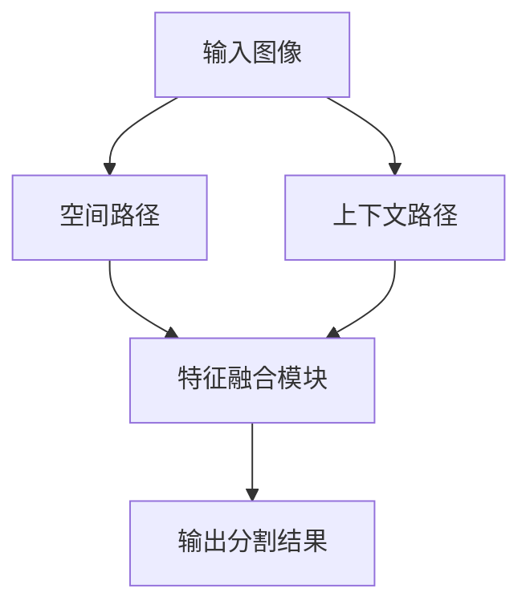
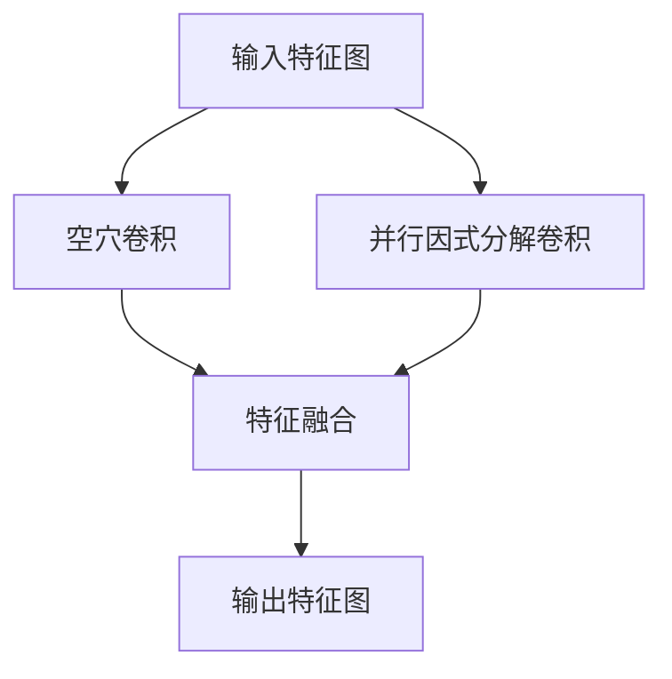
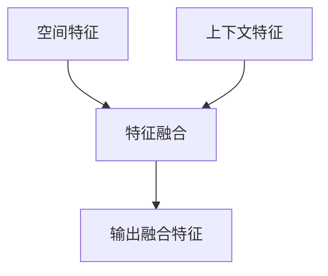

# BiSeNet原理与代码实例讲解

## 1.背景介绍

### 1.1 语义分割的重要性

语义分割是计算机视觉领域的一个核心任务,旨在对图像中的每个像素进行分类,将其与场景中的不同对象关联起来。它在诸多领域都有着广泛的应用,例如无人驾驶、增强现实、医疗影像分析等。准确的语义分割可以为这些应用提供关键的视觉理解能力。

### 1.2 实时语义分割的挑战

尽管深度学习的发展推动了语义分割性能的大幅提升,但在实际应用中,我们往往还需要考虑实时性和计算效率的问题。特别是对于一些嵌入式设备和移动端,其有限的计算资源和能源约束使得高效、轻量级的语义分割模型变得尤为重要。

### 1.3 BiSeNet的提出

为了在保持较高精度的同时,满足实时语义分割的需求,谷歌大脑团队在2018年提出了BiSeNet(Bilateral Segmentation Network)。BiSeNet通过特征融合和上下文捕获等策略,实现了高效、实时的语义分割,在多个公开数据集上取得了优异的表现。

## 2.核心概念与联系

### 2.1 空间路径与上下文路径

BiSeNet的核心思想是利用两条并行的路径来捕获空间信息和上下文信息,并在最后融合这两种特征。具体来说:

1. **空间路径(Spatial Path)**: 通过一系列的卷积和下采样操作来获取高分辨率的空间特征,用于精确定位目标边缘和细节信息。
2. **上下文路径(Context Path)**: 利用空穴卷积(Atrous Convolution)来获取更大感受野的上下文语义特征,用于理解目标的类别和场景信息。



### 2.2 空穴卷积与并行因式分解卷积

在上下文路径中,BiSeNet采用了空穴卷积(Atrous Convolution)和并行因式分解卷积(Parallel Factorized Convolution)来高效地获取大感受野的语义特征。

1. **空穴卷积**: 通过在卷积核中引入空洞(即卷积核中间有空缺),可以显著增大卷积的感受野,从而捕获到更大范围的上下文信息。
2. **并行因式分解卷积**: 将标准的二维卷积分解为两个一维卷积,可以大幅减少计算量,提高效率。



### 2.3 特征融合模块

为了融合空间路径和上下文路径获取的特征,BiSeNet设计了一个特征融合模块。该模块利用注意力机制对两种特征进行加权融合,从而获得同时具有高分辨率和丰富语义信息的特征表示。



## 3.核心算法原理具体操作步骤

BiSeNet的核心算法原理可以概括为以下几个步骤:

### 3.1 空间路径

1. 将输入图像送入一个轻量级的卷积网络(如Xception),获取初始特征图。
2. 通过一系列的卷积和下采样操作,逐步降低特征图的分辨率,同时增加通道数,以获取更丰富的空间特征。
3. 在最后一个下采样层之后,特征图的分辨率降低到原始图像的1/8。

### 3.2 上下文路径

1. 将输入图像送入另一个轻量级的卷积网络(如Xception),获取初始特征图。
2. 使用空穴卷积和并行因式分解卷积来提取大感受野的上下文语义特征,同时保持较高的计算效率。
3. 通过多个这样的模块,逐步增大感受野,捕获更丰富的上下文信息。

### 3.3 特征融合

1. 将空间路径和上下文路径获取的特征图进行上采样和下采样,使它们具有相同的分辨率。
2. 利用注意力机制对两种特征进行加权融合,生成融合特征图。
3. 在融合特征图的基础上,进行一系列的卷积操作,最终输出分割结果。

### 3.4 损失函数

BiSeNet采用了一种新颖的损失函数,即结合了标准交叉熵损失和一种辅助损失。辅助损失旨在引导模型在训练早期就学习到更好的边缘和细节信息,从而提高最终的分割质量。

## 4.数学模型和公式详细讲解举例说明

### 4.1 空穴卷积

空穴卷积(Atrous Convolution)是一种扩大卷积核感受野的技术,它通过在卷积核中引入空洞(即卷积核中间有空缺)来实现。具体来说,对于一个二维输入特征图 $X$,空穴卷积的计算公式如下:

$$
Y(i,j) = \sum_{k,l} X(i+r\cdot k, j+r\cdot l) \cdot K(k,l)
$$

其中 $r$ 表示空穴率(dilation rate),当 $r=1$ 时,就是标准的卷积操作。通过增大 $r$ 的值,我们可以有效地增大卷积核的感受野,而不需要增加参数量和计算量。

### 4.2 并行因式分解卷积

并行因式分解卷积(Parallel Factorized Convolution)是一种高效的卷积操作,它将标准的二维卷积分解为两个一维卷积,从而大幅减少计算量。具体来说,对于一个二维输入特征图 $X$,并行因式分解卷积的计算过程如下:

1. 首先对输入特征图进行一个 $1\times k$ 的一维卷积,得到中间特征图 $Y$:

$$
Y(i,j,k) = \sum_{l} X(i,j,l) \cdot K_1(k,l)
$$

2. 然后对中间特征图 $Y$ 进行一个 $k\times 1$ 的一维卷积,得到最终输出特征图 $Z$:

$$
Z(i,j,k) = \sum_{l} Y(i,l,k) \cdot K_2(j,l)
$$

通过这种分解,我们可以将原本 $k\times k$ 的二维卷积转化为两个一维卷积,从而大幅减少计算量,提高效率。

### 4.3 注意力机制

BiSeNet在特征融合模块中采用了注意力机制,用于对空间特征和上下文特征进行加权融合。具体来说,假设空间特征为 $F_s$,上下文特征为 $F_c$,我们首先计算它们之间的相似度张量 $S$:

$$
S(i,j) = \frac{F_s(i,:) \cdot F_c(j,:)^T}{\sqrt{C}}
$$

其中 $C$ 表示特征通道数,用于归一化。然后,我们对相似度张量 $S$ 进行软最大值操作,得到空间注意力权重 $\alpha_s$ 和上下文注意力权重 $\alpha_c$:

$$
\alpha_s(i,j) = \frac{e^{S(i,j)}}{\sum_j e^{S(i,j)}}
$$

$$
\alpha_c(i,j) = \frac{e^{S(j,i)}}{\sum_i e^{S(j,i)}}
$$

最后,我们利用这些注意力权重对空间特征和上下文特征进行加权融合,得到融合特征 $F_f$:

$$
F_f(i,j) = \alpha_s(i,j) \cdot F_s(i,j) + \alpha_c(i,j) \cdot F_c(i,j)
$$

通过这种方式,BiSeNet可以自适应地融合空间和上下文信息,从而获得更加丰富的特征表示。

## 5.项目实践:代码实例和详细解释说明

为了更好地理解BiSeNet的实现细节,我们将提供一个基于PyTorch的代码实例,并对其中的关键部分进行详细解释。

### 5.1 空间路径实现

```python
import torch
import torch.nn as nn

class SpatialPath(nn.Module):
    def __init__(self):
        super(SpatialPath, self).__init__()
        # 初始化卷积层
        self.conv1 = ...
        self.conv2 = ...
        ...
        
    def forward(self, x):
        # 前向传播
        x = self.conv1(x)
        x = self.conv2(x)
        ...
        return x
```

在空间路径中,我们使用一系列的卷积层和下采样层来提取空间特征。这些层的具体设计可以参考BiSeNet论文中的细节。

### 5.2 上下文路径实现

```python
import torch
import torch.nn as nn

class ContextPath(nn.Module):
    def __init__(self):
        super(ContextPath, self).__init__()
        # 初始化空穴卷积层
        self.atrous_conv1 = ...
        self.atrous_conv2 = ...
        ...
        # 初始化并行因式分解卷积层
        self.factorized_conv1 = ...
        self.factorized_conv2 = ...
        ...
        
    def forward(self, x):
        # 前向传播
        x = self.atrous_conv1(x)
        x = self.factorized_conv1(x)
        x = self.atrous_conv2(x)
        x = self.factorized_conv2(x)
        ...
        return x
```

在上下文路径中,我们使用空穴卷积和并行因式分解卷积来提取大感受野的上下文语义特征。这些层的具体设计也可以参考BiSeNet论文。

### 5.3 特征融合模块实现

```python
import torch
import torch.nn as nn
import torch.nn.functional as F

class FeatureFusion(nn.Module):
    def __init__(self):
        super(FeatureFusion, self).__init__()
        # 初始化上采样和下采样层
        self.upsample = ...
        self.downsample = ...
        
    def forward(self, spatial_feat, context_feat):
        # 调整特征图分辨率
        spatial_feat = self.upsample(spatial_feat)
        context_feat = self.downsample(context_feat)
        
        # 计算注意力权重
        attention_weights = ...
        
        # 特征融合
        fused_feat = attention_weights[0] * spatial_feat + attention_weights[1] * context_feat
        
        return fused_feat
```

在特征融合模块中,我们首先对空间特征和上下文特征进行上采样和下采样,使它们具有相同的分辨率。然后,我们计算注意力权重,并利用这些权重对两种特征进行加权融合,得到融合特征。

### 5.4 BiSeNet模型整合

```python
import torch
import torch.nn as nn

class BiSeNet(nn.Module):
    def __init__(self):
        super(BiSeNet, self).__init__()
        # 初始化空间路径
        self.spatial_path = SpatialPath()
        # 初始化上下文路径
        self.context_path = ContextPath()
        # 初始化特征融合模块
        self.feature_fusion = FeatureFusion()
        # 初始化最终卷积层
        self.final_conv = ...
        
    def forward(self, x):
        # 前向传播
        spatial_feat = self.spatial_path(x)
        context_feat = self.context_path(x)
        fused_feat = self.feature_fusion(spatial_feat, context_feat)
        output = self.final_conv(fused_feat)
        
        return output
```

最后,我们将空间路径、上下文路径和特征融合模块整合到BiSeNet模型中。在前向传播过程中,输入图像首先通过空间路径和上下文路径分别提取空间特征和上下文特征,然后这两种特征被融合到一起,最后经过一些卷积层输出最终的分割结果。

通过这个代码实例,我们可以更好地理解BiSeNet的实现细节,并在此基础上进行进一步的修改和优化。

## 6.实际应用场景

BiSeNet凭借其高效、实时的语义分割能力,在许多实际应用场景中发挥着重要作用。以下是一些典型的应用场景:

### 6.1 无人驾驶

在无人驾驶系统中,准