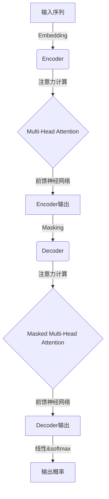

# ChatGPT背后的推手——OpenAI

## 1. 背景介绍

### 1.1 人工智能的崛起

人工智能(Artificial Intelligence, AI)是当代科技发展的重要驱动力,已经渗透到了我们生活的方方面面。从语音助手到无人驾驶,从医疗诊断到金融风险评估,AI技术都发挥着越来越重要的作用。而推动这一切的,正是近年来机器学习和深度学习等AI技术的飞速发展。

### 1.2 OpenAI的崛起

在这股AI热潮中,OpenAI无疑是最具影响力的科技公司之一。它由著名企业家埃隆·马斯克(Elon Musk)和其他知名科学家于2015年共同创立,最初的目标是确保人工智能的发展有利于全人类。

OpenAI一直致力于推动人工智能的基础研究和应用,在自然语言处理、计算机视觉、强化学习等多个领域取得了卓越的研究成果,其中最著名的就是GPT(Generative Pre-trained Transformer)大型语言模型系列。

## 2. 核心概念与联系

### 2.1 GPT: 通用预训练语言模型

GPT是OpenAI提出的一种通用预训练语言模型,它可以从大量文本数据中学习语言知识和模式,并应用于各种自然语言处理任务,如文本生成、机器翻译、问答系统等。

GPT的核心思想是利用自注意力(Self-Attention)机制和Transformer架构,对大规模语料进行无监督预训练,获取通用的语言表示能力。预训练过程中,模型会学习到单词之间的关联关系、语义和语法知识等,从而能够生成流畅、连贯的文本输出。

GPT的版本不断迭代,从GPT、GPT-2到GPT-3,模型规模和性能都有了大幅提升。其中,GPT-3拥有惊人的1750亿参数,展现出了强大的文本生成、理解和推理能力,在多个基准测试中取得了同类最佳成绩。

### 2.2 GPT与ChatGPT的关系

ChatGPT是基于GPT语言模型的对话式AI助手,它借鉴了GPT-3的强大语言能力,并在此基础上进行了特定的训练和优化,使其能够更好地进行多轮对话交互。

ChatGPT不仅能够回答问题、解释概念,还能根据上下文生成连贯的回复,模拟人类的交谈方式。它还具备一定的推理和分析能力,可以解决一些复杂的问题。此外,ChatGPT在训练过程中还接受了人工反馈,以提高其输出的合理性和安全性。

总的来说,ChatGPT是OpenAI在GPT系列语言模型基础上的一个重要应用和延伸,它将人工智能的语言能力进一步推向了新的高度。

## 3. 核心算法原理具体操作步骤

### 3.1 Transformer架构

GPT和ChatGPT的核心算法都是基于Transformer架构,这是一种全新的序列到序列(Sequence-to-Sequence)模型,可以有效捕获长距离依赖关系,克服了传统循环神经网络(RNN)在长序列处理上的缺陷。

Transformer架构主要由编码器(Encoder)和解码器(Decoder)两个模块组成,它们都采用了自注意力机制,能够同时关注输入序列中的所有位置,捕获全局依赖关系。



1. **Embedding**层将输入序列(如文本)转换为向量表示
2. **Encoder**模块通过多头自注意力机制捕获输入序列中单词之间的依赖关系
3. **Decoder**模块则在Encoder的基础上,利用Masked Multi-Head Attention机制,预测下一个单词的概率分布
4. 最终通过线性层和softmax输出预测序列的概率分布

### 3.2 预训练和微调

GPT和ChatGPT都采用了"预训练+微调"的范式,先在大规模无标注数据上进行通用预训练,获取通用语言表示能力;再根据具体的下游任务,在预训练模型的基础上进行微调(Fine-tuning),使模型适应特定的任务。

1. **预训练(Pre-training)**
   - 目标是在大规模文本语料上训练模型,学习通用的语言知识和模式
   - 采用无监督的方式,常用的预训练目标是"遮蔽语言模型"(Masked Language Model)
   - 预训练过程迭代地最小化模型在遮蔽单词预测上的损失函数

2. **微调(Fine-tuning)**
   - 在完成预训练后,将预训练模型的参数作为初始化参数
   - 根据具体的下游任务(如文本生成、机器翻译等),收集相应的标注数据
   - 在标注数据上对预训练模型进行进一步训练,使其适应特定任务
   - 微调过程通常需要较少的数据和计算资源,但可以显著提高模型的性能

通过这种"预训练+微调"的范式,GPT和ChatGPT可以在大规模无标注数据上学习通用的语言知识,再针对特定任务进行微调,从而获得优秀的性能表现。

## 4. 数学模型和公式详细讲解举例说明

### 4.1 自注意力机制(Self-Attention)

自注意力机制是Transformer架构的核心,它能够捕获输入序列中任意两个单词之间的依赖关系,是实现长距离依赖建模的关键。

给定一个长度为 $n$ 的输入序列 $\boldsymbol{X}=\left(x_1, x_2, \ldots, x_n\right)$,自注意力机制首先计算出每个单词对其他所有单词的注意力权重,然后对单词表示进行加权求和,得到该单词的新表示。具体计算过程如下:

$$\begin{aligned}
\boldsymbol{Q}, \boldsymbol{K}, \boldsymbol{V} &=\boldsymbol{X} \boldsymbol{W}^Q, \boldsymbol{X} \boldsymbol{W}^K, \boldsymbol{X} \boldsymbol{W}^V \\
\operatorname{Attention}(\boldsymbol{Q}, \boldsymbol{K}, \boldsymbol{V}) &=\operatorname{softmax}\left(\frac{\boldsymbol{Q} \boldsymbol{K}^{\top}}{\sqrt{d_k}}\right) \boldsymbol{V}
\end{aligned}$$

其中 $\boldsymbol{W}^Q, \boldsymbol{W}^K, \boldsymbol{W}^V$ 是可训练的权重矩阵,将输入 $\boldsymbol{X}$ 映射到查询(Query)、键(Key)和值(Value)的表示空间。$d_k$ 是缩放因子,用于防止点积过大导致softmax饱和。

注意力权重 $\alpha_{ij}$ 表示第 $i$ 个单词对第 $j$ 个单词的注意力程度,计算方式为:

$$\alpha_{i j}=\frac{\exp \left(q_i k_j^{\top} / \sqrt{d_k}\right)}{\sum_{l=1}^{n} \exp \left(q_i k_l^{\top} / \sqrt{d_k}\right)}$$

最终,第 $i$ 个单词的新表示 $z_i$ 是其值表示 $v_i$ 和所有单词的加权值表示之和:

$$z_i=\sum_{j=1}^{n} \alpha_{i j} v_j$$

通过自注意力机制,每个单词的表示都融合了其他单词的信息,从而能够更好地建模长距离依赖关系。

### 4.2 多头注意力机制(Multi-Head Attention)

为了进一步提高注意力机制的表示能力,Transformer引入了多头注意力机制。它将注意力机制运行多个"头"(Head),每个头都学习到输入序列的不同表示子空间,最后将这些子空间的表示进行拼接,捕获更丰富的依赖关系信息。

具体来说,给定查询 $\boldsymbol{Q}$、键 $\boldsymbol{K}$ 和值 $\boldsymbol{V}$ 的表示,多头注意力机制的计算过程如下:

$$\begin{aligned}
\operatorname{head}_i &=\operatorname{Attention}\left(\boldsymbol{Q} \boldsymbol{W}_{i}^{Q}, \boldsymbol{K} \boldsymbol{W}_{i}^{K}, \boldsymbol{V} \boldsymbol{W}_{i}^{V}\right) \\
\operatorname{MultiHead}(\boldsymbol{Q}, \boldsymbol{K}, \boldsymbol{V}) &=\operatorname{Concat}\left(\operatorname{head}_1, \ldots, \operatorname{head}_h\right) \boldsymbol{W}^{O}
\end{aligned}$$

其中 $\boldsymbol{W}_{i}^{Q}, \boldsymbol{W}_{i}^{K}, \boldsymbol{W}_{i}^{V}$ 和 $\boldsymbol{W}^{O}$ 都是可训练的权重矩阵,用于将输入映射到不同的子空间,并将多个头的输出拼接起来。$h$ 是头的数量,通常设置为8或更多。

多头注意力机制不仅提高了模型的表示能力,还具有更好的并行计算性能,因为每个头的计算可以相互独立进行。

## 5. 项目实践: 代码实例和详细解释说明

为了更好地理解Transformer的自注意力机制,我们用PyTorch实现一个简化版本的单头自注意力层。

```python
import torch
import torch.nn as nn
import math

class ScaledDotProductAttention(nn.Module):
    def __init__(self, d_k):
        super().__init__()
        self.d_k = d_k

    def forward(self, Q, K, V):
        # 计算注意力分数
        scores = torch.matmul(Q, K.transpose(-2, -1)) / math.sqrt(self.d_k)
        
        # 对注意力分数做softmax操作
        attn_weights = nn.functional.softmax(scores, dim=-1)
        
        # 计算加权和作为输出
        output = torch.matmul(attn_weights, V)
        
        return output, attn_weights
```

- `ScaledDotProductAttention`是一个PyTorch模块,实现了缩放点积注意力机制
- 输入包括查询 `Q`、键 `K` 和值 `V`,它们都是三维张量,形状分别为 `(batch_size, seq_len, d_model)`
- 首先计算注意力分数矩阵 `scores`,它是查询 `Q` 与键 `K` 的转置做点积,然后除以缩放因子 `sqrt(d_k)`
- 对注意力分数矩阵做 `softmax` 操作,得到注意力权重矩阵 `attn_weights`
- 最后,将注意力权重矩阵与值 `V` 做加权求和,得到输出张量 `output`

我们可以使用这个注意力层构建一个简单的编码器-解码器模型,用于序列到序列的任务,如机器翻译:

```python
class Encoder(nn.Module):
    def __init__(self, d_model, d_k, n_heads):
        super().__init__()
        self.attn = ScaledDotProductAttention(d_k)
        self.proj = nn.Linear(d_model, d_model)

    def forward(self, x):
        output, attn_weights = self.attn(x, x, x)
        output = self.proj(output)
        return output, attn_weights

class Decoder(nn.Module):
    def __init__(self, d_model, d_k, n_heads):
        super().__init__()
        self.attn1 = ScaledDotProductAttention(d_k)
        self.attn2 = ScaledDotProductAttention(d_k)
        self.proj = nn.Linear(d_model, d_model)

    def forward(self, x, enc_output):
        output1, attn_weights1 = self.attn1(x, x, x)
        output2, attn_weights2 = self.attn2(output1, enc_output, enc_output)
        output = self.proj(output2)
        return output, attn_weights1, attn_weights2
```

- `Encoder`模块包含一个多头自注意力层和一个投影层
- `Decoder`模块包含两个多头自注意力层,第一个用于解码器内部的自注意力,第二个用于