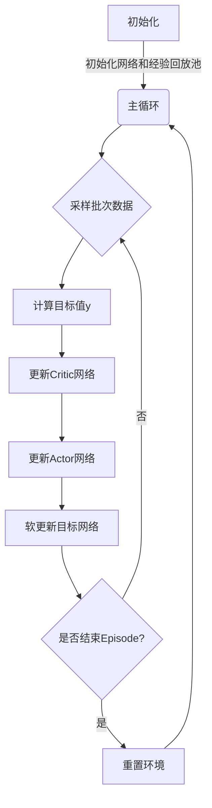

# DDPG原理与代码实例讲解

## 1. 背景介绍

### 1.1 强化学习简介

强化学习(Reinforcement Learning, RL)是机器学习的一个重要分支,它关注智能体(Agent)如何通过与环境(Environment)的交互来学习并采取最优策略,以最大化长期累积奖励。与监督学习和无监督学习不同,强化学习没有给定的输入-输出数据对,而是通过试错和奖惩机制来学习。

### 1.2 深度强化学习的兴起

传统的强化学习算法在处理高维状态空间和动作空间时往往会遇到"维数灾难"的问题。深度神经网络的出现为解决这一问题提供了新的思路。深度神经网络具有强大的特征提取和函数逼近能力,可以将高维的状态和动作映射到低维的特征空间,从而简化了强化学习问题。深度强化学习(Deep Reinforcement Learning, DRL)通过将深度学习与强化学习相结合,取得了令人瞩目的成就,如AlphaGo战胜人类顶尖棋手、OpenAI的机器人学会行走等。

### 1.3 DRL在连续控制问题中的挑战

在离散动作空间的问题中,深度Q网络(Deep Q-Network, DQN)等算法取得了巨大成功。但对于连续动作空间的控制问题,如机器人控制、自动驾驶等,DQN算法无法直接应用。这主要是因为连续动作空间往往是高维的,对其进行离散化会导致动作空间爆炸。此时,我们需要一种能够直接输出连续动作的算法,这就是深度确定性策略梯度(Deep Deterministic Policy Gradient, DDPG)算法的用武之地。

## 2. 核心概念与联系

### 2.1 策略梯度算法

策略梯度(Policy Gradient)算法是解决强化学习问题的一种重要方法。它直接对策略函数进行参数化,通过梯度上升的方式来优化策略函数的参数,使得期望的累积奖励最大化。

在策略梯度算法中,我们定义了一个参数化的策略函数 $\pi_\theta(a|s)$,表示在状态 $s$ 下选择动作 $a$ 的概率,其中 $\theta$ 是策略函数的参数。我们的目标是找到一组最优参数 $\theta^*$,使得期望的累积奖励 $J(\theta)$ 最大化:

$$J(\theta) = \mathbb{E}_{\tau \sim \pi_\theta}[\sum_{t=0}^{T} \gamma^t r(s_t, a_t)]$$

其中 $\tau = (s_0, a_0, s_1, a_1, ...)$ 表示一个由策略 $\pi_\theta$ 生成的状态-动作序列,也称为轨迹(Trajectory)。$r(s_t, a_t)$ 是在状态 $s_t$ 执行动作 $a_t$ 后获得的即时奖励,$ \gamma \in [0, 1)$ 是折扣因子,用于权衡即时奖励和长期奖励的重要性。

为了优化目标函数 $J(\theta)$,我们可以计算其关于参数 $\theta$ 的梯度:

$$\nabla_\theta J(\theta) = \mathbb{E}_{\tau \sim \pi_\theta}\left[\sum_{t=0}^{T} \nabla_\theta \log \pi_\theta(a_t|s_t)Q^{\pi_\theta}(s_t, a_t)\right]$$

其中 $Q^{\pi_\theta}(s_t, a_t)$ 是在状态 $s_t$ 执行动作 $a_t$ 后,按照策略 $\pi_\theta$ 执行所能获得的期望累积奖励。这个期望累积奖励通常是未知的,需要通过某种方式进行估计。

根据策略梯度定理,我们可以通过梯度上升的方式来更新策略参数 $\theta$,使得期望的累积奖励最大化:

$$\theta_{k+1} = \theta_k + \alpha \nabla_\theta J(\theta_k)$$

其中 $\alpha$ 是学习率。

### 2.2 Actor-Critic算法

Actor-Critic算法是策略梯度算法的一种重要变体。它将策略函数和值函数(Value Function)分开,分别由Actor和Critic两个模块来学习。

- Actor模块负责根据当前状态输出一个动作,其实现了策略函数 $\pi_\theta(a|s)$。
- Critic模块则评估当前状态-动作对的值函数 $Q^{\pi_\theta}(s, a)$,也就是按照当前策略执行后能获得的期望累积奖励。

Actor和Critic两个模块相互促进,形成一个正反馈循环:

- Critic根据收集到的状态-动作-奖励序列,评估当前策略的好坏,并将评估结果反馈给Actor。
- Actor根据Critic的评估结果,调整策略参数,输出更好的动作序列。
- 新的动作序列被送入Critic进行评估,循环往复。

通过这种方式,Actor-Critic算法能够有效地解决策略梯度算法中需要估计 $Q^{\pi_\theta}(s, a)$ 的问题。

### 2.3 DDPG算法

DDPG(Deep Deterministic Policy Gradient)算法是一种用于解决连续控制问题的Actor-Critic算法。它的主要创新点在于:

1. 将Actor和Critic都用深度神经网络来拟合,利用深度神经网络的强大函数逼近能力。
2. 引入了经验回放(Experience Replay)和目标网络(Target Network)两种技术,以提高算法的稳定性和收敛性。

DDPG算法的核心思想是:

- Actor网络 $\mu(s|\theta^\mu)$ 输出一个确定性的动作 $a = \mu(s|\theta^\mu)$,而不是输出动作概率。
- Critic网络 $Q(s, a|\theta^Q)$ 评估当前状态-动作对的值函数,即期望累积奖励。
- 通过最小化均方误差损失函数 $L = \mathbb{E}_{s_t, a_t, r_t, s_{t+1}}[(Q(s_t, a_t|\theta^Q) - y_t)^2]$ 来更新Critic网络,其中 $y_t = r_t + \gamma Q'(s_{t+1}, \mu'(s_{t+1}|\theta^{\mu'}))$ 是目标值。
- 通过策略梯度定理,计算Actor网络的策略梯度 $\nabla_{\theta^\mu} J \approx \mathbb{E}_{s_t}\left[\nabla_{\theta^\mu}\mu(s_t|\theta^\mu)\nabla_{a}Q(s_t, a|\theta^Q)|_{a=\mu(s_t|\theta^\mu)}\right]$,并通过梯度上升的方式更新Actor网络。

DDPG算法的伪代码如下:

```python
初始化Critic网络 Q(s, a|θ^Q)和Actor网络 μ(s|θ^μ)及其目标网络Q'和μ'
初始化经验回放池 D
for episode = 1, M:
    初始化初始状态 s_0
    for t = 0, T:
        选择动作 a_t = μ(s_t|θ^μ) + N  # 添加探索噪声
        执行动作 a_t,观测奖励 r_t 和新状态 s_{t+1}
        存储(s_t, a_t, r_t, s_{t+1})到经验回放池 D
        从 D 中采样一个批次的转换 (s_j, a_j, r_j, s_{j+1})
        计算目标值 y_j = r_j + γ * Q'(s_{j+1}, μ'(s_{j+1}|θ^{μ'}))
        更新Critic网络:最小化损失 L = (y_j - Q(s_j, a_j|θ^Q))^2
        更新Actor网络:通过策略梯度上升 ∇_θ^μ J ≈ (1/N)Σ∇_a Q(s, a|θ^Q)|_{s=s_j, a=μ(s_j)} ∇_θ^μ μ(s|θ^μ)
        软更新目标网络参数:
            θ^{Q'} = τ * θ^Q + (1 - τ) * θ^{Q'}
            θ^{μ'} = τ * θ^μ + (1 - τ) * θ^{μ'}
```

其中,经验回放和目标网络是DDPG算法的两个关键技术:

- 经验回放(Experience Replay):将Agent与环境的互动存储在经验回放池中,并从中随机采样批次数据用于训练网络。这种方式打破了数据间的相关性,提高了数据的利用效率,同时也增加了算法的稳定性。
- 目标网络(Target Network):在更新Actor和Critic网络时,使用一个滞后的目标网络计算目标值,而不是直接使用当前网络。这种方式可以增加算法的稳定性,避免了由于同步更新造成的振荡。

通过上述技术,DDPG算法在处理连续控制问题时展现出了良好的性能和稳定性。

## 3. 核心算法原理具体操作步骤

DDPG算法的核心思想是将Actor-Critic算法与深度神经网络、经验回放和目标网络相结合,以解决连续控制问题。下面我们将详细介绍DDPG算法的具体操作步骤。

### 3.1 初始化

1. 初始化评critic网络 $Q(s, a|\theta^Q)$ 和actor网络 $\mu(s|\theta^\mu)$,它们的网络结构和参数可以自行设计。
2. 复制参数,初始化目标critic网络 $Q'(s, a|\theta^{Q'})$ 和目标actor网络 $\mu'(s|\theta^{\mu'})$,使得 $\theta^{Q'} \leftarrow \theta^Q, \theta^{\mu'} \leftarrow \theta^\mu$。
3. 初始化经验回放池 $D$,用于存储 $(s_t, a_t, r_t, s_{t+1})$ 转换。

### 3.2 主循环

对于每一个episode,执行以下步骤:

1. 初始化环境,获取初始状态 $s_0$。
2. 对于每个时间步 $t$,执行以下操作:
    - 根据当前actor网络和探索噪声选择动作: $a_t = \mu(s_t|\theta^\mu) + \mathcal{N}_t$。探索噪声 $\mathcal{N}_t$ 可以是高斯噪声或者其他噪声分布,它用于保证算法具有一定的探索能力。
    - 在环境中执行动作 $a_t$,观测到奖励 $r_t$ 和新状态 $s_{t+1}$。
    - 将转换 $(s_t, a_t, r_t, s_{t+1})$ 存储到经验回放池 $D$ 中。
    - 从经验回放池 $D$ 中随机采样一个批次的转换 $(s_j, a_j, r_j, s_{j+1})$。
    - 计算目标值 $y_j$:
        $$y_j = r_j + \gamma Q'(s_{j+1}, \mu'(s_{j+1}|\theta^{\mu'}))$$
        其中 $\gamma$ 是折扣因子,用于权衡即时奖励和长期奖励的重要性。
    - 更新critic网络:最小化损失函数
        $$L = \frac{1}{N}\sum_{j}(y_j - Q(s_j, a_j|\theta^Q))^2$$
        其中 $N$ 是批次大小。
    - 更新actor网络:通过策略梯度上升
        $$\nabla_{\theta^\mu}J \approx \frac{1}{N}\sum_{j}\nabla_a Q(s_j, a|\theta^Q)|_{a=\mu(s_j|\theta^\mu)}\nabla_{\theta^\mu}\mu(s_j|\theta^\mu)$$
    - 软更新目标网络参数:
        $$\theta^{Q'} \leftarrow \tau\theta^Q + (1 - \tau)\theta^{Q'}$$
        $$\theta^{\mu'} \leftarrow \tau\theta^\mu + (1 - \tau)\theta^{\mu'}$$
        其中 $\tau \ll 1$ 是软更新系数,用于控制目标网络参数的更新速度。

### 3.3 算法流程图



上图展示了DD