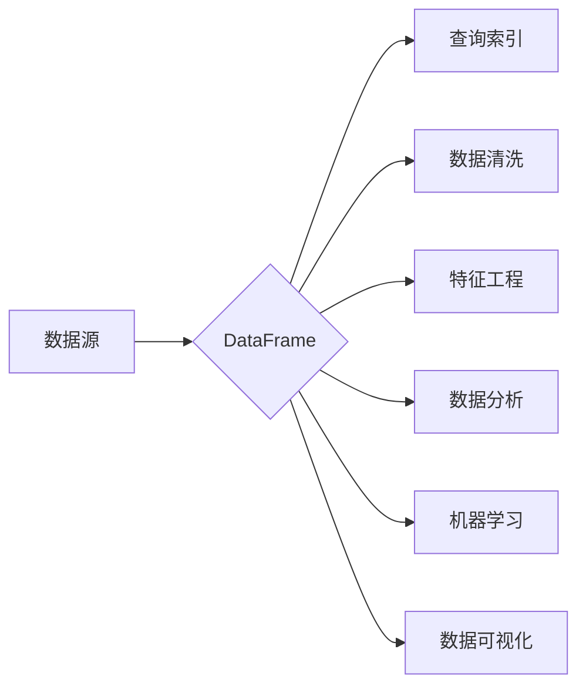

# DataFrame原理与代码实例讲解

## 1. 背景介绍

### 1.1 数据分析的重要性

在当今大数据时代,数据分析已成为各行各业的关键环节。企业需要从海量数据中提取有价值的信息,以支持决策制定、优化业务流程、提升用户体验等。而高效的数据分析离不开强大的数据处理工具和库。

### 1.2 Python数据分析生态

在Python数据分析生态中,Pandas是最受欢迎的数据处理和分析库之一。Pandas提供了两个核心数据结构:Series和DataFrame,它们使得在Python中处理结构化数据变得简单高效。本文将重点介绍DataFrame的原理和使用。

### 1.3 DataFrame的地位和作用

DataFrame是一个二维的数据结构,可以将其看作是一个Excel电子表格或SQL表。它由行和列组成,每列可以是不同的数据类型。DataFrame强大的数据操作、清洗、转换功能,使其成为数据分析中不可或缺的利器。

## 2. 核心概念与关联

### 2.1 DataFrame的核心概念

- DataFrame由行(row)和列(column)组成,类似二维数组或表格
- 每列数据可以是不同数据类型,如整数、浮点数、字符串、时间等
- DataFrame具有index(行索引)和columns(列索引)属性
- 可通过行索引或列索引快速定位和操作数据

### 2.2 DataFrame与Series的关系

- Series是一维数据结构,只有一列数据和对应的索引
- DataFrame可以看作是多个共享同一个索引(行标签)的Series的集合
- DataFrame的每一列都是一个Series
- 对DataFrame的列操作,本质上是对Series的操作

### 2.3 DataFrame与NumPy的关系

- NumPy是Python科学计算的基础库,提供了ndarray多维数组对象
- DataFrame的底层实现依赖NumPy的ndarray
- DataFrame可以方便地与ndarray互相转换
- 很多对DataFrame的操作,背后都是对ndarray的运算

## 3. 核心算法原理和操作步骤

### 3.1 DataFrame的创建

DataFrame可以由多种数据创建,常见的有:

1. 从Python字典创建DataFrame
2. 从二维ndarray创建DataFrame 
3. 从CSV等文件创建DataFrame

以从字典创建为例,步骤如下:

1. 准备一个字典,字典的key为列名,value为列数据(列表或ndarray)
2. 将字典传给pd.DataFrame()函数
3. 可以通过columns参数指定列顺序,index参数指定行索引

### 3.2 DataFrame的查询与索引

DataFrame支持灵活的数据查询和索引操作:

1. 通过df[col]选取单列,df[[col1, col2]]选取多列
2. 通过df.loc[row]按标签选取单行,df.loc[row1:row2]选取多行
3. 通过df.iloc[i]按位置选取单行,df.iloc[i:j]选取多行
4. 通过布尔索引选取满足条件的行,如df[df['col'] > 0]

### 3.3 DataFrame的常用操作

DataFrame提供了一系列高效的数据操作函数,常用的有:

1. df.head(n)和df.tail(n):查看前n行和后n行数据
2. df.info()和df.describe():查看DataFrame的基本信息和汇总统计
3. df.sort_values(by, ascending):按指定列对DataFrame排序
4. df.groupby(by).agg(func):对DataFrame分组并应用聚合函数
5. df.apply(func, axis):对DataFrame的行或列应用函数
6. df.join(other):将两个DataFrame按索引拼接
7. df.merge(other, on, how):按指定列将两个DataFrame合并

## 4. 数学模型和公式详解

DataFrame的很多操作背后都涉及线性代数运算,下面以矩阵乘法为例介绍。

假设有两个DataFrame A和B,它们的矩阵乘法结果为新的DataFrame C。用数学公式表示为:

$$
C = A \times B
$$

其中,A的维度为 $m \times n$,B的维度为 $n \times p$,则C的维度为 $m \times p$。C中第i行第j列元素 $c_{ij}$ 的计算公式为:

$$
c_{ij} = \sum_{k=1}^{n} a_{ik} \times b_{kj}
$$

其中 $a_{ik}$ 为A中第i行第k列元素,$b_{kj}$ 为B中第k行第j列元素。

在DataFrame中,可以用 `df1.dot(df2)` 实现两个DataFrame的矩阵乘法,其背后就是上述数学运算。

例如:

```python
import pandas as pd
import numpy as np

A = pd.DataFrame(np.random.randint(0, 10, (3, 4)))
B = pd.DataFrame(np.random.randint(0, 10, (4, 2)))

C = A.dot(B)
print(C)
```

输出:
```
    0   1
0  74  80
1  74  47
2  87  81
```

## 5. 代码实例详解

下面通过一个完整的数据分析案例,演示DataFrame的创建、查询、操作等。

```python
import pandas as pd
import numpy as np
import matplotlib.pyplot as plt

# 1. 创建DataFrame
data = {
    'name': ['Alice', 'Bob', 'Charlie', 'David', 'Ella'], 
    'age': [24, 35, 28, 42, 31],
    'gender': ['F', 'M', 'M', 'M', 'F'],
    'score': [85, 78, 92, 88, 95]
}
df = pd.DataFrame(data)

# 2. 查看DataFrame信息
print(df.head())
print(df.info())
print(df.describe())

# 3. 查询与索引
print(df['name'])  # 选取name列
print(df[['name', 'age']])  # 选取name和age列
print(df.loc[0])  # 选取第0行
print(df.loc[0:2])  # 选取第0到2行
print(df.iloc[0:2, 0:2])  # 选取第0到1行,第0到1列
print(df[df['score'] > 90])  # 选取score大于90的行

# 4. 常用操作
print(df.sort_values('age'))  # 按age列排序
print(df.groupby('gender')['score'].mean())  # 按gender分组,计算score的均值
df['pass'] = df['score'].apply(lambda x: 'yes' if x >= 60 else 'no')  # 添加pass列

# 5. 数据可视化
df['score'].plot(kind='hist', bins=20, figsize=(8, 5))  # 绘制score的直方图
plt.show()
```

## 6. 实际应用场景

DataFrame在各领域都有广泛应用,下面列举几个典型场景:

1. 金融量化:使用DataFrame存储和分析股票、基金等金融数据,进行量化交易
2. 用户行为分析:使用DataFrame存储用户行为日志数据,分析用户特征和偏好 
3. 销售数据分析:使用DataFrame存储销售记录,分析不同时间、地区、产品的销量
4. 传感器数据分析:使用DataFrame存储物联网传感器采集的时序数据,进行异常检测和预测

## 7. 工具和资源推荐

1. Pandas官方文档:提供了全面的DataFrame使用指南和API参考
2. Jupyter Notebook:可以交互式地学习和使用DataFrame
3. Kaggle:全球最大的数据科学社区,有大量DataFrame实战项目可供参考学习
4. 《利用Python进行数据分析》:经典的Pandas入门书籍,手把手教你用DataFrame处理数据

## 8. 总结与展望

### 8.1 DataFrame的优势

DataFrame凭借其直观的数据表示、丰富的数据操作函数以及强大的性能,成为Python数据分析的利器。掌握DataFrame是成为数据分析师的必备技能。

### 8.2 未来的发展趋势

未来DataFrame将继续朝着更高性能、更友好的用户接口、更强大的功能evolve:

1. 更高性能:通过优化底层算法、利用多核加速等技术,不断提升DataFrame的运算速度
2. 更友好的界面:提供类似SQL的查询接口,降低用户使用门槛
3. 更强大的功能:增加更多机器学习工具的集成,使数据处理和建模更加无缝

### 8.3 面临的挑战

DataFrame要真正成为大数据处理的利器,还需要克服一些挑战:

1. 大数据量的处理:如何在保证性能的同时,处理TB/PB级别的超大数据集
2. 数据安全与隐私:如何在数据分析过程中,保护用户隐私和敏感数据安全
3. 实时数据处理:如何实现DataFrame的流式计算,满足实时数据处理需求

## 9. 附录:常见问题

### Q1:DataFrame和SQL表格有什么区别?

A1:虽然DataFrame和SQL表格都是二维的行列数据,但DataFrame更加灵活:

- DataFrame支持多种数据类型,SQL表中一列只能是一种类型
- DataFrame支持复杂的索引机制,SQL表只能用一列作为主键
- DataFrame支持更丰富的操作,如apply、groupby等,SQL主要是查询

### Q2:DataFrame在大数据场景下性能如何?

A2:Pandas的DataFrame在百万级数据规模下性能很好,但在更大数据集上可能会有瓶颈。这时可以考虑:

- 使用Dask DataFrame:可以并行处理大DataFrame,将计算任务分发到集群
- 使用Spark DataFrame(PySpark):Spark专为大数据设计,支持TB/PB级数据的分布式计算
- 对DataFrame的查询优化:如过滤减少数据量、向量化避免循环等

### Q3:如何将DataFrame保存到文件,并再次读取?

A3:Pandas支持多种文件格式的读写,如:

- CSV文件:df.to_csv('data.csv')  /  pd.read_csv('data.csv')
- Excel文件:df.to_excel('data.xlsx')  /  pd.read_excel('data.xlsx')
- HDF5文件:df.to_hdf('data.h5', 'df')  /  pd.read_hdf('data.h5', 'df')
- JSON文件:df.to_json('data.json')  /  pd.read_json('data.json')



以上就是对DataFrame原理和使用的全面介绍,希望对你的数据分析之旅有所帮助。DataFrame虽然强大,但仍在快速发展中,建议多关注Pandas的最新进展。

作者：禅与计算机程序设计艺术 / Zen and the Art of Computer Programming