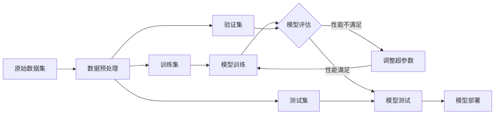
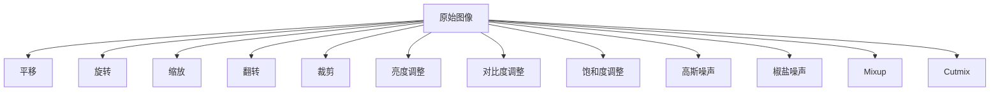
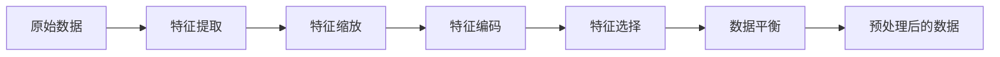

# Dataset 原理与代码实例讲解

## 1. 背景介绍

在现代机器学习和深度学习的发展过程中,数据集(Dataset)扮演着至关重要的角色。高质量的数据集是训练出优秀模型的基石。本文将深入探讨Dataset的原理,并结合代码实例进行讲解,帮助读者全面理解Dataset的概念和应用。

### 1.1 数据集的定义与意义

数据集是指用于训练、验证和测试机器学习模型的数据集合。它通常由大量的样本数据组成,每个样本包含特征(feature)和标签(label)两部分。特征表示样本的属性或特征,标签则表示样本所属的类别或预测目标值。

数据集的质量直接影响模型的性能。一个优秀的数据集应该具备以下特点:

- 数据量充足:足够的数据量有助于模型更好地学习数据的内在规律。
- 数据分布均衡:不同类别或预测目标的样本数量分布尽量均衡,避免数据偏斜。 
- 数据质量高:数据噪声少,标注准确,特征信息丰富。
- 与任务相关:数据集应与要解决的问题密切相关,能够很好地反映任务的特点。

### 1.2 常见的数据集类型

根据机器学习任务的不同,常见的数据集类型可分为以下几类:

1. 分类数据集(Classification Dataset):用于分类任务,每个样本对应一个离散的类别标签。如手写数字识别、垃圾邮件识别等。

2. 回归数据集(Regression Dataset):用于回归任务,每个样本对应一个连续的数值标签。如房价预测、股票趋势预测等。

3. 目标检测数据集(Object Detection Dataset):用于目标检测任务,每个样本图像中包含一个或多个待检测目标的位置和类别信息。如行人检测、车辆检测等。

4. 语义分割数据集(Semantic Segmentation Dataset):用于语义分割任务,对图像中的每个像素进行类别标注。如背景、人物、车辆等不同物体的像素级别标注。

5. 文本数据集(Text Dataset):由大量文本数据组成,可用于文本分类、情感分析、命名实体识别等任务。

6. 语音数据集(Speech Dataset):由语音片段数据组成,常用于语音识别、说话人识别等任务。

7. 推荐系统数据集(Recommender System Dataset):包含用户-物品的交互记录,如用户的浏览、点击、购买记录等,用于构建推荐系统。

## 2. 核心概念与联系

### 2.1 样本(Sample)

样本是数据集中的基本单元,通常由特征和标签两部分组成。每个样本代表了一个独立的数据实例。以图像分类任务为例,一张图片就是一个样本,图片的像素值是特征,图片所属的类别是标签。

### 2.2 特征(Feature)

特征表示样本的属性或特征信息,是样本用于学习和预测的输入。特征可分为数值型特征和类别型特征。数值型特征通常是连续值,如图片像素值、文本向量等;类别型特征是离散值,如one-hot编码后的词语、用户ID等。

### 2.3 标签(Label) 

标签表示样本的预测目标,是模型学习的参考答案。在有监督学习中,标签用于指导模型的训练过程。不同任务的标签形式不同,分类任务的标签是离散的类别,回归任务的标签是连续的数值。

### 2.4 训练集(Training Set)

训练集是用于训练模型的数据集合,模型通过学习训练集中的样本,不断优化模型参数,以期在新数据上取得良好的泛化性能。训练集通常占整个数据集的大部分,如70%~80%。

### 2.5 验证集(Validation Set)  

验证集是在模型训练过程中用于评估模型性能、进行超参数调优的数据集合。通过在验证集上评测模型性能,可以选择性能最优的模型参数和超参数组合。验证集通常占整个数据集的一小部分,如10%~20%。

### 2.6 测试集(Test Set)

测试集是在模型训练完成后,用于评估模型最终性能的数据集合。测试集中的样本是模型从未见过的新数据,用于考察模型的泛化能力。测试集通常占整个数据集的一小部分,如10%~20%。

### 2.7 数据集划分

为了合理评估模型性能,避免过拟合,通常需要将整个数据集划分为训练集、验证集和测试集三部分。常见的划分方式有:

- 留出法(Hold-out):将数据集随机划分为互斥的两部分,一部分作为训练集,另一部分作为测试集。验证集可从训练集中再次划分出来。 
- 交叉验证法(Cross Validation):将数据集划分为k个大小相似的子集,每次选择其中1个子集作为验证集,其余k-1个子集作为训练集,重复k次。常见的有k折交叉验证和留一交叉验证。
- 自助采样法(Bootstrap):通过有放回地从数据集中重复采样,构造多个训练集和验证集,用于评估模型性能的稳定性。

下图展示了数据集划分与模型训练验证的关系:



## 3. 核心算法原理与具体操作步骤

### 3.1 数据集的构建流程

构建高质量的数据集需要经过一系列的步骤,主要包括:

1. 明确任务目标:根据要解决的问题,确定数据集的类型和标注形式。
2. 数据收集:从各种渠道收集原始数据,如网络爬虫、公开数据集、用户日志等。
3. 数据清洗:对原始数据进行去重、去噪、填充缺失值等处理,提高数据质量。
4. 数据标注:对样本进行人工标注,如分类标签、边界框位置等。标注质量很大程度上决定了数据集的质量。
5. 数据增强:通过对样本进行变换,如旋转、缩放、添加噪声等,扩充数据集的多样性和鲁棒性。
6. 数据预处理:对样本进行特征提取、归一化、编码等预处理操作,将其转换为模型可以接受的输入格式。
7. 数据集划分:将数据集划分为训练集、验证集和测试集,用于模型的训练和评估。
8. 数据存储:将处理后的数据集存储为方便读取的格式,如CSV、JSON、TFRecord等。

### 3.2 常用的数据增强方法

数据增强(Data Augmentation)是一种提高模型泛化能力、缓解过拟合的有效方法。通过对训练样本进行一系列的变换,可以增加数据集的多样性和数量。常用的数据增强方法包括:

1. 几何变换:对图像进行平移、旋转、缩放、翻转、裁剪等操作,增加图像的多样性。
2. 颜色变换:对图像进行亮度、对比度、饱和度等调整,模拟不同光照条件下的图像。
3. 噪声添加:对图像添加高斯噪声、椒盐噪声等,提高模型对噪声的鲁棒性。
4. 混合增强:将多个图像混合,生成新的合成图像,如Mixup、Cutmix等方法。
5. 自动增强:利用自动化搜索算法,如AutoAugment,搜索最优的数据增强策略组合。

以下是几种常见数据增强方法的示意图:



### 3.3 数据预处理的常用操作

数据预处理是将原始数据转换为模型可以接受的输入格式的过程。常见的数据预处理操作包括:

1. 特征提取:从原始数据中提取有效的特征表示,如图像的SIFT特征、文本的TF-IDF特征等。
2. 特征缩放:对特征进行归一化或标准化处理,使其数值范围一致,如Min-Max缩放、Z-score标准化等。
3. 特征编码:将类别型特征转换为数值型特征,如One-hot编码、Label编码等。
4. 特征选择:从众多特征中选择最有效、最相关的特征子集,降低特征维度,如过滤法、包裹法、嵌入法等。
5. 数据平衡:处理不平衡数据集,使各类别样本数量均衡,如过采样、欠采样、SMOTE算法等。

以下是数据预处理流程的示意图:



## 4. 数学模型和公式详细讲解举例说明

### 4.1 数据集的数学表示

假设有一个数据集$D$,其中包含$N$个样本,每个样本由特征$x$和标签$y$组成。数据集$D$可以表示为:

$$D = \{(x_1, y_1), (x_2, y_2), ..., (x_N, y_N)\}$$

其中,$x_i \in \mathbb{R}^d$表示第$i$个样本的特征向量,维度为$d$;$y_i \in \mathbb{Y}$表示第$i$个样本的标签,标签空间$\mathbb{Y}$根据任务不同而不同,如分类任务中$\mathbb{Y} = \{1, 2, ..., K\}$,回归任务中$\mathbb{Y} = \mathbb{R}$。

### 4.2 特征缩放的数学公式

特征缩放的目的是将特征的数值范围缩放到一个固定区间,常见的有Min-Max缩放和Z-score标准化两种方法。

Min-Max缩放将特征缩放到[0, 1]区间内,公式为:

$$x^{'}_i = \frac{x_i - min(x)}{max(x) - min(x)}$$

其中,$x_i$表示第$i$个样本的某个特征值,$min(x)$和$max(x)$分别表示该特征在整个数据集上的最小值和最大值。

Z-score标准化将特征缩放到均值为0、标准差为1的分布上,公式为:

$$x^{'}_i = \frac{x_i - \mu}{\sigma}$$

其中,$\mu$和$\sigma$分别表示该特征在整个数据集上的均值和标准差。

### 4.3 交叉验证的数学描述

K折交叉验证将数据集$D$划分为$K$个大小相似的子集$\{D_1, D_2, ..., D_K\}$,每次选择其中一个子集$D_i$作为验证集,其余$K-1$个子集$D \backslash D_i$作为训练集,重复$K$次。第$i$次验证的模型性能可以表示为:

$$p_i = f(D \backslash D_i, D_i)$$

其中,$f$表示模型训练和评估的过程。$K$折交叉验证的平均性能为:

$$\bar{p} = \frac{1}{K} \sum_{i=1}^K p_i$$

交叉验证可以有效利用有限的数据,评估模型的泛化性能,减少过拟合的风险。

## 5. 项目实践:代码实例和详细解释说明

下面以Python和PyTorch为例,展示数据集的构建和使用的代码实例。

### 5.1 自定义数据集类

```python
import torch
from torch.utils.data import Dataset

class MyDataset(Dataset):
    def __init__(self, features, labels):
        self.features = features
        self.labels = labels
    
    