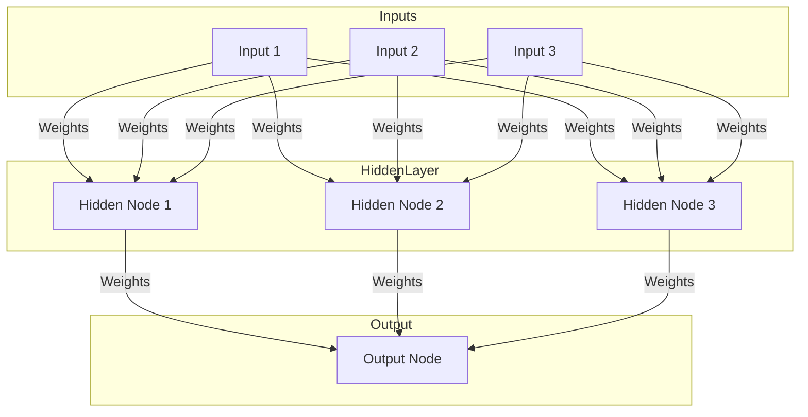
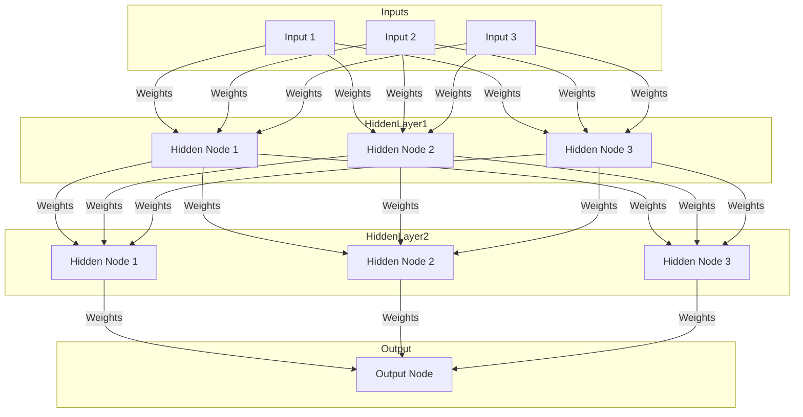

# Deep Learning原理与代码实例讲解

## 1.背景介绍

深度学习(Deep Learning)是机器学习的一个新的研究热点,它是一种基于对数据进行表征学习的机器学习方法。通过对海量数据的学习,可以自动获取数据的特征表示,从而解决机器学习中复杂的模式识别问题。深度学习的动机在于构建一种算法模型,使之能够自主地从数据中学习到分布式特征表示,并且这种特征表示对于解决机器学习任务是非常有效的。

深度学习的概念源于人工神经网络的研究,它模仿生物神经网络的行为特征,通过建立一种多层次的网络结构,每一层对输入数据进行特征提取和转换,最后在输出层完成特定的机器学习任务。与传统的机器学习方法不同,深度学习可以自动学习数据表示特征,而不需要人工设计特征。

近年来,由于算力的飞速发展、大数据时代的到来以及一些新的技术突破,深度学习在语音识别、图像识别、自然语言处理等领域取得了令人瞩目的成就,成为人工智能领域最炙手可热的技术之一。

## 2.核心概念与联系

### 2.1 神经网络

神经网络是深度学习的核心基础,它模仿生物神经网络的结构和工作原理。一个神经网络由多个神经元(节点)组成,每个神经元接收来自其他神经元或输入数据的信号,经过加权求和和非线性激活函数的处理,产生输出信号传递给下一层的神经元。

神经网络的基本结构如下所示:



### 2.2 深度神经网络

深度神经网络是由多个隐藏层组成的神经网络,每一层对上一层的输出进行非线性变换,从而学习数据的更高层次的抽象特征表示。深度网络的层数越多,可以学习到的特征表示就越抽象,对于复杂任务的建模能力就越强。



### 2.3 前馈神经网络与卷积神经网络

前馈神经网络(Feedforward Neural Network)是深度学习中最基本的网络结构,信息只从输入层向输出层单向传递。而卷积神经网络(Convolutional Neural Network, CNN)则是专门用于处理图像等结构化数据的一种深度网络,它引入了卷积层和池化层等特殊层,能够有效地捕获图像的局部特征和空间关系。

### 2.4 循环神经网络

循环神经网络(Recurrent Neural Network, RNN)是另一种常用的深度网络结构,它适用于处理序列数据,如自然语言、语音、时间序列等。RNN中的神经元不仅接收当前时刻的输入,还会接收上一时刻状态的信息,从而能够捕获序列数据中的时间动态特性。

### 2.5 深度学习与传统机器学习的区别

与传统的机器学习方法相比,深度学习具有以下几个显著的特点:

1. 自动学习特征表示,不需要人工设计特征
2. 端到端的模型训练,无需分阶段处理
3. 可以处理复杂的高维数据,如图像、语音等
4. 具有强大的建模能力,能够捕捉数据中的复杂模式

## 3.核心算法原理具体操作步骤

深度学习的核心算法是基于反向传播(Back Propagation)的梯度下降优化,用于训练神经网络模型。具体的操作步骤如下:

1. **前向传播(Forward Propagation)**

   将输入数据传递到网络的第一层,经过加权求和和激活函数的处理,计算出第一层的输出。然后将第一层的输出作为第二层的输入,重复上述过程,一直传播到输出层,得到网络的最终输出。

2. **计算损失函数(Loss Function)**

   将网络的输出与期望的目标值进行比较,计算损失函数(如均方误差、交叉熵等),衡量网络输出与目标值之间的差异程度。

3. **反向传播(Back Propagation)**

   根据损失函数对网络的每一层参数(权重和偏置)计算梯度,利用链式法则从输出层开始,沿着网络反向传播,计算每一层参数的梯度。

4. **参数更新(Parameter Update)**

   使用优化算法(如梯度下降、Adam等)根据计算得到的梯度,更新网络中每一层的参数,使损失函数值下降。

5. **重复迭代**

   重复执行前向传播、计算损失函数、反向传播和参数更新的过程,直到模型收敛或达到预设的迭代次数。

以上是深度学习训练的基本流程,具体的实现细节可能因不同的网络结构、优化算法等而有所不同。

## 4.数学模型和公式详细讲解举例说明

### 4.1 神经元模型

神经元是神经网络的基本计算单元,它接收来自其他神经元或输入数据的加权信号,经过激活函数的非线性变换后产生输出。一个神经元的数学模型可以表示为:

$$
y = \phi\left(\sum_{i=1}^{n}w_ix_i + b\right)
$$

其中:
- $x_i$是第$i$个输入
- $w_i$是与第$i$个输入相关的权重
- $b$是偏置项
- $\phi$是激活函数,引入非线性

常用的激活函数包括Sigmoid函数、Tanh函数、ReLU函数等。

### 4.2 前馈神经网络

前馈神经网络由多层神经元组成,每一层的输出作为下一层的输入。对于一个包含$L$层的前馈神经网络,第$l$层的输出可以表示为:

$$
\mathbf{h}^{(l)} = \phi\left(\mathbf{W}^{(l)}\mathbf{h}^{(l-1)} + \mathbf{b}^{(l)}\right)
$$

其中:
- $\mathbf{h}^{(l)}$是第$l$层的输出向量
- $\mathbf{W}^{(l)}$是第$l$层的权重矩阵
- $\mathbf{b}^{(l)}$是第$l$层的偏置向量
- $\phi$是激活函数

网络的最终输出$\mathbf{y}$即为最后一层的输出$\mathbf{h}^{(L)}$。

### 4.3 损失函数

在训练过程中,我们需要定义一个损失函数(Loss Function)来衡量网络输出与期望目标之间的差异。常用的损失函数包括:

1. **均方误差(Mean Squared Error, MSE)**

   $$
   \text{MSE}(\mathbf{y}, \mathbf{t}) = \frac{1}{n}\sum_{i=1}^{n}(y_i - t_i)^2
   $$

   其中$\mathbf{y}$是网络输出,$\mathbf{t}$是期望目标,$n$是样本数量。

2. **交叉熵损失(Cross-Entropy Loss)**

   对于二分类问题:
   $$
   \text{CE}(\mathbf{y}, \mathbf{t}) = -\frac{1}{n}\sum_{i=1}^{n}\left[t_i\log(y_i) + (1-t_i)\log(1-y_i)\right]
   $$

   对于多分类问题:
   $$
   \text{CE}(\mathbf{y}, \mathbf{t}) = -\frac{1}{n}\sum_{i=1}^{n}\sum_{j=1}^{C}t_{ij}\log(y_{ij})
   $$

   其中$C$是类别数量。

### 4.4 反向传播

反向传播算法是通过链式法则计算每一层参数的梯度,以便更新参数。对于第$l$层的权重矩阵$\mathbf{W}^{(l)}$和偏置向量$\mathbf{b}^{(l)}$,其梯度可以表示为:

$$
\frac{\partial L}{\partial\mathbf{W}^{(l)}} = \frac{\partial L}{\partial\mathbf{h}^{(l+1)}}\frac{\partial\mathbf{h}^{(l+1)}}{\partial\mathbf{W}^{(l)}}
$$

$$
\frac{\partial L}{\partial\mathbf{b}^{(l)}} = \frac{\partial L}{\partial\mathbf{h}^{(l+1)}}\frac{\partial\mathbf{h}^{(l+1)}}{\partial\mathbf{b}^{(l)}}
$$

其中$L$是损失函数。通过反向传播计算得到每一层的梯度后,就可以使用优化算法(如梯度下降)更新网络参数。

以上是深度学习中一些常见的数学模型和公式,具体的推导和应用需要结合实际问题进行分析。

## 5.项目实践：代码实例和详细解释说明

为了更好地理解深度学习的原理和实现,我们将通过一个简单的示例项目来实践前馈神经网络的构建和训练。

在这个示例中,我们将使用Python和PyTorch框架,构建一个用于手写数字识别的前馈神经网络模型。我们将使用著名的MNIST数据集作为训练和测试数据。

### 5.1 导入必要的库

```python
import torch
import torch.nn as nn
import torch.optim as optim
from torchvision import datasets, transforms
```

### 5.2 加载和预处理数据

```python
# 定义数据转换
transform = transforms.Compose([
    transforms.ToTensor(),
    transforms.Normalize((0.1307,), (0.3081,))
])

# 加载MNIST数据集
train_dataset = datasets.MNIST(root='./data', train=True, download=True, transform=transform)
test_dataset = datasets.MNIST(root='./data', train=False, download=True, transform=transform)

# 创建数据加载器
train_loader = torch.utils.data.DataLoader(train_dataset, batch_size=64, shuffle=True)
test_loader = torch.utils.data.DataLoader(test_dataset, batch_size=64, shuffle=False)
```

### 5.3 定义神经网络模型

```python
class Net(nn.Module):
    def __init__(self):
        super(Net, self).__init__()
        self.fc1 = nn.Linear(28 * 28, 512)
        self.fc2 = nn.Linear(512, 256)
        self.fc3 = nn.Linear(256, 10)

    def forward(self, x):
        x = x.view(-1, 28 * 28)
        x = torch.relu(self.fc1(x))
        x = torch.relu(self.fc2(x))
        x = self.fc3(x)
        return x

model = Net()
```

在这个示例中,我们定义了一个包含三个全连接层的前馈神经网络