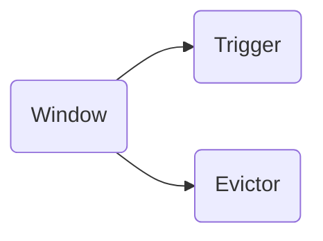
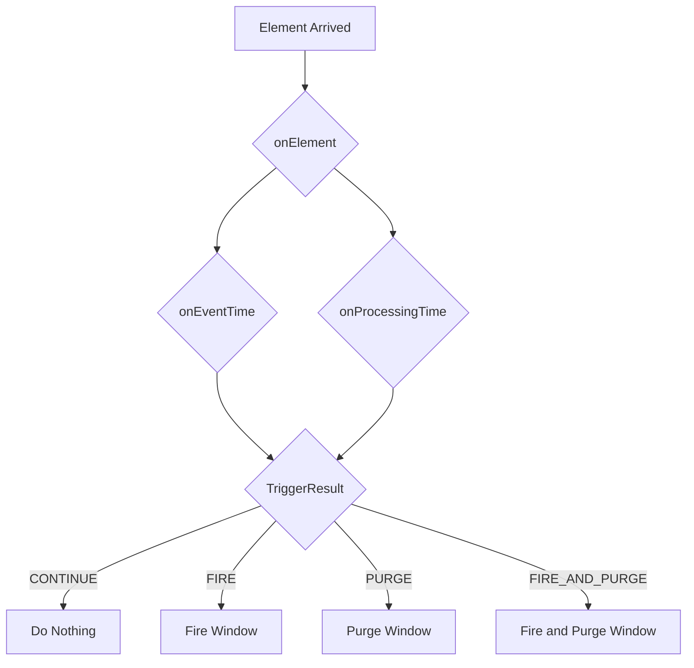

# Flink Trigger原理与代码实例讲解

## 1. 背景介绍

### 1.1 流式计算与批处理
在大数据处理领域,根据数据到达和处理方式的不同,通常可以分为批处理(Batch Processing)和流式计算(Stream Processing)两大类。批处理主要面向有界数据集,数据先进行收集并存储,再进行分析处理。而流式计算则面向连续不断到达的数据流,数据一旦到达就立即进行处理,从而实现实时计算和分析。

### 1.2 Apache Flink 简介
Apache Flink 是一个开源的分布式大数据处理引擎,其核心是一个数据流编程模型和一个支持数据流与批处理的分布式计算引擎。Flink 以数据并行和流水线方式执行任意流数据程序,可以实现高吞吐、低延迟、高性能的流式计算。

### 1.3 Flink Window 与 Trigger
在 Flink 流式计算中,Window 是一个非常重要和强大的数据处理抽象,它允许在无界数据流上进行有界的聚合计算。而 Trigger 则是 Window 的重要组成部分,它定义了何时触发 Window 的计算逻辑,即 Window 什么时候被触发执行或清除。

## 2. 核心概念与联系

### 2.1 Window
Window 将一个无限流切分成有限大小的"桶"(bucket),可以在这些桶上做计算操作得到有限的结果。Flink 支持 Time Window(时间窗口)、Count Window(计数窗口)、Session Window(会话窗口)等多种类型的 Window。

### 2.2 Trigger
Trigger 定义了 Window 何时触发计算或清除数据,是 Window 的重要组成部分。Trigger 接口中定义了 onElement、onProcessingTime、onEventTime、onMerge、clear 等方法,分别在不同的事件发生时被调用。

### 2.3 Evictor 
Evictor 定义了 Window 的数据淘汰策略,即一个窗口删除数据的逻辑。常见的 Evictor 有 CountEvictor 和 TimeEvictor 等。

### 2.4 Window、Trigger、Evictor 关系

下面是 Window、Trigger、Evictor 三者关系的示意图:



Window 包含 Trigger 和 Evictor 两个组件。Trigger 定义 Window 何时触发,Evictor 定义 Window 的数据淘汰逻辑。三者协同工作,共同完成 Window 的计算逻辑。

## 3. 核心算法原理具体操作步骤

### 3.1 Trigger 接口定义

```java
public interface Trigger<T, W extends Window> extends Serializable {

  TriggerResult onElement(T element, long timestamp, W window, TriggerContext ctx) throws Exception;
  
  TriggerResult onProcessingTime(long time, W window, TriggerContext ctx) throws Exception;
  
  TriggerResult onEventTime(long time, W window, TriggerContext ctx) throws Exception;
  
  void clear(W window, TriggerContext ctx) throws Exception;
  
  boolean canMerge();
  
  void onMerge(W window, OnMergeContext ctx) throws Exception;
}
```

Trigger 接口中定义了以下几个关键方法:

- onElement: 每个元素进入 Window 时调用
- onProcessingTime: 当注册的 Processing Time Timer 触发时调用  
- onEventTime: 当注册的 Event Time Timer 触发时调用
- clear: 当 Window 关闭销毁时调用
- onMerge: 当两个 Window 合并时调用

### 3.2 TriggerResult

TriggerResult 是 Trigger 中各个方法的返回值类型,它是一个枚举类,定义如下:

```java
public enum TriggerResult {
  CONTINUE(false, false),
  FIRE(true, false), 
  PURGE(false, true),
  FIRE_AND_PURGE(true, true);
}
```

- CONTINUE: 不做任何操作
- FIRE: 触发 Window 计算
- PURGE: 清除 Window 中的数据
- FIRE_AND_PURGE: 先触发 Window 计算,再清除数据

### 3.3 Trigger 执行流程

下面是 Trigger 的执行流程示意图:



当一个元素到达 Window 时,会先调用 onElement 方法。之后,如果注册了 EventTime Timer 或 ProcessingTime Timer,则会在 Timer 触发时分别调用对应的 onEventTime 或 onProcessingTime 方法。这些方法最终会返回一个 TriggerResult,根据结果类型执行相应的后续操作,如触发计算、清除数据等。

## 4. 数学模型和公式详细讲解举例说明

Trigger 本身是一个通用的接口,内部并没有涉及复杂的数学模型。但在实现自定义 Trigger 时,可能会用到一些数学或统计模型。这里举一个简单的例子。

假设我们要实现一个基于标准差的 Trigger。当 Window 内的元素标准差大于指定阈值时触发计算。这里就需要用到标准差的计算公式:

$$
\sigma = \sqrt{\frac{1}{N} \sum_{i=1}^N (x_i - \mu)^2}
$$

其中,$\sigma$ 表示标准差,$N$ 表示样本数量,$x_i$ 表示第 $i$ 个元素的值,$\mu$ 表示样本均值,其计算公式为:

$$
\mu = \frac{1}{N} \sum_{i=1}^N x_i
$$

在 onElement 方法中,我们可以在每个元素到达 Window 时更新均值和标准差,当标准差超过指定阈值时返回 FIRE,触发 Window 计算。

## 5. 项目实践：代码实例和详细解释说明

下面我们通过一个具体的代码实例,演示如何自定义一个简单的 Trigger。

```java
public class CustomTrigger<T> extends Trigger<T, TimeWindow> {

    private final long maxCount;
    private final long interval;

    private long count = 0L;
    private long lastFireTimestamp = 0L;

    public CustomTrigger(long maxCount, long interval) {
        this.maxCount = maxCount;
        this.interval = interval;
    }

    @Override
    public TriggerResult onElement(T element, long timestamp, TimeWindow window, TriggerContext ctx) throws Exception {
        count++;
        if (count >= maxCount || timestamp >= lastFireTimestamp + interval) {
            lastFireTimestamp = timestamp;
            count = 0;
            return TriggerResult.FIRE;
        }
        return TriggerResult.CONTINUE;
    }

    @Override
    public TriggerResult onEventTime(long time, TimeWindow window, TriggerContext ctx) throws Exception {
        return TriggerResult.CONTINUE;
    }

    @Override
    public TriggerResult onProcessingTime(long time, TimeWindow window, TriggerContext ctx) throws Exception {
        return TriggerResult.CONTINUE;
    }

    @Override
    public void clear(TimeWindow window, TriggerContext ctx) throws Exception {
        count = 0;
        lastFireTimestamp = 0;
    }
}
```

这个自定义 Trigger 的逻辑如下:

- 构造函数接收两个参数:maxCount 表示触发计算的最大元素数量,interval 表示触发的时间间隔
- onElement 方法中,每来一个元素 count 加 1,同时判断是否达到 maxCount 或者当前时间是否已经超过上次触发时间 + interval。如果满足条件,则返回 FIRE,触发计算并清空状态,否则返回 CONTINUE
- onEventTime 和 onProcessingTime 方法直接返回 CONTINUE,不做任何操作
- clear 方法中重置 count 和 lastFireTimestamp

使用这个自定义 Trigger 的示例代码如下:

```java
DataStream<Tuple2<String, Long>> stream = ...

stream.keyBy(t -> t.f0)
      .window(TumblingEventTimeWindows.of(Time.seconds(10)))
      .trigger(new CustomTrigger<>(100, Time.seconds(1).toMilliseconds()))
      .reduce((value1, value2) -> new Tuple2<>(value1.f0, value1.f1 + value2.f1))
      .print();
```

这里我们在一个 KeyedStream 上定义了一个 10 秒的滚动事件时间窗口,并使用了我们自定义的 CustomTrigger。这个 Trigger 会在窗口元素数量达到 100 或者每隔 1 秒钟触发一次 Window。

## 6. 实际应用场景

Trigger 在实际的流式计算应用中有非常广泛的应用场景,下面列举几个常见的例子:

- 实时统计/监控告警:通过自定义 Trigger,可以在数据满足一定条件时(如超过阈值)实时触发计算,并发出告警通知
- 数据去重:利用 Trigger 的 clear 机制,可以实现基于 Window 的数据去重功能 
- 数据校验:通过 Trigger 判断一个 Window 内的数据是否完整,如果不完整可以发出报警
- 复杂事件处理:Trigger 可以与状态结合,实现复杂事件模式的匹配与检测

总的来说,Trigger 提供了一种灵活的机制,让我们能够在 Window 上实现更加复杂和精细的流式计算控制逻辑。

## 7. 工具和资源推荐

- Flink 官网: https://flink.apache.org/  
- Flink 官方文档中关于 Trigger 的介绍: https://ci.apache.org/projects/flink/flink-docs-release-1.12/dev/stream/operators/windows.html#triggers 
- Flink 源码中 Trigger 相关的实现: https://github.com/apache/flink/blob/master/flink-streaming-java/src/main/java/org/apache/flink/streaming/api/windowing/triggers/Trigger.java
- Flink 中文社区: https://flink-learning.org.cn/

这些资源可以帮助大家更深入地学习和掌握 Flink Trigger 的相关知识。

## 8. 总结：未来发展趋势与挑战

Flink 作为新一代的流式计算引擎,其 Trigger 机制为 Window 计算模型提供了强大的表达能力和灵活性。未来在流式计算领域,我们可以预见 Trigger 机制将在以下方面不断发展和完善:

- 更多样化的 Trigger 类型:针对不同的业务场景,会涌现出更多新的 Trigger 类型,如基于 Machine Learning 的 Trigger、自适应 Trigger 等
- 更精细的 Trigger 控制粒度:Trigger 的控制粒度会变得更加精细,从而实现更加实时和准确的流式计算
- 更智能的 Trigger 决策:结合 AI 算法,Trigger 可以具备自我学习和优化的能力,自动适应数据特征和业务需求

当然,Trigger 的发展也面临着一些挑战:

- 如何权衡 Trigger 的表达能力和计算性能
- 如何设计易用的 Trigger API,降低用户的使用门槛
- 如何保证 Trigger 逻辑的正确性和可维护性

这些都是值得流式计算框架设计者深入思考和不断改进的问题。相信经过社区的共同努力,Trigger 机制必将在未来的流式计算领域发挥更大的价值。

## 9. 附录：常见问题与解答

Q: Trigger 与 Evictor 有什么区别?

A: Trigger 定义了 Window 的触发计算策略,即何时触发 Window 进行计算或清除数据。而 Evictor 定义了 Window 的淘汰数据策略,即一个 Window 在计算前或计算后哪些数据需要被删除。它们分别从不同的角度来控制 Window 的计算逻辑。

Q: 是否所有的 Window 都需要定义 Trigger?  

A: 并不是所有的 Window 都需要显式地定义 Trigger。Flink 提供了默认的 Trigger 实现,如事件时间 Window 的 EventTimeTrigger、处理时间 Window 的 ProcessingTimeTrigger 等。只有当你需要自定义 Window 的触发逻辑时,才需要实现自己的 Trigger。

Q: Trigger 的 onEventTime 和 onProcessingTime 有什么区别?

A: onEventTime 是在 Watermark 到达时触发,代表的是业务时间的进展。而 onProcessingTime 是在系统处理时间达到定时器设定时间时触发,与数据本身的业务时间无关。它们分别对应事件时间语义和处理时间语义下的定时器触发。

Q: Trigger 状态