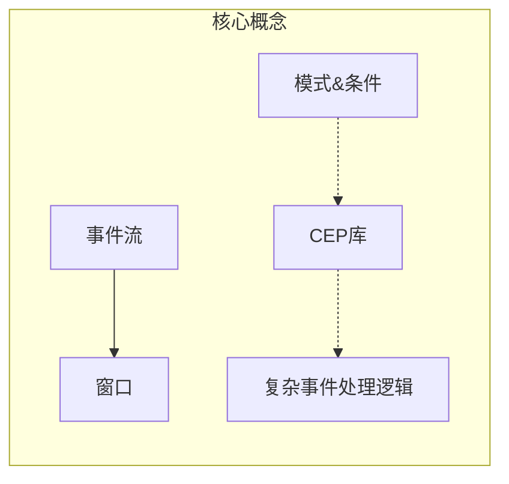
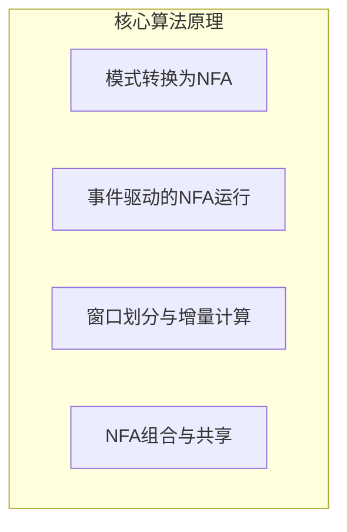
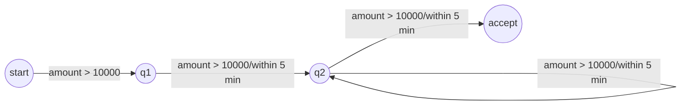

# FlinkCEP与金融科技：实时交易监控与欺诈检测

## 1.背景介绍

### 1.1 金融科技的兴起

近年来,金融科技(FinTech)的发展如火如荼,成为金融行业的一股新兴力量。金融科技旨在利用创新技术提高金融服务的效率、可及性和安全性。其中,实时交易监控和欺诈检测是金融科技的关键应用领域之一。

### 1.2 实时交易监控与欺诈检测的重要性

在金融交易中,实时监控和及时发现可疑活动对于防止欺诈、保护客户利益和维护金融体系的稳定至关重要。传统的批处理方式已经无法满足实时性的要求,因此需要采用先进的流式处理技术来实现实时交易监控和欺诈检测。

### 1.3 Apache Flink介绍

Apache Flink是一个开源的分布式流式数据处理框架,具有低延迟、高吞吐量、精确一次语义等优势。Flink提供了CEP(复杂事件处理)库,可以高效地对流数据进行模式匹配、过滤和处理,非常适合实时交易监控和欺诈检测等场景。

## 2.核心概念与联系

### 2.1 事件流(Event Stream)

事件流是指连续不断产生的事件序列,如金融交易流、传感器数据流等。Flink以事件流为基础,对其进行实时处理和分析。

### 2.2 窗口(Window)

窗口是Flink处理事件流的基本单位。根据时间或计数等条件,事件流被划分为多个窗口,每个窗口内的事件作为一个小批次进行处理。常见的窗口类型包括滚动窗口、滑动窗口、会话窗口等。

### 2.3 CEP(复杂事件处理)

CEP是一种事件处理范式,旨在从有序事件流中发现特定的复杂模式。Flink CEP库提供了模式定义、模式匹配和模式选择等功能,可以方便地构建复杂的事件处理逻辑。

### 2.4 模式(Pattern)

模式是用于描述需要检测的复杂事件序列的规则。Flink CEP库支持使用正则表达式、量词等方式定义模式,并提供了多种内置模式,如严格连续、宽松连续等。

### 2.5 条件(Condition)

条件是指对事件流中的单个事件施加的过滤条件。Flink CEP库支持使用lambda表达式或POJO类定义条件,可以根据事件的属性或其他上下文信息进行过滤。

### 2.6 核心概念关系

事件流作为输入源,通过窗口操作将其划分为小批次。CEP库根据定义的模式和条件,在每个窗口内对事件流进行模式匹配和过滤,从而实现复杂事件处理逻辑。这种处理方式非常适合实时交易监控和欺诈检测等场景。



## 3.核心算法原理具体操作步骤

Flink CEP库的核心算法原理是基于有限状态自动机(Finite State Machine, FSM)和NFA(Non-deterministic Finite Automaton)。以下是具体的操作步骤:

### 3.1 模式转换为NFA

首先,Flink CEP库将用户定义的模式转换为NFA。每个模式对应一个NFA,NFA由多个状态和转移边组成。

#### 3.1.1 状态表示

每个状态代表模式的部分匹配情况。初始状态表示未匹配任何事件,接受状态表示完全匹配模式。

#### 3.1.2 转移边

转移边代表事件的到来,满足特定条件时会触发状态转移。转移边上可以附加条件,用于过滤不符合条件的事件。

### 3.2 事件驱动的NFA运行

当有新事件到来时,NFA根据事件的属性值决定是否进行状态转移。

#### 3.2.1 部分匹配

如果事件满足某个状态的转移条件,则从当前状态沿着对应的转移边进行状态转移,表示部分匹配了模式。

#### 3.2.2 完全匹配

如果转移到接受状态,则表示完全匹配了模式,CEP库将输出对应的匹配事件序列。

#### 3.2.3 状态维护

为了支持模式的部分匹配,CEP库会为每个部分匹配状态维护一个状态实例,用于保存已匹配事件序列和其他上下文信息。

### 3.3 窗口划分与增量计算

CEP库将事件流根据窗口策略划分为多个窗口,每个窗口内的事件作为一个小批次进行处理。

#### 3.3.1 窗口划分

常见的窗口策略包括时间窗口、计数窗口等。窗口可以是固定大小的滚动窗口,也可以是重叠的滑动窗口。

#### 3.3.2 增量计算

对于每个新到达的窗口,CEP库会基于上一个窗口的计算结果,进行增量计算。这种增量计算方式可以提高效率,避免重复计算。

### 3.4 NFA组合与共享

为了支持更复杂的模式匹配,Flink CEP库支持将多个NFA组合成一个复合NFA。同时,CEP库也支持多个作业共享同一个NFA,以节省资源和提高效率。



## 4.数学模型和公式详细讲解举例说明

在Flink CEP库中,模式匹配过程可以用数学模型和公式进行描述和分析。

### 4.1 有限状态自动机(FSM)模型

FSM是一种数学计算模型,由一组有限状态、一组输入符号、一个初始状态、一组接受状态和一组状态转移函数组成。

$$
FSM = (Q, \Sigma, q_0, F, \delta)
$$

其中:
- $Q$是有限状态集合
- $\Sigma$是输入符号集合(事件流)
- $q_0 \in Q$是初始状态
- $F \subseteq Q$是接受状态集合
- $\delta: Q \times \Sigma \rightarrow Q$是状态转移函数

FSM的工作原理是:对于每个输入符号$a \in \Sigma$,如果当前状态为$q$,则根据转移函数$\delta(q, a)$进行状态转移。如果转移到接受状态$q_f \in F$,则表示接受该输入序列。

在Flink CEP中,每个模式对应一个FSM,事件流作为输入符号序列驱动FSM的状态转移。当FSM转移到接受状态时,即表示匹配到该模式。

### 4.2 NFA(非确定有限自动机)模型

NFA是FSM的一种变体,允许在同一状态和输入符号下有多个可能的转移目标状态,因此是非确定的。

$$
NFA = (Q, \Sigma, I, F, \delta)
$$

其中:
- $Q$是有限状态集合
- $\Sigma$是输入符号集合
- $I \subseteq Q$是初始状态集合
- $F \subseteq Q$是接受状态集合
- $\delta: Q \times \Sigma_\epsilon \rightarrow \mathcal{P}(Q)$是状态转移函数,其中$\Sigma_\epsilon = \Sigma \cup \{\epsilon\}$,
$\epsilon$表示空输入符号

NFA的工作原理类似FSM,但在每个状态和输入符号下,可能有多个转移目标状态。NFA接受一个输入序列,当且仅当至少存在一条路径可以从初始状态出发,经过一系列状态转移,最终到达接受状态。

在Flink CEP中,模式被转换为NFA,事件流作为输入符号序列驱动NFA的状态转移。由于NFA的非确定性,在同一输入事件下,可能有多条状态转移路径,从而支持更复杂的模式匹配。

### 4.3 模式匹配示例

假设我们需要监控金融交易中的可疑行为模式:"在5分钟内,同一用户进行3次或更多的大额转账交易"。我们可以使用CEP模式和NFA来描述和匹配这种行为模式。

首先,定义模式:

```java
Pattern<Transaction, ?> pattern = Pattern.<Transaction>begin("start")
    .where(t -> t.getAmount() > 10000)  // 大额交易
    .timesOrMore(3)                     // 至少3次
    .within(Time.minutes(5));           // 5分钟内
```

该模式表示:从"start"状态开始,匹配金额大于10000的交易事件,这种事件在5分钟内出现3次或更多次。

该模式对应的NFA如下:



- 初始状态是"start"
- 当发生金额大于10000的交易事件时,从"start"转移到"q1"
- 在5分钟内,如果再次发生金额大于10000的交易事件,从"q1"转移到"q2"
- 在5分钟内,如果再次发生金额大于10000的交易事件,从"q2"转移到"accept"状态,表示完全匹配模式
- 在5分钟内,如果持续发生金额大于10000的交易事件,则在"q2"状态自循环

通过这个示例,我们可以看到NFA模型如何描述和匹配复杂的事件模式。Flink CEP库利用NFA的状态转移机制,高效地对事件流进行模式匹配,从而实现实时交易监控和欺诈检测。

## 5.项目实践:代码实例和详细解释说明

接下来,我们通过一个实际项目案例,展示如何使用Flink CEP库进行实时交易监控和欺诈检测。

### 5.1 项目概述

我们将构建一个实时交易监控系统,监控金融交易事件流,并对可疑交易活动发出警报。具体需求如下:

- 监控大额交易(金额大于10000)
- 检测同一用户在5分钟内进行3次或更多大额交易的行为模式
- 对于被检测到的可疑交易活动,发出警报并记录相关信息

### 5.2 数据模型

我们定义一个`Transaction`类,表示金融交易事件:

```java
public class Transaction {
    private String userId;
    private double amount;
    private long timestamp;
    // 构造函数、getter/setter方法
}
```

### 5.3 Flink CEP作业

接下来,我们创建一个Flink CEP作业,实现上述需求。

#### 5.3.1 环境准备

```java
StreamExecutionEnvironment env = StreamExecutionEnvironment.getExecutionEnvironment();
```

#### 5.3.2 定义模式

```java
Pattern<Transaction, ?> pattern = Pattern.<Transaction>begin("start")
    .where(t -> t.getAmount() > 10000)
    .timesOrMore(3)
    .within(Time.minutes(5));
```

该模式表示:从"start"状态开始,匹配金额大于10000的交易事件,这种事件在5分钟内出现3次或更多次。

#### 5.3.3 应用模式

```java
DataStream<Transaction> transactions = env.addSource(new TransactionSource());

PatternStream<Transaction> patternStream = CEP.pattern(transactions, pattern);
```

我们从一个`TransactionSource`获取交易事件流,然后将模式应用于该事件流,得到一个`PatternStream`。

#### 5.3.4 处理匹配结果

```java
DataStream<String> alerts = patternStream.process(
    new PatternProcessFunction<Transaction, String>() {
        @Override
        public void processMatch(Map<String, List<Transaction>> pattern, Context ctx, Collector<String> out) throws Exception {
            List<Transaction> transactions = pattern.get("start");
            String userId = transactions.get(0).getUserId();
            out.collect("User " + userId + " has made " + transactions.size() + " large transactions within 5 minutes!");
        }
    }
);
```

我们定义一个`PatternProcessFunction`,当模式匹配成功时,该函数会被调用。在该函数中,我们从匹