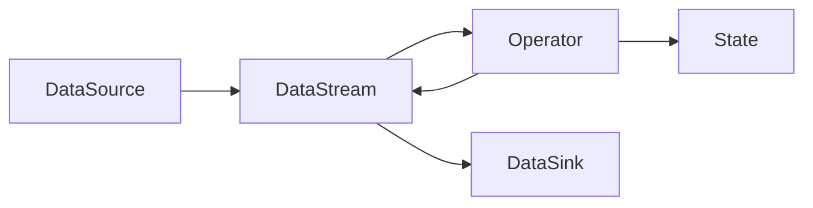

# Flink原理与代码实例讲解

## 1. 背景介绍

### 1.1 大数据处理的挑战
随着数据量的爆炸式增长,传统的批处理模式已经无法满足实时性要求。企业迫切需要一种高效、实时的数据处理方案。

### 1.2 Flink的诞生
Flink是由德国柏林工业大学的研究人员发起的开源项目,旨在解决大规模数据实时计算的问题。它继承了Google DataFlow模型的设计思想,并在此基础上进行了扩展和优化。

### 1.3 Flink的优势
相比Storm、Spark Streaming等流处理框架,Flink具有低延迟、高吞吐、exactly-once语义保证等优势。同时Flink还提供了丰富的API和类库,使得开发者能够快速构建流处理应用。

## 2. 核心概念与联系

### 2.1 DataStream 
DataStream是Flink中的核心抽象,代表了一个连续不断的数据流。数据可以来自消息队列、socket、文件等各种数据源。DataStream上可以进行各种转换操作,如map、filter、join等。

### 2.2 Operator
Operator代表了对DataStream进行的一次转换操作,接收一个或多个DataStream,产生一个新的DataStream。常见的Operator包括:
- Map: 对每个元素做一对一转换 
- FlatMap: 对每个元素做一对多转换
- Filter: 过滤元素
- KeyBy: 按key分组 
- Reduce: 对分组数据进行聚合
- Window: 在有限的时间内收集和聚合数据

### 2.3 State
State是Flink中对中间计算结果的抽象,可以在Operator中声明和使用。Flink提供了多种State类型:
- ValueState: 存储单值
- ListState: 存储列表
- MapState: 存储key-value对
- ReducingState: 存储reduce函数的中间结果
- AggregatingState: 存储自定义聚合函数的中间结果

### 2.4 Time
Flink支持三种时间语义:
- ProcessingTime: 数据被处理的时间
- EventTime: 数据自带的时间戳
- IngestionTime: 数据进入Flink的时间

使用EventTime和Watermark机制,可以在乱序数据流上做窗口计算。

### 2.5 Window
Window将无界数据流切分成有界的桶,在桶上进行计算。Flink支持两种窗口:
- TimeWindow: 按时间划分,如每5秒 
- CountWindow: 按数量划分,如每100个元素

还可以定义滑动窗口(SlidingWindow)和会话窗口(SessionWindow)。

### 2.6 Flink架构
下图展示了Flink的核心架构和各组件间的关系:



## 3. 核心算法原理具体操作步骤

### 3.1 DataFlow模型
Flink的核心是基于DataFlow模型,将计算抽象为一个有向无环图(DAG)。图中的节点代表Operator,边代表数据依赖关系。
具体步骤如下:
1. 定义数据源(SourceFunction)
2. 通过各种转换算子构建DAG
3. 定义数据汇(SinkFunction) 
4. 调用execute提交DAG到集群执行

### 3.2 Window算子内部实现
以TimeWindow为例,具体实现步骤如下:
1. 为每个key维护一个WindowBuffer,缓存元素
2. 当watermark到达时,触发对WindowBuffer中的元素进行计算
3. 计算完成后清空WindowBuffer,等待下一个窗口
4. 将计算结果发送到下游算子

### 3.3 状态后端(State Backend)
状态后端负责管理和存储状态数据,是Flink容错机制的核心。
常见的状态后端有:
- MemoryStateBackend: 存储在TaskManager的内存中,Checkpoint存储在JobManager内存
- FsStateBackend: 存储在TaskManager内存,Checkpoint存储在文件系统如HDFS
- RocksDBStateBackend: 存储在RocksDB数据库中,Checkpoint存储在文件系统

状态后端的核心接口是StateBackend和CheckpointStorage。

## 4. 数学模型和公式详细讲解举例说明

### 4.1 窗口计算中的数学模型
对于一个滑动窗口$w$,假设窗口长度为$l$,滑动步长为$s$,那么第$i$个窗口的起始位置$w_i$为:

$$w_i = i \times s, i \in N$$

窗口中的元素$e_j$满足:

$$w_i \leq e_j.timestamp < w_i + l$$

对窗口中的元素进行聚合计算,得到输出结果$r_i$:

$$r_i=f(e_j),  w_i \leq e_j.timestamp < w_i + l$$

其中$f$为聚合函数,如sum、avg、max等。

### 4.2 Watermark的传播机制
Watermark用于衡量EventTime进展,是一种特殊的元素,包含一个时间戳$t$。
Watermark的传播规则如下:
1. 算子收到Watermark时,更新自己的EventTime clock到$t$
2. 算子完成一个窗口的计算后,向下游发送Watermark $t'=t-l$,其中$l$为窗口长度
3. 对于有多个输入的算子,以多个输入中最小的Watermark为准

例如,某个算子有两个输入,分别收到Watermark $t_1=10$和$t_2=12$,则更新自己的EventTime clock到$min(t_1,t_2)=10$。

## 5. 项目实践：代码实例和详细解释说明

下面通过一个实际的代码例子,演示如何用Flink进行流处理。
需求:统计每5秒内各个sensor的温度数据的平均值。

```scala
object FlinkSensorAvgTemp {
  def main(args: Array[String]): Unit = {
    // 创建执行环境
    val env = StreamExecutionEnvironment.getExecutionEnvironment
    // 设置EventTime语义
    env.setStreamTimeCharacteristic(TimeCharacteristic.EventTime)
    
    // 定义数据源
    val stream = env
      .addSource(new SensorSource)
      .assignTimestampsAndWatermarks(
        new BoundedOutOfOrdernessTimestampExtractor[SensorReading](Time.seconds(1)) {
          override def extractTimestamp(r: SensorReading): Long = r.timestamp
        }
      )
      
    // 定义转换操作  
    val avgTemp = stream
      .map(r => (r.id, r.temperature))
      .keyBy(_._1)
      .timeWindow(Time.seconds(5))
      .reduce((a,b)=>(a._1, (a._2+b._2)/2))
      
    // 定义数据汇  
    avgTemp.print()
    
    // 提交执行
    env.execute()
  }
}
```

代码解释:
1. 创建StreamExecutionEnvironment并指定使用EventTime语义。
2. 调用addSource定义数据源。这里使用了自定义的SensorSource,会随机生成传感器数据。
3. 调用assignTimestampsAndWatermarks抽取数据中的时间戳,并指定Watermark生成策略。这里允许数据有1秒的延迟。
4. 调用map将数据转换成(sensor_id, temperature)的tuple格式。
5. 调用keyBy按sensor_id分组。
6. 调用timeWindow定义5秒的滚动窗口。
7. 调用reduce做聚合计算,输出平均温度。
8. 调用print将结果输出到控制台。
9. 调用execute提交Job。

## 6. 实际应用场景

Flink广泛应用于各个行业的实时数据处理场景,包括:

### 6.1 电商和市场营销
- 实时统计各个品类的销售额、订单量等KPI指标 
- 实时计算每个用户的购物偏好,进行个性化推荐
- 实时检测异常订单,预防刷单行为

### 6.2 物联网
- 实时分析设备传感器数据,监控设备健康状态
- 实时检测异常数据和报警,预防设备故障
- 根据设备数据优化能源分配,提高能源利用效率

### 6.3 物流运输
- 实时跟踪货物运输轨迹,优化调度
- 实时预测货物到达时间,提高配送效率
- 实时监控运输过程质量,如温度、湿度等

### 6.4 金融
- 实时检测异常交易,预防金融欺诈 
- 实时计算各类金融风险指标
- 实时分析用户交易行为,优化金融产品

## 7. 工具和资源推荐

### 7.1 Flink官方文档
- 快速入门指南: https://ci.apache.org/projects/flink/flink-docs-stable/getting-started/
- DataStream API文档: https://ci.apache.org/projects/flink/flink-docs-stable/dev/datastream_api.html
- 状态与容错: https://ci.apache.org/projects/flink/flink-docs-stable/dev/stream/state/

### 7.2 书籍
- 《Stream Processing with Apache Flink》by Fabian Hueske, Vasiliki Kalavri
- 《Streaming Systems》 by Tyler Akidau, Slava Chernyak, Reuven Lax

### 7.3 在线课程
- Coursera: Apache Flink: https://www.coursera.org/learn/apache-flink
- Udemy: Apache Flink Course - Hands On Java Stream Processing!: https://www.udemy.com/course/apache-flink-course-hands-on-java-stream-processing/

### 7.4 博客与论坛
- Flink官方博客: https://flink.apache.org/blog/
- Ververica博客: https://www.ververica.com/blog
- Apache Flink Meetup: https://www.meetup.com/topics/apache-flink/

## 8. 总结：未来发展趋势与挑战

### 8.1 流批一体化
未来Flink会进一步打通流处理和批处理,提供统一的API,简化开发。DataStream和DataSet的边界会逐渐模糊。

### 8.2 SQL on Stream
Flink已经支持了流上的SQL,未来这一功能会更加完善,极大降低流处理应用的开发门槛。

### 8.3 机器学习
Flink社区已经开始探索在流上做机器学习的可能性,相关的类库如FlinkML正在开发中。将ML和流处理结合,可以实现实时的模型训练和预测。

### 8.4 挑战
- 流处理的exactly-once语义保证仍然是一个挑战,如何在保证一致性的同时提高性能。
- 大状态的高效存储与访问。如何存储大规模状态,并保证快速的读写。
- 流上的迭代算法。如何在无界流上实现迭代算法,如机器学习、图计算等。

## 9. 附录：常见问题与解答

### 9.1 Flink与Spark Streaming的区别?
- Flink是纯流式处理,Spark Streaming是微批处理,Flink延迟更低。
- Flink支持更多的状态类型,状态存储更加高效。
- Flink支持EventTime和Watermark,Spark只支持ProcessingTime。

### 9.2 Flink状态存储在哪里?如何保证状态不丢失?
Flink状态存储在状态后端,常见的有MemoryStateBackend、FsStateBackend、RocksDBStateBackend。
通过周期性的Checkpoint机制将状态持久化,保证状态不丢失。Checkpoint时会暂停处理,对状态做快照。

### 9.3 Flink如何处理反压问题?
Flink通过跟踪每个算子的消费速率,动态调整产生速率来处理反压。
如果下游算子消费变慢,Flink会通知上游算子降低发送速率。
还可以通过Buffer缓存元素,平滑速率差异。

### 9.4 Flink窗口是否支持自定义Trigger?
Flink内置了常用的窗口Trigger,如EventTimeTrigger、ProcessingTimeTrigger、CountTrigger等。
同时也支持自定义Trigger,实现Trigger接口即可。
例如可以自定义一个PunctuatedTrigger,根据数据的某个字段来触发窗口计算。

作者：禅与计算机程序设计艺术 / Zen and the Art of Computer Programming