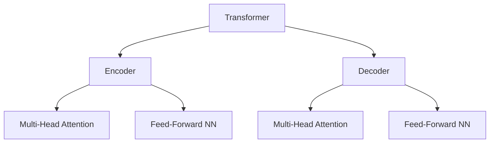

# GPT原理与代码实战案例讲解

## 1.背景介绍

在过去几年中,自然语言处理(NLP)领域取得了长足的进步,其中一个重大突破是Transformer模型的出现。Transformer是一种基于注意力机制的序列到序列模型,它克服了传统序列模型的一些缺陷,展现出卓越的性能。而GPT(Generative Pre-trained Transformer)则是Transformer在生成式任务上的一个具有里程碑意义的应用。

GPT是一种基于Transformer的大型语言模型,由OpenAI于2018年提出。它在大规模无标记语料库上进行预训练,学习文本的统计规律,掌握语言的内在知识。预训练后的GPT可以在下游任务上进行微调,广泛应用于文本生成、机器翻译、问答系统等各种NLP任务。GPT的出现极大推动了NLP技术的发展,也为后续更加先进的模型如GPT-2、GPT-3等奠定了基础。

## 2.核心概念与联系

### 2.1 Transformer架构

Transformer是GPT的核心架构,它完全基于注意力机制,摒弃了RNN和CNN等传统结构。Transformer由编码器(Encoder)和解码器(Decoder)组成,两者都采用多头自注意力(Multi-Head Attention)和前馈神经网络(Feed-Forward Neural Network)堆叠而成。



### 2.2 自注意力机制

自注意力机制是Transformer的核心,它能够捕捉输入序列中任意两个位置之间的依赖关系。对于给定的查询(Query)向量,自注意力通过计算其与所有键(Key)向量的相似性,从而确定值(Value)向量的权重分布,最终得到加权求和的注意力表示。

$$\mathrm{Attention}(Q, K, V) = \mathrm{softmax}\left(\frac{QK^T}{\sqrt{d_k}}\right)V$$

其中$Q$、$K$、$V$分别对应查询、键和值。

### 2.3 掩码自注意力

在解码器中,由于需要预测下一个单词,因此必须防止注意力计算时利用了后续位置的信息。这就需要引入掩码自注意力,在计算注意力权重时,将来自被掩码位置的值设为负无穷,从而不会对注意力权重产生影响。

### 2.4 位置编码

由于Transformer没有循环或卷积结构,因此需要一些额外的信息来提供序列的位置信息。位置编码就是对序列中每个位置的嵌入向量添加一个相对论的位置向量,使得模型能够区分不同位置。

## 3.核心算法原理具体操作步骤

GPT的核心算法原理可以概括为以下几个步骤:

1. **数据预处理**:将原始文本数据转换为模型可以接受的形式,包括分词、构建词表、填充等。

2. **词嵌入**:将每个词映射为一个固定长度的向量表示,作为模型的输入。

3. **位置编码**:为每个位置添加相对论位置向量,为序列赋予位置信息。

4. **编码器**:输入序列通过多层编码器,在每一层进行多头自注意力计算和前馈神经网络变换,得到上下文表示。

5. **掩码自注意力(仅解码器)**:在解码器中,对未来位置的信息进行掩码,防止模型利用这些信息进行预测。

6. **输出层**:将最后一层的上下文表示输入到一个线性层和Softmax层,得到下一个单词的概率分布预测。

7. **训练**:基于最大似然估计,最小化预测的交叉熵损失,通过反向传播算法更新模型参数。

8. **生成**:给定起始标记,基于贪婪搜索或其他解码策略,自回归地生成新的文本序列。

## 4.数学模型和公式详细讲解举例说明

### 4.1 注意力计算

注意力机制是Transformer的核心,我们来详细分析其数学原理。给定查询$Q$、键$K$和值$V$,注意力计算公式为:

$$\mathrm{Attention}(Q, K, V) = \mathrm{softmax}\left(\frac{QK^T}{\sqrt{d_k}}\right)V$$

首先计算查询$Q$与所有键$K$的点积得分,并除以$\sqrt{d_k}$进行缩放,其中$d_k$为键的维度。这一步是为了防止点积过大导致Softmax的梯度较小。

$$\begin{aligned}
\text{scores} &= \frac{QK^T}{\sqrt{d_k}} \\
&= \begin{bmatrix}
    q_1 \cdot k_1^T & q_1 \cdot k_2^T & \cdots & q_1 \cdot k_n^T \\
    q_2 \cdot k_1^T & q_2 \cdot k_2^T & \cdots & q_2 \cdot k_n^T \\
    \vdots & \vdots & \ddots & \vdots \\
    q_m \cdot k_1^T & q_m \cdot k_2^T & \cdots & q_m \cdot k_n^T
\end{bmatrix}
\end{aligned}$$

然后对得分进行Softmax操作,得到注意力权重:

$$\mathrm{attention\_weights} = \mathrm{softmax}(\text{scores})$$

最后将注意力权重与值$V$相乘,得到加权和的注意力表示:

$$\mathrm{attn\_output} = \mathrm{attention\_weights} \cdot V$$

以上就是基本的注意力计算过程。在实际应用中,我们会对多个注意力头的结果进行拼接,形成多头注意力表示。

### 4.2 位置编码

位置编码为序列的每个位置赋予一个位置向量,使模型能够区分不同位置。位置编码向量由正弦和余弦函数构成:

$$\begin{aligned}
\mathrm{PE}_{(pos, 2i)} &= \sin\left(pos / 10000^{2i / d_{\mathrm{model}}}\right) \\
\mathrm{PE}_{(pos, 2i+1)} &= \cos\left(pos / 10000^{2i / d_{\mathrm{model}}}\right)
\end{aligned}$$

其中$pos$是位置索引,而$i$是维度索引。这种设计使得对于特定的偏移量,位置编码在对应的维度上会给出一个周期性的值。

### 4.3 交叉熵损失

GPT的训练目标是最大化语言模型的对数似然,等价于最小化交叉熵损失。给定输入序列$X=(x_1, x_2, \ldots, x_n)$和目标序列$Y=(y_1, y_2, \ldots, y_n)$,交叉熵损失为:

$$\mathcal{L}(\theta) = -\frac{1}{n}\sum_{t=1}^n \log P(y_t|X, y_{<t}; \theta)$$

其中$\theta$为模型参数,而$P(y_t|X, y_{<t}; \theta)$是模型在给定上文$X$和前缀$y_{<t}$的条件下,对下一个词$y_t$的预测概率。

## 5.项目实践:代码实例和详细解释说明

接下来我们通过一个实例,展示如何使用PyTorch实现一个简单的GPT模型。为了方便说明,我们将构建一个小型的GPT模型,用于对一个小型语料库进行文本生成。

### 5.1 导入需要的库

```python
import torch
import torch.nn as nn
import torch.optim as optim
from torch.utils.data import Dataset, DataLoader
```

### 5.2 数据预处理

我们首先需要对原始文本进行预处理,将其转换为模型可接受的形式。

```python
# 读取语料库
with open('data.txt', 'r', encoding='utf-8') as f:
    text = f.read()

# 构建字典
vocab = sorted(set(text))
vocab_size = len(vocab)

# 单词映射为索引
stoi = {s: i for i, s in enumerate(vocab)}
itos = {i: s for s, i in stoi.items()}

# 文本编码
encoded = [stoi[s] for s in text]
```

### 5.3 GPT模型实现

接下来定义GPT模型的核心组件。

```python
class GPTModel(nn.Module):
    def __init__(self, vocab_size, embedding_dim, num_heads, num_layers, dropout=0.1):
        super().__init__()
        self.embedding = nn.Embedding(vocab_size, embedding_dim)
        self.pos_encoding = PositionalEncoding(embedding_dim)
        encoder_layer = nn.TransformerEncoderLayer(d_model=embedding_dim, nhead=num_heads, dropout=dropout)
        self.transformer = nn.TransformerEncoder(encoder_layer, num_layers=num_layers)
        self.fc = nn.Linear(embedding_dim, vocab_size)

    def forward(self, x, mask=None):
        x = self.embedding(x)
        x = self.pos_encoding(x)
        x = self.transformer(x, mask)
        return self.fc(x)
```

这里我们使用PyTorch内置的Transformer编码器层,并添加了词嵌入、位置编码和输出线性层。`PositionalEncoding`是一个自定义的位置编码层,用于为序列添加位置信息。

### 5.4 训练

下面是训练GPT模型的代码。

```python
# 超参数设置
batch_size = 32
num_epochs = 10
learning_rate = 1e-3

# 数据加载
dataset = TextDataset(encoded)
data_loader = DataLoader(dataset, batch_size=batch_size, shuffle=True)

# 模型初始化
model = GPTModel(vocab_size, embedding_dim=256, num_heads=8, num_layers=6)
criterion = nn.CrossEntropyLoss()
optimizer = optim.Adam(model.parameters(), lr=learning_rate)

# 训练循环
for epoch in range(num_epochs):
    for batch in data_loader:
        optimizer.zero_grad()
        outputs = model(batch)
        loss = criterion(outputs.view(-1, vocab_size), batch.view(-1))
        loss.backward()
        optimizer.step()
    print(f'Epoch {epoch+1}, Loss: {loss.item():.4f}')
```

我们使用交叉熵损失函数和Adam优化器进行训练。在每个epoch中,我们遍历数据加载器,获取一个批次的输入,计算模型输出和损失,然后通过反向传播更新模型参数。

### 5.5 文本生成

最后,我们可以使用训练好的模型生成新的文本。

```python
# 给定起始标记
start_token = stoi['<start>']
input_ids = torch.LongTensor([start_token])

# 自回归生成
for _ in range(100):
    outputs = model(input_ids)
    last_output = outputs[:, -1, :]
    next_token = torch.multinomial(torch.softmax(last_output, dim=-1), num_samples=1)
    input_ids = torch.cat([input_ids, next_token], dim=0)

# 解码输出
generated_text = ''.join([itos[token] for token in input_ids])
print(generated_text)
```

我们首先给定一个起始标记,然后自回归地生成新的单词。在每一步,我们将当前输入传入模型,获取最后一个位置的输出概率分布,并从中采样得到下一个单词。重复这个过程,直到生成足够长的序列。最后,我们将生成的单词索引解码为文本。

通过这个实例,你应该对GPT模型的实现有了一定的了解。当然,在实际应用中,GPT模型会更加复杂和强大,但其核心思想是相似的。

## 6.实际应用场景

GPT及其变体模型在自然语言处理领域有着广泛的应用,包括但不限于:

1. **文本生成**: GPT可以生成连贯、流畅的文本内容,如新闻报道、小说、诗歌等。

2. **机器翻译**: 将GPT应用于序列到序列的机器翻译任务,可以获得优秀的翻译质量。

3. **问答系统**: 基于GPT的问答模型能够理解自然语言的问题,并生成相关的答复。

4. **文本摘要**: GPT可以对长文本进行摘要,提取关键信息。

5. **代码生成**: 一些研究尝试使用GPT生成编程代码,辅助程序员开发。

6. **对话系统**: GPT的强大语言生成能力使其可以用于构建对话代理、聊天机器人等应用。

7. **文本增强**: 通过GPT生成相似的文本数据,扩充现有的数据集,提高模型的泛化能力。

8. **情感分析**: 利用GPT生