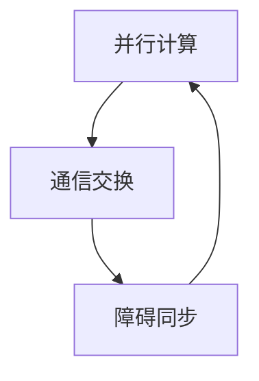
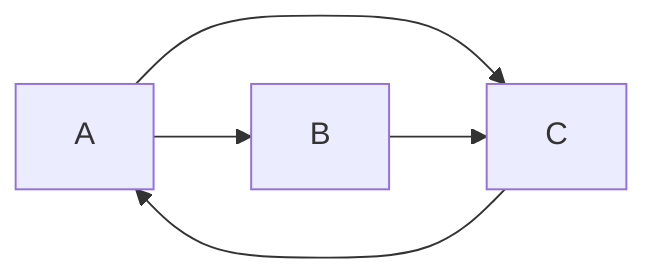

# Giraph原理与代码实例讲解

## 1.背景介绍

### 1.1 大数据时代的到来

随着互联网、物联网和云计算的快速发展,海量的数据正以前所未有的规模和速度不断产生。这些大数据蕴含着巨大的商业价值,但传统的数据处理方式已经无法满足对大数据的处理需求。因此,全新的大数据处理技术应运而生。

### 1.2 大数据处理的挑战

大数据处理面临着诸多挑战,例如:

- 数据规模巨大
- 数据种类繁多
- 数据生成速度快
- 数据分布广泛

传统的集中式计算架构无法应对这些挑战,因此分布式计算框架应运而生。

### 1.3 MapReduce与Hadoop

Google提出的MapReduce编程模型为大数据处理提供了一种全新的思路。基于MapReduce模型,Apache Hadoop项目构建了一个可靠、可扩展、分布式的大数据处理平台,成为大数据处理的事实标准。

### 1.4 图计算的重要性

然而,Hadoop MapReduce主要面向大规模数据集的批处理,对于图计算等迭代运算并不是很高效。而图计算在诸多领域都有着广泛的应用,例如社交网络分析、网页排名、推荐系统等。因此,一种专门的大规模图计算框架就显得尤为重要。

## 2.核心概念与联系

### 2.1 图及其数据结构表示

图(Graph)是一种重要的数据结构,由顶点(Vertex)和边(Edge)组成。图可以用邻接矩阵或邻接表等数据结构来表示。

在大规模图计算中,通常采用压缩的邻接表(Compressed Sparse Row)来表示图结构,以节省存储空间。

### 2.2 图计算的思想

图计算的核心思想是,将图中的顶点视为数据,将边视为顶点之间的关系。通过在图上进行并行迭代计算,可以得到每个顶点的最终计算结果。

常见的图计算算法包括:

- 页面排名算法(PageRank)
- 最短路径算法
- 连通分量算法
- 三角形计数算法等

### 2.3 Giraph简介

Apache Giraph是一个可伸缩的、容错的大规模图处理系统,它基于Hadoop的HDFS和MapReduce框架构建。Giraph支持图计算的BSP(Bulk Synchronous Parallel)模型,可以高效地进行大规模图计算。

Giraph的核心思想是将图分片存储在不同的计算节点上,然后通过消息传递的方式进行并行计算。每个计算节点负责处理一部分图数据,并与其他节点交换消息以协调计算。

### 2.4 Giraph与Hadoop的关系

Giraph依赖于Hadoop的HDFS和MapReduce框架。HDFS用于存储图数据,MapReduce用于启动和管理Giraph作业。

Giraph作业的执行过程包括:

1. 将图数据加载到HDFS
2. 启动MapReduce作业
3. 使用Giraph进行图计算
4. 将计算结果存储到HDFS

## 3.核心算法原理具体操作步骤

### 3.1 BSP(Bulk Synchronous Parallel)模型

Giraph采用BSP模型进行图计算,BSP模型包含三个并行执行的过程:

1. 并行计算
2. 通信交换
3. 障碍同步

BSP模型的执行过程如下:



1. 并行计算阶段,每个计算节点独立处理本地数据,生成消息传递给其他节点。
2. 通信交换阶段,节点之间交换消息。
3. 障碍同步阶段,等待所有节点完成计算和通信,进入下一轮迭代。

### 3.2 顶点并行计算

在Giraph中,每个顶点都是一个独立的计算单元,包含以下几个核心组件:

- `Vertex`接口: 定义顶点的计算逻辑
- `VertexInputFormat`接口: 定义图数据的输入格式
- `VertexOutputFormat`接口: 定义计算结果的输出格式

用户需要实现这些接口,定义顶点的计算逻辑和数据格式。

### 3.3 消息传递和聚合

在BSP模型中,顶点之间通过消息传递进行通信。Giraph提供了以下组件支持消息传递:

- `MessageBytesEncoder`接口: 定义消息的序列化方式
- `MessageAggregator`接口: 定义消息聚合的逻辑

消息聚合可以减少网络通信量,提高计算效率。

### 3.4 分片和容错

为了支持大规模图计算,Giraph将图数据划分为多个分片(Partition),每个分片由一个计算节点负责处理。

Giraph采用了容错机制,可以在计算节点发生故障时自动恢复计算。恢复机制包括:

1. 检查点(Checkpoint): 定期保存计算状态
2. 故障恢复: 从最近的检查点恢复计算

## 4.数学模型和公式详细讲解举例说明

### 4.1 PageRank算法

PageRank是一种著名的网页排名算法,它基于网页之间的链接关系,计算每个网页的重要性权重。PageRank算法可以用于搜索引擎的网页排名、社交网络分析等领域。

PageRank算法的核心思想是,一个网页的重要性取决于指向它的网页的重要性和数量。具体来说,PageRank算法定义了一个网页 $p$ 的重要性权重 $PR(p)$ 如下:

$$PR(p) = (1-d) + d \sum_{q \in M(p)} \frac{PR(q)}{L(q)}$$

其中:

- $d$ 是一个阻尼系数,通常取值 $0.85$
- $M(p)$ 是指向网页 $p$ 的所有网页集合
- $L(q)$ 是网页 $q$ 的出链接数量
- $(1-d)$ 是随机浏览因子,保证了每个网页的初始权重不为 $0$

PageRank算法通过迭代计算,直到网页的权重收敛。在每一轮迭代中,每个网页的新权重是根据上一轮迭代计算出的其他网页的权重计算得到的。

以一个简单的网页链接图为例:



假设初始时,每个网页的权重都是 $1/3$,阻尼系数 $d=0.85$,则第一轮迭代后,每个网页的新权重为:

$$\begin{aligned}
PR(A) &= (1-0.85) + 0.85 \times \frac{1/3}{1} = 0.285 \\
PR(B) &= (1-0.85) + 0.85 \times 0 = 0.15 \\
PR(C) &= (1-0.85) + 0.85 \times (\frac{1/3}{2} + \frac{1/3}{1}) = 0.365
\end{aligned}$$

通过多轮迭代,网页的权重会逐渐收敛到一个稳定值。

### 4.2 最短路径算法

在图计算中,求解最短路径是一个常见的问题,例如在导航系统中寻找两点之间的最短路径。常见的最短路径算法包括Dijkstra算法和Floyd算法等。

以Dijkstra算法为例,它用于计算单源最短路径。算法的基本思想是,从源顶点开始,每次选取一个距离源顶点最近的顶点,更新其他顶点到源顶点的距离。

设 $G=(V,E)$ 是一个加权无向图,其中 $V$ 是顶点集合, $E$ 是边集合,边的权重为 $w(u,v)$。我们定义 $dist(s,v)$ 为源顶点 $s$ 到顶点 $v$ 的最短路径长度。

Dijkstra算法的伪代码如下:

```
function Dijkstra(G, s):
    for each vertex v in G:
        dist(s,v) = infinity
    dist(s,s) = 0

    Q = V  // 未访问的顶点集合

    while Q is not empty:
        u = vertex in Q with min dist(s,u)
        Q = Q - {u}

        for each neighbor v of u:
            alt = dist(s,u) + w(u,v)
            if alt < dist(s,v):
                dist(s,v) = alt

    return dist
```

算法的时间复杂度为 $O((|V|+|E|)\log|V|)$,其中 $|V|$ 和 $|E|$ 分别表示顶点数和边数。

在Giraph中实现Dijkstra算法的关键步骤包括:

1. 将图数据加载到HDFS
2. 定义顶点计算逻辑,实现`Vertex`接口
3. 定义消息传递和聚合逻辑
4. 运行Giraph作业,获取最终结果

## 5.项目实践: 代码实例和详细解释说明

在本节中,我们将通过一个实际的代码示例,演示如何使用Giraph进行PageRank算法的计算。

### 5.1 准备工作

首先,我们需要准备一个示例图数据集。这里我们使用一个简单的网页链接图,包含6个网页和8条链接,保存在HDFS上的`/user/giraph/input/graph.txt`文件中:

```
1   2,3
2   3
3   1,4
4   5,6
5   
6
```

每一行表示一个网页及其出链接,用空格分隔。

### 5.2 定义顶点计算逻辑

我们需要实现`Vertex`接口,定义顶点的计算逻辑。以下是一个简单的PageRank实现:

```java
public class PageRankVertex extends BasicVertex<LongWritable, DoubleWritable, DoubleWritable, DoubleWritable> {

    private double pageRank = 1.0;  // 初始PageRank值
    private static final double DAMPING_FACTOR = 0.85;  // 阻尼系数

    @Override
    public void compute(Iterable<DoubleWritable> messages) {
        double sum = 0;
        for (DoubleWritable message : messages) {
            sum += message.get();
        }

        pageRank = DAMPING_FACTOR * sum + (1 - DAMPING_FACTOR) / getTotalNumVertices();

        if (getSuperstep() < MAX_ITERATIONS) {
            double messageToBeSent = pageRank / getTotalNumOutEdges();
            sendMessageToAllEdges(new DoubleWritable(messageToBeSent));
        } else {
            voteToHalt();  // 迭代结束
        }
    }
}
```

这个实现遵循PageRank算法的计算公式,在每一轮迭代中更新每个顶点的PageRank值,并将新的PageRank值发送给所有出边。

### 5.3 定义数据格式

我们需要定义图数据的输入格式和计算结果的输出格式。以下是一个简单的实现:

```java
public static class PageRankVertexInputFormat extends
        TextVertexInputFormat<LongWritable, DoubleWritable, DoubleWritable> {
    @Override
    public TextVertexReader getVertexReader(InputSplit split, TaskAttemptContext context) {
        return new PageRankVertexReader();
    }
}

public static class PageRankVertexReader extends TextVertexReaderFromEachLineProcessed<LongWritable, DoubleWritable, DoubleWritable> {
    @Override
    protected LongWritable getId(Text line) {
        String[] tokens = line.toString().trim().split("\\s+");
        return new LongWritable(Long.parseLong(tokens[0]));
    }

    @Override
    protected DoubleWritable getValue(Text line) {
        return new DoubleWritable(1.0);  // 初始PageRank值为1.0
    }

    @Override
    protected Iterable<DoubleWritable> getEdges(Text line) {
        String[] tokens = line.toString().trim().split("\\s+");
        List<DoubleWritable> edges = new ArrayList<>();
        for (int i = 1; i < tokens.length; i++) {
            edges.add(new DoubleWritable(Double.parseDouble(tokens[i])));
        }
        return edges;
    }
}
```

这个实现将输入数据解析为顶点ID、初始PageRank值和出边列表。

### 5.4 运行Giraph作业

最后,我们需要编写一个主程序,将上述组件组合起来,运行Giraph作业。

```java
public class PageRankApp {
    public static void main(String[] args) throws Exception {
        String inputPath = args[0];
        String outputPath = args[1];
        int numWorkers = Integer.parseInt(args[2]);
        int numIterations = Integer.parseInt(args[3]);

        GiraphJob job = new Giraph