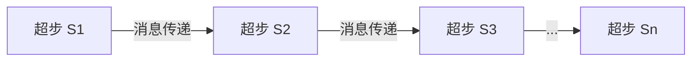

# Giraph图计算框架原理与代码实例讲解

## 1. 背景介绍
在大数据时代，图数据结构因其能够有效表达复杂关系而变得越来越重要。社交网络、推荐系统、网络分析等领域都需要处理大规模图数据。Apache Giraph是一个高度可扩展的图处理框架，它基于Google的Pregel模型构建，专为大规模图数据设计。Giraph允许用户以分布式的方式执行复杂的图分析任务，它与Hadoop紧密集成，能够处理包含数十亿个顶点和边的图。

## 2. 核心概念与联系
Giraph的核心概念包括顶点、边、消息以及超步（Superstep）。每个顶点都可以发送、接收消息，并且能够在每个超步中修改自身和其邻居的状态。Giraph的计算模型是迭代的，每次迭代称为一个超步，在每个超步中，顶点之间通过消息传递来交换信息。



## 3. 核心算法原理具体操作步骤
Giraph的核心算法原理基于Pregel模型，操作步骤如下：
1. 初始化：加载图数据，每个顶点设置初始值。
2. 超步迭代：在每个超步中，顶点执行用户定义的计算函数，处理接收到的消息，并发送消息给其他顶点。
3. 同步：在超步之间，系统同步所有顶点的状态。
4. 终止条件：当所有顶点投票停止计算或达到预设的超步数时，算法终止。

## 4. 数学模型和公式详细讲解举例说明
Giraph的数学模型可以用以下公式表示：
$$
V_{t+1} = F(V_t, M_t)
$$
其中，$V_t$ 是在超步 $t$ 的顶点状态，$M_t$ 是在超步 $t$ 接收到的消息集合，$F$ 是用户定义的计算函数，$V_{t+1}$ 是下一个超步的顶点状态。

## 5. 项目实践：代码实例和详细解释说明
以PageRank算法为例，Giraph中的实现如下：

```java
public class SimplePageRankVertex extends BasicComputation<
    LongWritable, DoubleWritable, FloatWritable, DoubleWritable> {

  @Override
  public void compute(
      Vertex<LongWritable, DoubleWritable, FloatWritable> vertex,
      Iterable<DoubleWritable> messages) {
    if (getSuperstep() >= 1) {
      double sum = 0;
      for (DoubleWritable message : messages) {
        sum += message.get();
      }
      DoubleWritable vertexValue = new DoubleWritable((0.15f / getTotalNumVertices()) + 0.85f * sum);
      vertex.setValue(vertexValue);
    }

    if (getSuperstep() < 30) {
      long edges = vertex.getNumEdges();
      sendMessages(vertex.getEdges(), new DoubleWritable(vertex.getValue().get() / edges));
    } else {
      vertex.voteToHalt();
    }
  }
}
```
在这段代码中，`compute` 方法定义了每个顶点在每个超步中的行为。在第一个超步之后，顶点计算从其邻居接收到的PageRank值的总和，并更新自己的值。如果超步数小于30，顶点将其值除以出边数并发送给邻居。

## 6. 实际应用场景
Giraph被广泛应用于社交网络分析、网络拓扑结构分析、生物信息学以及交通网络优化等领域。例如，Facebook使用Giraph来分析其社交图，优化新闻推送算法。

## 7. 工具和资源推荐
- Apache Giraph官方网站：提供最新版本的Giraph下载和用户文档。
- Hadoop：Giraph的运行依赖于Hadoop集群，了解Hadoop是使用Giraph的前提。
- Maven：用于构建和管理Giraph项目的工具。

## 8. 总结：未来发展趋势与挑战
随着图数据规模的不断扩大，Giraph需要进一步优化其性能和可扩展性。未来的发展趋势可能包括更高效的数据分区策略、更灵活的计算模型以及更好的容错机制。挑战在于如何平衡计算效率和资源消耗，以及如何处理动态变化的图数据。

## 9. 附录：常见问题与解答
Q1: Giraph和Hadoop有什么区别？
A1: Hadoop主要用于批处理大数据，而Giraph是专门为图数据设计的分布式计算框架。

Q2: Giraph如何保证计算的正确性？
A2: Giraph通过同步机制和容错机制来保证计算的正确性。每个超步结束时，所有顶点的状态都会同步，如果计算过程中出现错误，Giraph可以从检查点恢复。

作者：禅与计算机程序设计艺术 / Zen and the Art of Computer Programming