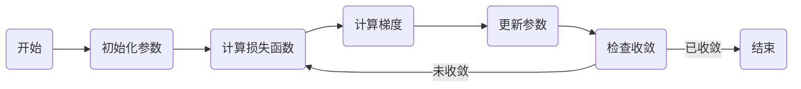

# Gradient Descent 原理与代码实战案例讲解

## 1. 背景介绍

在机器学习和深度学习的世界中，梯度下降（Gradient Descent）是一种基础且极其重要的优化算法。它用于最小化一个函数，即在寻找函数最小值的过程中，梯度下降帮助我们找到能够使损失函数（Loss Function）最小化的参数值。这个过程是许多机器学习模型训练的核心，包括线性回归、逻辑回归和神经网络等。

## 2. 核心概念与联系

### 2.1 梯度（Gradient）
梯度是多变量函数在某一点处的导数向量，指向函数增长最快的方向。

### 2.2 下降（Descent）
下降是指在优化过程中，沿着梯度的反方向——即函数值减小最快的方向进行搜索。

### 2.3 学习率（Learning Rate）
学习率决定了在梯度下降过程中每一步沿梯度反方向前进的距离大小。

### 2.4 损失函数（Loss Function）
损失函数衡量模型预测值与真实值之间的差异，优化的目标是最小化损失函数。

## 3. 核心算法原理具体操作步骤



1. 初始化参数：选择一个初始点作为参数的起始值。
2. 计算损失函数：在当前参数下，计算损失函数的值。
3. 计算梯度：求出损失函数在当前参数下的梯度。
4. 更新参数：根据梯度和学习率调整参数值。
5. 检查收敛：判断算法是否收敛，如果未收敛则返回步骤2继续迭代。

## 4. 数学模型和公式详细讲解举例说明

假设我们有一个损失函数 $L(\theta)$，其中 $\theta$ 是模型参数。梯度下降的更新规则可以表示为：

$$
\theta_{new} = \theta_{old} - \alpha \cdot \nabla_\theta L(\theta_{old})
$$

其中，$\alpha$ 是学习率，$\nabla_\theta L(\theta_{old})$ 是损失函数关于 $\theta$ 的梯度。

## 5. 项目实践：代码实例和详细解释说明

以线性回归为例，我们的目标是找到一条直线，即 $y = wx + b$，使得预测值 $y$ 与实际值尽可能接近。

```python
import numpy as np

# 损失函数
def loss_function(w, b, x, y):
    num_examples = x.shape[0]
    predictions = w * x + b
    return np.sum((predictions - y) ** 2) / (2 * num_examples)

# 梯度计算
def compute_gradient(w, b, x, y):
    num_examples = x.shape[0]
    predictions = w * x + b
    w_gradient = np.sum((predictions - y) * x) / num_examples
    b_gradient = np.sum(predictions - y) / num_examples
    return w_gradient, b_gradient

# 梯度下降
def gradient_descent(x, y, learning_rate=0.01, epochs=100):
    w, b = 0, 0
    for i in range(epochs):
        w_gradient, b_gradient = compute_gradient(w, b, x, y)
        w -= learning_rate * w_gradient
        b -= learning_rate * b_gradient
        if i % 10 == 0:
            print(f"Epoch {i}, Loss: {loss_function(w, b, x, y)}")
    return w, b

# 假设数据
x = np.array([1, 2, 3, 4, 5])
y = np.array([5, 7, 9, 11, 13])

# 执行梯度下降
w, b = gradient_descent(x, y)
print(f"Trained weights: w = {w}, b = {b}")
```

## 6. 实际应用场景

梯度下降在机器学习领域有广泛的应用，如：

- 线性回归模型的参数估计
- 神经网络的权重优化
- 支持向量机中的核参数选择
- 逻辑回归中的特征权重学习

## 7. 工具和资源推荐

- TensorFlow和PyTorch：两个流行的深度学习框架，内置梯度下降优化器。
- Scikit-learn：提供了许多机器学习算法的实现，包括基于梯度下降的模型。
- Coursera和edX：提供机器学习和深度学习的在线课程，涵盖梯度下降等算法。

## 8. 总结：未来发展趋势与挑战

梯度下降作为一种优化算法，在未来仍将是机器学习领域的研究热点。随着问题规模的增大和模型复杂度的提高，如何设计更高效、更稳定的梯度下降变种，以及如何处理局部最小值和鞍点问题，将是未来研究的重点。

## 9. 附录：常见问题与解答

Q1: 如何选择合适的学习率？
A1: 学习率的选择通常需要基于实验调整，可以使用诸如学习率衰减等技术来帮助选择。

Q2: 梯度下降是否总是能找到全局最小值？
A2: 对于凸函数，梯度下降可以保证找到全局最小值。对于非凸函数，梯度下降可能陷入局部最小值或鞍点。

Q3: 什么是批量梯度下降、随机梯度下降和小批量梯度下降？
A3: 批量梯度下降使用所有数据计算梯度，随机梯度下降每次只用一个样本，小批量梯度下降则介于两者之间，每次使用一小批样本。

作者：禅与计算机程序设计艺术 / Zen and the Art of Computer Programming