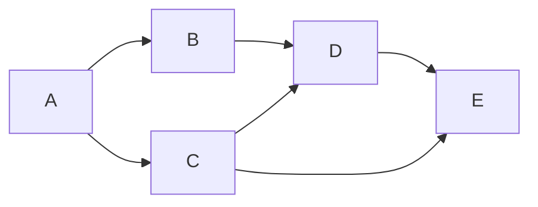
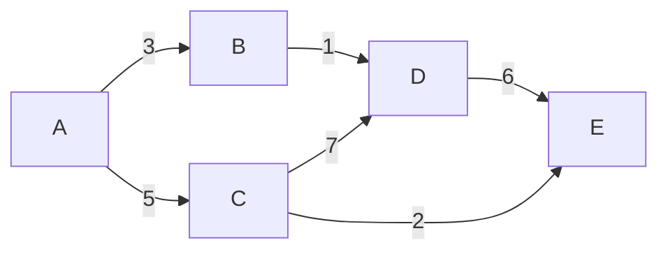

# Graph Shortest Path算法原理与代码实例讲解

## 1.背景介绍

在现实生活中,我们经常会遇到寻找最短路径的问题,比如导航软件寻找最短路径,网络路由选择最优路径等。图论中的最短路径问题就是解决这类问题的重要算法。最短路径算法在操作研究、交通运输、网络路由等诸多领域都有广泛应用。

## 2.核心概念与联系

### 2.1 图的基本概念

**图(Graph)**是由一组顶点(Vertex)和连接这些顶点的边(Edge)组成的数据结构。根据边是否带权值,可分为无权图和有权图。根据边是否有方向,可分为无向图和有向图。

**路径(Path)**是指在图中顶点与顶点之间通过边相连接而形成的一条线。

**环(Cycle)**是指起点和终点相同的路径。

**连通(Connected)**指在无向图中,任意两个顶点之间都存在路径相连。

**强连通(Strongly Connected)**指在有向图中,任意两个顶点之间存在双向路径。

### 2.2 最短路径问题

**最短路径问题**是指在给定的图中,寻找两个顶点之间的最短路径。根据问题的不同,可分为:

- **单源最短路径(Single-Source Shortest Path)**:从一个源顶点出发,寻找到其他所有顶点的最短路径。
- **单目标最短路径(Single-Destination Shortest Path)**:从所有顶点出发,寻找到一个目标顶点的最短路径。
- **所有点对最短路径(All-Pairs Shortest Path)**:寻找任意两个顶点之间的最短路径。

根据图的类型,最短路径问题又可分为:

- **无权最短路径**:在无权图中寻找最短路径,即路径上边的数量最少。
- **有权最短路径**:在有权图中寻找最短路径,即路径上边的权值之和最小。

## 3.核心算法原理具体操作步骤

### 3.1 无权最短路径算法

#### 3.1.1 广度优先搜索(BFS)

广度优先搜索是解决无权最短路径问题的经典算法。从源点出发,按层级遍历顶点,每一层的顶点到源点的路径长度都相等。

**算法步骤**:

1. 创建一个队列,将源点入队
2. 标记源点为已访问
3. 当队列不为空时,从队列中取出一个顶点u
4. 访问u的所有未被访问过的邻接点v,标记v为已访问,并将v入队
5. 重复步骤3和4,直到队列为空

```python
from collections import deque

def bfs(graph, source):
    visited = [False] * len(graph)
    distance = [float('inf')] * len(graph)
    parent = [-1] * len(graph)
    
    queue = deque([source])
    visited[source] = True
    distance[source] = 0
    
    while queue:
        u = queue.popleft()
        for v in graph[u]:
            if not visited[v]:
                visited[v] = True
                distance[v] = distance[u] + 1
                parent[v] = u
                queue.append(v)
    
    return distance, parent
```

时间复杂度为$O(V+E)$,其中$V$为顶点数,$E$为边数。

#### 3.1.2 Dijkstra算法(有权图)

Dijkstra算法是解决有权最短路径问题的经典算法,适用于有向图和无向图,但要求边的权值为非负数。

**算法步骤**:

1. 创建一个优先队列(小顶堆),将源点及其距离(0)入堆
2. 当堆不为空时,取出堆顶元素u及其距离dist[u]
3. 遍历u的所有邻接点v,若dist[u] + weight(u, v) < dist[v],则更新dist[v]和parent[v],并将v及其距离入堆
4. 重复步骤2和3,直到堆为空

```python
import heapq

def dijkstra(graph, source):
    dist = [float('inf')] * len(graph)
    parent = [-1] * len(graph)
    dist[source] = 0
    
    pq = [(0, source)]
    
    while pq:
        d, u = heapq.heappop(pq)
        if d > dist[u]:
            continue
        for v, weight in graph[u]:
            new_dist = d + weight
            if new_dist < dist[v]:
                dist[v] = new_dist
                parent[v] = u
                heapq.heappush(pq, (new_dist, v))
    
    return dist, parent
```

时间复杂度为$O((V+E)\log V)$,其中$V$为顶点数,$E$为边数。

### 3.2 动态规划算法

#### 3.2.1 Floyd-Warshall算法

Floyd-Warshall算法是解决所有点对最短路径问题的经典动态规划算法,适用于有向图和无向图。

**算法思路**:

1. 创建一个$V\times V$的距离矩阵$dist$,其中$dist[i][j]$表示顶点$i$到$j$的最短距离
2. 初始化$dist$矩阵,对于存在边$(i,j)$的顶点对,令$dist[i][j]=weight(i,j)$,否则令$dist[i][j]=\infty$
3. 对于每个中间顶点$k$,更新$dist$矩阵,若存在$dist[i][k]+dist[k][j]<dist[i][j]$,则更新$dist[i][j]=dist[i][k]+dist[k][j]$
4. 最终$dist$矩阵中的$dist[i][j]$即为顶点$i$到$j$的最短距离

```python
def floyd_warshall(graph):
    V = len(graph)
    dist = [[float('inf')] * V for _ in range(V)]
    
    for i in range(V):
        dist[i][i] = 0
        for j in graph[i]:
            dist[i][j[0]] = j[1]
    
    for k in range(V):
        for i in range(V):
            for j in range(V):
                if dist[i][k] != float('inf') and dist[k][j] != float('inf'):
                    dist[i][j] = min(dist[i][j], dist[i][k] + dist[k][j])
    
    return dist
```

时间复杂度为$O(V^3)$,空间复杂度为$O(V^2)$。

#### 3.2.2 Bellman-Ford算法

Bellman-Ford算法是解决单源最短路径问题的动态规划算法,适用于有向图和无向图,可以处理存在负权边的情况。

**算法思路**:

1. 创建一个距离数组$dist$,其中$dist[i]$表示源点到顶点$i$的最短距离,初始化$dist[source]=0$,其他顶点设为$\infty$
2. 进行$V-1$轮松弛操作,对于每条边$(u,v)$,若$dist[u]+weight(u,v)<dist[v]$,则更新$dist[v]=dist[u]+weight(u,v)$
3. 再次进行一轮松弛操作,若存在$dist[u]+weight(u,v)<dist[v]$,则图中存在负权环
4. 最终$dist$数组中的$dist[i]$即为源点到顶点$i$的最短距离

```python
def bellman_ford(graph, source):
    V = len(graph)
    dist = [float('inf')] * V
    dist[source] = 0
    parent = [-1] * V
    
    for _ in range(V - 1):
        for u in range(V):
            for v, weight in graph[u]:
                if dist[u] != float('inf') and dist[u] + weight < dist[v]:
                    dist[v] = dist[u] + weight
                    parent[v] = u
    
    for u in range(V):
        for v, weight in graph[u]:
            if dist[u] != float('inf') and dist[u] + weight < dist[v]:
                return None  # Negative cycle detected
    
    return dist, parent
```

时间复杂度为$O(VE)$,空间复杂度为$O(V)$。

## 4.数学模型和公式详细讲解举例说明

在图论中,最短路径问题可以用数学模型来表示和求解。

### 4.1 无权最短路径数学模型

对于无权图$G=(V,E)$,定义$d(u,v)$为顶点$u$到$v$的最短路径长度。则无权最短路径问题可以表示为:

$$
d(u,v) = \begin{cases}
0, & u=v \\
1+\min\limits_{w\in N(u)}d(w,v), & u\neq v
\end{cases}
$$

其中$N(u)$表示$u$的邻接点集合。

以下是一个无权图的例子,求$d(A,E)$:



根据上述公式,可以得到:

$$
\begin{aligned}
d(A,A) &= 0 \\
d(A,B) &= 1 \\
d(A,C) &= 1 \\
d(B,D) &= 1+\min(d(A,D),d(C,D)) \\
       &= 1+\min(2,1)=2 \\
d(C,E) &= 1 \\
d(D,E) &= 1+\min(d(A,E),d(B,E),d(C,E)) \\
       &= 1+\min(3,3,1)=2 \\
d(A,E) &= 1+\min(d(B,E),d(C,E)) \\
       &= 1+\min(3,1)=2
\end{aligned}
$$

因此,从$A$到$E$的最短路径长度为2。

### 4.2 有权最短路径数学模型

对于有权图$G=(V,E,w)$,其中$w:E\rightarrow\mathbb{R}$是边的权值函数,定义$d(u,v)$为顶点$u$到$v$的最短路径权值之和。则有权最短路径问题可以表示为:

$$
d(u,v) = \begin{cases}
0, & u=v \\
\min\limits_{(u,w)\in E}\{w(u,w)+d(w,v)\}, & u\neq v
\end{cases}
$$

以下是一个有权图的例子,求$d(A,E)$:



根据上述公式,可以得到:

$$
\begin{aligned}
d(A,A) &= 0 \\
d(A,B) &= 3 \\
d(A,C) &= 5 \\
d(B,D) &= 1+d(A,B)=4 \\
d(C,D) &= 7 \\
d(C,E) &= 2 \\
d(D,E) &= 6+\min(d(A,D),d(B,D),d(C,D)) \\
       &= 6+\min(10,4,7)=10 \\
d(A,E) &= \min(d(A,B)+d(B,E),d(A,C)+d(C,E)) \\
       &= \min(3+10,5+2)=7
\end{aligned}
$$

因此,从$A$到$E$的最短路径权值之和为7。

## 5.项目实践：代码实例和详细解释说明

以下是使用Python实现的几种最短路径算法的代码示例,并对关键部分进行了详细注释解释。

### 5.1 无权最短路径算法

#### 5.1.1 广度优先搜索(BFS)

```python
from collections import deque

def bfs(graph, source):
    """
    使用广度优先搜索算法求解无权最短路径问题
    
    Args:
        graph (list): 邻接表表示的图
        source (int): 源点编号
        
    Returns:
        tuple: (distance, parent)
            distance (list): 源点到每个顶点的最短路径长度
            parent (list): 每个顶点在最短路径上的父节点
    """
    
    n = len(graph)
    visited = [False] * n  # 标记顶点是否被访问过
    distance = [float('inf')] * n  # 初始化距离为无穷大
    parent = [-1] * n  # 初始化父节点为-1
    
    queue = deque([source])  # 创建队列,将源点入队
    visited[source] = True  # 标记源点为已访问
    distance[source] = 0  # 源点到自身的距离为0
    
    while queue:
        u = queue.popleft()  # 取出队首元素
        for v in graph[u]:  # 遍历u的邻接点
            if not visited[v]:  # 如果v未被访问过
                visited[v] = True  # 标记v为已访问
                distance[v] = distance[u] + 1  # v到源点的距离为u到源点的距离+1
                parent[v] = u  # u是v在最短路径上的父节点
                queue.