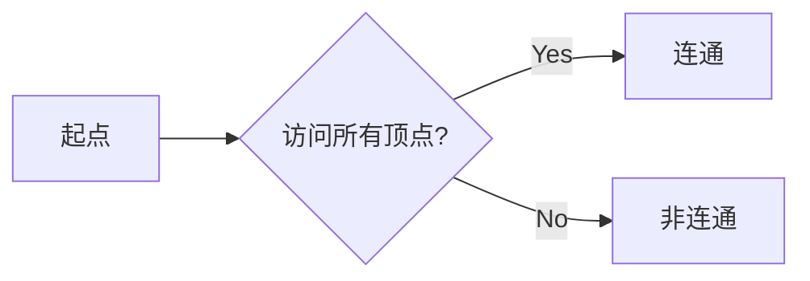

# Graph Traversal图遍历原理与代码实例讲解

## 1.背景介绍
### 1.1 图论基础
图(Graph)是一种非线性数据结构,由一组顶点(Vertex)和一组能够将两个顶点相连的边(Edge)组成。图在计算机科学领域有着广泛的应用,如社交网络分析、路径规划、任务调度等。
### 1.2 图的表示方法
在计算机内存中表示图主要有两种方式:
- 邻接矩阵(Adjacency Matrix):使用二维数组表示顶点之间的连通关系。
- 邻接表(Adjacency List):每个顶点维护一个链表,存储与其相连的顶点。
### 1.3 图遍历简介
图遍历(Graph Traversal)是指按照某种搜索策略,不重复地访问图的所有顶点。图遍历是许多图算法的基础,如最短路径、连通分量等。常见的图遍历算法有:
- 深度优先搜索(Depth-First Search,DFS) 
- 广度优先搜索(Breadth-First Search,BFS)

## 2.核心概念与联系
### 2.1 深度优先搜索 
DFS 是一种利用递归实现的搜索算法。其过程简要来说是对每一个可能的分支路径深入到不能再深入为止,而且每个顶点只能访问一次。
### 2.2 广度优先搜索
BFS 是从根节点开始,沿着树的宽度遍历树的节点。如果所有节点均被访问,则算法中止。BFS 同样属于盲目搜索,无法事先知道从源顶点到目标顶点的路径长度。
### 2.3 两种遍历方式的联系与区别
- 联系:都是对图进行遍历,且都需要辅助数据结构。
- 区别:DFS 使用栈,BFS 使用队列。DFS 适合搜索模型深度较大的图,BFS 适合搜索模型广度较大的图。

## 3.核心算法原理具体操作步骤
### 3.1 深度优先搜索步骤
1. 访问顶点 v,并标记 v 为已访问。 
2. 取 v 的第一个邻接点 w。
3. 若 w 存在,则继续执行; 否则回溯。
4. 若 w 未访问,对 w 进行深度优先遍历递归(即把 w 当做另一个 v,然后进行步骤 123)。 
5. 访问完 w 顶点后,查找 v 的另一个新的邻接点 w,转到步骤3。

### 3.2 广度优先搜索步骤
1. 顶点 v 入队列。
2. 当队列非空时则继续执行,否则算法结束。
3. 出队列取得队头顶点 v;访问顶点 v 并标记为已访问。
4. 查找顶点 v 的第一个邻接点 w。
5. 若顶点 v 的邻接点 w 不存在,则转到步骤3;否则循环执行以下三个步骤:
   - 若顶点 w 尚未被访问,则访问顶点 w 并标记为已访问。  
   - 顶点 w 入队列。
   - 查找顶点 v 的另一个新的邻接点 w,转到步骤5。

## 4.数学模型和公式详细讲解举例说明
图的数学表示可以用二元组 $G=(V,E)$ 表示,其中:
- $V$ 表示顶点的有限非空集合。
- $E$ 表示顶点之间边的集合。

设图 $G=(V,E)$ 表示一个有向图,顶点 $v_i$ 的邻接点定义为 $Adj[v_i]=\{v_j|(v_i,v_j)\in E\}$。

以下是邻接矩阵和邻接表两种表示方法的示例:

邻接矩阵:
$$
A_{i j}=\left\{\begin{array}{ll}
1, & \text { if }(i, j) \in E \\
0, & \text { otherwise }
\end{array}\right.
$$

邻接表:每个顶点 $v_i$ 对应一个链表,其中存储的是顶点 $v_i$ 的所有邻接点。

## 5.项目实践：代码实例和详细解释说明
### 5.1 深度优先搜索
```cpp
vector<vector<int>> adj; // 邻接表表示图 
vector<bool> visited; // 标记每个顶点是否被访问

void dfs(int v) {
    visited[v] = true; // 标记当前顶点 v 为已访问
    for (int u : adj[v]) { // 遍历 v 的邻接点
        if (!visited[u]) { // 如果 u 未被访问
            dfs(u); // 递归访问 u
        }
    }
}
```
上述代码使用邻接表 `adj` 存储图,`visited` 数组标记每个顶点是否被访问过。`dfs` 函数递归遍历图,标记已访问的顶点,避免重复访问。

### 5.2 广度优先搜索
```cpp
vector<vector<int>> adj; // 邻接表表示图
vector<bool> visited; // 标记每个顶点是否被访问
queue<int> q; // BFS 队列

void bfs(int s) {
    visited[s] = true; // 标记起点 s 为已访问
    q.push(s); // 起点入队
    while (!q.empty()) {
        int v = q.front(); // 取队首顶点
        q.pop();
        for (int u : adj[v]) { // 遍历 v 的邻接点
            if (!visited[u]) { // 如果 u 未被访问 
                visited[u] = true; // 标记 u 为已访问
                q.push(u); // u 入队
            }
        }
    }
}
```
上述代码同样使用邻接表 `adj` 存储图,`visited` 数组标记顶点访问状态。`bfs` 函数从起点 `s` 开始,利用队列 `q` 实现 BFS。

## 6.实际应用场景
图遍历在实际中有着广泛的应用,例如:
- 社交网络分析:使用 BFS 发现用户之间的最短路径,挖掘用户的潜在社交关系。
- 网络爬虫:使用 DFS 遍历互联网,抓取网页数据。
- 垃圾回收:在 Java,C# 等语言中,使用 DFS 遍历对象引用图,标记需要回收的内存空间。
- 寻路算法:使用 BFS 在游戏地图中寻找最短路径。
- 模型检测:使用 DFS 遍历状态空间,检测死锁、饥饿等问题。

## 7.工具和资源推荐
- C++ 图算法库:Boost Graph Library(BGL)
- Java 图算法库:JGraphT
- Python 图算法库:NetworkX,graph-tool
- 可视化图分析工具:Gephi,Cytoscape

## 8.总结：未来发展趋势与挑战
图遍历作为图算法的基础,在未来仍将扮演重要角色。随着图数据规模的增长,亟需研究高效的图遍历算法。此外,在分布式环境下执行图遍历面临诸多挑战,如何在保证正确性的同时提高性能,值得进一步探索。

## 9.附录：常见问题与解答
Q:DFS 和 BFS 的时间复杂度?
A:在邻接表表示的图上,DFS 和 BFS 的时间复杂度均为 $O(V+E)$。

Q:DFS 和 BFS 的空间复杂度? 
A:DFS 的空间复杂度为 $O(V)$,即递归工作栈的大小。BFS 的空间复杂度为 $O(V)$,即队列的大小。

Q:如何判断一个图是否连通?
A:对图执行 DFS 或 BFS,若所有顶点都被访问到,则图是连通的;否则是非连通的。



作者：禅与计算机程序设计艺术 / Zen and the Art of Computer Programming