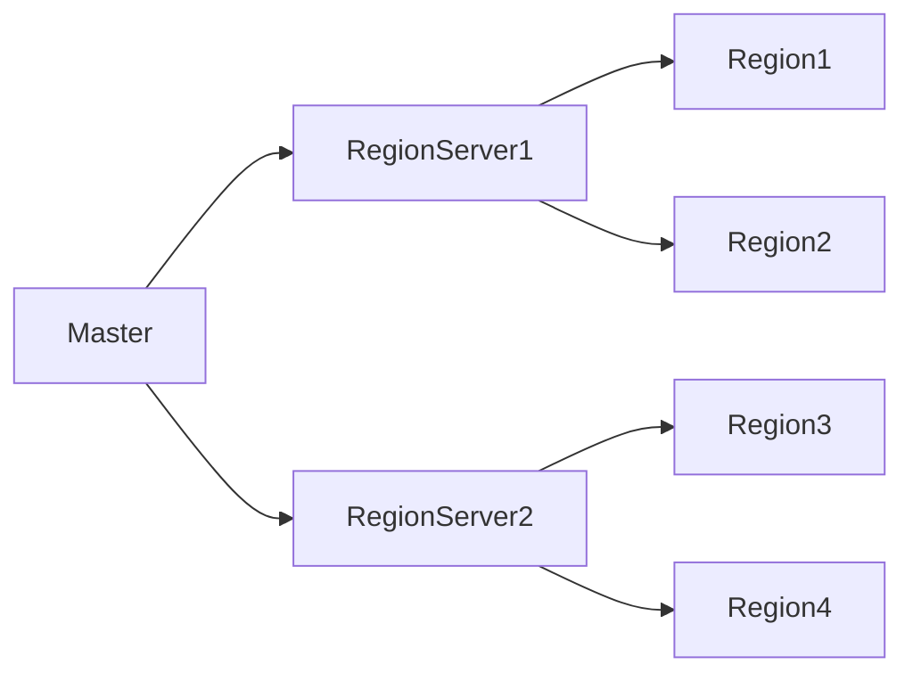

## 1. 背景介绍

HBase是一个开源的、非关系型、分布式数据库，它模仿了Google的Bigtable设计，并且是Apache Hadoop项目的一部分。HBase的主要设计目标是为了在Hadoop文件系统上提供高可靠性、高性能、列式存储、可伸缩的分布式文件系统。HBase是建立在Hadoop HDFS文件系统之上，利用Hadoop MapReduce进行分布式计算，同时也支持Google的Bigtable的数据结构模型。

## 2. 核心概念与联系

HBase的核心概念包括表、行、列族和列。表是数据存储的主要单位，每个表有一个唯一的名称，并且包含多个行。行是由一个行键和多个列组成，列是数据的基本单位，每个列都属于某个列族。列族是物理存储单位，对列进行分组管理。HBase的列式存储结构使得它非常适合于存储稀疏数据。

在HBase中，数据是按照行键进行排序的，这使得它非常适合于进行范围查询。HBase还支持版本控制，可以存储数据的多个版本。

HBase的架构主要包括Master节点和RegionServer节点。Master节点负责管理和协调RegionServer，RegionServer负责处理数据的读写请求。



## 3. 核心算法原理具体操作步骤

HBase的读写操作主要包括Get、Put、Scan和Delete四种操作。

- Get操作：根据行键获取数据，可以指定列族或者列。
- Put操作：向表中添加数据，可以指定行键、列族、列和值。
- Scan操作：扫描表中的数据，可以指定开始行键和结束行键，也可以指定列族或者列。
- Delete操作：删除表中的数据，可以删除行、列或者列的某个版本的数据。

HBase的数据存储采用了LSM（Log-Structured Merge-trees）算法，数据首先写入内存，当内存满了之后，数据会被刷写到硬盘。为了优化读取性能，HBase会对硬盘上的数据进行合并和压缩。

## 4. 数学模型和公式详细讲解举例说明

HBase的数据模型可以用一个四维矩阵来表示，四个维度分别是行键、列族、列和时间戳。其中，时间戳用于实现数据的版本控制。

假设我们有一个HBase表，表中有n行，每行有m个列族，每个列族有k个列，每个列有t个版本，那么这个表可以表示为一个四维矩阵$M_{n\times m\times k\times t}$。

## 5. 项目实践：代码实例和详细解释说明

下面我们通过一个简单的例子来演示如何使用HBase的Java API进行数据的读写操作。

首先，我们需要创建一个HBase的配置对象，并且指定HBase的Master地址：

```java
Configuration conf = HBaseConfiguration.create();
conf.set("hbase.master", "localhost:60000");
```

然后，我们创建一个HBase的连接对象，并且获取表的操作对象：

```java
Connection conn = ConnectionFactory.createConnection(conf);
Table table = conn.getTable(TableName.valueOf("test"));
```

接着，我们可以使用Put对象向表中添加数据：

```java
Put put = new Put(Bytes.toBytes("row1"));
put.addColumn(Bytes.toBytes("cf1"), Bytes.toBytes("col1"), Bytes.toBytes("value1"));
table.put(put);
```

最后，我们可以使用Get对象从表中获取数据：

```java
Get get = new Get(Bytes.toBytes("row1"));
Result result = table.get(get);
byte[] value = result.getValue(Bytes.toBytes("cf1"), Bytes.toBytes("col1"));
System.out.println(Bytes.toString(value));
```

## 6. 实际应用场景

HBase因其高可靠性、高性能和可伸缩性，被广泛应用于大数据处理领域。例如，Facebook使用HBase存储用户的消息数据；雅虎使用HBase进行搜索引擎的数据分析；Twitter使用HBase存储用户的时间线数据。

## 7. 工具和资源推荐

- HBase官方网站：提供了详细的文档和教程。
- HBase: The Definitive Guide：这是一本详细介绍HBase的书籍，适合初学者阅读。
- HBase in Action：这是一本实战性质的书籍，通过实例讲解了如何使用HBase。

## 8. 总结：未来发展趋势与挑战

HBase作为一个成熟的分布式数据库，已经在大数据处理领域得到了广泛的应用。然而，HBase也面临着一些挑战，例如如何提高数据的写入性能，如何优化数据的存储结构，如何提高系统的可用性等。未来，HBase需要在这些方面进行更深入的研究和改进。

## 9. 附录：常见问题与解答

Q: HBase和传统的关系型数据库有什么区别？

A: HBase是一个非关系型的、列式的、分布式的数据库，它支持大规模的数据存储和处理，而传统的关系型数据库主要适合于小规模的、结构化的数据存储和处理。

Q: HBase如何保证数据的一致性？

A: HBase使用了ZooKeeper来保证系统的一致性，当系统发生故障时，ZooKeeper可以自动进行故障转移。

Q: HBase如何提高查询性能？

A: HBase的数据是按照行键进行排序存储的，这使得它非常适合于进行范围查询。同时，HBase还使用了Bloom filter和Block cache来提高查询性能。

作者：禅与计算机程序设计艺术 / Zen and the Art of Computer Programming
