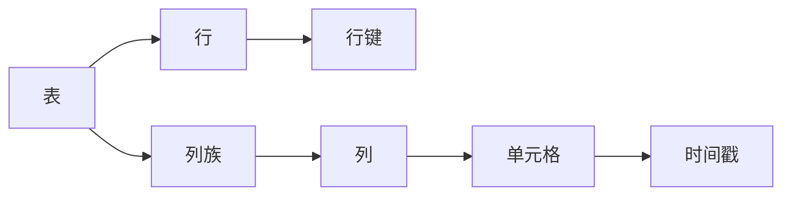

## 1.背景介绍

在大数据时代，我们面临着海量数据的处理和存储问题。为了解决这个问题，我们需要一种能够高效处理大规模数据的数据库系统。HBase正是这样一种数据库，它是Google BigTable的开源实现，属于Hadoop生态系统中的一部分，能够提供海量数据的存储和随机访问。

HBase是一种列式存储的数据库，这意味着它会将同一列的数据存储在一起，从而优化读取性能。这种存储方式与传统的行式存储数据库（如MySQL）有很大的不同。在本文中，我们将深入探讨HBase的原理，包括其数据模型、架构和核心算法，以及如何在实际项目中使用HBase。

## 2.核心概念与联系

在我们深入研究HBase的工作原理之前，首先需要了解一些核心的概念：

- **表（Table）**：HBase中的数据是以表的形式存储的，每个表都由行（Row）和列（Column）组成。
- **行键（Row Key）**：每一行数据都有一个唯一的标识，称为行键。HBase通过行键来定位数据。
- **列族（Column Family）**：在HBase中，列被组织成列族。每个列族内的数据都会被一起存储。
- **时间戳（Timestamp）**：HBase中的每个单元格都会包含多个版本的数据，每个版本都有一个时间戳来标识。

这些概念之间的关系可以用下面的Mermaid流程图来表示：



## 3.核心算法原理具体操作步骤

HBase的核心算法主要包括数据存储和数据读取两部分。

### 3.1 数据存储

HBase的数据存储过程可以分为以下几个步骤：

1. 当数据被写入HBase时，首先会被写入内存中的MemStore。
2. 当MemStore的数据量达到一定阈值时，数据会被刷写（Flush）到硬盘上，形成一个新的HFile。
3. HBase会定期进行Compaction操作，合并小的HFile，删除过期的版本和已经被删除的数据。

### 3.2 数据读取

HBase的数据读取过程可以分为以下几个步骤：

1. 当我们对HBase进行查询时，HBase首先会检查MemStore中是否有我们需要的数据。
2. 如果MemStore中没有我们需要的数据，HBase会检查BlockCache，看是否有之前读取过的数据块。
3. 如果BlockCache中也没有我们需要的数据，HBase会从硬盘上的HFile中读取数据。

## 4.数学模型和公式详细讲解举例说明

在HBase中，数据的存储和读取都是通过Hash算法进行的。Hash算法可以将任意长度的输入（在这里是行键）通过散列算法变换成固定长度的输出。在HBase中，这个输出就是数据的存储位置。

假设我们有一个Hash函数H，行键K，那么数据的存储位置就可以表示为：

$$
P = H(K)
$$

其中P是数据的存储位置。

当我们需要查询数据时，只需要再次通过Hash函数计算行键的Hash值，就可以得到数据的存储位置。

## 5.项目实践：代码实例和详细解释说明

在Java中，我们可以使用HBase的客户端API来操作HBase数据库。下面是一个简单的例子，展示了如何创建表，插入数据，和查询数据。

```java
// 创建HBase配置
Configuration conf = HBaseConfiguration.create();

// 创建HBase管理对象
HBaseAdmin admin = new HBaseAdmin(conf);

// 创建表描述对象
HTableDescriptor tableDescriptor = new HTableDescriptor(TableName.valueOf("test"));

// 添加列族
tableDescriptor.addFamily(new HColumnDescriptor("cf"));

// 创建表
admin.createTable(tableDescriptor);

// 创建HBase表对象
HTable table = new HTable(conf, "test");

// 创建Put对象，用于插入数据
Put put = new Put(Bytes.toBytes("row1"));

// 添加数据
put.add(Bytes.toBytes("cf"), Bytes.toBytes("col1"), Bytes.toBytes("value1"));

// 插入数据
table.put(put);

// 创建Get对象，用于查询数据
Get get = new Get(Bytes.toBytes("row1"));

// 查询数据
Result result = table.get(get);

// 输出结果
byte[] value = result.getValue(Bytes.toBytes("cf"), Bytes.toBytes("col1"));
System.out.println(Bytes.toString(value));
```

## 6.实际应用场景

HBase由于其高扩展性和高性能，被广泛应用于大数据处理的各个领域。下面是一些常见的应用场景：

- **日志存储和分析**：HBase可以用于存储海量的日志数据，并提供实时的查询能力。
- **时间序列数据**：由于HBase的列式存储特性，它非常适合存储时间序列数据，如股票价格，气象数据等。
- **用户行为分析**：HBase可以用于存储用户的行为数据，如点击流，浏览历史等，用于用户行为分析和推荐系统。

## 7.工具和资源推荐

- **HBase官方文档**：HBase的官方文档是学习HBase的最好资源，它详细介绍了HBase的架构，数据模型，API，以及如何配置和优化HBase。
- **HBase: The Definitive Guide**：这本书是HBase的权威指南，详细介绍了HBase的内部工作原理，以及如何在实际项目中使用HBase。
- **HBase Shell**：HBase Shell是一个交互式的HBase客户端，可以用于执行HBase的各种操作，如创建表，插入数据，查询数据等。

## 8.总结：未来发展趋势与挑战

HBase作为一个成熟的大数据存储解决方案，已经在许多大型互联网公司得到了广泛的应用。然而，随着数据规模的不断增长，HBase也面临着一些挑战，如如何进一步提高数据的写入和读取性能，如何处理更大规模的数据，如何提高系统的稳定性和可靠性等。

未来，我们期待HBase能够在这些方面做出更多的优化和改进，以满足大数据时代的需求。

## 9.附录：常见问题与解答

**Q: HBase和传统的关系型数据库有什么区别？**

A: HBase是一种列式存储的数据库，它将同一列的数据存储在一起，这与传统的行式存储数据库有很大的不同。另外，HBase是一个分布式数据库，可以横向扩展，处理海量的数据，而传统的关系型数据库通常是单机的，数据规模受到限制。

**Q: HBase适合做什么样的应用？**

A: HBase适合需要处理海量数据，需要高速读写，需要随机访问，或者需要版本控制的应用。例如，日志存储和分析，时间序列数据分析，用户行为分析等。

**Q: HBase的数据模型是怎样的？**

A: HBase的数据模型是一个多维的排序映射表，每个表由行和列组成，每一行都有一个唯一的行键，列被组织成列族，每个单元格都可以有多个版本的数据。

作者：禅与计算机程序设计艺术 / Zen and the Art of Computer Programming