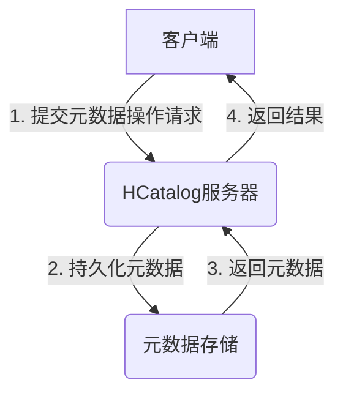
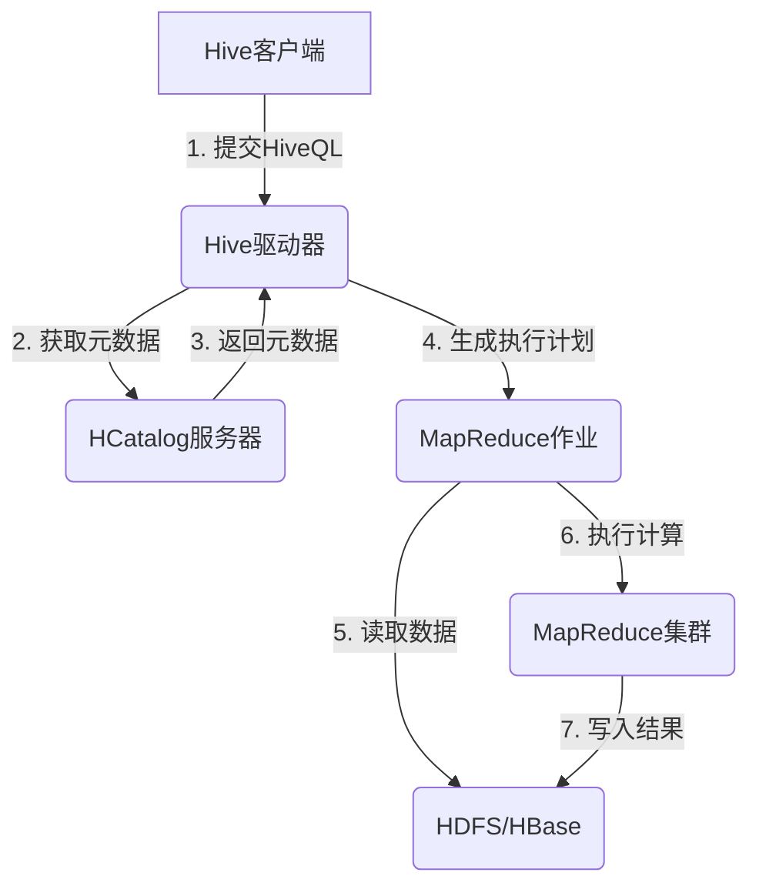

# HCatalog实战案例：社交网络数据分析

## 1.背景介绍

### 1.1 大数据时代的到来

随着互联网、移动互联网和物联网的快速发展,数据呈现出爆炸式增长,传统的数据处理方式已经无法满足大数据时代的需求。大数据时代已经到来,对于海量的结构化、半结构化和非结构化数据的存储、管理和分析提出了新的挑战。

### 1.2 大数据生态系统概述

为了应对大数据带来的挑战,一个全新的大数据生态系统应运而生。Apache Hadoop作为大数据生态系统的核心,提供了分布式存储(HDFS)和分布式计算(MapReduce)能力。围绕Hadoop,出现了一系列优秀的大数据组件,构建了一个强大的大数据处理平台,包括Hive、HBase、Kafka、Spark、Flink等。

### 1.3 HCatalog在大数据生态系统中的作用

HCatalog作为Hadoop生态系统中的元数据服务,为Hadoop生态系统中的不同组件提供统一的元数据管理服务。它提供了一个基于关系数据库的抽象层,使得用户可以像使用关系数据库一样,通过SQL语句来管理和访问存储在Hadoop系统中的数据。HCatalog支持对HDFS、HBase、Hive等数据源的元数据管理,为数据治理、数据共享和数据访问提供了统一的入口。

### 1.4 社交网络数据分析的重要性

在当前的大数据时代,社交网络数据分析已经成为一个热门的研究领域。社交网络数据包括用户信息、社交关系、用户行为数据等,对于理解用户需求、优化产品设计、改善用户体验、精准营销等方面具有重要意义。HCatalog作为Hadoop生态系统中的元数据服务,可以为社交网络数据的存储、管理和分析提供有力支持。

## 2.核心概念与联系

### 2.1 HCatalog核心概念

**表(Table)**:表是HCatalog中最核心的概念,代表了一个数据集。表由一系列列(Column)组成,每一列都有对应的数据类型。

**分区(Partition)**:分区是HCatalog中用于优化查询性能的一种技术。通过将表按照某些列的值进行分区存储,可以避免全表扫描,提高查询效率。

**数据库(Database)**:数据库是HCatalog中用于组织和管理表的逻辑单元。每个数据库可以包含多个表,并且不同数据库之间的表是相互隔离的。

**视图(View)**:视图是一种虚拟表,它是基于一个或多个实际表的查询结果构建而成。视图可以简化复杂查询,提高查询效率。

**外部表(External Table)**:外部表是指HCatalog中的元数据与实际数据存储位置是分离的。这种表适用于需要管理已经存在于HDFS或HBase中的数据的场景。

### 2.2 HCatalog与其他Hadoop组件的关系

**HCatalog与Hive**:HCatalog起源于Hive,最初是作为Hive的一个子项目。HCatalog提供了一个统一的元数据服务,可以被Hive、Pig等组件共享和访问。

**HCatalog与HBase**:HCatalog支持管理HBase中的表元数据,使得用户可以通过SQL语句来访问HBase中的数据。

**HCatalog与Pig**:Pig是一种用于大数据分析的高级语言,它可以通过HCatalog访问和管理Hadoop系统中的数据。

**HCatalog与MapReduce**:MapReduce作为Hadoop的核心计算框架,可以通过HCatalog访问和处理存储在Hadoop系统中的数据。

**HCatalog与Spark**:Spark是一种新兴的大数据处理框架,它可以通过HCatalog访问和处理存储在Hadoop系统中的数据。

### 2.3 HCatalog与社交网络数据分析的关系

社交网络数据通常具有海量、多样化和动态变化等特点,传统的关系数据库难以满足其存储和处理需求。HCatalog作为Hadoop生态系统中的元数据服务,可以为社交网络数据的存储、管理和分析提供有力支持:

1. **数据存储**:HCatalog可以管理存储在HDFS、HBase等分布式存储系统中的社交网络数据。
2. **元数据管理**:HCatalog提供了统一的元数据管理服务,方便对社交网络数据的元数据进行管理和共享。
3. **数据访问**:通过HCatalog,用户可以使用SQL语句来访问和查询存储在Hadoop系统中的社交网络数据。
4. **数据分析**:HCatalog与Hive、Spark等大数据分析工具紧密集成,为社交网络数据的分析提供了强大的计算能力。

## 3.核心算法原理具体操作步骤

### 3.1 HCatalog架构概览

HCatalog的架构如下图所示:

1. **客户端**:客户端可以是Hive、Pig、MapReduce作业或其他与HCatalog集成的应用程序。
2. **HCatalog服务器**:HCatalog服务器负责处理客户端的元数据操作请求,包括创建、修改、删除表、分区等操作。
3. **元数据存储**:HCatalog使用关系数据库(如MySQL、PostgreSQL等)作为元数据存储,用于持久化存储元数据信息。

### 3.2 HCatalog元数据管理流程

HCatalog元数据管理的核心流程如下:

1. **创建表**:客户端向HCatalog服务器发送创建表的请求,包括表名、列信息、表属性等。HCatalog服务器将元数据信息持久化存储到元数据存储中。
2. **添加分区**:对于分区表,客户端可以向HCatalog服务器发送添加分区的请求,包括分区列和分区值。HCatalog服务器将分区元数据信息存储到元数据存储中。
3. **查询元数据**:客户端可以向HCatalog服务器发送查询元数据的请求,如查询表结构、分区信息等。HCatalog服务器从元数据存储中读取相应的元数据信息,并返回给客户端。
4. **修改元数据**:客户端可以向HCatalog服务器发送修改元数据的请求,如修改表结构、表属性等。HCatalog服务器将修改后的元数据信息持久化存储到元数据存储中。
5. **删除元数据**:客户端可以向HCatalog服务器发送删除元数据的请求,如删除表、删除分区等。HCatalog服务器将相应的元数据信息从元数据存储中删除。

### 3.3 HCatalog与Hive集成

HCatalog与Hive集成的核心流程如下:

1. **Hive客户端**:用户通过Hive客户端提交HiveQL语句。
2. **Hive驱动器**:Hive驱动器负责解析HiveQL语句,并从HCatalog服务器获取相应的元数据信息。
3. **HCatalog服务器**:HCatalog服务器从元数据存储中读取所需的元数据信息,并返回给Hive驱动器。
4. **MapReduce作业**:根据HiveQL语句和元数据信息,Hive驱动器生成相应的MapReduce作业执行计划。
5. **HDFS/HBase**:MapReduce作业从HDFS或HBase中读取输入数据。
6. **MapReduce集群**:MapReduce集群执行相应的计算任务。
7. **HDFS/HBase**:MapReduce作业将计算结果写入HDFS或HBase中。

通过与Hive的集成,HCatalog为Hive提供了统一的元数据管理服务,使得Hive可以方便地访问和处理存储在HDFS、HBase等数据源中的数据。

## 4.数学模型和公式详细讲解举例说明

在社交网络数据分析中,常用的数学模型和公式包括:

### 4.1 PageRank算法

PageRank算法是谷歌用于评估网页重要性的核心算法,它也被广泛应用于社交网络中的影响力分析。PageRank算法的核心思想是,一个节点的重要性不仅取决于它自身,还取决于链接到它的其他重要节点的数量和重要性。

PageRank算法的数学模型如下:

$$PR(u) = (1-d) + d \times \sum_{v \in B_u} \frac{PR(v)}{L(v)}$$

其中:

- $PR(u)$表示节点$u$的PageRank值
- $B_u$表示链接到节点$u$的节点集合
- $L(v)$表示节点$v$的出链接数量
- $d$是一个阻尼系数,通常取值0.85

PageRank算法通过迭代计算直到收敛,得到每个节点的最终PageRank值。

### 4.2 社区发现算法

社区发现是社交网络分析中的一个重要任务,旨在发现网络中的密切连接的节点群组。常用的社区发现算法包括Louvain算法、标签传播算法等。

**Louvain算法**的核心思想是通过优化模ул度(Modularity)函数来发现社区结构。模块度函数定义如下:

$$Q = \frac{1}{2m} \sum_{i,j} \left[ A_{ij} - \frac{k_i k_j}{2m} \right] \delta(c_i, c_j)$$

其中:

- $m$表示网络中所有边的权重之和
- $A_{ij}$表示节点$i$和节点$j$之间边的权重
- $k_i$和$k_j$分别表示节点$i$和节点$j$的度数
- $c_i$和$c_j$分别表示节点$i$和节点$j$所属的社区
- $\delta(c_i, c_j)$是一个指示函数,当$c_i = c_j$时取值1,否则取值0

Louvain算法通过迭代优化模块度函数,最终得到网络中的社区结构。

### 4.3 链路预测算法

链路预测是社交网络分析中的另一个重要任务,旨在预测网络中可能存在但尚未观测到的链接。常用的链路预测算法包括基于相似性的算法、基于概率模型的算法等。

**基于资源分配的链路预测算法**利用了节点之间共享邻居的信息,其数学模型如下:

$$s_{xy} = \sum_{z \in \Gamma(x) \cap \Gamma(y)} \frac{1}{k_z}$$

其中:

- $s_{xy}$表示节点$x$和节点$y$之间的相似性分数
- $\Gamma(x)$和$\Gamma(y)$分别表示节点$x$和节点$y$的邻居集合
- $k_z$表示节点$z$的度数

算法的基本思想是,如果两个节点共享的邻居越多,且这些邻居的度数越小,则这两个节点之间存在链接的可能性就越大。

以上是社交网络数据分析中常用的一些数学模型和公式,在实际应用中,还需要结合具体场景和数据特征,选择合适的模型和算法。

## 5.项目实践:代码实例和详细解释说明

在本节中,我们将通过一个实际项目案例,演示如何使用HCatalog管理社交网络数据,并基于Hive进行数据分析。

### 5.1 项目概述

假设我们有一个社交网络数据集,包含用户信息、用户关系和用户行为数据。我们需要将这些数据存储在Hadoop生态系统中,并进行数据分析,以发现用户行为模式、社交关系特征等有价值的见解。

### 5.2 创建HCatalog表

首先,