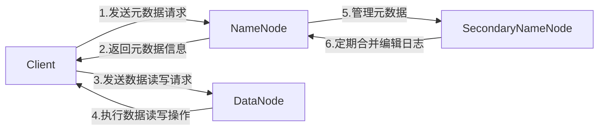

# HDFS源码解析：深入理解核心机制

## 1.背景介绍

Apache Hadoop分布式文件系统(HDFS)是一种高度容错的分布式文件系统,旨在运行在廉价的机器上。它被设计成适合部署在大型集群中运行,并提供高吞吐量的数据访问。HDFS由Apache软件基金会的Hadoop项目发展而来,现已成为大数据生态系统中不可或缺的核心组件之一。

HDFS的设计灵感来自于Google的GFS(Google文件系统),两者在架构和设计思想上有很多相似之处。与传统文件系统相比,HDFS具有以下特点:

- **高容错性**:通过数据冗余机制,即使节点出现故障也能保证数据不丢失。
- **适合批处理**:一次写入多次读取的文件访问模式,适合大型数据集的批量处理。
- **流式数据访问**:数据一旦写入就不会被修改,利于数据的串行读写。
- **大文件存储**:HDFS适合存储大文件(GB到TB级别),而不适合存储大量小文件。
- **可构建在廉价机器上**:HDFS可以部署在廉价的商用硬件上,而不需要昂贵的硬件。

HDFS广泛应用于大数据分析、机器学习、日志处理等领域,为海量数据的存储和处理提供了可靠、高效的解决方案。

## 2.核心概念与联系

HDFS的核心架构由以下几个组件组成:

1. **NameNode(名称节点)**: 管理文件系统的命名空间和客户端对文件的访问。它是HDFS集群的主节点,负责维护文件系统的元数据,如目录结构、文件与块的映射关系等。
2. **DataNode(数据节点)**: 负责实际存储文件数据块并执行读写操作。集群中可以有成百上千个DataNode,用于存储文件数据。
3. **SecondaryNameNode(辅助名称节点)**: 定期合并NameNode产生的编辑日志,以防止NameNode的内存占用过多。
4. **Client(客户端)**: 向NameNode发送元数据请求,并与DataNode进行数据交互。

这些组件之间的关系如下所示:



其中,NameNode是HDFS的核心,负责管理整个文件系统的命名空间和客户端对文件的访问。它维护着文件系统的目录树和文件与数据块的映射关系。当客户端需要进行文件操作时,首先需要与NameNode交互以获取相关元数据信息。

DataNode则负责实际存储文件数据块,并执行读写操作。当客户端需要读写数据时,会直接与DataNode进行数据交互。

SecondaryNameNode主要用于合并NameNode产生的编辑日志,以防止NameNode的内存占用过多。它定期从NameNode获取编辑日志,并将其合并到一个新的镜像文件中,从而减轻NameNode的内存压力。

## 3.核心算法原理具体操作步骤

### 3.1 文件写入流程

HDFS采用了写一次读多次的策略,一旦文件被写入HDFS,就不能被修改。文件写入的具体流程如下:

1. **客户端与NameNode交互**:客户端向NameNode请求创建一个新文件,NameNode会进行目录检查、配额检查等,并为该文件分配一个唯一的文件ID。
2. **NameNode分配数据块ID**:NameNode为该文件的第一个数据块分配一个唯一的块ID,并确定该块应该存储在哪些DataNode上(默认情况下,每个块会存储3份副本)。
3. **客户端与DataNode交互**:NameNode将DataNode的存储位置信息返回给客户端,客户端与指定的DataNode建立管道,开始向DataNode传输数据。
4. **数据块写入**:客户端将数据分成多个数据包(Packet),按顺序依次传输给DataNode。第一个DataNode会在本地临时存储文件数据,并将数据包转发给其他DataNode,以确保数据冗余。
5. **数据块写入完成**:当一个数据块被成功写入指定的DataNode后,客户端会通知NameNode该块已经写入完成。
6. **重复步骤2-5**:对于文件的后续数据块,重复步骤2-5的过程,直到整个文件写入完成。

下图展示了HDFS文件写入的整体流程:

```mermaid
sequenceDiagram
    participant Client
    participant NameNode
    participant DataNode1
    participant DataNode2
    participant DataNode3

    Client->>NameNode: 请求创建新文件
    NameNode-->>Client: 分配文件ID和数据块ID
    Client->>NameNode: 请求存储位置信息
    NameNode-->>Client: 返回DataNode存储位置
    Client->>DataNode1: 传输数据包1
    DataNode1->>DataNode2: 转发数据包1
    DataNode1->>DataNode3: 转发数据包1
    Client->>DataNode1: 传输数据包2
    DataNode1->>DataNode2: 转发数据包2
    DataNode1->>DataNode3: 转发数据包2
    ...
    Client->>NameNode: 通知数据块写入完成
    NameNode-->>Client: 确认
```

### 3.2 文件读取流程

HDFS的文件读取流程相对简单,主要步骤如下:

1. **客户端与NameNode交互**:客户端向NameNode请求读取某个文件,NameNode会检查客户端是否有读取权限,并返回该文件对应的数据块位置信息。
2. **客户端与DataNode交互**:客户端根据NameNode返回的数据块位置信息,直接与相应的DataNode建立连接,并从最近的DataNode读取数据。
3. **数据传输**:DataNode将数据块分成多个数据包,按顺序传输给客户端。如果某个DataNode出现故障,客户端会自动从其他DataNode读取数据。
4. **读取完成**:当所有数据包都被成功读取后,文件读取过程完成。

下图展示了HDFS文件读取的整体流程:

```mermaid
sequenceDiagram
    participant Client
    participant NameNode
    participant DataNode1
    participant DataNode2
    participant DataNode3

    Client->>NameNode: 请求读取文件
    NameNode-->>Client: 返回数据块位置信息
    Client->>DataNode1: 请求读取数据块
    DataNode1-->>Client: 传输数据包1
    DataNode1-->>Client: 传输数据包2
    ...
    Client->>DataNode2: 请求读取数据块
    DataNode2-->>Client: 传输数据包1
    DataNode2-->>Client: 传输数据包2
    ...
    Client->>DataNode3: 请求读取数据块
    DataNode3-->>Client: 传输数据包1
    DataNode3-->>Client: 传输数据包2
    ...
```

## 4.数学模型和公式详细讲解举例说明

在HDFS中,数据块的存储和复制策略是一个重要的设计考虑因素。HDFS采用了一种基于机架感知的复制策略,旨在提高数据可靠性和读取性能。

假设集群中有N个DataNode,分布在M个机架上。我们需要为每个数据块存储R份副本(默认情况下R=3)。那么,HDFS在选择DataNode存储位置时,需要遵循以下原则:

1. 尽量将副本分散存储在不同的机架上,以提高容错能力。
2. 在同一机架内,尽量选择不同的DataNode存储副本,以避免单点故障。
3. 如果无法在不同机架上存储副本,则在同一机架内存储。

我们可以用数学模型来描述这个过程。设$N_i$表示第i个机架上的DataNode数量,那么总的DataNode数量为:

$$N = \sum_{i=1}^{M} N_i$$

对于一个数据块,我们需要选择R个DataNode来存储副本。令$x_i$表示在第i个机架上存储的副本数量,则有:

$$\sum_{i=1}^{M} x_i = R$$

同时,由于需要尽量将副本分散存储在不同的机架上,因此对于任意一个机架i,我们有:

$$x_i \leq \left\lfloor\frac{R}{M}\right\rfloor + 1$$

其中,$\lfloor\cdot\rfloor$表示向下取整操作。

此外,为了避免单点故障,在同一机架内,副本应该存储在不同的DataNode上,因此对于任意一个机架i,我们有:

$$x_i \leq N_i$$

综合以上约束条件,HDFS会尽可能选择满足以下优化目标的存储方案:

$$\max \sum_{i=1}^{M} \left(\frac{x_i}{N_i}\right)^2$$

这个优化目标旨在最大化副本在不同机架和DataNode上的分散程度,从而提高数据可靠性和读取性能。

## 5.项目实践:代码实例和详细解释说明

在HDFS源码中,文件写入和读取的核心逻辑主要体现在`DistributedFileSystem`和`DFSOutputStream`等类中。下面我们来看一些关键代码片段,并进行详细解释。

### 5.1 文件写入示例

以下代码展示了HDFS文件写入的基本流程:

```java
// 1. 获取DistributedFileSystem实例
Configuration conf = new Configuration();
FileSystem fs = FileSystem.get(URI.create("hdfs://namenode:9000"), conf);

// 2. 创建文件并获取输出流
Path path = new Path("/user/data/input.txt");
FSDataOutputStream out = fs.create(path);

// 3. 写入数据
String content = "Hello, HDFS!";
out.write(content.getBytes());

// 4. 关闭输出流
out.close();
```

1. 首先,我们需要获取`DistributedFileSystem`实例,它是HDFS文件系统的Java API入口。
2. 调用`create()`方法创建一个新文件,并获取`FSDataOutputStream`对象,用于向HDFS写入数据。
3. 通过`write()`方法将数据写入输出流。
4. 最后,调用`close()`方法关闭输出流,完成文件写入过程。

在`create()`方法中,NameNode会为新文件分配一个唯一的文件ID和数据块ID,并确定数据块的存储位置。相关代码如下:

```java
// DistributedFileSystem.java
public FSDataOutputStream create(Path f, ...) throws IOException {
    // 1. 与NameNode交互,获取文件ID和数据块ID
    FileSystem.validatePathForWrite(stateUpdateService, f, permission);
    final StartupOption startOpt = getStartupOption(f);
    newStreamFlusherId.set(UNASSIGNED_STREAMING_FLUSH_ID);
    DataStreamer streamer = new DataStreamer(getConf().getInt(
        CommonConfigurationKeysPublic.IO_FILE_BUFFER_SIZE_KEY,
        CommonConfigurationKeysPublic.IO_FILE_BUFFER_SIZE_DEFAULT));
    return new FSDataOutputStream(this, streamer, startOpt, null);
}

// FSDataOutputStream.java
FSDataOutputStream(DFSClient dfsClient, DataStreamer streamer, 
    StartupOption startOpt, String clientName) throws IOException {
    // 2. 获取数据块存储位置信息
    this.streamer = streamer;
    this.dfsClient = dfsClient;
    this.startOpt = startOpt;
    this.shouldCacheFirstBlock = startOpt.getCacheFirstBlockOnCreate();
    this.clientName = clientName;
    this.computePacketHeaderTransmitTime = dfsClient.getConf().getPacketHeaderComputeTransmitTimeEnabled();
    this.fileId = streamer.getFileId();
    this.blockSize = streamer.getBlockSize();
    this.bytesPerChecksum = dfsClient.getConf().getBytesPerChecksum();
    this.cachingStrategy = dfsClient.getConf().getCachingStrategy();
    this.cachingStrategyPurePosixReserved = cachingStrategy == CachingStrategy.POSIX &&
        dfsClient.getConf().isReservedRawPosixFallocateOnCreate();
    this.cachingStrategy = cachingStrategy;
    this.blockAccessTokens = streamer.getBlockAccessTokens();
    this.envelopeTracingEnabled = dfsClient.getConf().isEnvelopeTracingEnabled();
    streamer.start();
}
```

在`FSDataOutputStream`的构造函数中,会与NameNode交互获取数据块的存储位置信息,并启动`DataStreamer`线程,开始向DataNode传输数据。

### 5.2 文件读取示例

以下代码展示了HDFS文件读取的基本流程: