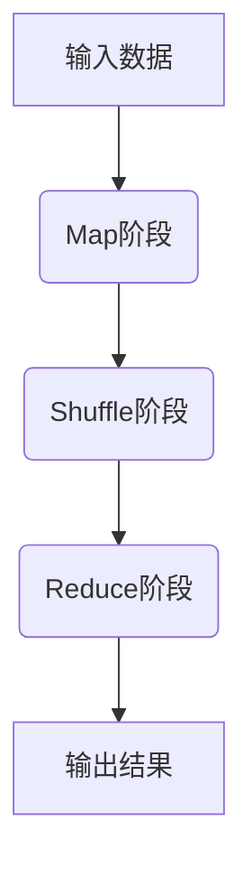
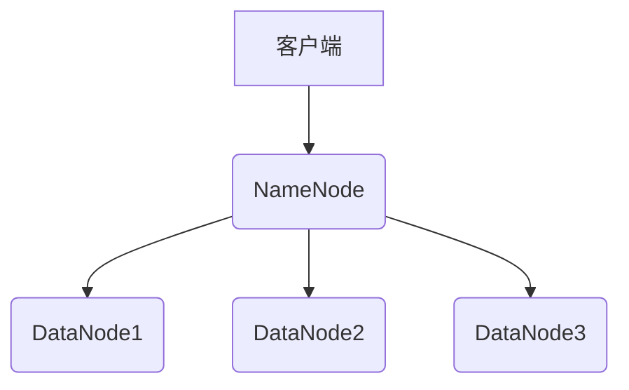
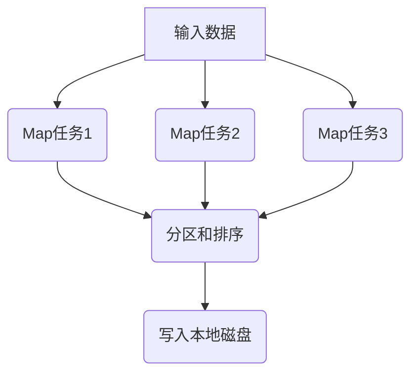
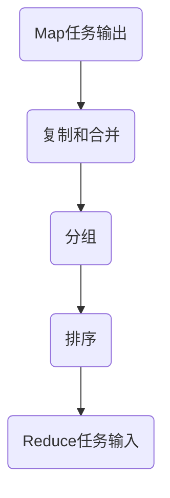
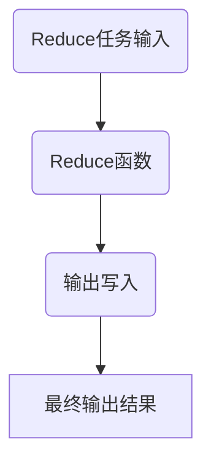

# Hadoop MapReduce计算框架原理与代码实例讲解

## 1.背景介绍

在当今大数据时代，海量数据的存储和处理成为了一个巨大的挑战。传统的单机系统已经无法满足现代数据处理的需求,因此分布式计算框架应运而生。Apache Hadoop是一个开源的分布式系统基础架构,它是Google的MapReduce和Google文件系统(GFS)的开源实现。Hadoop MapReduce是Hadoop生态系统中最核心的计算框架,它能够并行处理TB甚至PB级别的数据集。

### 1.1 大数据时代的到来

随着互联网、物联网、移动互联网等新兴技术的快速发展,海量数据的产生已经成为了一种常态。这些数据来源于各种渠道,如网页、社交媒体、物联网传感器等。传统的数据处理系统无法有效地处理如此庞大的数据量,因此迫切需要一种新的计算框架来解决这一问题。

### 1.2 Hadoop的诞生

Google在2004年发表了两篇论文,分别介绍了MapReduce编程模型和Google文件系统(GFS)。这两项创新为大规模数据处理奠定了基础。2005年,Apache Hadoop项目正式启动,旨在实现一个开源的分布式系统基础架构,包括分布式文件系统(HDFS)和分布式计算框架(MapReduce)。

### 1.3 MapReduce编程范式

MapReduce是一种编程范式,用于在大规模集群上并行处理和生成大型数据集。它将计算过程分为两个阶段:Map阶段和Reduce阶段。这种编程模型使得开发人员可以专注于编写处理数据的业务逻辑,而不必关心底层的并行计算、数据分发、容错等复杂细节。

## 2.核心概念与联系

### 2.1 MapReduce概念

MapReduce是一种分布式数据处理模型,它将计算过程分为两个阶段:Map和Reduce。

1. **Map阶段**:输入数据被划分为多个数据块,每个数据块由一个Map任务处理。Map任务将输入数据转换为一组键值对(key/value),并将这些键值对写入本地磁盘。

2. **Shuffle阶段**:系统对Map阶段输出的键值对进行合并和分组,将具有相同键的值集合在一起,准备输入到Reduce阶段。

3. **Reduce阶段**:Reduce任务从Shuffle阶段获取输入数据,对具有相同键的值集合进行处理,生成最终的输出结果。



### 2.2 HDFS概念

Hadoop分布式文件系统(HDFS)是Hadoop生态系统中的核心存储组件,它是一个高度容错的分布式文件系统,设计用于在廉价的硬件上存储大量数据。

HDFS采用主从架构,由一个NameNode(名称节点)和多个DataNode(数据节点)组成。NameNode负责管理文件系统的元数据,而DataNode负责存储实际的文件数据块。



### 2.3 MapReduce与HDFS的关系

MapReduce和HDFS是Hadoop生态系统中的两个核心组件,它们紧密协作,为大数据处理提供了强大的支持。

- **数据存储**:HDFS为MapReduce提供了可靠的大规模数据存储。MapReduce任务可以直接从HDFS读取输入数据,并将输出结果写回HDFS。

- **数据本地性**:MapReduce任务会尽量在存储输入数据的节点上执行,以减少数据传输开销。这种数据本地性优化可以显著提高MapReduce作业的性能。

- **容错性**:HDFS和MapReduce都具有高度的容错性。HDFS通过数据块复制提供了数据容错,而MapReduce则通过任务重新执行来实现容错。

## 3.核心算法原理具体操作步骤 

### 3.1 Map阶段

Map阶段是MapReduce计算过程的第一个阶段,它将输入数据转换为一组键值对(key/value)。具体操作步骤如下:

1. **输入数据拆分**:输入数据被划分为多个数据块(通常为64MB或128MB),每个数据块由一个Map任务处理。

2. **Map任务执行**:每个Map任务会读取一个数据块,并将其转换为一组键值对。Map函数的输入是一个键值对,输出也是一个键值对。

3. **分区和排序**:Map任务输出的键值对会先进行分区,然后按照键进行排序。分区是为了确保具有相同键的键值对被发送到同一个Reduce任务。

4. **写入本地磁盘**:排序后的键值对会被写入本地磁盘,以便进行Shuffle阶段。



### 3.2 Shuffle阶段

Shuffle阶段是MapReduce计算过程的中间阶段,它将Map阶段输出的键值对合并和分组,准备输入到Reduce阶段。具体操作步骤如下:

1. **复制和合并**:Map任务输出的键值对会被复制到Reduce任务所在的节点,并按照键进行合并。

2. **分组**:具有相同键的值会被分组在一起,形成一个键值对列表。

3. **排序**:对于每个Reduce任务,它的输入键值对列表会按照键进行排序。



### 3.3 Reduce阶段

Reduce阶段是MapReduce计算过程的最后一个阶段,它对Shuffle阶段输出的键值对列表进行处理,生成最终的输出结果。具体操作步骤如下:

1. **Reduce任务执行**:每个Reduce任务会读取一个键值对列表,对于每个键,它会调用Reduce函数进行处理。Reduce函数的输入是一个键和一个值列表,输出是一个新的键值对。

2. **输出写入**:Reduce任务输出的键值对会被写入HDFS或其他存储系统。



## 4.数学模型和公式详细讲解举例说明

在MapReduce中,我们可以使用数学模型和公式来描述和优化计算过程。以下是一些常见的数学模型和公式:

### 4.1 数据局部性模型

数据局部性是MapReduce优化的关键因素之一。我们可以使用以下公式来计算数据传输成本:

$$
C_{transfer} = \sum_{i=1}^{n} \sum_{j=1}^{m} d_{ij} \times s_{ij}
$$

其中:

- $n$是Map任务的数量
- $m$是Reduce任务的数量
- $d_{ij}$是Map任务$i$的输出数据传输到Reduce任务$j$的距离
- $s_{ij}$是Map任务$i$的输出数据传输到Reduce任务$j$的大小

我们希望最小化数据传输成本,从而提高MapReduce作业的性能。

### 4.2 任务调度模型

任务调度是MapReduce中另一个重要的优化问题。我们可以使用以下公式来描述任务调度问题:

$$
\min \sum_{i=1}^{n} w_i \times t_i
$$

其中:

- $n$是任务的数量
- $w_i$是任务$i$的权重
- $t_i$是任务$i$的完成时间

我们希望最小化加权任务完成时间,从而提高整个MapReduce作业的效率。

### 4.3 示例:WordCount

WordCount是MapReduce中一个经典的示例,它统计给定文本文件中每个单词出现的次数。我们可以使用以下Map和Reduce函数来实现WordCount:

**Map函数**:

```python
def map(key, value):
    words = value.split()
    for word in words:
        emit(word, 1)
```

**Reduce函数**:

```python
def reduce(key, values):
    count = sum(values)
    emit(key, count)
```

在Map阶段,每个Map任务将输入文本拆分为单词,并为每个单词输出一个键值对(word, 1)。在Reduce阶段,具有相同键(单词)的值(计数)会被汇总,最终输出每个单词的总计数。

## 5.项目实践:代码实例和详细解释说明

在这一节,我们将通过一个实际的MapReduce程序示例来深入理解MapReduce的工作原理。我们将使用Python编写一个WordCount程序,它统计给定文本文件中每个单词出现的次数。

### 5.1 环境准备

在开始编写MapReduce程序之前,我们需要安装以下Python库:

- `mrjob`:一个用于编写和运行MapReduce作业的Python库。
- `tqdm`:一个用于显示进度条的Python库(可选)。

可以使用以下命令安装这些库:

```bash
pip install mrjob tqdm
```

### 5.2 WordCount程序

我们将使用`mrjob`库编写一个WordCount程序。以下是完整的代码:

```python
from mrjob.job import MRJob
from mrjob.step import MRStep
import re
from tqdm import tqdm

WORD_RE = re.compile(r"[\w']+")

class MRWordCount(MRJob):

    def mapper_get_words(self, _, line):
        words = WORD_RE.findall(line)
        for word in words:
            yield word.lower(), 1

    def combiner_count_words(self, word, counts):
        yield word, sum(counts)

    def reducer_count_words(self, word, counts):
        yield word, sum(counts)

    def steps(self):
        return [
            MRStep(mapper=self.mapper_get_words,
                   combiner=self.combiner_count_words,
                   reducer=self.reducer_count_words)
        ]

if __name__ == '__main__':
    MRWordCount.run()
```

让我们详细解释一下这段代码:

1. **导入所需的库**:我们导入了`mrjob`、`re`和`tqdm`库。

2. **定义正则表达式**:我们定义了一个正则表达式`WORD_RE`来匹配单词。

3. **定义MapReduce作业类**:我们定义了一个名为`MRWordCount`的类,继承自`MRJob`。

4. **定义Map函数**:我们在`mapper_get_words`方法中定义了Map函数。它将输入的每一行文本拆分为单词,并为每个单词输出一个键值对(word, 1)。

5. **定义Combiner函数**:我们在`combiner_count_words`方法中定义了Combiner函数。它将Map阶段输出的键值对进行本地汇总,减少了传输到Reduce阶段的数据量。

6. **定义Reduce函数**:我们在`reducer_count_words`方法中定义了Reduce函数。它将Combiner阶段输出的键值对进行最终汇总,得到每个单词的总计数。

7. **定义MapReduce步骤**:我们在`steps`方法中定义了MapReduce作业的步骤,包括Map、Combiner和Reduce阶段。

8. **运行MapReduce作业**:在`if __name__ == '__main__'`块中,我们调用`MRWordCount.run()`来运行MapReduce作业。

### 5.3 运行WordCount程序

要运行WordCount程序,我们需要提供一个或多个文本文件作为输入。假设我们有一个名为`input.txt`的文本文件,内容如下:

```
Hello World
Hello Hadoop
Hadoop MapReduce
```

我们可以使用以下命令运行WordCount程序:

```bash
python wordcount.py input.txt
```

程序将输出每个单词的计数结果,如下所示:

```
"hadoop" 2
"hello" 2
"mapreduce" 1
"world" 1
```

### 5.4 代码解释

让我们详细解释一下WordCount程序的工作原理:

1. **Map阶段**:程序将输入文件`input.txt`划分为多个数据块,每个数据块由一个Map任务处理。Map任务将每一行文本拆分为单词,并为每个单词输出一个