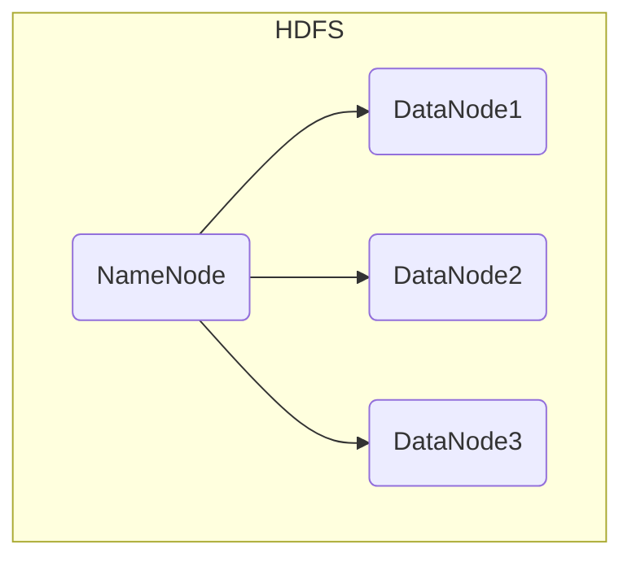
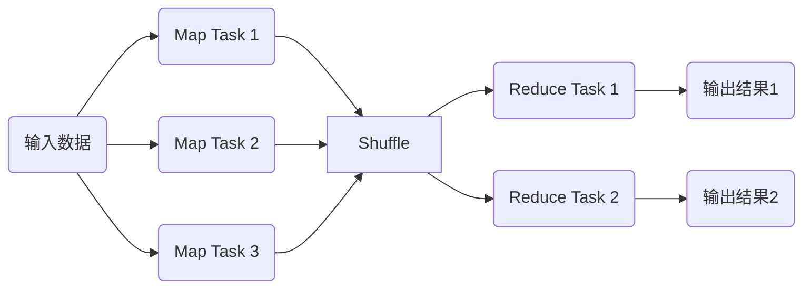
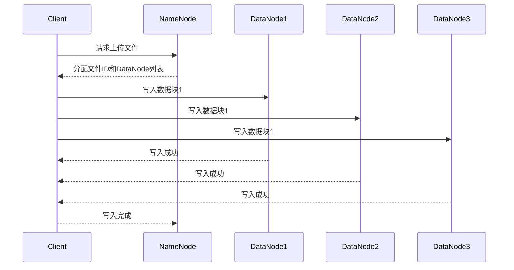
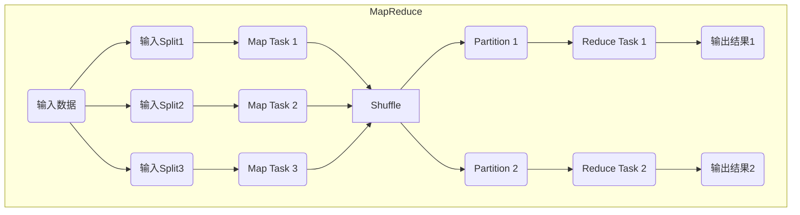

好的,我明白了您的要求。以下是题为《Hadoop 原理与代码实例讲解》的技术博客文章:

# Hadoop 原理与代码实例讲解

## 1.背景介绍

### 1.1 大数据时代的到来

随着信息技术的不断发展,数据呈现出爆炸式增长的趋势。无论是个人的社交媒体、网上购物记录,还是企业的交易数据、日志文件,都在急剧积累着大量的数据。这些海量的结构化和非结构化数据的存储和处理,对传统的数据库管理系统和数据处理架构带来了巨大挑战。

### 1.2 Hadoop 的诞生

为了应对日益增长的大数据处理需求,Google 提出了 GFS(Google 文件系统)和 MapReduce 分布式计算模型的理念。Hadoop 正是受到 Google 这一理念的启发,作为一个可靠、高性能、可扩展的分布式系统基础架构而应运而生。

Hadoop 最初是由 Apache 软件基金会在 2006 年开发的开源分布式系统基础架构。它主要由 Hadoop 分布式文件系统(HDFS)和 MapReduce 分布式计算框架两部分组成,可以在廉价的计算机集群上存储和处理大规模数据集。

## 2.核心概念与联系

### 2.1 HDFS 架构

Hadoop 分布式文件系统(HDFS)是一个高度容错的分布式文件系统,设计用于在廉价的机器上运行。它具有以下几个核心概念:

1. **NameNode**: 存储文件系统的元数据,如目录树、文件与块的映射等。
2. **DataNode**: 存储实际的文件数据块。
3. **块(Block)**: HDFS 中文件被划分为一个个块,并存储在不同的 DataNode 上。
4. **副本(Replication)**: 每个块都会有多个副本,以提高容错性和可用性。

HDFS 架构如下所示:



### 2.2 MapReduce 计算模型

MapReduce 是一种分布式数据处理模型,它将计算过程分为两个阶段:Map 阶段和 Reduce 阶段。

1. **Map 阶段**: 将输入数据划分为多个数据块,并行处理每个数据块,生成中间结果。
2. **Reduce 阶段**: 对 Map 阶段的输出结果进行合并和处理,生成最终结果。

MapReduce 计算模型如下所示:



## 3.核心算法原理具体操作步骤  

### 3.1 HDFS 写数据流程

1. 客户端向 NameNode 请求上传文件,NameNode 检查目标文件是否已存在。
2. NameNode 为文件在 HDFS 上分配一个新的文件ID。
3. NameNode 指示客户端将文件分块,并为每个块分配存储 DataNode。
4. 客户端按照 NameNode 指示的 DataNode 顺序依次写入数据块。
5. 在写入数据块的同时,每个 DataNode 会为该块启动一个线程,并将块数据持久化到本地磁盘。
6. 当所有 DataNode 都写入成功后,文件写入完成。

HDFS 写数据流程如下:



### 3.2 MapReduce 执行流程

1. **输入切分**: 输入数据集被划分为多个数据块,称为输入splits。
2. **Map 阶段**:
   - MapReduce 框架为每个输入splits分配一个 Map 任务。
   - Map 任务并行执行,处理输入splits,生成键值对形式的中间结果。
3. **Shuffle 阶段**:
   - MapReduce 框架对 Map 阶段的输出结果进行分区和排序。
   - 将相同分区的数据发送到同一个 Reduce 任务。
4. **Reduce 阶段**:
   - MapReduce 框架为每个分区分配一个 Reduce 任务。
   - Reduce 任务对相应分区的数据进行合并和处理,生成最终结果。

MapReduce 执行流程如下:



## 4.数学模型和公式详细讲解举例说明

在 Hadoop 中,数据块的副本放置策略遵循一定的数学模型和公式,以实现数据的高可用性和负载均衡。

### 4.1 副本放置策略

假设我们需要为一个文件块创建 `n` 个副本,HDFS 会按照以下步骤选择 DataNode 节点:

1. 将第一个副本放置在上传文件的 DataNode 节点(假设为节点 A)。
2. 将第二个副本放置在与节点 A 不同的机架上的一个节点(假设为节点 B)。
3. 将第三个副本放置在与节点 A、B 不同的另一个机架上的一个节点(假设为节点 C)。
4. 如果还有更多副本,则从第三步开始循环,在不同机架上放置副本,直到副本数量达到 `n`。

这种副本放置策略可以用数学公式表示如下:

$$
\begin{align*}
&\text{第一个副本放置在上传节点:} &&\text{node}_1 = \text{uploadNode}\\
&\text{第二个副本放置在不同机架:} &&\text{node}_2 \neq \text{rack}(\text{node}_1)\\
&\text{第三个副本放置在另一个机架:} &&\text{node}_3 \neq \text{rack}(\text{node}_1) \wedge \text{node}_3 \neq \text{rack}(\text{node}_2)\\
&\text{其余副本:} &&\text{node}_i \neq \text{rack}(\text{node}_{i-2}) \wedge \text{node}_i \neq \text{rack}(\text{node}_{i-1})
\end{align*}
$$

其中, $\text{rack}(\text{node}_i)$ 表示节点 $\text{node}_i$ 所在的机架。

这种副本放置策略可以最大限度地避免单点故障,提高数据的可靠性和可用性。

### 4.2 负载均衡

为了实现集群中各个 DataNode 之间的负载均衡,HDFS 采用了一种基于机架感知的负载均衡策略。具体来说,当选择一个 DataNode 来存储新的数据块时,NameNode 会优先选择与已存储该文件其他数据块的 DataNode 位于不同机架的节点。

这种负载均衡策略可以用数学公式表示如下:

$$
\begin{align*}
&\text{计算每个节点的权重:} &&w_i = \frac{1}{\text{remaining}(\text{node}_i)} + \frac{1}{\text{remaining}(\text{rack}(\text{node}_i))}\\
&\text{选择权重最大的节点:} &&\text{selectedNode} = \arg\max_i w_i
\end{align*}
$$

其中, $\text{remaining}(\text{node}_i)$ 表示节点 $\text{node}_i$ 的剩余存储空间, $\text{remaining}(\text{rack}(\text{node}_i))$ 表示节点 $\text{node}_i$ 所在机架的剩余存储空间。

通过这种基于机架感知的负载均衡策略,HDFS 可以在尽量利用每个节点的存储空间的同时,也避免了单个机架成为热点,从而提高了整个集群的数据吞吐量和可靠性。

## 5.项目实践:代码实例和详细解释说明

### 5.1 HDFS 客户端示例

以下是一个使用 HDFS Java API 进行文件上传和下载的示例代码:

```java
import org.apache.hadoop.conf.Configuration;
import org.apache.hadoop.fs.FileSystem;
import org.apache.hadoop.fs.Path;

public class HDFSExample {
    public static void main(String[] args) throws Exception {
        Configuration conf = new Configuration();
        conf.set("fs.defaultFS", "hdfs://namenode:9000");
        FileSystem fs = FileSystem.get(conf);

        // 上传文件
        Path localPath = new Path("/path/to/local/file.txt");
        Path hdfsPath = new Path("/path/in/hdfs/file.txt");
        fs.copyFromLocalFile(localPath, hdfsPath);

        // 下载文件
        Path downloadPath = new Path("/path/to/download/file.txt");
        fs.copyToLocalFile(hdfsPath, downloadPath);

        fs.close();
    }
}
```

代码解释:

1. 创建一个 `Configuration` 对象,设置 HDFS 的 NameNode 地址。
2. 通过 `FileSystem.get(conf)` 获取一个 HDFS `FileSystem` 实例。
3. 使用 `copyFromLocalFile` 方法将本地文件上传到 HDFS。
4. 使用 `copyToLocalFile` 方法从 HDFS 下载文件到本地。
5. 最后关闭 `FileSystem` 实例。

### 5.2 MapReduce 单词计数示例

以下是一个使用 MapReduce 进行单词计数的示例代码:

```java
import org.apache.hadoop.conf.Configuration;
import org.apache.hadoop.fs.Path;
import org.apache.hadoop.io.IntWritable;
import org.apache.hadoop.io.Text;
import org.apache.hadoop.mapreduce.Job;
import org.apache.hadoop.mapreduce.Mapper;
import org.apache.hadoop.mapreduce.Reducer;
import org.apache.hadoop.mapreduce.lib.input.FileInputFormat;
import org.apache.hadoop.mapreduce.lib.output.FileOutputFormat;

public class WordCount {
    public static class TokenizerMapper extends Mapper<Object, Text, Text, IntWritable> {
        private final static IntWritable one = new IntWritable(1);
        private Text word = new Text();

        public void map(Object key, Text value, Context context) throws IOException, InterruptedException {
            StringTokenizer itr = new StringTokenizer(value.toString());
            while (itr.hasMoreTokens()) {
                word.set(itr.nextToken());
                context.write(word, one);
            }
        }
    }

    public static class IntSumReducer extends Reducer<Text, IntWritable, Text, IntWritable> {
        private IntWritable result = new IntWritable();

        public void reduce(Text key, Iterable<IntWritable> values, Context context) throws IOException, InterruptedException {
            int sum = 0;
            for (IntWritable val : values) {
                sum += val.get();
            }
            result.set(sum);
            context.write(key, result);
        }
    }

    public static void main(String[] args) throws Exception {
        Configuration conf = new Configuration();
        Job job = Job.getInstance(conf, "word count");
        job.setJarByClass(WordCount.class);
        job.setMapperClass(TokenizerMapper.class);
        job.setCombinerClass(IntSumReducer.class);
        job.setReducerClass(IntSumReducer.class);
        job.setOutputKeyClass(Text.class);
        job.setOutputValueClass(IntWritable.class);
        FileInputFormat.addInputPath(job, new Path(args[0]));
        FileOutputFormat.setOutputPath(job, new Path(args[1]));
        System.exit(job.waitForCompletion(true) ? 0 : 1);
    }
}
```

代码解释:

1. `TokenizerMapper` 类实现了 `Mapper` 接口,用于