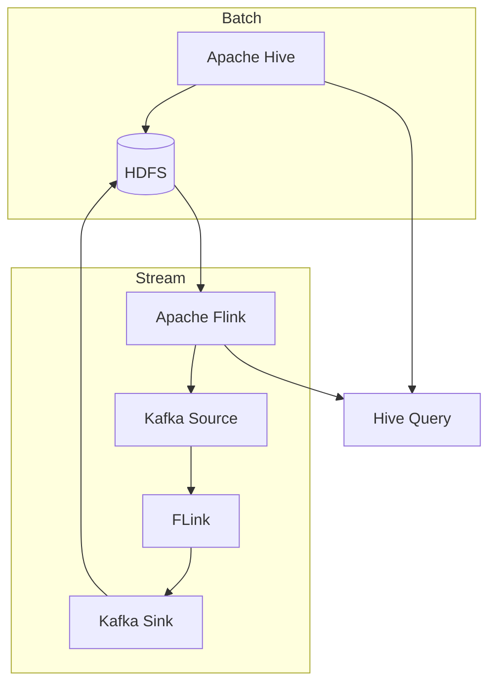
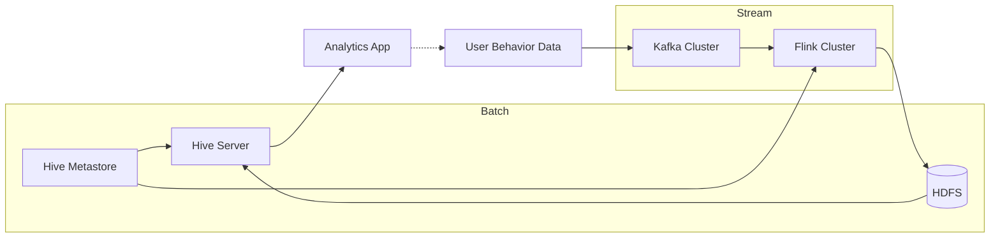

# Hive-Flink整合原理与代码实例讲解

## 1.背景介绍

随着大数据时代的到来,数据量呈现爆炸式增长,传统的数据处理方式已经无法满足现代企业对于实时数据处理和分析的需求。Apache Hive作为建立在Hadoop之上的数据仓库工具,提供了类SQL语言来管理和查询存储在HDFS中的大规模数据集,大大简化了大数据处理的复杂性。然而,Hive主要面向批处理场景,对于实时数据处理能力较弱。

Apache Flink作为新一代分布式流式数据处理引擎,具有低延迟、高吞吐、精确一次语义等优势,可以实现准实时数据处理和分析。将Hive和Flink进行整合,可以充分利用两者的优势,实现批流一体化的大数据处理和分析。

## 2.核心概念与联系

### 2.1 Apache Hive

Apache Hive是建立在Hadoop之上的数据仓库工具,它将结构化的数据文件映射为一张数据库表,并提供类SQL查询语言HQL(Hive Query Language)来管理和查询这些数据。Hive的主要组件包括:

- **Metastore**: 存储Hive元数据的组件,包括表、视图、分区等信息。
- **Driver**: 解析HQL语句,生成查询计划。
- **Compiler**: 将查询计划转换为一系列MapReduce作业。
- **Executor**: 在Hadoop集群上执行MapReduce作业。

Hive适合用于离线批处理场景,但对于实时数据处理能力较弱。

### 2.2 Apache Flink

Apache Flink是一个分布式、高性能、高可靠的流式数据处理引擎,具有以下核心特点:

- **流式数据处理**: Flink支持实时流式数据处理,可以对无界数据流进行低延迟的处理。
- **事件时间语义**: Flink支持基于事件时间的窗口操作,可以处理乱序数据。
- **精确一次语义**: Flink通过检查点机制实现精确一次的状态一致性。
- **高吞吐、低延迟**: Flink采用增量检查点和优化的网络传输,实现高吞吐、低延迟的数据处理。

Flink适合用于实时数据处理和分析场景,但对于批量数据处理能力相对较弱。

### 2.3 Hive-Flink整合

将Hive和Flink进行整合,可以实现批流一体化的大数据处理和分析。Hive提供批量数据处理能力,Flink提供实时数据处理能力,两者可以互补,形成完整的大数据处理解决方案。

整合的核心思路是:

1. 使用Hive处理离线批量数据,生成结果表。
2. 使用Flink对实时数据流进行处理,并将结果数据写入Hive表中。
3. 通过Hive查询语句对批量数据和实时数据进行联合查询和分析。

## 3.核心算法原理具体操作步骤

### 3.1 Hive-Flink整合架构

Hive-Flink整合架构如下图所示:



该架构包括以下几个核心组件:

- **Apache Hive**: 用于离线批量数据处理,将结果数据存储在HDFS中。
- **Apache Flink**: 用于实时流式数据处理,从Kafka消费实时数据,处理后将结果数据写入Kafka或HDFS。
- **Kafka**: 作为实时数据的消息队列,为Flink提供数据源和数据sink。
- **HDFS**: 作为批量数据和实时数据的存储介质,为Hive和Flink提供数据源和数据sink。
- **Hive Query**: 通过Hive查询语句对批量数据和实时数据进行联合查询和分析。

### 3.2 Hive批量数据处理

Hive主要用于离线批量数据处理,具体步骤如下:

1. 创建Hive表,将数据文件映射为表结构。
2. 使用HQL(Hive Query Language)编写查询语句,对表进行转换、过滤、聚合等操作。
3. Hive将HQL语句转换为一系列MapReduce作业,提交到Hadoop集群执行。
4. MapReduce作业在Hadoop集群上并行处理数据,将结果写入HDFS。
5. 通过Hive查询语句可以查看和分析处理结果。

### 3.3 Flink实时数据处理

Flink主要用于实时流式数据处理,具体步骤如下:

1. 从Kafka消费实时数据流,作为Flink的数据源。
2. 使用Flink DataStream API或SQL编写数据处理逻辑,包括转换、过滤、聚合、窗口操作等。
3. Flink将数据处理逻辑转换为执行计划,并行执行在Flink集群上。
4. 处理后的结果数据可以写入Kafka或HDFS,作为数据sink。
5. 通过Hive查询语句可以查看和分析实时数据处理结果。

### 3.4 Hive-Flink联合查询分析

通过Hive查询语句,可以对批量数据和实时数据进行联合查询和分析,具体步骤如下:

1. 在Hive中创建外部表,将Flink写入HDFS的实时数据结果映射为表结构。
2. 使用HQL编写查询语句,将批量数据表和实时数据表进行JOIN操作。
3. Hive将HQL语句转换为MapReduce作业,提交到Hadoop集群执行。
4. MapReduce作业并行处理批量数据和实时数据,将结果写入HDFS。
5. 通过Hive查询语句可以查看和分析联合查询结果。

## 4.数学模型和公式详细讲解举例说明

在Hive-Flink整合场景中,常见的数学模型和公式主要集中在实时数据处理阶段,例如滑动窗口计算、机器学习算法等。以下将详细讲解一个基于滑动窗口的数据聚合计算示例。

### 4.1 滑动窗口概念

滑动窗口是流式数据处理中一种常见的技术,用于对一段时间内的数据进行聚合计算。滑动窗口由以下三个参数定义:

- **Window Size(窗口大小)**: 指定窗口涵盖的事件个数或时间范围。
- **Slide Size(滑动步长)**: 指定窗口每次滑动的事件个数或时间间隔。
- **Slide Type(滑动类型)**: 指定窗口滑动的方式,可以是滚动(Tumbling)或滑动(Sliding)。

### 4.2 滑动窗口数学模型

假设我们有一个无界的数据流 $\{x_1, x_2, x_3, \dots\}$,我们希望对每个窗口内的数据进行求和操作。对于滚动窗口(Tumbling Window),窗口大小为 $w$,滑动步长为 $w$,则第 $i$ 个窗口的求和结果为:

$$
y_i = \sum_{j=(i-1)w+1}^{iw} x_j
$$

对于滑动窗口(Sliding Window),窗口大小为 $w$,滑动步长为 $s$,则第 $i$ 个窗口的求和结果为:

$$
y_i = \sum_{j=(i-1)s+1}^{(i-1)s+w} x_j
$$

### 4.3 代码实例

以下是使用Flink DataStream API实现滑动窗口求和的代码示例:

```java
import org.apache.flink.streaming.api.datastream.DataStream;
import org.apache.flink.streaming.api.environment.StreamExecutionEnvironment;
import org.apache.flink.streaming.api.windowing.assigners.SlidingEventTimeWindows;
import org.apache.flink.streaming.api.windowing.time.Time;

// 创建执行环境
StreamExecutionEnvironment env = StreamExecutionEnvironment.getExecutionEnvironment();

// 创建数据源
DataStream<Integer> input = env.fromElements(1, 2, 3, 4, 5, 6, 7, 8, 9, 10);

// 定义滑动窗口
DataStream<Integer> sum = input
    .keyBy(value -> value)
    .window(SlidingEventTimeWindows.of(Time.seconds(10), Time.seconds(5)))
    .sum(0);

// 打印结果
sum.print();
```

在这个示例中,我们定义了一个滑动窗口,窗口大小为10秒,滑动步长为5秒。对于每个键(value),Flink会计算每个窗口内的数据求和,并输出结果。

该示例的输出结果如下:

```
4
10
16
22
28
34
40
36
32
28
```

可以看到,每个窗口内的数据求和结果都被正确计算出来。

## 5.项目实践:代码实例和详细解释说明

### 5.1 项目概述

在本节中,我们将通过一个实际项目来演示如何将Hive和Flink进行整合,实现批流一体化的大数据处理和分析。该项目的目标是对电商网站的用户行为数据进行实时分析,包括用户浏览商品、加入购物车、下单等行为。

项目架构如下图所示:



该架构包括以下几个核心组件:

- **Kafka Cluster**: 用于接收和缓存实时的用户行为数据。
- **Flink Cluster**: 从Kafka消费实时数据,进行实时数据处理,并将结果写入HDFS。
- **HDFS**: 存储批量数据和实时数据处理结果。
- **Hive Metastore**: 存储Hive元数据,为Hive Server和Flink Cluster提供元数据服务。
- **Hive Server**: 执行Hive查询,对批量数据和实时数据进行联合查询和分析。
- **Analytics App**: 分析应用程序,通过Hive Server查询和展示分析结果。

### 5.2 Hive批量数据处理

在该项目中,我们使用Hive处理离线批量数据,即用户行为日志文件。具体步骤如下:

1. 在HDFS上创建目录,用于存储用户行为日志文件。
2. 使用Hive创建外部表,将日志文件映射为表结构。

```sql
CREATE EXTERNAL TABLE user_behavior_log (
    user_id STRING,
    behavior STRING,
    product_id STRING,
    timestamp BIGINT
)
PARTITIONED BY (dt STRING)
ROW FORMAT DELIMITED FIELDS TERMINATED BY ','
LOCATION '/user_behavior_logs';
```

3. 加载日志数据到Hive表中。

```sql
LOAD DATA INPATH '/user_behavior_logs/2023-06-01' INTO TABLE user_behavior_log PARTITION (dt='2023-06-01');
```

4. 使用HQL对用户行为数据进行转换、过滤、聚合等操作,生成分析结果表。

```sql
CREATE TABLE user_behavior_analytics AS
SELECT
    user_id,
    behavior,
    product_id,
    COUNT(*) AS count
FROM user_behavior_log
WHERE dt = '2023-06-01'
GROUP BY user_id, behavior, product_id;
```

5. 通过Hive查询语句可以查看和分析批量数据处理结果。

```sql
SELECT * FROM user_behavior_analytics;
```

### 5.3 Flink实时数据处理

在该项目中,我们使用Flink从Kafka消费实时的用户行为数据,进行实时数据处理,并将结果写入HDFS。具体步骤如下:

1. 从Kafka消费实时数据流,作为Flink的数据源。

```java
DataStream<String> input = env.addSource(new FlinkKafkaConsumer<>(
    "user_behavior_topic",
    new SimpleStringSchema(),
    kafkaProps
));
```

2. 使用Flink DataStream API对实时数据进行处理,包括转换、过滤、