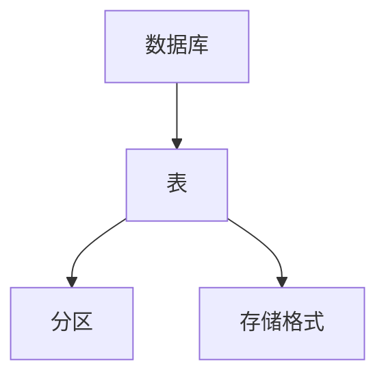

## 1.背景介绍

在大数据处理领域，Hive是一种重要的数据仓库工具，它可以将结构化的数据文件映射为一张数据库表，并提供HiveQL查询语言进行数据查询和分析。HiveQL是一种SQL方言，它继承了SQL的大部分语法，但也有自己独特的特性。本文将详细介绍HiveQL的原理及代码实例。

## 2.核心概念与联系

HiveQL的核心概念主要包括数据库、表、分区和存储格式等。其中，数据库是Hive中最高级别的命名空间，下面可以包含多个表。表是Hive中数据的基本组织单位，类似于关系数据库中的表。分区是Hive中的一个重要特性，它可以将表数据根据某一列的值进行物理分区，以提高查询效率。存储格式则定义了Hive如何读写数据。

这些核心概念之间的关系可以用以下的Mermaid流程图进行表示：



## 3.核心算法原理具体操作步骤

HiveQL的执行过程主要包括SQL解析、执行计划生成、任务分发和执行、结果获取和处理等步骤。

1. SQL解析：Hive接收到HiveQL语句后，首先进行语法和语义的解析，生成抽象语法树（AST）。

2. 执行计划生成：基于AST，Hive生成执行计划，包括操作符树和任务划分。

3. 任务分发和执行：Hive将生成的任务分发到Hadoop集群上执行。

4. 结果获取和处理：任务执行完成后，Hive获取结果，并进行必要的后处理。

## 4.数学模型和公式详细讲解举例说明

在HiveQL中，常用的数学模型主要是集合模型和关系模型。集合模型用于处理集合类型的数据，关系模型用于处理表格类型的数据。

例如，我们有一个表格数据，包含了用户ID和用户购买商品的数量。我们可以用关系模型来表示这个数据，并用HiveQL来查询购买商品数量最多的用户。

假设我们的表格数据为：

| 用户ID | 购买商品数量 |
| ------ | ------------ |
| 1      | 10           |
| 2      | 20           |
| 3      | 15           |

我们可以用以下HiveQL语句来查询购买商品数量最多的用户：

```sql
SELECT 用户ID, MAX(购买商品数量) FROM 表格;
```

## 5.项目实践：代码实例和详细解释说明

下面我们来看一个实际的HiveQL代码实例。假设我们有一个用户信息表user，包含了用户的id和name两个字段，我们想查询id大于10的所有用户信息。

首先，我们需要创建用户信息表：

```sql
CREATE TABLE user(id INT, name STRING);
```

然后，我们可以用以下HiveQL语句来查询id大于10的所有用户信息：

```sql
SELECT * FROM user WHERE id > 10;
```

这个查询语句的执行过程如下：

1. Hive接收到查询语句，进行语法和语义解析，生成AST。

2. 基于AST，Hive生成执行计划，包括操作符树和任务划分。

3. Hive将生成的任务分发到Hadoop集群上执行。

4. 任务执行完成后，Hive获取结果，并进行必要的后处理。

5. 最后，Hive返回查询结果。

## 6.实际应用场景

HiveQL广泛应用于大数据处理领域，例如数据挖掘、日志分析、报表生成等。它可以处理PB级别的数据，支持复杂的SQL查询，包括联接、分组、排序等操作，非常适合进行大规模数据分析。

## 7.工具和资源推荐

对于HiveQL的学习和使用，以下工具和资源可能会有所帮助：

- Hive官方文档：详细介绍了Hive的各种特性和使用方法，是学习Hive的重要资源。

- Hadoop：Hive运行在Hadoop之上，对Hadoop的了解有助于理解Hive的工作原理。

- SQL教程：HiveQL是SQL的方言，对SQL的了解有助于理解和使用HiveQL。

## 8.总结：未来发展趋势与挑战

随着大数据技术的发展，Hive和HiveQL的应用将更加广泛。但同时，Hive也面临着一些挑战，例如性能优化、实时查询支持、复杂查询处理等。未来，Hive需要不断优化和改进，以满足日益增长的大数据处理需求。

## 9.附录：常见问题与解答

1. HiveQL和SQL有什么区别？

HiveQL是SQL的一种方言，它继承了SQL的大部分语法，但也有自己独特的特性，例如支持表分区、复杂数据类型等。

2. HiveQL支持哪些数据类型？

HiveQL支持多种数据类型，包括基本数据类型（如INT、STRING等）、复杂数据类型（如ARRAY、MAP、STRUCT等）以及用户自定义数据类型。

3. HiveQL如何进行性能优化？

HiveQL的性能优化主要包括数据分区、数据压缩、查询优化等方法。

作者：禅与计算机程序设计艺术 / Zen and the Art of Computer Programming